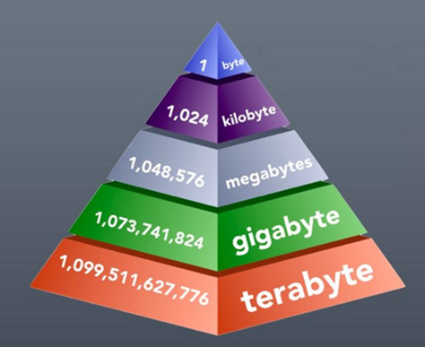
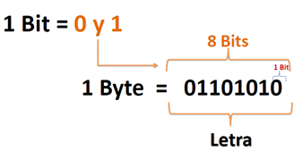
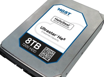

# Unidades de medida de la información

Con estas unidades medimos la capacidad para albergar información que tiene el disco duro, un USB o cualquier otro elemento de un sistema informático diseñado para tal efecto. Los medios de almacenamiento pueden ser muy diferentes.

Entre las unidades de medición de almacenamiento, es decir, la cantidad de bits que almacenan tenemos la siguiente clasificación:

## Bit

El bit es la unidad **mínima** del código binario. Cada bit sólo puede tener 2 valores: un 0 o 1. Con un número n de bits pueden representarse hasta 2 elevado a n valores diferentes.

Un bit es una unidad muy pequeña, por lo que habitualmente se utilizan múltiplos del byte, especialmente el **Gigabyte** y el **Terabyte**.

Si utilizáis algún programa como este, podréis ver qué hay en realidad dentro de los archivos, en forma de bits:

http://blog.bodurov.com/Bytes-and-Bits-Viewer/

## Byte

El byte (abreviado con la mayúscula B para diferenciarlo del bit) es una unidad de información compuesta por 8 bits. Se puede utilizar para almacenar, entre otras cosas, un carácter, como por ejemplo una letra o un número.

Como curiosidad, existía una medidas de cuatro bits que se conoce como **nibble**, pero no se utiliza en la actualidad.

## Kilobyte

 En el inicio de la informática, al utilizar el sistema binario, resultó más cómodo utilizar potencias de dos para establecer las unidades. Y así se estableció el **Kilobyte** como 1.024 bytes, es decir, dos elevado a la diez bytes. Por eso contamos de 1024 y no de 1000 en 1000.

Un KB corresponde a 1024 bytes (B). Se utiliza para almacenamiento de:

- Archivos pequeños
- Documentos de texto (1.000 caracteres)
- Imágenes en baja resolución.

## Megabyte

Un MB corresponde a 1024 Kilobytes (KB). Equivale a más de un millón de bytes.

Por ejemplo:

- Imágenes en alta resolución
- Archivos
- Programas pequeños

## Gigabyte

Un GB contiene 1024 MB de información. Equivale a mil millones de bytes. Es la unidad que más típicamente se maneja hoy en día, la podemos encontrar en:

- Tamaño de memoria RAM
- Capacidad de datos de líneas móviles
- Memorias USB y almacenamiento en smartphones.

## Terabyte

Un **Terabyte** o TB equivale a 1024 Gigabytes o 240 Bytes
Su símbolo es TB

Un **Terabyte** equivale aproximadamente a:

- 300 horas de video
- 3,6 millones de fotografías digitales estándar.
- 1.000 copias de la Enciclopedia Británica digital.

Los discos duros actuales de ordenador tienen capacidades en torno a 1-4 TB de espacio.

## Unidades mayores

Aunque los términos más allá del terabyte no se usan comúnmente, existen varias medidas inventadas, que con el tiempo se volverán habituales.

Las siguientes medidas por encima del TB son:

- 1 petabyte = 1.024 terabytes
- 1 exabyte = 1.024 petabytes
- 1 zettabyte = 1.024 exabytes
- 1 yottabyte = 1.024 zettabyte

Las medidas de almacenamiento de información (en base 2) aumentan de 1024 en 1024
