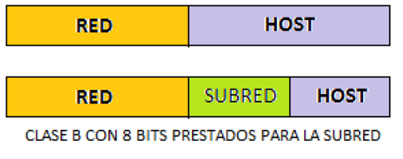
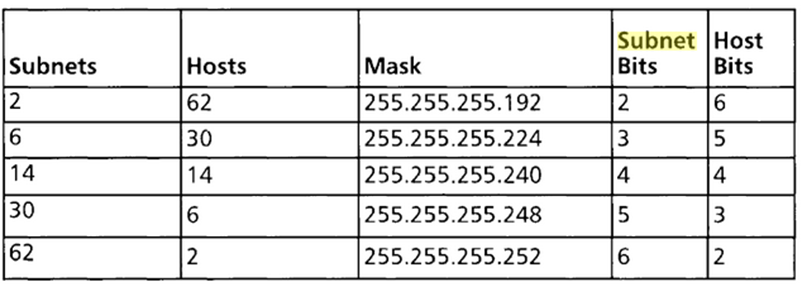

# <!-- fit --> SUBNETTING <!-- _class: invert-->

# Problemática

- Sistema de direcciones de clase A, B y C poco flexible.
- Empresa 300 ordenadores = red de clase B
- Desperdicio de IPs
- Se soluciona con la creación de subredes

# Segmentación

La solución a esta problemática es la **segmentación** de la red mediante el uso de dispositivos físicos de interconexión, como routers, para dividir la red en **subredes** más pequeñas y así aumentar su eficiencia.

La creación de subredes permitirá un mejor control y organización de la dirección IP y una mayor flexibilidad en el sistema de direcciones.

# Subnetting

Subnetting es un método para administrar las direcciones IP. Esto se logra dividiendo clases de direcciones de red en partes de menor tamaño. Esto significa que una gran red se divide en **segmentos** más pequeños, eficientes y administrables.

# Subnetting

Para hacer esto se usa una **máscara** de subred. Esto permite a los administradores dividir la red en subredes separadas con direcciones IP separadas, lo que ayuda a ahorrar direcciones IP y hace que la administración de la red sea más sencilla.

# Máscara de subred

Una máscara de subred es una dirección IP binaria que es usada para identificar y separar las direcciones IP de la red y los hosts. Se utiliza para determinar qué parte de la dirección IP es la parte de red y cuál es la parte de hosts.

# Máscara de subred

La máscara de subred especifica **cuántos bits de la dirección IP se usan para identificar la parte de red y cuántos para identificar la parte de hosts**. Los bits de la parte de red se denominan bits de máscara de subred. El resto de los bits se usan para identificar la parte de hosts.

# Subredes posibles clase C

Las combinaciones posibles para una IP de clase C son:

# IPv6

IPv6 es una nueva versión de IP con un espacio de direcciones mucho mayor. Esto significa que hay más direcciones disponibles para los usuarios. Esto se debe a que IPv6 utiliza 128 bits para almacenar la dirección en lugar de los 32 bits usados por IPv4. Esto significa que hay un número teórico de direcciones de 2^128 (aproximadamente 3,4 x 10^38) para IPv6, frente a las 2^32 (4.294.967.296) direcciones disponibles para IPv4.

# IPv6

A medida que más personas se conectan a Internet, los proveedores de servicios comienzan a ofrecer IPv6 para aumentar el número de direcciones disponibles. Esto significa que eventualmente, la mayoría de los dispositivos tendrán direcciones IPv6.

En resumen, el agotamiento del espacio de direcciones es un problema real y se está solucionando **implementando IPv6**.

# Preguntas

- ¿A qué subred pertenece la IP 195.85.8.87?
- ¿Qué tipo de IP es 195.85.8.95?¿ y 195.85.8.96?
- ¿Pertenecen a la misma subred?
- ¿A qué IP tengo que enviar un paquete para que llegue a todos los hosts de la subred 195.85.8.96?
- ¿A cuantos hosts puedo asignar IP en toda la red?

# Ejercicio

Para los siguientes supuestos:

- IP asignada: 218.35.50.0. Necesitamos 5 subredes
- IP asignada: 195.100.5.0. 50 máquinas en cada subred
- IP asignada: 140.10.0.0. Necesitamos 8 subredes
- IP asignada: 172.59.0.0. Necesitamos 10 subredes
- IP asignada: 195.85.8.0. Necesitamos 8 subredes

# Calcular los siguientes parámetros.

- Clase de dirección:
- Máscara de red por defecto:
- Máscara de subred:
- Cantidad de subredes:
- Cantidad de direcciones:
