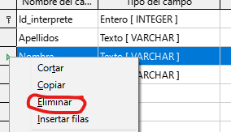

# 3. Tipos de datos y edición de tablas

## Edición de tablas

Para abrir esta tabla para editarla tenemos que situarnos en el apartado de Tablas y hacer un clic con el botón derecho del ratón y seleccionar la opción Editar

## Agregar campos

Para añadir nuevos campos a nuestra tabla hay que seguir el mismo proceso que en la creación de una tabla; es decir, introducir un valor para el nombre del campo, elegir un tipo de campo y escribir una descripción de ese campo.

## Eliminar campos

Para eliminar campos de nuestra tabla nos situamos al inicio del campo y seleccionamos la opción eliminar. Antes de eliminar una columna de nuestra tabla debemos saber que al hacerlo se borrarán todos los valores que tuviéramos dados a esta columna en nuestra filas.

En el caso de haber borrado una columna de la tabla accidentalmente siempre tenemos la opción de cerrar la ventana de edición sin guardar los cambios realizados.

## Modificación de campos existentes

Las modificaciones que se pueden realizar sobre las campos existentes pueden ser de dos tipos:

- Cambios de nombre del campo o de la descripción del mismo.
- Cambio en las propiedades del campo, desde ser o no clave primaria, a cambiar el tipo de campo y las propiedades asociadas a ese tipo de campo.
