- [CARACTERÍSTICAS DEL SONIDO](#características-del-sonido)
  - [Frecuencia](#frecuencia)
  - [¿Qué frecuencia oye un ser humano?](#qué-frecuencia-oye-un-ser-humano)
  - [Amplitud](#amplitud)
  - [Forma de onda](#forma-de-onda)
- [GENERACIÓN DEL SONIDO](#generación-del-sonido)
  - [Altavoces](#altavoces)
  - [Voz](#voz)
- [CAPTURA DEL SONIDO](#captura-del-sonido)
  - [Micrófonos](#micrófonos)
  - [Filtres](#filtres)
- [Soportes](#soportes)
  - [Los vinilos](#los-vinilos)
  - [Casete y CD](#casete-y-cd)
  - [CD](#cd)
  - [Dispositivos portátiles](#dispositivos-portátiles)
  - [Walkman](#walkman)
  - [Discman](#discman)
  - [Reproductores mp3](#reproductores-mp3)
- [DIGITALIZACIÓN DEL SONIDO](#digitalización-del-sonido)
  - [CONVERSOR ANALÓGICO-DIGITAL O DAC](#conversor-analógico-digital-o-dac)
  - [TARJETAS DE SONIDO](#tarjetas-de-sonido)
  - [INTERFAZ DE AUDIO](#interfaz-de-audio)
- [Digitalización del sonido](#digitalización-del-sonido-1)
- [FORMATOS DE AUDIO DIGITAL](#formatos-de-audio-digital)
- [Reproductores](#reproductores)
- [DAWs (PROGRAMAS DE EDICIÓN MUSICAL)](#daws-programas-de-edición-musical)
- [Podcast](#podcast)
- [Guitarra elèctrica](#guitarra-elèctrica)

AUDIO DIGITAL

¿QUÉ ES EL SONIDO?

El sonido es una sensación producida en el oído por un movimiento vibratorio que se propaga por un medio (generalmente por el aire) que transmite la vibración hasta nuestro oído.

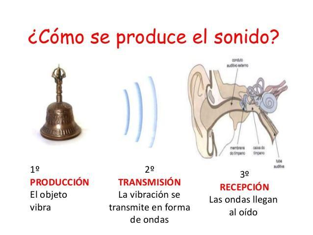

¿Cómo se produce?

Por ejemplo, al vibrar la campana, mueve el aire que hay alrededor con una frecuencia determinada. Cuando esta llega al oído, activa el mecanismo de oído interno que traduce esta vibración en señales eléctricas que llegan a nuestro cerebro.

El sonido lo produce nuestra voz, un instrumento, nuestras manos, o unos altavoces, por ejemplo.

¿Cómo llega el sonido a nuestro oído?

El sonido se propaga por un medio físico que generalmente es el aire, pero no es el único. En cambio, no se propaga en el vacío, por lo que en el espacio no podríamos oír nada, por ejemplo.

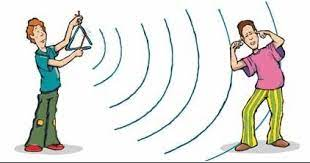

Si el sonido se convierte en señales eléctricas, se puede transmitir mediante cables a distancia.

Journey of Sound to the Brain

# CARACTERÍSTICAS DEL SONIDO

## Frecuencia

La frecuencia de un sonido es el número de vibraciones por segundo que produce. Se mide en Hertzios (Hz), aunque generalmente se utilizan unidades más grandes: KHz, MHz

Los sonidos agudos tienen una frecuencia más alta, mientras que los sonidos graves tienen frecuencias más bajas.

- Los sonidos de frecuencias bajas, son sonidos graves
- Los sonidos de frecuencias altas, son sonidos agudos

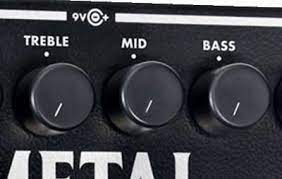

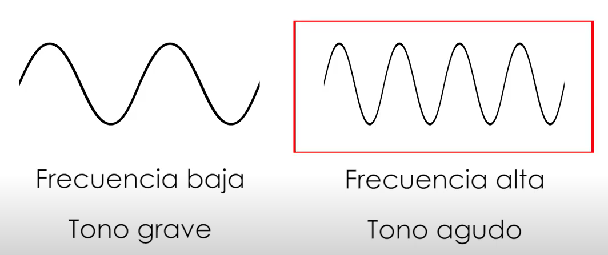

Slow Motion GUITAR Strings  -2000/4000% slower

- Guitar Strings Oscillating in HD 60 fps: https://www.youtube.com/watch?v=8YGQmV3NxMI

## ¿Qué frecuencia oye un ser humano?

| Especie     | Rango Auditivo            | Nota                                                              |
| ----------- | ------------------------- | ----------------------------------------------------------------- |
| Humano      | 20 Hz a 20,000 Hz         |                                                                   |
| Perro       | Aprox. 40 Hz a 60,000 Hz  | Pueden escuchar sonidos ``ultrasónicos`` fuera del alcance humano |
| Gato        | Aprox. 48 Hz a 85,000 Hz  | Pueden percibir sonidos de frecuencia muy alta                    |
| Delfín      | Aprox. 75 Hz a 150,000 Hz | Utilizan ``ecolocación`` para detectar objetos en su entorno      |
| Murciélagos | Varía, hasta 200,000 Hz   | Utilizan ecolocación para cazar insectos durante la noche         |

Esto es así puesto que la mayoría de los sonidos que interesan al ser humano se dan entre estas frecuencias. Por encima de 20.000 Hz o por debajo de 20 Hz hay sonidos, pero las personas no somos conscientes de ellos.

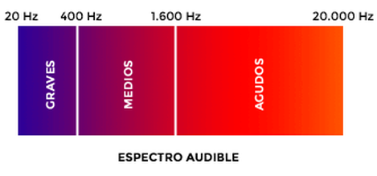

¿Todos los humanos oímos igual?

Con la edad vamos perdiendo oído, sobretodo en los agudos.

En este vídeo, podéis comprobar los diferentes sonidos que puede percibir un ser humano, de más grave a más agudo:

20Hz to 20kHz (Human Audio Spectrum)

¿Qué otros sonidos no percibe el ser humano?

Los sonidos por encima del máximo humano se llaman ultrasonidos, y pueden ser percibidos por ciertos animales. En el caso del delfín y los murciélagos los utilizan a modo de sónar para comunicarse a largas distancias u orientarse a través de ellos. Por el contrario, también existen los infrasonidos.

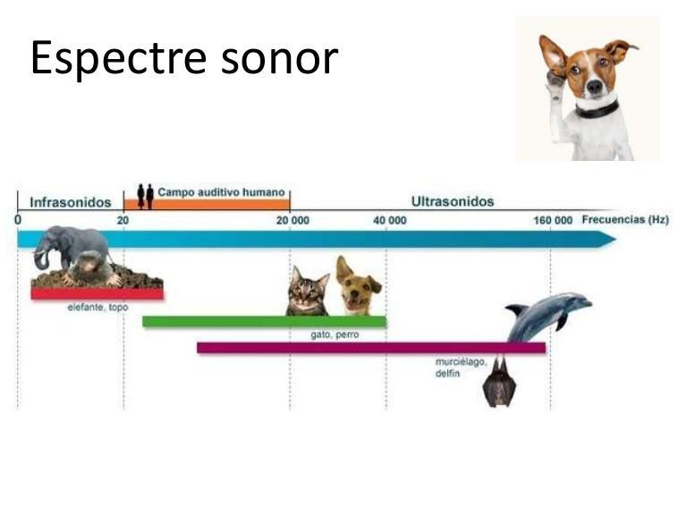

## Amplitud

La amplitud nos dice lo fuerte o flojo que es ese sonido, es decir, su volumen. Si subimos la ganancia del micro, hablamos más fuerte o nos acercamos más, aumentará su amplitud.

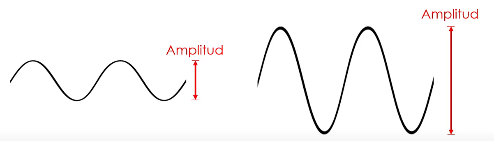

- Slow Motion (raw footage): https://www.youtube.com/watch?v=3ATVOTJfkg8
https://www.youtube.com/watch?v=Qu5sqpFDYn8

## Forma de onda

Normalmente los sonidos o canciones contienen más de una frecuencia, puesto que están compuestos de varios instrumentos y voces al mismo tiempo.

Por ello, cada sonido tiene una forma de onda, que representa la amplitud (más fuerte o más flojo) y la frecuencia del sonido en cada segundo.

En este caso, los fragmentos de izquierda y derecha son sonidos más graves (se ve más distancia entre las ondas), pero más fuertes (por ello suben más alto).

Por el contrario, el fragmento de en medio suena más flojo, pero tiene una frecuencia más aguda.

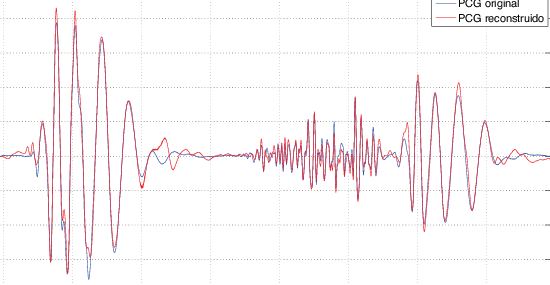

Aquí podemos ver el sonido correspondiente a una palabra pronunciada por una persona. Cada trozo corresponde a una sílaba. Cada sílaba de una palabra produce un golpe de sonido, separadas una de otra por un breve espacio.

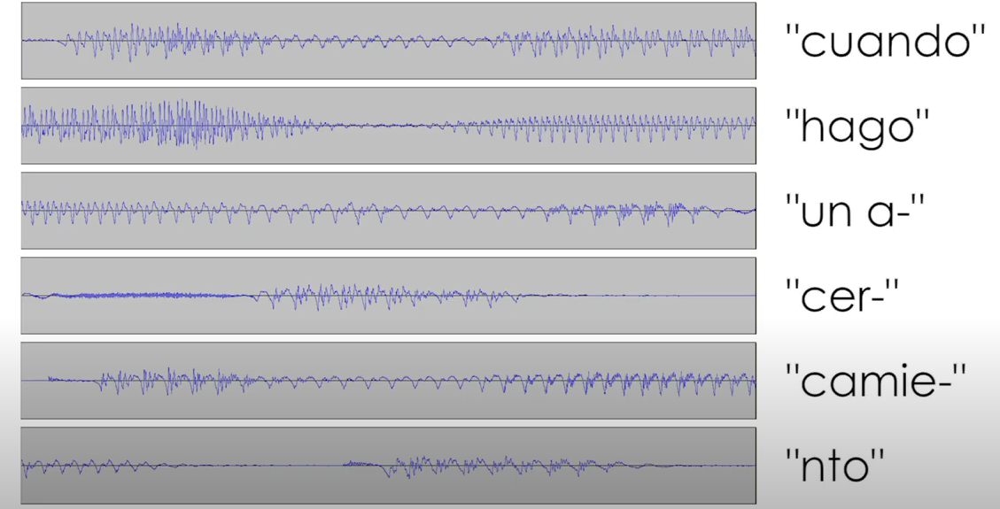

# GENERACIÓN DEL SONIDO

Para generar un sonido necesitamos hacer vibrar el aire de alguna forma (palmas, cuerdas vocales, etc.).

Algunos aparatos e instrumentos musicales generan sonido utilizando unas membranas que se mueven en función de la frecuencia del sonido. Otros modifican el aire de alguna forma para producir sonido.

## Altavoces

Los altavoces (speakers), según la electricidad que reciben, activan un electroimán. Este electroimán mueve la membrana, que al desplazarse mueve a su vez el aire creando sonido.

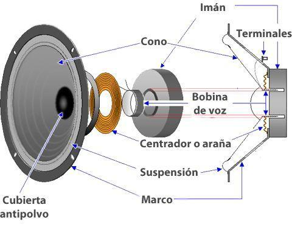

Podéis ver un vídeo del proceso a cámara lenta. Se ha filmado a cámara lenta, porque normalmente la vibración de la membrana es tan rápida que no podemos percibirlo.

En los sonidos graves (generalmente en los subwoofers), la vibración es más lenta y por tanto fácil de ver.

Video altavoz slow motion

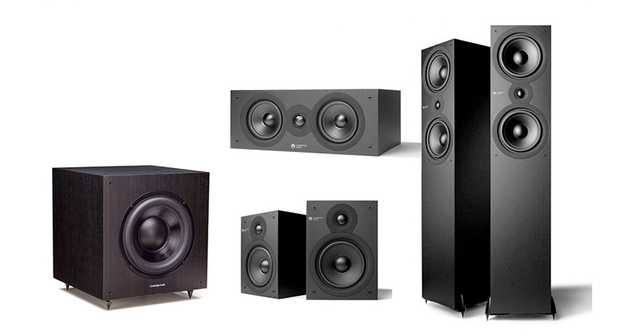

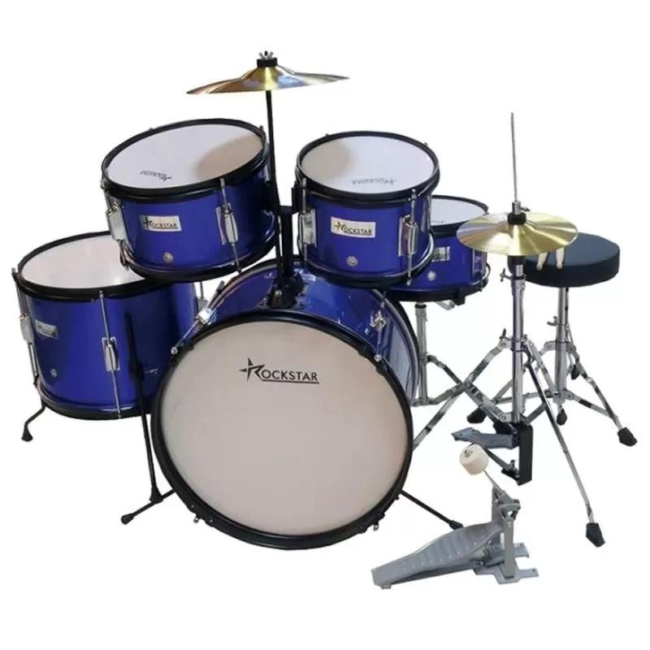

## Voz

Otro método de generar diferentes sonidos es el empleado por las cuerdas vocales que todos tenemos en la garganta. Éstos funcionan de un modo ligeramente diferente.

El aire es impulsado por los pulmones, y las cuerdas vocales, según su posición, simplemente “modulan” cómo será el sonido.

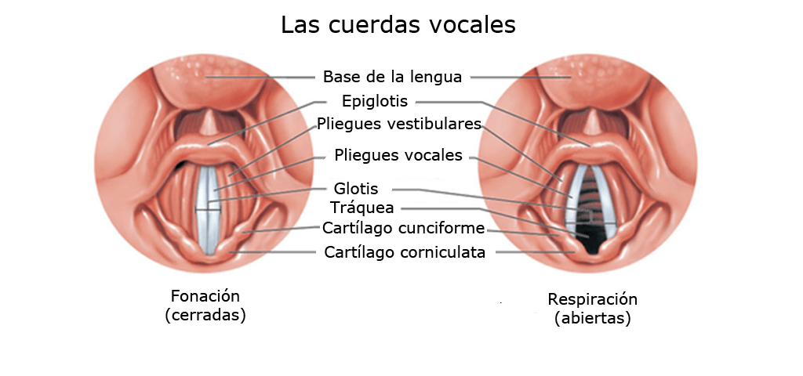

Este funcionamiento tiene lógica, puesto que no únicamente utilizamos los pulmones para hablar, sino también para respirar, y no siempre nos interesa emitir algún sonido.

Podéis ver un video del funcionamiento de las cuerdas vocales a continuación.

Las cuerdas vocales se mueven mucho más rápido de lo que se ve, imaginad que, para un sonido de 1000 Hz, se moverían a razón de 1000 veces por segundo.

Cueras vocales: Vocal Folds

Oído: Journey of Sound to the Brain

# CAPTURA DEL SONIDO

Gracias a diversos inventos, hoy en día podemos capturar el sonido, gracias a micrófonos o tarjetas de sonido, y, por ejemplo:

Lo podemos almacenar en dispositivos como CD, discos duros, para utilizarlos a posteriori.

Se puede transmitir a unos altavoces.

Utilizando técnicas de Streaming lo podemos enviar a través de Internet a cualquier lugar del mundo.

Por último, tenemos la posibilidad de reproducir este sonido en un lugar y momento diferente al original.

## Micrófonos

Los micrófonos contienen una ``membrana`` que vibra cuando le llega aire.  En función de la fuerza del aire y la frecuencia, fibra de una forma u otra. Esta vibración se convierte en una señal eléctrica que se envía a un equipo de sonido para ser amplificada o guardada de algún modo.

Existen multitud de tipos de micrófonos, según su construcción y su uso. En este caso, podéis ver dos modelos de micrófono habituales.

## Filtres

Els filtres, com els antipop o anti vent, també són molt útils per millorar la qualitat de les gravacions. L'**antipop** ajuda a reduir els sons de "popping" que es produeixen quan es pronuncien certes lletres, com la "p" o la "b", mentre que **l'anti vent** redueix el soroll del vent en exteriors.

Ejemplos de micrófonos

Existen multitud de tipos de micrófonos, según su construcción y su uso. En este caso, podéis ver dos modelos de micrófono habituales

También podemos adquirir un set de grabación que también incluye un soporte o trípode, además de diferentes filtros, como los antipop o anti viento.

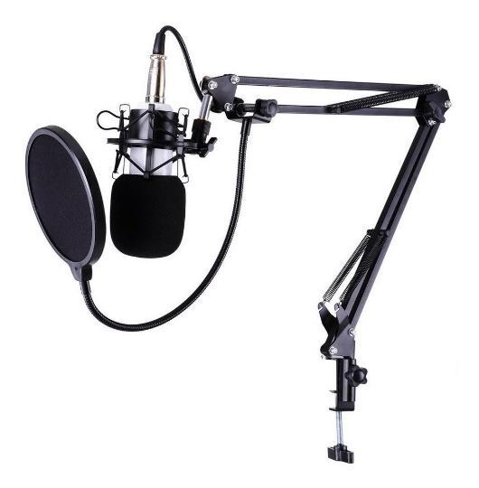

# Soportes

Antes de la informática, todo el proceso de grabación, mezcla y reproducción se hacía con equipos eléctricos de forma analógica en estudios de grabación. 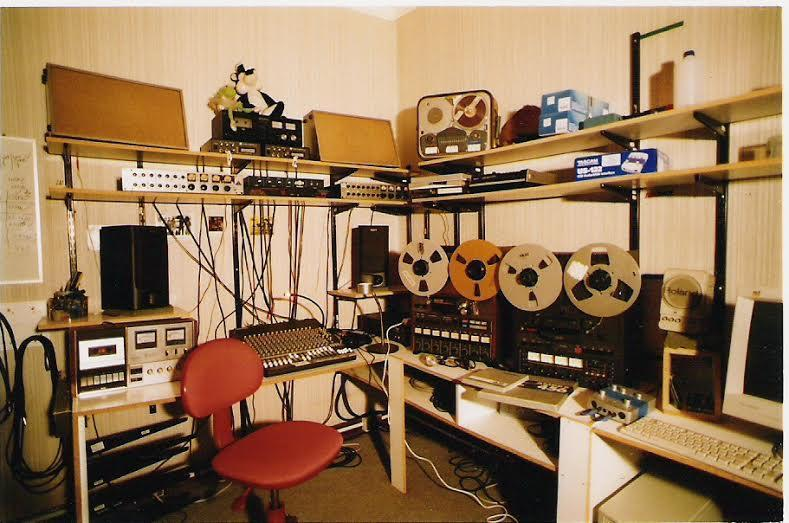

Hoy en día, podemos crear música y autoeditarse en nuestra casa creando un home studio.

## Los vinilos

El sonido grabado se guardaba en formatos analógicos (vinilos).

Estos discos están formados de diferentes ``surcos`` microscópicos. Los vinilos tienen surcos que siguen una ``espiral`` desde el borde exterior hacia el centro del disco. Estos surcos contienen la información grabada del sonido.

Para reproducir el sonido, se utiliza una aguja que se coloca en el surco del vinilo. La aguja está conectada a un brazo giratorio que se mueve a lo largo del surco mientras el vinilo gira.
Según como se mueve una ``aguja`` al recorrer los surcos del disco, el sonido suena de una forma u otra.

La forma en que la aguja se mueve a lo largo de los surcos modula la ``corriente eléctrica`` en el sistema. Estas variaciones de corriente representan las vibraciones originales capturadas durante la grabación.
La corriente eléctrica modulada se ``amplifica`` y luego se envía a los ``altavoces``, donde se convierte nuevamente en vibraciones mecánicas que generan sonido.

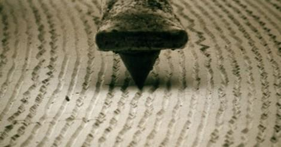

Video funcionamiento del vinilo: https://www.youtube.com/watch1?v=6tTQ_tThE2Q

Posteriormente, los DJ comenzaron a mezclar canciones utilizando dos tocadiscos y una mesa de mezclas con la que cambiar el sonido de uno a otro.

## Casete y CD

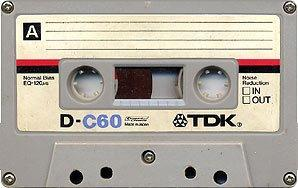

En lugar de surcos microscópicos, los cassettes tienen una ``cinta magnética enrollada`` en el interior. Esta cinta es sensible a las variaciones magnéticas.

La reproducción de un cassette implica el paso de la cinta sobre ``cabezas`` magnéticas. Estas cabezas leen las variaciones magnéticas en la cinta y las convierten en una señal eléctrica.

La cinta se enrolla o desenrolla mediante un mecanismo que permite avanzar o retroceder para acceder a diferentes partes de la grabación.

## CD

A diferencia de los formatos analógicos como los vinilos y los cassettes, los CDs utilizan un formato ``digital``. La información de audio se almacena en forma de ``datos binarios``, compuestos por una serie de ceros y unos.

La información en un CD se codifica en una pista espiral mediante pequeños "pits" (depresiones) y "lands" (mesetas) en la superficie del disco. Estas variaciones se leen mediante un láser durante la reproducción.

Durante la reproducción, un ``láser`` escanea la superficie del CD. Cuando encuentra un pit, la luz se refleja de manera diferente que en un land. Los cambios en la reflexión se detectan mediante fotodetectores.

La información binaria leída del CD se convierte nuevamente en una señal ``analógica``. Este proceso de conversión digital a analógico se realiza dentro del reproductor de CD.

Las cadenas musicales pronto incorporaron dos reproductores, a fin de poder grabar de uno a otro.

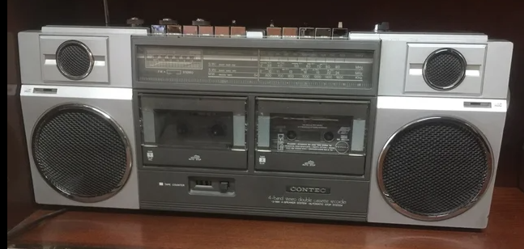

Video funcionamiento casete y walkman: El regreso del cassette musical

## Dispositivos portátiles

## Walkman

El primer modelo de walkman se creó en 1979. Hasta entonces no había forma de llevar la música contigo de una manera personal y portátil. El walkman revolucionó la forma en que las personas disfrutaban de la música al permitirles llevar consigo sus canciones favoritas a donde fuera que fueran.

## Discman

El lanzamiento del discman en 1985 marcó otro hito en la portabilidad de la música. A diferencia de su predecesor, el walkman, el discman reproducía CDs, proporcionando una opción más compacta y eliminando la necesidad de cintas o discos de vinilo.

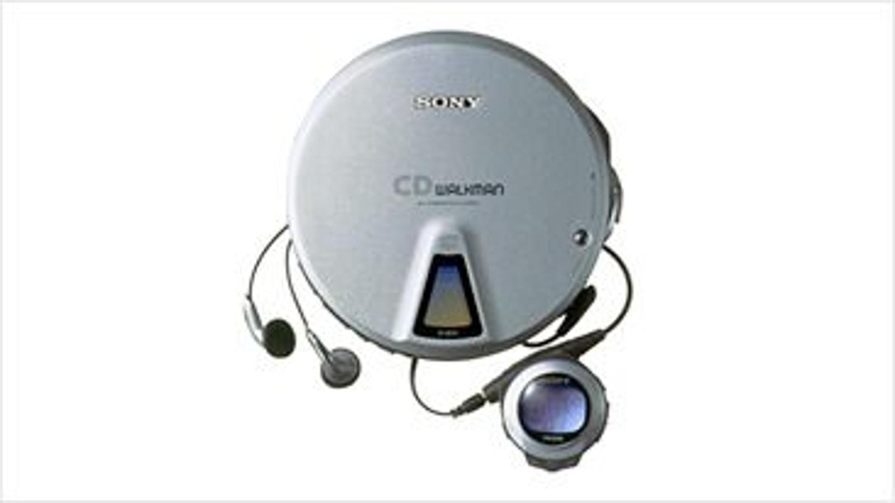

## Reproductores mp3

El primer iPod fue presentado en 2001 por Apple. Este dispositivo revolucionario no solo ofrecía una capacidad de almacenamiento significativamente mayor en comparación con los reproductores de música portátiles existentes, sino que también introdujo la ``rueda de desplazamiento táctil`` que facilitaba la navegación por la biblioteca musical. Además, el iPod fue pionero en la sincronización fácil con ``iTunes``, simplificando la gestión de la música en el dispositivo.

# DIGITALIZACIÓN DEL SONIDO

Gracias a la informática, podemos guardar el sonido en formato digital (ceros y unos) en un ordenador, en forma de archivo de audio. Estos archivos, se pueden modificar, editar y mezclar directamente utilizando un ordenador utilizando diferentes programas.

Para poder hacer todo esto necesitamos introducir (digitalizar) los sonidos dentro del ordenador para poder trabajar con ellos.

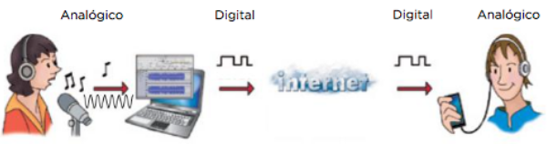

## CONVERSOR ANALÓGICO-DIGITAL O DAC

Si tenemos que grabar un instrumento como guitarras acústicas, baterías, etc. o la voz, necesitamos traducir estos sonidos analógicos a sonido digital. Para ello utilizamos un conversor analógico-digital (DAC). Este conversor suele venir incluido en una tarjeta de sonido.

A esta tarjeta conectaremos los dispositivos que queremos grabar en nuestro ordenador mediante diferentes cables.

## TARJETAS DE SONIDO

También existen tarjetas de sonido internas, aunque ya están en desuso, en forma de tarjetas de expansión. Se utilizan fundamentalmente en ordenadores para reproducir sonido y grabar voz de menor calidad, pero no se suelen utilizar para producción musical.

Actualmente estas tarjetas no se instalan como tarjetas de expansión independientes y están integradas en la propia placa base del dispositivo.

## INTERFAZ DE AUDIO

Las interfaces de audio son dispositivos que permiten conectar instrumentos, micrófonos y otros equipos de audio a una computadora para grabar, editar y reproducir música en un entorno digital. Estas interfaces actúan como intermediarios entre los dispositivos de audio y el software de grabación o producción musical.

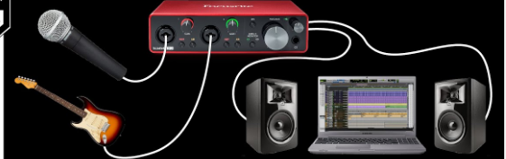

Tipos
Hay una gran variedad de interfaces de audio en el mercado, que varían en términos de número de entradas y salidas, calidad de sonido, conectividad y otros factores.

Las interfaces más sencillas pueden tener solo un par de entradas para micrófono o guitarra, mientras que las interfaces más complejas pueden tener varias entradas y salidas, con preamplificadores de alta calidad y convertidores de audio de gama alta.

Algunas interfaces de audio también vienen con efectos integrados, como ecualizadores y compresores, y ofrecen opciones de monitorización para escuchar la grabación en tiempo real.

Las interfaces de audio son una herramienta esencial para la producción musical y la grabación en el entorno digital. Permiten a los músicos y productores grabar y editar audio de alta calidad en sus estudios, y también se utilizan en estudios de grabación profesionales para producir música de alta calidad.
Las tarjetas de sonido más profesionales son tarjetas de sonido externas o interfaces de audio. En esta ocasión tienen forma de cajas con botones y entradas, que se conectan a través de un puerto externo como USB.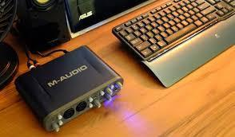

Estas tarjetas se pueden conectar a diferentes dispositivos, según nuestra necesidad.

La tarjeta tiene diferentes entradas y salidas para conectar instrumentos y micrófonos (Jack, cannon, etc.).

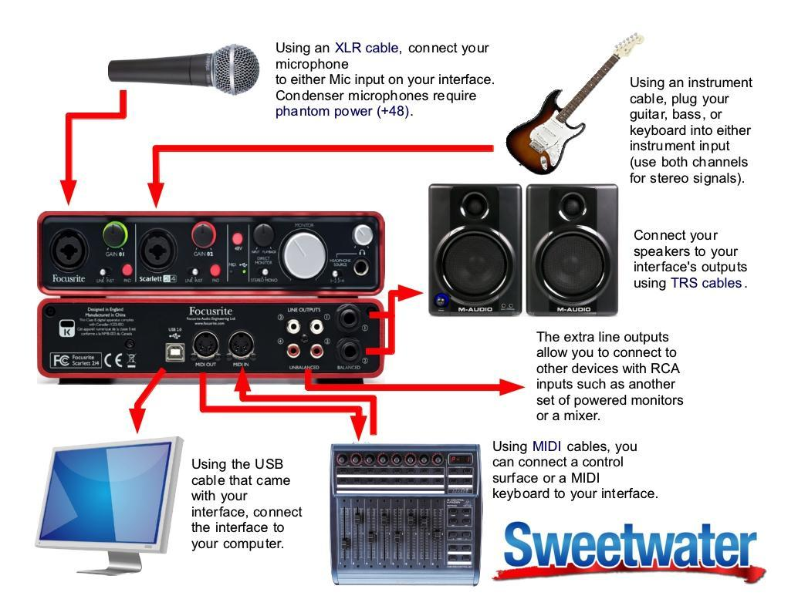

### Entradas

Las entradas por la parte frontal permiten conectar 1, 2 o más instrumentos para introducir sonido y convertirlo a sonido digital que se envía al ordenador.

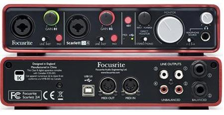

### Salidas

Una vez el ordenador reproduce una canción, o un vídeo, convierte estos archivos digitales otra vez a señal analógica que sale por las salidas traseras, por ejemplo, hacia unos altavoces. Los altavoces solo entienden de señales analógicas para poder funcionar. Por último, una salida USB nos permitirá conectarlo al ordenador.

### Botones

También tenemos una serie de botones y knobs para poder controlar el volumen, por ejemplo.

En la siguiente imagen podéis ver una configuración para un pequeño estudio casero, utilizando una tarjeta de sonido, un micrófono, una guitarra eléctrica, un ordenador y altavoces.

# Digitalización del sonido

Proceso en que se transforma un sonido de naturaleza analógica (continua) en una señal digital. Para poder introducir un sonido en un equipo informático, hace falta transformar un sonido de naturaleza analógica (continua) en una señal digital en forma de 1s y 0s, el lenguaje que se utiliza en informática.

1. En primer lugar, se toman muestras de la señal cada cierto tiempo (muestreo). En el muestreo, el ordenador toma muestras de la señal sonora cada cierto tiempo. Cuantas más muestras tomamos por segundo, la calidad en el sonido digital será mayor.
2. A cada una de estas muestras se les da un valor numérico en función de su fuerza (cuantificación)

La frecuencia de muestreo se suele expresar en KHz.

Algunas medidas típicas son:

- 11 KHz (calidad baja)
- 22 KHz (calidad media)
- 44.1 KHz (calidad alta)
- 96 KHz (calidad muy alta)

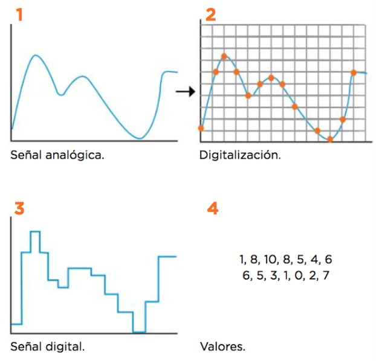

# FORMATOS DE AUDIO DIGITAL

Una vez convertido el audio en sonido digital (ceros y unos), lo podemos guardar de diferentes formas. El formato del archivo indica la estructura con la que el sonido es almacenado.

La extensión del archivo (mp3, wav, flac) nos indica el tipo de archivo del que se trata. Cada formato tiene unas ventajas y unos inconvenientes concretos.

COMPRESIÓN

Si los guardamos tal cual, los archivos de audio contienen toda la información. De esta forma, tenemos archivos de mejor calidad, pero mayor tamaño.

Gracias a los ordenadores podemos comprimir los archivos de sonido y vídeo utilizando operaciones matemáticas para reducir el tamaño descartando parte de la información que no somos capaces de apreciar.

FORMATO MP3

La invención del archivo MP3 permitió que la música ocupará menos espacio en los ordenadores. Gracias a ello se popularizaron los reproductores MP3, que permitían almacenar cientos de canciones, mientras que un CD normal daba para unas 15 aproximadamente.

Al ocupar menos los archivos también se popularizó la piratería musical a través de internet, a través de diferentes programas de intercambio de archivos, como Napster, Ares, o eMule, por ejemplo.

La calidad del sonido es menor pero también disminuye el tamaño. Una canción comprimida en MP3 puede ocupar una décima parte de lo que ocuparía la misma canción sin comprimir

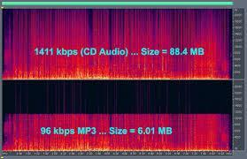

# Reproductores

Aplicación que permite escuchar audio digital. Los más populares son iTunes y Spotify. Suelen incluir funcionalidades como:

- Crear listas de reproducción
- Escuchar emisoras online
- Sincronizar archivos entre ordenador y dispositivos portátiles
- Añadir etiquetas ID3

Para escuchar música online hace falta conexión a internet, aunque se pueden descargar canciones para oírlas sin necesidad de conexión.

# DAWs (PROGRAMAS DE EDICIÓN MUSICAL)

Si queremos grabar música y mezclarla, necesitamos una estación de trabajo. Una estación de trabajo de audio digital o DAW, es un software que permite crear música sobre la base de audio o sonidos MIDI.

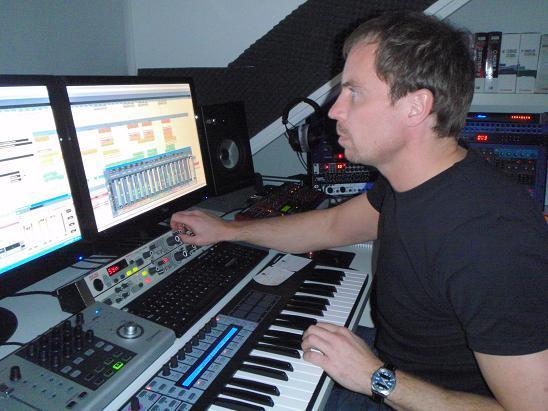

Los sonidos pueden insertarse desde medios externos micrófono, instrumento musical, teclado, sintetizador, etc.

Algunos ejemplos son:

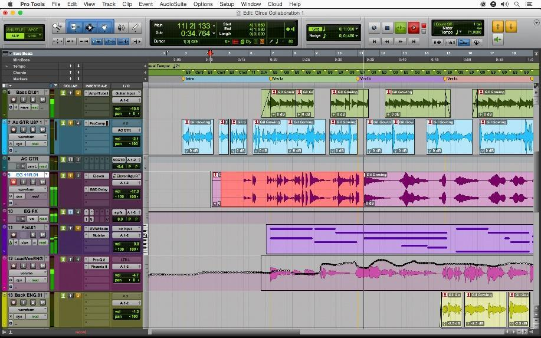

- Cubase (Steinberg)
- Pro Tools (Avid)
- Reaper
- Ableton Live

Otros: Ardour, Cakewalk Sonar, FL Studio, lmms, DSP-Quattro, etc

Los sonidos se pueden trabajar en pistas separadas y aplicar diferentes efectos a una pista o a un trozo concreto. Permite también exportar el resultado en diferentes formatos de audio.

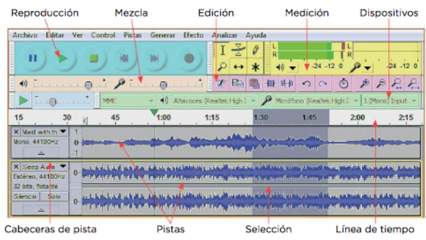

Transmisión a través de internet

Streaming

El Streaming consiste en transmitir sonido o vídeo digital a través de internet en tiempo real. Permite escuchar música a la carta sin descargar todo el archivo previamente

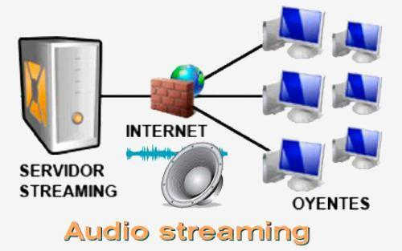

Se financian a través de publicidad o mediante suscripción.

# Podcast

¿Qué es un podcast?

Se trata de un archivo de sonido digital creado para ser difundido por Internet. Cualquiera puede escucharlo en el momento que desee desde un ordenador o dispositivo portátil

Recorrido de un podcast

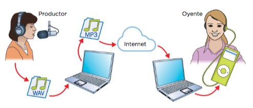

Productor graba el archivo

Comprime el archivo en un formato apto para el podcast

Lo cuelga en Internet

El usuario final lo descarga y reproduce

REPOSITORIOS DE PODCAST

Estos podcasts pueden ser escuchados en YouTube, páginas web concretas o utilizando apps para descargarlas y escucharlas, como iTunes o iVoox.

# Guitarra elèctrica

El músic pulsa les cordes de la guitarra elèctrica. A diferència de la guitarra acústica, les **cordes** de la guitarra elèctrica són més fines i estan fetes d'acer, en lloc de niló o acer entortillat.

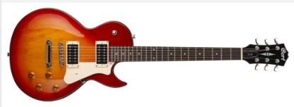

Les cordes vibren a través dels **píkaps**. Els píkaps són bobines magnètiques que es troben sota les cordes. Quan les cordes vibren, generen un camp magnètic al voltant dels píkaps.

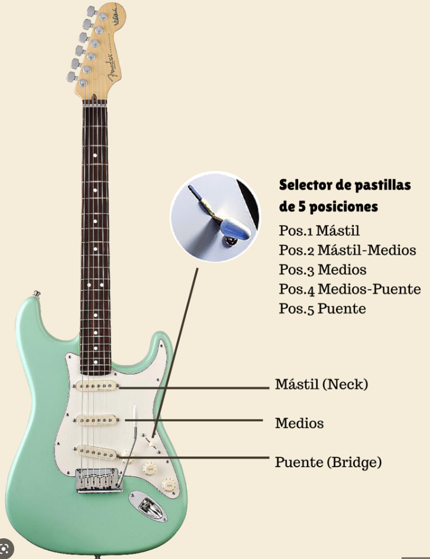

Els píkaps transformen les vibracions en senyals elèctrics. Els píkaps capturen les vibracions de les cordes i les transformen en senyals elèctrics que es transmeten a través dels cables de la guitarra.

Els senyals elèctrics són amplificats. Els senyals elèctrics que són transmesos a través dels cables són amplificats per un amplificador de guitarra. L'amplificador augmenta la força del senyal elèctric per crear un so més fort i potent.

Els senyals amplificats són enviats als altaveus. Finalment, els senyals amplificats són enviats als altaveus, que convierten el senyal elèctric en ones sonores audibles.