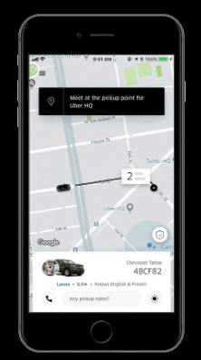
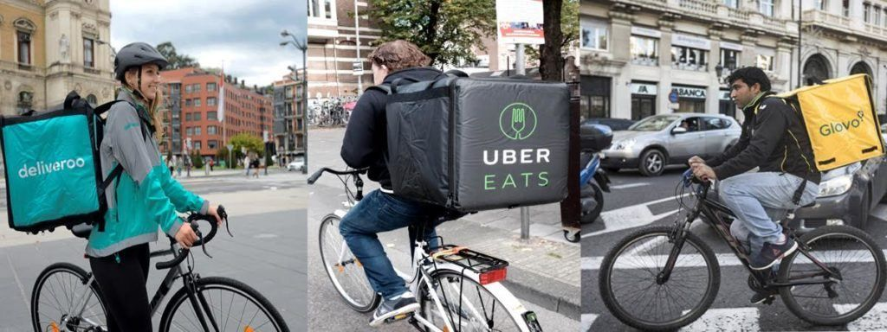
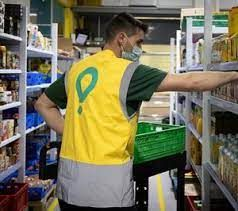
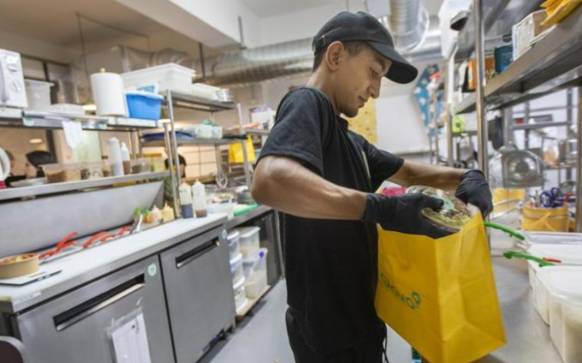
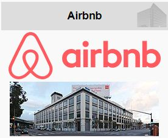

# Nuevas profesiones y negocios en la era digital

## Introducción

En la era digital, el ecosistema de negocios está cambiando rápidamente. Estamos asistiendo a la expansión de las Tecnologías de la Información y la Comunicación (TIC) que permiten a las empresas crear **nuevos modelos de negocio, profesiones y ofrecer servicios en tiempo real** a través de los smartphones.

Esto está generando un nuevo modelo digital que ahorra costes de producción, une a los consumidores, reduce los precios y elimina barreras de entrada al mercado. Estos cambios están abriendo la puerta a nuevas profesiones y oportunidades de negocio en la era digital.

## Ejemplos

- **Uber** es ya una de las mayores empresas de transporte del mundo, sin tener coches en propiedad
- **Airbnb** es la mayor red de alojamientos sin tener ni una sola habitación de hotel
- **Glovo** es la mayor red de distribución sin tener trabajadores contratados.

## Mobilidad

### VTC

La mobilidad se ha visto revolucionada en los últimos años con la llegada de empresas como Uber y Cabify, que ofrecen un servicio de alquiler de vehículo con conductor (VTC) para trayectos relativamente cortos. El servicio se presta por un conductor profesional con licencia y se puede contratar directamente desde sus aplicaciones. Es importante mencionar que es obligatorio contratar el servicio con antelación, siendo necesario un mínimo de 30 minutos previos en Baleares.

### Bicicletas y patinetes eléctricos

Además de estos servicios de transporte, también se está haciendo cada vez más popular el uso de las bicicletas para la movilidad en grandes ciudades, gracias a la llegada de empresas como Lime, Ofo o Mobike, entre otras. Estas empresas ofrecen alquiler de bicicletas de forma temporal y puntual, y es posible contratarlas desde sus aplicaciones.

Los usuarios pueden encontrar bicicletas a su alrededor y devolverlas cuando hayan llegado a su destino.

Por último, también se ha introducido el uso de los patinetes eléctricos para la movilidad. Estas empresas ofrecen alquiler de patinetes eléctricos para desplazamientos cortos, y se pueden contratar directamente desde sus aplicaciones. Esta modalidad de transporte se ha convertido en una de las opciones más utilizadas para los desplazamientos dentro de las ciudades, ya que es una forma rápida, económica y sostenible. Los usuarios pueden encontrar patinetes a su alrededor y devolverlos cuando hayan llegado a su destino.

## Carpooling

Carpooling es una práctica que consiste en compartir el coche para desplazarse entre dos o más personas. Se trata de una forma de viajar económica, ya que se sufragan en común los gastos del trayecto.

En España, este tipo de plataformas están muy extendidas y cada vez son más personas las que se animan a compartir el coche con otros usuarios.

## Delivery

Delivery es un servicio de recogida y reparto a domicilio, mayoritariamente de comida, que se realiza a través de plataformas como **Uber Eats, Deliveroo, Glovo y Just Eat**. Estas plataformas emplean a trabajadores a los que se conoce como riders, los cuales trabajan como autónomos y realizan los repartos en bicicleta, patinete o moto, recibiendo en el teléfono los pedidos que deben recoger (por ejemplo, en un restaurante) y entregar a domicilio.

http://www.youtube.com/watch?v=NL_217-Iygc

## ¿Cuánto gana cada una de las partes?

- Cada una de estas compañías se lleva una comisión
- En torno al 30% del valor de la compra.
- Imaginemos que realizamos un pedido que conste de dos menús y bebida por valor de 20 euros.
- El restaurante al que lo pidamos se quedará con 13,6 euros.
- La empresa de Delivery se queda con 6,4 euros.

## ¿Qué gana un rider?

### Ingresos

- Salario real de difícil de calcular
- En torno a los 8-10 eur/hora
- Jornadas de entre 40 y 49 h/semana
- Aprox. 4 euros brutos por pedido.

### Gastos (descontar de los ingresos)

- Cuota de autónomos (de 60 euros a 286)
- Pago del IRPF y el IVA -del que algunos gastos son deducibles-
- Mantenimiento, gasolina y seguro del vehículo

## Glovo express

Glovo Express ofrece un servicio de entrega **24 horas del día**, con productos en **locales bien situados** como alimentación y supermercado. A través de esta plataforma, los usuarios pueden solicitar pedidos de supermercado y recibirlos en menos de 10 minutos. Esto hace que sea una opción ideal para aquellos que necesitan recibir su compra de forma rápida y eficiente.

## Dark kitchen (cocinas fantasma)

Dark Kitchen son restaurantes dedicados por completo a la venta online. Estos restaurantes no cuentan con mesas ni camareros, sino sólo con unos cuantos cocineros, materias primas y unos fogones. Estos restaurantes tienen perfiles en las principales plataformas de comida a domicilio para llegar a más gente.

http://www.youtube.com/watch?v=zB9fw3ENbkw

## Community manager

Un community manager es un profesional especializado en la expansión de internet y las redes sociales que se encarga de crear un puente entre las empresas y los consumidores para que la comunicación entre ambos sea más directa e interactiva.

Su trabajo consiste en gestionar la presencia online de la empresa, llevar a cabo la **gestión de los perfiles** de la empresa en las redes sociales, dar **respuesta** a los comentarios y **poner voz** a la empresa para que escuche a quienes hablan de ella. Su trabajo se realiza con herramientas 2.0 que ayudan a conectar y a crear una comunidad que sea fiel a la marca.

## Airbnb

Airbnb es una plataforma digital que ofrece alojamientos a particulares y turísticos para **alquiler vacacional**. Los **anfitriones** tienen la opción de publicitar y contratar el arriendo de sus propiedades con sus huéspedes.

Además, tanto los anfitriones como los huéspedes pueden **valorarse** mutuamente como referencia para futuros usuarios.

## Influencers

- Persona que cuenta con cierta credibilidad sobre un tema concreto
- Presencia en redes sociales
- Tiene una enorme cantidad de seguidores
- Expresa opiniones sobre este tema
- Ejercen una gran influencia sobre muchas personas que la conocen

## eSports

Los eSports son competiciones organizadas a nivel profesional de videojuegos, donde los jugadores compiten en multijugador de diferentes disciplinas. Cada esport cuenta con sus propias reglas y la primera competición fue organizada en la Universidad de Stanford en 1972, donde cinco estudiantes compitieron en una “**Olimpiada de guerra espacial intergaláctica**”.

Una de las marcas de eSports más exitosas es Fnatic, que se fundó en 2004. Han ganado más de 200 campeonatos en 30 juegos diferentes, como League of Legends, FIFA, CSGO, Dota 2, Fortnite, Rainbow Six Siege y PUBG.

https://www.owayo.co.uk/magazine/esports-tournaments-popular-en.htm

https://forbes.es/listas/92832/los-25-jugadores-espanoles-que-conquistan-los-e-sports/

http://www.youtube.com/watch?v=_Q0RaST09qU
