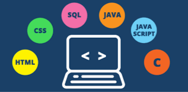
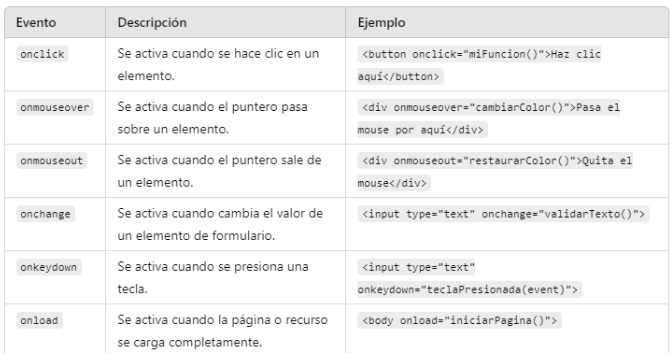

# Introducción a JavaScript



## 1. ¿Qué es JavaScript?

JavaScript es un lenguaje de programación que permite agregar interactividad a las páginas web.
Mientras HTML estructura el contenido y CSS lo estiliza, JavaScript proporciona la lógica para hacer
que una página web sea dinámica e interactiva.

## 2. ¿Dónde se utiliza JavaScript?

Se utiliza principalmente en el desarrollo de sitios web para manejar eventos (como clics o entradas de teclado), actualizar contenido de la página sin recargar (usando AJAX), y validar formularios, entre otros.

También existen tecnologías como Node.js, JavaScript también se puede ejecutar en
servidores.

## 3. Cómo incluir JavaScript en un HTML

JavaScript puede incluirse de tres maneras:

**a) En línea (Inline)**

Se puede incluir directamente dentro de un elemento HTML utilizando el
atributo onclick , onchange , etc.

```js
<button onclick="alert('Hola Mundo')">Haz clic aquí</button>
```

**b) En el head o body (Internal Script)**

Puedes escribir el código JavaScript dentro de etiquetas <script> en el archivo HTML. Este código HTML crea una página web sencilla que incluye un botón, y cuando se hace clic en él, se muestra un mensaje emergente (alerta) en el navegador.

```html
<!DOCTYPE html>
<html lang="es">
  <head>
    <script>
      function mostrarMensaje() {
        alert('¡Bienvenido!');
        }
    </script>
  </head>
  <body>
    <button onclick="mostrarMensaje()">Mostrar Mensaje</button>
  </body>
</html>
```

**c) En un archivo externo (External Script)**

Lo más recomendable es colocar el código en un archivo separado con extensión .js , para mantener el código organizado y reutilizable.

<script src="app.js"></script>

De esta forma podremos hacer referencia al mismo archivo desde diferentes HTML, y únicamente realizar modificaciones en el archivo javascript.

## 4. Variables y Tipos de Datos

En JavaScript, puedes declarar variables usando las palabras clave ``var`` , ``let`` o ``const`` .

Para usar una variable, primero tenemos que definirla:

```js
// Definir una variable
var numero;
```
Ahora la variable existe, pero no tiene guardado ningún valor. Para ello, tenemos que asignárselo utilizando el operador de asignación =.

```js
// Asignar un valor
numero = 10;
```
También podemos definir una variable y asignarle un valor en la misma instrucción:

```js
// Operar con la variable
let resultado = numero + 5;
console.log(resultado); // Imprime 15
```

## 5. Funciones

Las funciones permiten encapsular un bloque de código que puede ejecutarse más tarde. Se definen con la palabra clave function .

Para definir una función:

```js
function saludar() {
  console.log("Hola, bienvenido");
  }
```

Para llamar a la función:

```js
saludar(); // Llama a la función
```

También podemos llamar a la función en un atributo de evento:

```js
<button onclick="saludar()">Click me</button>
```

## 6. Eventos

Los eventos en JavaScript permiten reaccionar a acciones del usuario, como clics, movimientos del
ratón, etc.

## 7. Manipulación del DOM

El DOM (Document Object Model) es una representación de la estructura de un documento HTML. JavaScript puede interactuar con el DOM para **modificar el contenido y la estructura de la página.**

Utilizaremos identificadores en diferentes elementos para hacer referencia a ellos:

```html
<p id="miParrafo"></p>
```

Para cambiar  el contenido de este párrafo:

```js
document.getElementById("miParrafo").innerText = "Nuevo contenido";
```

## Eventos

Los eventos son sucesos que ocurren durante la navegación, como por ejemplo pulsar un botón, pasar por encima de un texto, cargar la página.

Podemos utilizar javascript para que, al **dispararse un evento**, ejecute instrucciones de javascript.

Al clicar en el botón, se dispara el evento onclick, que ejecuta el comando javascript.

```js
<button onclick="window.alert('hola')">Click me</button>
```

onclick es un evento en JavaScript que se utiliza para ejecutar una función o un conjunto de instrucciones cuando un usuario hace clic en un elemento específico de una página web, como un botón, enlace, imagen o cualquier otro elemento HTML que soporte eventos.

