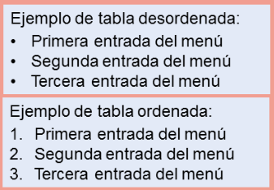
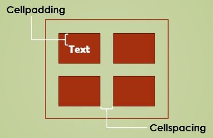

- [1. INTRODUCCIÓN AL LENGUAJE HTML](#1-introducción-al-lenguaje-html)
- [2. ESTRUCTURA DE UN DOCUMENTO HTML](#2-estructura-de-un-documento-html)
  - [HEAD y BODy](#head-y-body)
- [3. EJEMPLO DE UN DOCUMENTO HTML](#3-ejemplo-de-un-documento-html)
- [4. Títulos y párrafos](#4-títulos-y-párrafos)
  - [Títulos](#títulos)
  - [Párrafos](#párrafos)
- [5. Estilos de texto y párrafo](#5-estilos-de-texto-y-párrafo)
  - [Estilos](#estilos)
  - [Estilos de párrafo](#estilos-de-párrafo)
- [6. Colores](#6-colores)
  - [¿Cómo podemos especificar un color en concreto?](#cómo-podemos-especificar-un-color-en-concreto)
- [7. ENLACES O HIPERVÍNCULOS.](#7-enlaces-o-hipervínculos)
  - [7.1 ENLACES DENTRO DE LA MISMA PÁGINA](#71-enlaces-dentro-de-la-misma-página)
  - [7.2 ENLACES A OTRA PÁGINA](#72-enlaces-a-otra-página)
  - [7.3 ENLACE A UNA DIRECCIÓN DE CORREO ELECTRÓNICO.](#73-enlace-a-una-dirección-de-correo-electrónico)
  - [7.4 ENLACE EN UNA NUEVA VENTANA.](#74-enlace-en-una-nueva-ventana)
- [8. IMÁGENES CON HTML](#8-imágenes-con-html)
<<<<<<< HEAD
  - [8.1 COMANDOS PARA LAS IMÁGENES](#81-comandos-para-las-imágenes)
  - [Modificar dimensiones de imágenes](#modificar-dimensiones-de-imágenes)
=======
  - [Alinear imágenes](#alinear-imágenes)
  - [Modificar dimensiones](#modificar-dimensiones)
>>>>>>> 7c0eec1ab93ded9c4d218d1682f1a9e2dd222c1e
  - [Imágenes y enlaces](#imágenes-y-enlaces)
- [9. Listas](#9-listas)
  - [Listas no ordenadas](#listas-no-ordenadas)
  - [Listas ordenadas](#listas-ordenadas)
- [10. Tablas](#10-tablas)
  - [Etiquetas](#etiquetas)
  - [Filas y columnas](#filas-y-columnas)
  - [Atributos](#atributos)
  - [Ancho y alto](#ancho-y-alto)
  - [Combinar celdas](#combinar-celdas)
  - [Estilos de tablas con CSS](#estilos-de-tablas-con-css)
- [11. Capas](#11-capas)
  - [Ejemplo de página con capas](#ejemplo-de-página-con-capas)
- [Formularis](#formularis)
- [Àudio i vídeo](#àudio-i-vídeo)

# 1. INTRODUCCIÓN AL LENGUAJE HTML

El lenguaje ``HTML`` (Hyper Text Markup Language) es un lenguaje que sirve
para escribir hipertexto, es decir, documentos de texto presentado de forma
estructurada, con ``enlaces`` (links) que conducen a otros documentos o a otras
fuentes de información (por ejemplo bases de datos) que pueden estar en tu propia
máquina o en máquinas remotas de la red. Todo ello se puede presentar
acompañado de cuantos gráficos estáticos o animados y sonidos seamos capaces
de imaginar.

Todas las codificaciones de efectos en el texto que forman el lenguaje HTML
no son más que instrucciones para el visualizador (``navegador`` o browser).
Actualmente existen multitud de ellos, aunque los más conocidos son el Internet
Explorer de Microsoft (IE), el Google Chrome, o el Mozilla Firefox, y sin olvidar el navegador Opera.

Una página escrita en HTML no es más que texto normal, escrito con
cualquier editor, acompañado de ciertos códigos para indicar el efecto deseado. A
estos códigos se les llama etiquetas o elementos del lenguaje.

# 2. ESTRUCTURA DE UN DOCUMENTO HTML

El principio esencial del lenguaje HTML es el uso de las etiquetas (tags).
Funcionan de la siguiente manera:

```html
<CÓDIGO> Este es el inicio de una etiqueta.
</CÓDIGO> Este es el cierre de una etiqueta.
```

Las letras de la etiqueta pueden estar en mayúsculas o minúsculas,
indiferentemente. Por claridad, usaremos las mayúsculas.

Lo que haya entre ambas etiquetas estará afectada por ellas. Por ejemplo,
todo el documento HTML debe estar entre las etiquetas <HTML> y </HTML>:

```html
<HTML>
     [Todo el documento]
</HTML>
```

## HEAD y BODy

**Head**

La cabecera se encuentra entre las etiquetas <HEAD> y </HEAD>. Esta sección contiene información relevante sobre el documento que no es visible directamente en la página, como el título del mismo. El título del documento, ubicado entre las etiquetas <TITLE> y </TITLE>, debe ser conciso y descriptivo, ya que será lo que los usuarios verán al añadir la página a sus favoritos o cuando aparezca en los resultados de búsqueda.

**Body**

El cuerpo del documento se define entre las etiquetas <BODY> y </BODY>. Todo lo que se quiere mostrar en la pantalla principal (como texto, imágenes, enlaces, etc.) se encuentra dentro de esta sección. Es aquí donde se estructura el contenido visible de la página web.

```html
<HTML>
 <HEAD>
 <TITLE> Título de la página </TITLE>
 </HEAD>
 <BODY>
 [Aquí van las etiquetas que visualizan la página]
 </BODY>
</HTML>
```

# 3. EJEMPLO DE UN DOCUMENTO HTML

<<<<<<< HEAD
Ejemplo:
=======
Antes de crear nuestra primera página, unas consideraciones sobre el texto:

- Cuando escribimos en el documento el texto que queremos que aparezca
en la pantalla, veremos que éste se acomoda a ella, sin que tengamos que
pulsar el retorno del carro. Si queremos separar el texto en distintos párrafos
debemos usar la etiqueta ``<P>``, (que tiene su correspondiente etiqueta de
cierre ``</P>``).
- El texto se puede colocar entre las etiquetas `<H1>` y ``</H1>``, ``<H2> ``y ``</H2>``,
etc. (hasta el número 6). Este número indica el tamaño del mismo. El tamaño
mayor es el correspondiente al número 1.
- Si queremos separar los párrafos, o cualquier otro elemento, pero sin dejar
una línea en blanco, usamos una etiqueta parecida ``<BR>`` (romper la línea).

**EJEMPLO PRÁCTICO 1**

En el Bloc de notas copiamos lo siguiente:
>>>>>>> 7c0eec1ab93ded9c4d218d1682f1a9e2dd222c1e

```html
<!DOCTYPE html>
<html>
    <head>
        <title>Esto es el nombre de la página</title>
    </head>
    <body>
        <h1>Esto es un título</h1>
        <p>Esto es un párrafo</p>
    </body>
</html>
```

# 4. Títulos y párrafos

## Títulos

Las etiquetas ``<h1>``, ``<h2>``, ``<h3>``, etc., se utilizan para crear títulos y subtítulos dentro del cuerpo (``<BODY>``) de un documento HTML. Estas etiquetas permiten jerarquizar el contenido, facilitando su organización tanto para los usuarios como para los motores de búsqueda.

``<h1>`` es el encabezado de nivel más alto, destinado al título principal de la página o sección.
``<h2>``, ``<h3>``, etc., son encabezados de niveles inferiores, utilizados para los subtítulos y subapartados.

```html
<h1>Heading 1</h1>
<h2>Heading 2</h2>
<h3>Heading 3</h3>
<h4>Heading 4</h4>
<h5>Heading 5</h5>
<h6>Heading 6</h6>
```

## Párrafos

El elemento HTML ``<p>`` define un párrafo.

Un párrafo siempre comienza en una nueva línea y los navegadores agregan automáticamente un espacio en blanco (un margen) antes y después de un párrafo.

```html
<p>Esto es un párrafo</p>
<p>Esto es otro</p>
```

# 5. Estilos de texto y párrafo

## Estilos

Para destacar alguna parte del texto se pueden usar las siguientes etiquetas:

- NEGRITA: ``<B> Texto en negrita </B>``
- CURSIVA: ``<I> Texto en cursiva </I>``

## Estilos de párrafo

Para asignar estilos, utilizaremos el atributo ``style``.

```html
<p style="color:red;">Soy rojo</p>
<p style="color:blue;">Soy azul</p>
<p style="font-size:50px;">Soy grande</p>
```

# 6. Colores

Tenemos colores predefinidos en HTML con nombre (red, blue), pero también los podemos definir nosotros. Para ello se puede usar el sistema RGB, que nos permite afinar más el color que queramos.

```html
<p style="color:red;">Esto es rojo</p>
<p style="color:#FF0000;">Esto también es rojo</p>
```

## ¿Cómo podemos especificar un color en concreto?

El color es un código hexadecimal, formado por tres pares de dígitos, precedidos del símbolo #, que pueden ser números y letras entre [ 0 1 2 3 4 5 6 7 8
9 A B C D E F ].

Con estos dígitos el par de menor valor será el 00 y el de mayor valor
será el FF

Los colores primarios son:

| código RGB | color    |
| ---------- | -------- |
| #FF0000    | Rojo     |
| #00FF00    | Verde    |
| #0000FF    | Azul     |
| #FFFFFF    | Blanco   |
| #000000    | Negro    |
| #FFFF00    | Amarillo |

Oscurecer un color. Para hacer un color más oscuro, hay que reducir el
número de su componente, dejando los otros dos invariables. Así, el rojo #FF0000 se puede hacer más oscuro con #AA0000, o aún más oscuro con #550000.

Aclarar un color. Para hacer que un color tenga un tono más suave (más
pastel), se deben variar los otros dos colores haciéndolos más claros, aumentando
su componente, (número más alto), en una cantidad igual. Así, podemos convertir el
rojo en rosa con #FF7070.

# 7. ENLACES O HIPERVÍNCULOS.

Este elemento es uno de los más importantes del HTML, ya que es el que
realmente permite "navegar" por uno o varios documentos, que pueden
encontrarse en cualquier parte. Se definen los hipervínculos o hiperenlaces del
documento Web mediante la etiqueta ``<A>``.

Sus comandos más importantes son: NAME, HREF y TARGET.

Vamos a distinguir tres tipos de enlaces:

- Enlaces dentro de la misma página.
- Enlaces con otra página, que puede encontrarse dentro o fuera de nuestro
sistema.
- Enlaces con una dirección de correo electrónico.

## 7.1 ENLACES DENTRO DE LA MISMA PÁGINA

A veces, en el caso de documentos (o páginas) muy extensos, nos puede
interesar dar un salto desde una posición a otra determinada.
Podemos realizarlo de dos formas:

```html
<a HREF="#marca"> Zona Activa </A> (marca puede ser cualquier palabra).
<a NAME="marca">Zona Activa </A> (marca puede ser cualquier palabra).
```

## 7.2 ENLACES A OTRA PÁGINA

En este caso, simplemente sustituimos lo que hemos llamado marca (el
destino del enlace) por el nombre del fichero html.

```html
<a HREF="web02.html"> Zona Activa </A>
```

Si queremos hacer un enlace a una dirección web (URL), simplemente
sustituimos lo que hemos llamado marca (el destino del enlace) por la dirección de
la página web.

```html
<a href="http://colegioliceosorolla.es"> Zona Activa </A>
```

## 7.3 ENLACE A UNA DIRECCIÓN DE CORREO ELECTRÓNICO.

La estructura de la etiqueta es:

```html
<a HREF="mailto: dirección de email"> Zona Activa </A>
```

## 7.4 ENLACE EN UNA NUEVA VENTANA.

Se utiliza el comando TARGET. La estructura de la etiqueta será:
```html
<a HREF="indice.html" TARGET="ventana2"> Nueva ventana </A>
```

# 8. IMÁGENES CON HTML

En HTML se debe indicar el nombre y la localización de un fichero que
contiene una imagen. Para ello utilizamos la etiqueta IMG con el comando SRC que
sirve para indicar donde se encuentra la imagen. La estructura de la etiqueta es:

```html
<<<<<<< HEAD

=======

>>>>>>> 7c0eec1ab93ded9c4d218d1682f1a9e2dd222c1e
```
Dentro del atributo src especificamos la ruta para encontrar el archivo que queremos mostrar.

1. **Ruta absoluta:**

La ruta absoluta incluye el protocolo (como `https://`) y el dominio completo del sitio web. Se utiliza cuando la imagen está alojada en un servidor externo.

```html

```

2. R**uta relativa a la raíz:**

Esta ruta comienza con una barra inclinada (/) y hace referencia a la raíz del sitio web. Se usa cuando la imagen está ubicada en el servidor actual, pero a partir de la raíz del proyecto.

```html

```

Ruta relativa al archivo actual: Es la ruta más común para archivos locales, donde se especifica la ubicación de la imagen en relación con el archivo HTML actual.

```html

```

Ruta hacia un directorio superior: Si la imagen está en un directorio superior al archivo HTML, puedes usar ../ para navegar hacia arriba en la estructura de carpetas.

```html

```

Aquí puedes ver un ejemplo de cada opción

<<<<<<< HEAD
```html
<!-- Imagen desde un servidor externo -->


<!-- Imagen ubicada en la raíz del proyecto -->


<!-- Imagen en una carpeta relativa -->


<!-- Imagen en un directorio superior -->

```

## 8.1 COMANDOS PARA LAS IMÁGENES

El atributo ``alt`` (abreviación de "texto alternativo") se utiliza en las etiquetas de imágenes (````) para proporcionar una descripción de la imagen cuando esta no se puede mostrar. Es esencial para la accesibilidad web, ya que los lectores de pantalla usan este texto para describir la imagen a los usuarios con discapacidades visuales.

Aquí tienes un ejemplo de cómo se usa el atributo alt:

```html

```

## Modificar dimensiones de imágenes

El atributo **WIDTH:** Redefine el ancho de la imagen. Este atributo acepta valores en píxeles o como porcentaje del contenedor.

```html
  
```
=======
En HTML, puedes usar los atributos width, height y border para definir el ancho, alto y borde de una imagen. A continuación te muestro cómo utilizarlos dentro de la etiqueta 

```html

```

- **`width="500"`**: Define el ancho de la imagen en píxeles. Puedes usar tanto píxeles como porcentaje (`%`) si quieres que el ancho sea relativo al contenedor.
- **`height="300"`**: Define la altura de la imagen en píxeles o porcentajes.
- **`border="5"`**: Define un borde alrededor de la imagen. Este atributo está obsoleto en HTML5 y se recomienda usar CSS para personalizar el borde.
>>>>>>> 7c0eec1ab93ded9c4d218d1682f1a9e2dd222c1e

## Imágenes y enlaces

Los **hipervínculos** pueden ser también definidos sobre **imágenes** de tal forma
que al hacer clic con el ratón sobre algún punto de la superficie de éstas, se pase al documento correspondiente.

Esto suele ser utilizado sobre todo para introducir botones de navegación en
las páginas HTML. Una imagen que actúa de hipervínculo se distingue mediante un
borde de color alrededor de ésta.

```html
<a href="https://www.ejemplo.com">
    
</a>
```

# 9. Listas

Una lista permite organizar un documento HTML estructurándolo de la
forma más clara posible, para hacerlo más perceptible al lector.

Las listas se utilizan para dividir el documento así como para efectuar numeraciones de objetos.

HTML define varios tipos de listas: **ordenadas** y **no ordenadas**



## Listas no ordenadas

```html
<ul> Elementos de la lista </ul>
```

Los elementos de la lista irán precedidos por un símbolo (fijo por defecto) que
puede variar según el nivel de anidamiento de la lista. Cada elemento de la misma
llevará la etiqueta: ``<LI> Primer elemento </LI>``

Ejemplo de lista no ordenada:

```html
<ul>
    <li>Aceite</li>
    <li>Cebolla</li>
    <li>Ajo</li>
</ul>
```

## Listas ordenadas

```html
<OL> Elementos de la lista </OL>
```

La etiqueta `<OL>` se utiliza para una lista ordenada o numerada. Cada marca
`<LI>` incrementará el número que se visualizará delante del elemento de la lista.

Ejemplo de lista numerada:

Por ejemplo:

```html
<ol>
    <li>Echar el aceite y calentar</li>
    <li>Añadir cebolla y remover</li>
    <li>Pijar ajo y agregarlo</li>
</ol>
```

Las listas numeradas no sólo se pueden ordenar con números. También se
pueden utilizar letras y numeración romana tanto en mayúsculas como
minúsculas.

Para esto se utiliza el comando TYPE de la etiqueta `<OL>` con los
siguientes valores:

- TYPE=1, (por defecto) para números.
- TYPE=A, para letras mayúsculas.
- TYPE=a, para letras minúsculas.
- TYPE=I, para numeración romana en mayúsculas.
- TYPE=i, para numeración romana en minúsculas.

# 10. Tablas

Las **tablas** son una parte importante en HTML y se utilizan para presentar datos en una forma estructurada. En HTML5, se ha mejorado el soporte para tablas con nuevas etiquetas y atributos.

## Etiquetas

La etiqueta general, que engloba a todas las demás es ``<TABLE>`` y ``</TABLE>``.

```html
<TABLE>
[Resto de las etiquetas]
</TABLE>
```

Las etiquetas más comunes para crear tablas en HTML5 son:

- ``<table>``: Esta etiqueta define la tabla y contiene todas las demás etiquetas en su interior.
- ``<thead>``: Esta etiqueta define la cabecera de la tabla. La cabecera contiene el título y los encabezados de la tabla.
- ``<tbody>``: Esta etiqueta define el cuerpo de la tabla. El cuerpo contiene todos los datos de la tabla.
- ``<tr>``: Esta etiqueta define una fila en la tabla.
- ``<th>``: Esta etiqueta define un encabezado de columna en la tabla
- ``<td>``: Esta etiqueta define una celda en la tabla.

## Filas y columnas

Indicamos el comienzo de la primera fila con la etiqueta ``<tr>``, y después marcamos en cuantas celdas dividiremos la fila con la etiqueta ``<td>``. Para finalizar cada celda y cada fila cerraremos la etiquetas ``</td>`` y ``</tr>``. La estructura quedará de la siguiente forma:

```html
<TABLE BORDER=1>
  <TR>
    <TD>fila1-celda1</TD>
    <TD>fila1-celda2</TD>
    <TD>fila1-celda3</TD>
  </TR>
  <TR>
    <TD>fila2-celda1</TD>
    <TD>fila2-celda2</TD>
    <TD>fila2-celda3</TD>
  </TR>
</TABLE>
```

## Atributos

Las etiquetas de tabla también pueden tener atributos. Los atributos más comunes son:

- **border**: Establece el tamaño del borde de la tabla.

```html
<table border="1">
```

Podemos cambiar el espacio dentro de las celdas o entre celdas con estas dos propiedades:

- **cellpadding**: Establece el tamaño del relleno de la celda
- **cellspacing**: Establece el tamaño del espacio entre las celdas

```html
<table cellspacing="2" cellpadding="3">
```



- **width**: Establece el tamaño de la tabla.
- **align**: Establece la alineación de la tabla.

```html
<table align="left" border="1">
  <tr>
    <td>Agua </td><td>1 l</td>
  </tr>
    <tr>
      <td>Leche desnatada</td><td>200 ml</td>
  </tr>
</table>
```

- **bgcolor**: Establece el color de fondo de la tabla o de una celda

```html
<td bgcolor=“red”>
```

## Ancho y alto

El valor de estos atributos se especifica en **píxeles**. Cuando no se les asigna ningún valor explícitamente estos atributos tomarán valores definidos por defecto.

Se puede determinar el tamaño de la tabla, bien forzándola a ocupar un
cierto porcentaje de la anchura de la ventana del navegador o definiendo un
tamaño fijo en unidades, mediante los atributos:

- ``WIDTH``: define el ancho de la tabla, bien en % o en unidades.
- ``HEIGTH``: define el alto de la tabla, bien en % o en unidades.

## Combinar celdas

Podemos romper la organización de filas y columnas combinando celdas para formar una sola. Para ello existen los atributos:

- ``colspan``: define una celda con una anchura múltiplo de la columna básica.
- ``rowspan``: define una celda con una anchura múltiplo de la fila básica.

## Estilos de tablas con CSS

Podemos crear estilos para nuestra tabla utilizando estilos CSS, definiéndolos en el HEAD de nuestro documento:

Si queremos poner un color de borde determinado:

```css
th, td{
  border-color: #96D4D4;
}
```

Si queremos que todos los bordes se junten en uno solo, podemos agregar la propedad `border-collapse`.

```css
table, th, td{
  border: 1px solid black;
  border-collapse: collapse;
}
```

Con ``padding``, podemos aumentar el espacio que queremos que haya entre el borde de la tabla y el texto:

```css
th, td{
  padding: 15px;
}
```

Utilizando la propiedad `border-spacing`, podemos separar las celdas entre ellas:

```css
table{
  border-spacing: 30px;
}
```

# 11. Capas

Dentro de la etiqueta `<body>` de tu documento, agrega la etiqueta `<div>`. Esta etiqueta es la que servirá para crear la capa.

```html
<body>
    <div></div>
</body>
```

Dentro de la etiqueta `<div>`, agrega el contenido que quieras presentar. Puede ser cualquier cosa, desde un texto, una imagen, hasta otros elementos HTML. Es importante destacar que la etiqueta `<div>` se utiliza para agrupar contenido, no para presentarlo directamente.

```html
<div>
  Aquí va el contenido que quieras presentar
</div>
```

Finalmente, para darle estilo a la etiqueta `<div>` y que se vea como una capa, agrega algunas etiquetas de estilo.

Por ejemplo:

```html
<div style="background-color: #cccccc; width: 200px; height: 200px; padding: 10px; margin: 10px;">
  Aquí va el contenido que quieras presentar
</div>
```

Con esto, habrás creado una capa div en tu documento HTML.

## Ejemplo de página con capas

```html
<!DOCTYPE html>
<html lang="en">
<head>
    <meta charset="UTF-8">
    <meta name="viewport" content="width=device-width, initial-scale=1.0">
    <meta http-equiv="X-UA-Compatible" content="ie=edge">
    <title>Document</title>
    <style>
        div {
            width: 100px;
            float: left;
        }
        div.cabecera{
            background-color:#da543c;
            border: 1px solid black;
            width: 100%;
        }
        div.menu{
            background-color: green;
            width: 30%;
        }
        div.principal{
            background-color: blue;
            width: 70%;
        }
    </style>
</head>
<body>
    <div class="cabecera">
        <h1>Esto es una capa</h1>
        <p>Esta capa va a ser roja</p>
    </div>
    <div class="menu">
        <h1>Esto es otra capa</h1>
        <p>Esta capa va a ser verde</p>
    </div>
    <div class="principal">
        <h1>Esto es otra capa</h1>
        <p>Esta capa va a ser verde</p>
    </div>
</body>
</html>
```

# Formularis

- Input
- Form
- Datalist
- Atributo placeholder
- Atributo autofocus
- Validación restringida

# Àudio i vídeo

El elemento **video** nos permite incrustar video fácilmente. Un ejemplo muy simple luce como lo siguiente:

```html
<video src="rabbit320.webm" controls>
  <p>Tu navegador no soporta HTML5 video. Aquí está el <a href="rabbit320.webm">enlace del video</a>.</p>
</video>
```

https://developer.mozilla.org/es/docs/Web/HTML/Element/video#attr-controls

El elemento **audio** nos permite incrustar video fácilmente. Un ejemplo muy simple luce como lo siguiente:

El elemento **audio** funciona exactamente de la misma forma que el elemento **video**, con algunas pequeñas diferencias como se describe a continuación. Un ejemplo típico podría ser así:

<audio controls>
  <source src="viper.mp3" type="audio/mp3">
  <source src="viper.ogg" type="audio/ogg">
  <p>Your browser doesn't support HTML5 audio. Here is a <a href="viper.mp3">link to the audio</a> instead.</p>
</audio>
