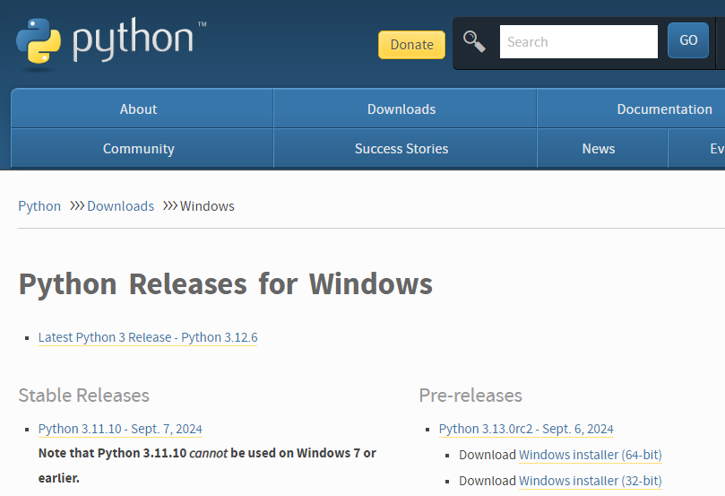

# Python

## Introducción

En este tema aprendremos un **lenguaje de programación**. Los lenguajes de programación se utilizan para crear **programas** que necesitamos que nuestro ordenador utilice.

Los ordenadores trabajan con lenguaje binario (0s y 1s), un idioma completamente diferente al de los humanos. Es por ello que se crean los lenguajes de programación. Gracias a ellos, las personas pueden escribir programas de una forma similar al lenguaje humano.

A diseñar, escribir y probar estos programas se le llama **programar**.

Una vez

## El lenguaje Python

Existen muchos lenguajes de programación, que son como diferentes idiomas. Cada uno tiene unas palabras propias y una determinada forma de escribirse, y se utilizan para tareas muy variadas. Nosotros vamos a aprender a utilizar **Python**, uno de los lenguajes más populares, pero hay muchos más.


## Herramientas online

Para crear nuestros programas podemis usar un entorno de programación online como, por ejemplo, [Repl.it](http://www.repl.it) donde podéis crear programas utilizando cualquier lenguaje a través de un navegador sin necesidad de instalar nada, y todos los proyectos que hagáis se guardarán ahí automáticamente.

Esta opción es la mejor si no queréis o no podéis instalar Python en vuestro ordenador.

## Instalación de Python

Para que un programa escrito en Python se ejecute en un ordenador, es necesario instalar el **intérprete de Python**.
Python tiene dos versiones principales: Python 2 y Python 3. Hoy en día, se recomienda usar **Python 3**, ya que Python 2 ha sido descontinuado.

Se puede descargar para Windows desde esta página: https://www.python.org/downloads/windows/. A continuación hay que instalarlo en el ordenador para que lea y ejecute los programas escritos en Python.



## Elementos de un programa

La programación consiste en escribir una secuencia de **instrucciones** organizadas en **líneas** de código, que en conjunto forman un **programa** capaz de realizar una tarea específica cuando es ejecutado.

Cada instrucción suele escribirse en una línea diferente, aunque esto no tiene por qué ser así. Si no cabe toda la instrucción, continuar en siguiente línea.

```python linenums="1"
print("cada línea termina en ;");
print("esta línea está mal")
print("la línea anterior tendria que terminar en ;");
```

Las instrucciones en un programa se ejecutan **secuencialmente** cuando el programa es iniciado.

En un programa, las líneas están **numeradas** para conocer en qué lugar del programa nos encontramos, pero los números no tienen ningún efecto en especial.

```python linenums="1"
print("estas es la línea 1 ;");
print("esta la 2. va a dar error aquí")
print("esta la 3");
```

## Nombres de archivos

Los archivos de Python se **guardan con extensión .py**, sus **nombres se escriben en minúsculas** y es recomendable **utilizar guiones bajos para separar palabras o números** para mantener la legibilidad y seguir las convenciones de estilo.

Ejemplos:

- operaciones_3_2.py
- operaciones_masa_corporal.py