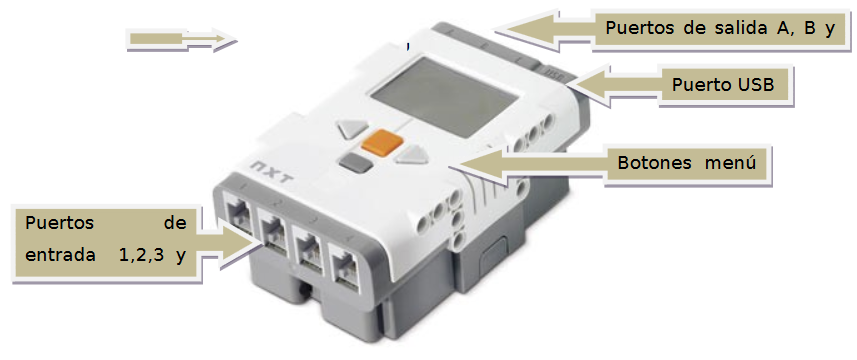
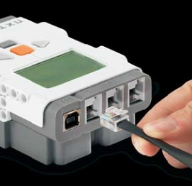

# Puertos

El bloque NXT cuenta también con:

- 4 puertos de entrada con conexión RJ12 (conector telefónico de 6 hilos),que permiten conectar sensores tanto digitales como analógicos.
- 3 puertos de salida RJ12 que se utilizan para conectar diferentes tipos de actuadores, normalmente servomotores.

La conexión de los motores y sensores al ladrillo NXT se realizará mediante unos cables proporcionados en el kit de Lego.

