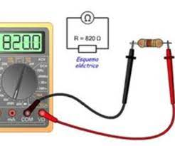
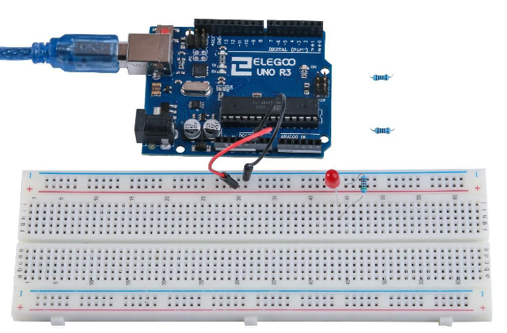
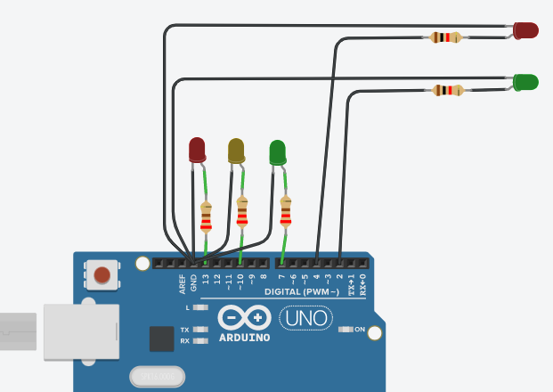
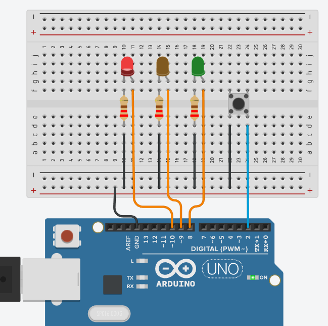

# LED

Los ``LED`` son diodos que emiten luz al pasar una corriente eléctrica determinada a través de ellos.

## ¿Cómo se conecta?

Directamente no se puede conectar un LED a una batería o fuente de tensión porque:

1) El  LED tiene un polo **positivo** y un **negativo** y no se encenderá si se conectan mal.
2) Un LED con una resistencia para limitar la corriente que circula a través de él.

## Ejemplo de LED


## Advertencia

Si no utilizas un resistencia con un LED, entonces se puede quemar casi de inmediato, como demasiada corriente fluirá a través, calienta y destruye al 'cruce' donde se produce la luz. Hay dos maneras de saber cual es el positivo del LED y que la negativa. En primer lugar, el positivo es más largo.

En segundo lugar, donde la pata del negativo entra en el cuerpo del LED, hay un borde plano para el caso del LED.

La patilla más larga es el ``positivo``.

## Resistencias

Como su nombre lo indica, resistencias de resisten el flujo de electricidad. Cuanto mayor sea el valor de la resistencia, resiste más y la menos corriente fluirá a través de él. Vamos a usar esto para controlar Cuánta electricidad fluye a través del LED y por lo tanto, como claramente brilla.

## Resistencias: ejemplo


## Resistencias: unidades

- La **unidad** de resistencia se denomina Ohm, que se abrevia generalmente a Ω la letra griega Omega.
- 1 Ohm es un valor bajo
- Valores de resistencias en kΩ (1.000 Ω) y MΩ (1.000.000 Ω). (kiloohmios y megaohmios).

## Resistencias: diferencias

Estas resistencias todas se ven iguales, excepto que tienen **rayas de colores** diferentes en ellos. Estas rayas decirte el valor de la resistencia.

El **código** de color resistor tiene tres franjas de colores y luego una banda de oro en un extremo.

## Ejemplo identificación resistencia


## Resistencias: orientación

A diferencia de los **LED**, resistencias no tienen un cable positivo y negativo. Se puede conectar de cualquier manera alrededor.

## Resistencias: medición

Si desconocemos el valor de una resistencia, también podemos medir su valor utilizando un ``multímetro``.



## Esquema


## Simulación

La **placa de desarrollo``Arduino`` UNO** es una conveniente fuente de 5 voltios, que vamos a utilizar para alimentar el LED y la resistencia. No necesita hacer nada con su UNO, salvo que lo conecte un cable USB.

## Simulación: ejemplo


## Resistencias para LED

- Con la resistencia de ``220 Ω``,  el LED debe ser bastante brillante.
- Si cambia  la resistencia ``220 Ω`` para la resistencia de ``1 kΩ``, brillará menos.
- Por último, con el resistor de ``10 kΩ`` en su lugar, el LED será casi invisible.

## Montaje



# Prácticas LED

Vamos a aprender a utilizar luces LED, botones y resistencias utilizando``Arduino``.

Para ello, diseñaréis, programaréis y simularéis circuitos variados utilizando principalmente resistencias, LEDs y botones.

# Práctica 1: Parpadeo LED integrado


# Práctica 2: Parpadeo LED Rojo externo

Parpadeo de un LED Rojo conectado a``Arduino``.


# Práctica 3: semáforo simple

## Semáforo de coches

En esta práctica programaremos un semáforo con tres leds: rojo, amarillo y verde, simulando un semáforo.

### Montaje


### Código

```c
// ``C++`` code
//
void setup()
{
  pinMode(13, OUTPUT);
  pinMode(10, OUTPUT);
  pinMode(7, OUTPUT);
}

void loop()
{
  //Encender verde
  digitalWrite(7, HIGH);
  digitalWrite(10, LOW);
  digitalWrite(13, LOW);
  delay(5000);
  //Encender amarillo
  digitalWrite(7, LOW);
  digitalWrite(10, HIGH);
  digitalWrite(13, LOW);
  delay(2000);
  //Encender rojo
  digitalWrite(7, LOW);
  digitalWrite(10, LOW);
  digitalWrite(13, HIGH);
  delay(5000);
}
```

# Práctica 4: semáforo de coches y peatones

Como ampliación, en este montaje controlaremos dos semáforos. Uno de peatones, y uno de coches.

- Cuando el de coches esté en rojo, el de peatones estará en verde, y viceversa
- El semáforo de coches pasa de verde a rojo pasando por el amarillo, y del rojo al verde directamente.

### Montaje



# Práctica 5: Semáforo con pulsador

En este ejemplo, el semáforo estará siempre en rojo, a no ser que pulsemos el botón. En ese caso, el semáforo pasará a verde, luego a ámbar y, por último, a rojo.

## Conexiones

Elegiremos 3 pines a los que colocar los LED, en mi caso 8, 9 y 10. Los 3 LED tendrán una resistencia en el camino, para protegerlos.

Tanto los LED como el pulsador se conectaran por la otra patilla hacia la entrada GND (tierra).


El pulsador irá conectado a otro pin, en mi caso he elegido el 2.




## Código del programa

```c
int ledVerde = 8;
int ledAmarillo = 9;
int ledRojo = 10;

int boton = 2;

void setup()
{
  pinMode(ledVerde, OUTPUT);
  pinMode(ledAmarillo, OUTPUT);
  pinMode(ledRojo, OUTPUT);

  pinMode(boton, INPUT_PULLUP);

  digitalWrite(ledRojo, HIGH);
}

void loop()
{
  if (digitalRead(boton) == LOW){
    delay(1000);
  	//Encender verde
  	digitalWrite(ledVerde, HIGH);
  	digitalWrite(ledAmarillo, LOW);
  	digitalWrite(ledRojo, LOW);
  	delay(5000);
  	//Encender amarillo
  	digitalWrite(ledVerde, LOW);
  	digitalWrite(ledAmarillo, HIGH);
  	digitalWrite(ledRojo, LOW);
  	delay(2000);
  	//Encender rojo
  	digitalWrite(ledVerde, LOW);
  	digitalWrite(ledAmarillo, LOW);
  	digitalWrite(ledRojo, HIGH);
  	delay(5000);
  }
}
```

Una vez que la simulación sea correcta, pasaremos a implementar el circuito físicamente y programarlo.


