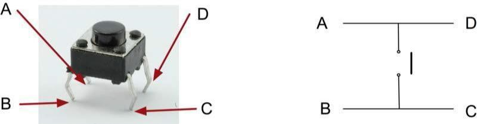
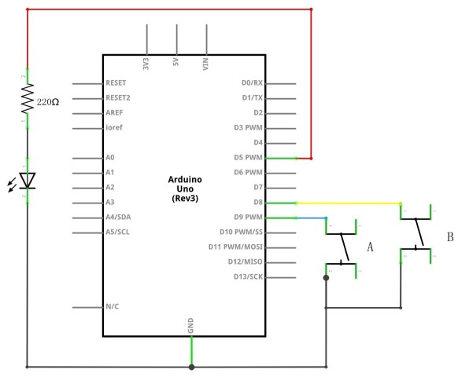

# Boton

En esta lección, aprenderemos a utilizar los botones con entradas digitales para  encender y apagar un LED.

- Al presionar el primer botón se encenderá el LED
- Al pulsar el otro botón se apagará el LED.

## Componentes

Antes de comenzar necesitaremos los siguientes componentes:

| cantidad | componente                |
| -------- | ------------------------- |
| 1        | Placa``Arduino`` UNO      |
| 1        | protoboard                |
| 1        | LED rojo                  |
| 1        | resistencia de 220 ohmios |
| 2        | interruptores             |
| 7        | cables jumper             |

## Pulsadores

Los interruptores son componentes muy simples. Al pulsar un botón, conectan dos contactos para que la electricidad fluya a través de ellos. Los interruptores de esta lección tienen **cuatro terminales**, lo cual puede resultar un poco confuso.

En realidad, solo hay dos conexiones eléctricas.

- Los terminales B y C están siempre conectados entre sí, al igual que los terminales A y D.
- Al pulsar el botón, se conectan todos los terminales.
- En realidad, dos de los terminales no son necesarios.



## Esquema de conexión



## Diagrama de cableado


## Las conexiones que vamos a tener que realizar son las siguientes:


Aunque los cuerpos de los interruptores son cuadrados, los pasadores sobresalen de lados opuestos del interruptor.

Esto significa que los pines solo estarán correctamente separados cuando se coloquen adecuadamente en la placa de pruebas. Recuerda que el LED debe tener el cable negativo más corto en el lado izquierdo.

## Explicación del código

- Al pulsar el botón izquierdo, se encenderá el **LED**.
- Al pulsar el botón derecho, se apagará.

La primera parte del proyecto define tres variables para las tres conexiones que vamos a utilizar.

- ``ledPin`` es el pin de salida
- ``pinBotonA`` se refiere al botón más cercano a la parte superior de la placa.
- ``buttonBpin`` al otro botón.

La función **setup** configura el pin 'ledPin' como salida, mientras que definimos las otras dos conexiones como entradas. Aquí es donde utilizamos **INPUT_PULLUP** como modo de pin:

- El modo **INPUT_PULLUP** indica que el pin debe ser utilizado como una entrada, pero cuando no hay nada conectado a la entrada, esta permanece en estado **HIGH**.
- En otras palabras, la entrada tiene un valor predeterminado de **HIGH**, a menos que se cambie a **LOW** al pulsar el botón. Esto permite que el botón controle la conexión a tierra y active la acción deseada.

# Conexión a tierra

Los interruptores están conectados a tierra por una razón importante. Cuando se presiona un interruptor, este conecta la clavija de entrada a tierra, cambiando su estado de alto a bajo.

En la función **setup**, configuramos el pin 'ledPin' como salida y las otras dos conexiones como entradas utilizando el modo **INPUT_PULLUP**.

- **INPUT_PULLUP** hace que el pin funcione como una entrada, manteniendo su estado en **HIGH** cuando no hay nada conectado.
- Cuando se pulsa el botón, la entrada se conecta a tierra y cambia a **LOW**. Esto permite que el botón controle la conexión a tierra y active la acción deseada.

La lógica puede parecer un poco invertida, ya que la entrada está normalmente en alto y solo cambia a bajo cuando se presiona el botón. Manejaremos esto en la **función loop**.

## Código completo

```c linenums="1" title="pruebaBoton.ino"
int ledPin = 5; //pin a que hemos conectado el LED
int pinBotonA = 9; //pin al que hemos conectado el boton A
int pinBotonB = 8; //pin al que hemos conectado el boton B

void setup()
{
  pinMode(ledPin, OUTPUT);
  pinMode(pinBotonA, INPUT_PULLUP);
  pinMode(pinBotonB, INPUT_PULLUP);
}

void loop()
{
  if (digitalRead(pinBotonA) == LOW)
  {
    digitalWrite(ledPin, HIGH);
  }
  if (digitalRead(pinBotonB) == LOW)
  {
    digitalWrite(ledPin, LOW);
  }
}
```