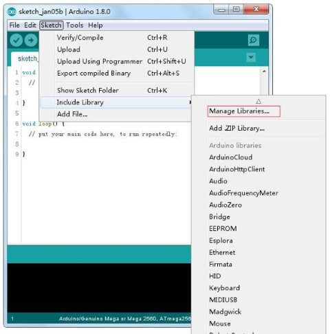
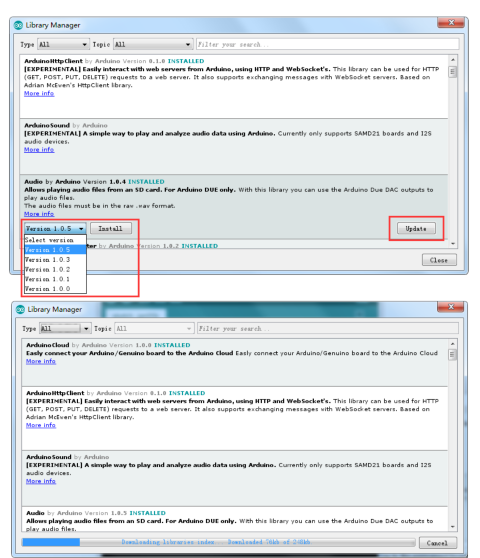
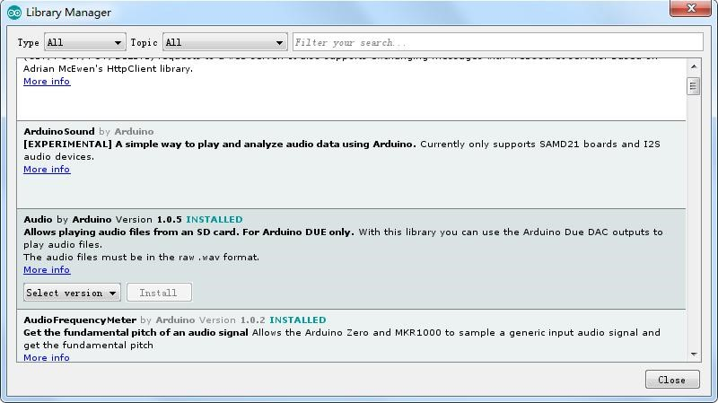
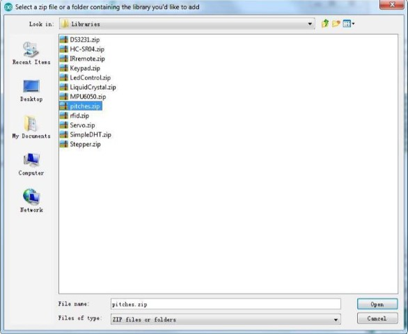
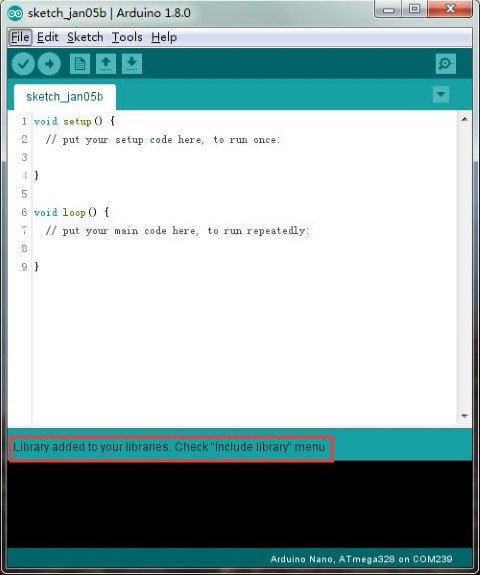

[游댗 Enrere](../) | [游 P많ina principal](http://danimrprofe.github.io/apuntes/) \n\n---
title: Librerías
footer: Daniel Moreno 🌐 <github.com/danimrprofe>
_footer: ""
paginate: true
_paginate: false
_class: invert
marp: true
---

# Librerias
## Arduino

---

## Instalación de **librerías** adicionales de``Arduino``

Una vez que esté instalado con el software de``Arduino`` y utilizando las funciones integradas, puede que desee ampliar la capacidad de tu``Arduino`` con **librería**s adicionales.

---

## 쯈ué son las librerías?

Las **librerías** son una colección de funciones que hacen que sea nos facilitan conectar con un  sensor, pantalla, módulo, etcétera. Por ejemplo, la librería **LiquidCrystal** incorporada facilita  hablar con pantallas LCD de caracteres.

Hay cientos de librerías adicionales disponibles en Internet. Para utilizar las **librerías** adicionales, es necesario instalarlas primero.

---

## Cómo instalar una librería

Mediante el administrador de la **librería**

Para instalar una nueva **librería** en el IDE de``Arduino`` se puede utilizar el **administrador de **librería**** (disponible desde IDE versión 1.8.0). Abra el IDE y haga clic en el menú "Dibujo" y luego la **librería** incluyen > Gestión de **librería**s.

---



---

Encontraremos una lista de **librerías** que ya están instaladas o disponibles para su instalación. En este ejemplo vamos a instalar la **librería** de puente. Desplazarse por la lista para encontrarla, a continuación, seleccione la versión de la **librería** que desea instalar. A veces sólo está disponible una versión de la **librería**. Si no aparece el menú de selección de versión, no te preocupes: es normal.

---

Hay veces que tienes que esperar, tal como se muestra en la figura. Por favor actualice y esperar

---



---

Finalmente haga click en instalar y esperar a que el IDE instale la nueva **librería**. La descarga puede tardar un tiempo dependiendo tu velocidad de conexión. Una vez haya terminado, debe aparecer una etiqueta instalada junto a la **librería** de puente. Una vez instalada puede cerrar el administrador de la **librería**.

---



---

Ahora ya puede encontrar la nueva **librería** disponible en el menú de **librería**. Si quieres añadir tu propia **librería** vaya a abrir un nuevo tema en Github.

---

### Importar una **librería** de .zip

Las **librería**s se distribuyen a menudo como un archivo ZIP o una carpeta. El nombre de la carpeta es el nombre de la **librería**. Dentro de la carpeta será un archivo .cpp, un archivo .h y a menudo un fichero llamado **keywords.txt**, carpeta de ejemplos y otros archivos requeridos por la **librería**. A partir de la versión 1.0.5, puede instalar **librería**s de partido 3 º en el IDE. Descomprime la librería descargada y dejarlo como está.

---

En el IDE de``Arduino``, desplácese a **Sketch > Biblioteca** incluyen. En la parte superior de la lista desplegable, seleccione la opción "agregar. Biblioteca ZIP''.


---

Se le pedirá para seleccionar la **librería** que desea añadir. Desplácese hasta la ubicación del archivo .zip y luego pincha en abrir.

---



---



---

Volver al dibujo > menú de **librería** de importación. Ahora debe ver la **librería** en la parte inferior del menú desplegable. Está listo para ser utilizado en su lista. El archivo zip se ha incorporado en la carpeta de **librería**s en el directorio de plantillas de``Arduino``.

---

Nota: la **librería** estará disponible para utilizar en los dibujos, pero los ejemplos de la **librería** no serán expuestos en el archivo > ejemplos hasta después del IDE se ha reiniciado. Los dos son los enfoques más comunes. Asimismo, pueden manejarse sistemas MAC y Linux. El manual de instalación que se introducirá por debajo como alternativa puede usarse rara vez y los usuarios que no lo necesiten pueden saltarlo

---

### Manual de instalación

Para instalar la **librería**, primero salga de la aplicación de``Arduino``. Luego descomprima el archivo ZIP que contiene la **librería**. Por ejemplo, para instalar una librería llamada "ArduinoParty", descomprime``Arduino``Party.zip.

Debería contener una carpeta llamada **ArduinoParty**, con archivos como``Arduino``Party.cpp y``Arduino``Party.h dentro. (Si los archivos .cpp y .h no en una carpeta, debe crear uno. En este caso, usted sería hacer una carpeta llamada "ArduinoParty" y copiar todos los archivos que estaban en el archivo ZIP, como``Arduino``Party.cpp y``Arduino``Party.h.)

Arrastre la carpeta de``Arduino``Party en esta carpeta (la carpeta de **librerías**). Bajo Windows, lo probable es que se llamará "My Documents\Arduino\libraries". Para usuarios de Mac, lo probable es que se llamará "Bibliotecas de``Arduino`` de documentos". En Linux, será la carpeta "libraries" en su programabook.

---

La carpeta de la **librería**``Arduino`` debe ahora este aspecto (en Windows):

```
Mi Documents\Arduino\libraries\ArduinoParty\ArduinoParty.cpp
Mi Documents\Arduino\libraries\ArduinoParty\ArduinoParty.h
Mi Documents\Arduino\libraries\ArduinoParty\examples
```
o como esta (en Mac y Linux):

```
Documents/Arduino/libraries/ArduinoParty/ArduinoParty.cpp
Documents/Arduino/libraries/ArduinoParty/ArduinoParty.h
Documentos/Arduino/**librería**s/ArduinoParty/ejemplos
```
---

Puede haber más archivos que solo los .cpp y .h, sólo asegúrese de que están todos allí. (La **librería** no funcionará si pones los archivos .cpp y .h en la carpeta de **librería**s o si está anidados en una carpeta extra. Visualizador:

Documents\Arduino\libraries\ArduinoParty.cpp y Documents\Arduino\libraries\ArduinoParty\ArduinoParty\ArduinoParty.cpp no funcionarán.)

---

Reiniciar la aplicación``Arduino``. Asegúrese de que la nueva **librería** aparece en el directorio -> elemento de menú de **librería** de importación del software. ¡Eso es todo! ¡Ha instalado una **librería**!