- [Blender](#blender)
- [0. Instalación](#0-instalación)
- [1. Modelado  🖌️](#1-modelado--️)
  - [Taza](#taza)
  - [Monigote](#monigote)
- [2. Entornos HDRI  🏞️](#2-entornos-hdri--️)
  - [¿Qué son los HDRI?](#qué-son-los-hdri)
  - [Agregando el HDRI](#agregando-el-hdri)
- [3. Animación 🎬](#3-animación-)
  - [3.1 Cámara en trayecto](#31-cámara-en-trayecto)
  - [3.2 Animación personalizada de cámara](#32-animación-personalizada-de-cámara)
  - [3.3 Animación de un objeto](#33-animación-de-un-objeto)
- [4. Texturas 🎨](#4-texturas-)
- [5. Armadura 💀](#5-armadura-)
  - [Rigging](#rigging)
  - [Crear un hueso](#crear-un-hueso)
  - [Columna vertebral](#columna-vertebral)
  - [Cadera](#cadera)
  - [Pierna](#pierna)
  - [Terminar](#terminar)
  - [Mover todo el personaje](#mover-todo-el-personaje)
- [6. Renderizado](#6-renderizado)
  - [Motor de renderizado](#motor-de-renderizado)
  - [Eligiendo el motor de renderizado](#eligiendo-el-motor-de-renderizado)
  - [Parámetros de renderizado](#parámetros-de-renderizado)
  - [Dimensiones](#dimensiones)
  - [Frames y framerate](#frames-y-framerate)
  - [Output](#output)
  - [Codificación](#codificación)
  - [Renderizar animación](#renderizar-animación)
- [7. Sistemas de partículas ❄️](#7-sistemas-de-partículas-️)
  - [Vista lateral del resultado](#vista-lateral-del-resultado)
  - [Crear copo](#crear-copo)
  - [2. Crear un plano con emisiones](#2-crear-un-plano-con-emisiones)
  - [3. Configuramos el plano para que emita partículas](#3-configuramos-el-plano-para-que-emita-partículas)
  - [4. Cambiamos el tipo de emisión para emitir objetos](#4-cambiamos-el-tipo-de-emisión-para-emitir-objetos)
  - [Colisiones y amortiguación](#colisiones-y-amortiguación)
- [8. Iluminación](#8-iluminación)
  - [Insertar luz de área](#insertar-luz-de-área)
- [9. Crear telón de fondo](#9-crear-telón-de-fondo)
  - [10. Texto](#10-texto)
- [11. Galeria de objetos](#11-galeria-de-objetos)
  - [Escena final](#escena-final)
  - [Ejemplos](#ejemplos)

# Blender

``Blender`` es un software de creación 3D gratuito y de código abierto. Está diseñado para modelado, animación, simulación, renderizado, composición y creación de gráficos interactivos. Se trata de una herramienta completa para la creación de contenido 3D con todo lo que necesita para crear proyectos profesionales.

``Blender`` se puede utilizar para la creación de aplicaciones, juegos, películas, producciones de televisión y mucho más.

# 0. Instalación

Página de descarga: https://www.blender.org/download/

Utilizaremos la ``versión 4.01``

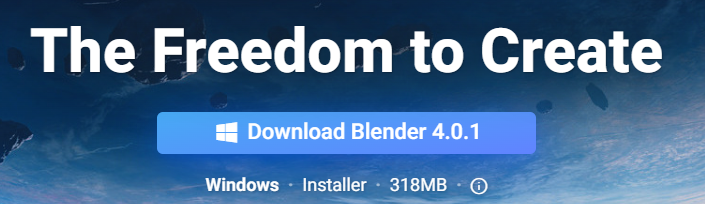

Elegiremos la versión portable:

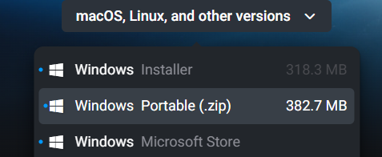

Se nos descargará un archivo comprimido ``zip`` con el programa. El archivo se quedará en la carpeta de ``descargas``.

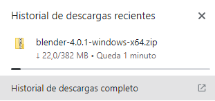

Abriendo el archivo descargado

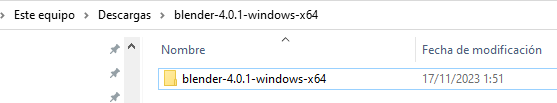

Lo extraeremos al escritorio:

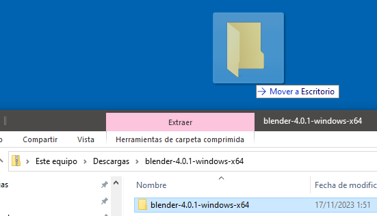

Para abrir blender, buscaremos el siguiente archivo:

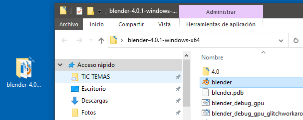

# 1. Modelado  🖌️

El modelado 3D es el proceso de crear representaciones tridimensionales de objetos o escenarios mediante software especializado, utilizando diferentes técnicas

## Taza

El primer objeto que vamos a modelar es una taza. De este modo utilizaremos las herramientas básicas para insertar, escalar y extruir nuestros obetos.

https://www.youtube.com/watch?v=kPHf9DlkGro

## Monigote

Podemos utilizar una restricción llamada ``mirror`` para crear objetos simétricos, lo que nos permite modelar en un plano y ver reflejado en el otro lo que dibujemos.


En este video podréis encontrar los pasos necesarios:

https://www.youtube.com/watch?v=AW8hmeC5x2c

# 2. Entornos HDRI  🏞️

En Blender, puedes cargar un HDRI como mapa de fondo para influir en la iluminación global de tu escena, o usarlo como fuente de luz ambiental para mejorar la calidad visual en tus renderizaciones. Los ``HDRI`` en Blender son especialmente útiles para lograr reflexiones y sombras más naturales alrededor de tus objetos

## ¿Qué son los HDRI?

Los HDRIs son básicamente imágenes 360° raw de alto rango dinámico que nos sirven para iluminar.

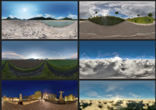

El primer caso es descargar un archivo que contenga el ``HDRI`` que queremos utilizar. Para ello podemos ir a la página web de ``poly haven``. En ella podemos encontrar múltiples recursos para nuestros renders, como por ejemplo texturas, entornos, etc.

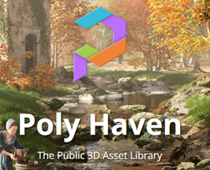

Entrando a la página veremos que tenemos un montón de ``HDRI`` que podemos usar totalmente de forma gratuita en nuestros renders.

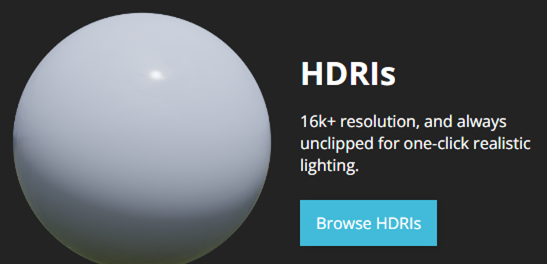

A continuación veremos varios de estos entornos, así como una panorámica de cómo se verían.

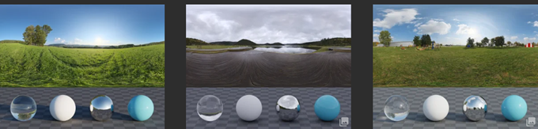

Vamos a elegir uno que nos interese. Nos vamos aquí abajo la descargamos como 2k.  Según la resolución que elijamos, más detallada se verá la escena, aunque el archivo descargado ocupará más tamaño.

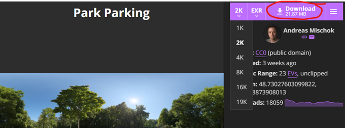

Ahora en descargas tendremos el archivo, con extensión exr. Este archivo se guardará en la carpeta descargas de nuestro perfil.


Ahora lo que vamos a hacer es seleccionar esta bola del mundo que todavía no habíamos visto y nos permitirá visualizar el entorno.

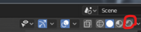

## Agregando el HDRI

Le damos a environment texture

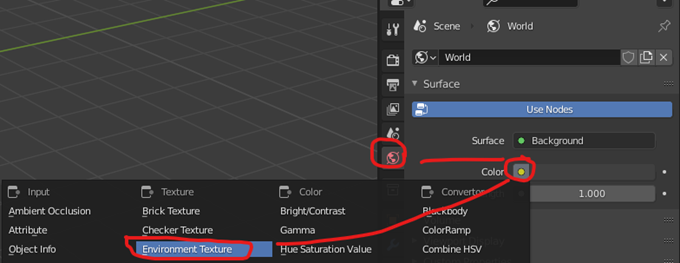

Le damos a open y seleccionamos HDRI que acabamos de descargar que es este de aquí le damos a abrir

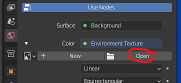

El formato ``HDRI`` (High Dynamic Range Image) utiliza archivos con extensión ``.exr`` para proporcionar imágenes de alto rango dinámico. Buscamos el archivo ``exr`` y lo abrimos.

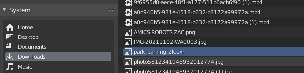

Veremos que ahora nuestro objeto está dentro de un entorno que lo ilumina como si estuviera ahí.


Por ejemplo, si añado una esfera y le aplico un material súper metálico, esencialmente aumento al máximo la propiedad 'metallic' y reduzco la rugosidad ('roughness').

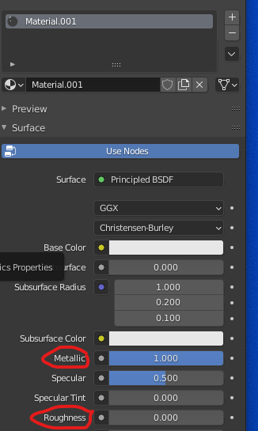

Si aplicamos ``clic derecho`` y sombreado suave (shade smooth), la geometría se mostraría como una esfera perfecta, permitiéndonos observar todos los reflejos de su entorno. En este punto, la esfera reflejaría de manera óptima el entorno, notando cómo cada cara se distingue individualmente y contribuye a la apariencia de una bola de disco.

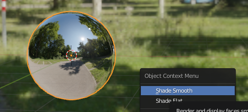

Esta sería una forma hiperrealista de iluminar nuestra escena

# 3. Animación 🎬

En esta sección exploraremos la línea de tiempo (**timeline**) y aprenderemos a manejar los fotogramas clave (**keyframes**) para crear movimientos y animaciones fluidas.

## 3.1 Cámara en trayecto


### **Objetivo:**

Configurar una animación en Blender en la que una cámara siga un trayecto definido, utilizando la línea de tiempo y los fotogramas clave.

### **Pasos en Blender:**

1. **Abrir la Línea de Tiempo:**
   - Asegúrate de tener visible la **línea de tiempo** (Timeline).
     Si no está visible, ve a **View > Areas > Timeline** en la parte inferior de la ventana de Blender.

2. **Añadir una cámara a la escena:**
   - Ve al menú **Add > Camera** (o presiona `Shift + A` > Cámara).
   - Posiciona la cámara en la ubicación inicial desde donde empezará su recorrido.
   - Para ver desde la cámara, presiona `Numpad 0`.

3. **Crear un trayecto (Path):**
   - Agrega un trayecto que seguirá la cámara:
     Ve a **Add > Curve > Path** (o usa `Shift + A` > Curva > Camino).
   - Ajusta el trayecto según necesites en el modo de edición (`Tab`) y mueve los puntos con `G`.

4. **Vincular la cámara al trayecto:**
   - Selecciona la cámara y luego el trayecto (manteniendo `Shift`).
   - Presiona `Ctrl + P` y selecciona **Follow Path** (Seguir Camino).
   - La cámara ahora estará vinculada al trayecto.

5. **Animar el movimiento de la cámara:**
   - Selecciona el trayecto y abre el panel **Object Data Properties** (icono de curva verde).
   - Activa la opción **Frames** y define la duración del movimiento (por ejemplo, de fotograma 1 a 100).
   - La cámara se moverá automáticamente a lo largo del trayecto.

6. **Hacer que la cámara mire hacia adelante:**
   - Selecciona la cámara y ve a **Object Constraint Properties** (icono de cadena).
   - Añade un modificador de tipo **Track To**:
     - En **Target**, selecciona el trayecto o un objeto al que la cámara debe mirar.
     - Ajusta los ejes según necesites (generalmente -Z para **To** y Y para **Up**).

7. **Ajustar velocidad o fotogramas clave:**
   - Si quieres modificar la velocidad, ajusta el valor de **Frames** en las propiedades del trayecto.
   - Para un control más detallado, abre el **Graph Editor** (`Shift + F6`) y ajusta las curvas de animación.

8. **Vista previa de la animación:**
   - Presiona `Space` o `Alt + A` para reproducir la animación.
   - Ajusta posiciones, trayectos, o tiempos si es necesario.

### **Consejos adicionales:**

- **Aceleraciones y desaceleraciones:**
  En el **Graph Editor**, selecciona la curva del movimiento y aplica suavizado (`T > Ease In/Out`). Esto hará que los movimientos sean más realistas.

- **Render de vista previa:**
  Presiona `Ctrl + F12` para renderizar una animación rápida y visualizar el resultado.

Video: https://www.youtube.com/watch?v=M9XMEEMnRJk

## 3.2 Animación personalizada de cámara

Vamos a hacer que la cámara se mueva alrededor de la escena, mientras que el objeto permanecerá fijo. En este caso, nosotros indicaremos todos los movimientos que va a seguir la cámara.

En resumen, lo que haremos será tomar "fotos" de la escena desde diferentes ángulos
en momentos determinados, y ``Blender`` calculará los movimientos a realizar entre los dos puntos.

### Crear una cámara

Si necesitamos crear una cámara, para ello hacemos ``shift + a`` y elegimos crear cámara.

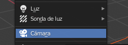

Por defecto la cármara nueva ``Blender`` la colocará en el centro de la escena. Si tenemos algún objeto ahí puede ser que no veáis la cámara porque este lo esté tapando.

###  Ver el punto de vista de la cámara

Podemos darle al 0 para irnos a la vista desde la cámara. También podemos seleccionar el icono de cámara arriba a la derecha.

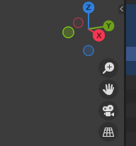

Como veis si intentamos movernos nos salimos de la cámara. También podemos pulsar 0 para salir de la vista.

### Modificar la posición

La cámara la podemos mover como cualquier objeto, por ejemplo haciendo ``g x`` o ``g z`` para moverla en estos ejes.

También podemos colocarla con la tecla ``n`` y variando los parámetros de posición y rotación a mano. Tal como loe hemos hecho, hemos distanciado la cámara 10 metros en el eje y, y la rotación de 90 grados respecto al eje X.


A continuación podéis ver como queda la escena con estos parámetros. Recordad que cada cuadrado mide 1m por lado en ``Blender``, por lo que os podéis hacer una idea de las distancias.


### Mover la cámara con nosotros

En ocasiones es más fácil animar la cámara si hacemos que nos siga a nosotros. Para ello, con la cámara seleccionada y la tecla ``n`` , a continuación seleccionamos view y lo que es camera to view. Ahora cuándo movamos la vista también se mueve nuestra cámara, que nos seguirá.


### Configuración de la cámara

En la configuración de cámara le damos poner que queremos una distancia focal de 120 milímetros (mm)

Vamos a componer nuestra imagen de esta forma vale la animación que quiero que haga la cámara es muy simple simplemente quiero que haga una especie de órbita.


### Insertar fotogramas clave

Los frames son las fotos que componen un video.

- Cuantos más frames en un segundo, más fluida se verá la animacion.
- Si tenemos un framerate de 30 fps y grabamos 120 fps, nuestra animación durará 4 segundos.

**¿Qué es un fotograma clave o keyframe?**

Un ``keyframe`` es en realidad una marca que guarda la **posición, escala, rotación y opacidad** de un objeto en un momento específico de la escena.

Si creas más de dos keyframes con una variación de posición, escala, rotación y opacidad entre ellos, verás que automáticamente ocurrirá una animación

Si le damos al ``0`` nos ponemos en la vista la cámara, y veremos que si nos movemos, la cámara nos sigue.


Lo que vamos a hacer para ello va a ser un aquí al primer fotograma le vamos a dar con nuestra cámara seleccionada aquí le damos a la ``i`` y esto nos va a insertar un keyframe un fotograma clave le vamos a ``localización y rotación``

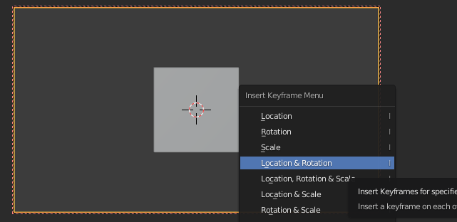

Vamos a avanzar 100 fotograma movemos un poquito la cámara e insertamos otro fotograma localización y rotación


 Si ahora le damos al play ya tendríamos nuestra animación hecha. Veréis que la animación no se detiene en el 100, por lo que la tendremos que parar nosotros.

### Analicemos el timeline

Aquí vemos que el único objeto animado ha sido la cámara. De hecho, el cubo sigue en su sitio.


Si ampliamos podemos ver la siguiente información. Tenemos dos **keyframes**

- Uno en el ``frame 0``. Es la "foto" de nuestra escena en ese momento.
- Otro en el ``frame 100``. Aquí las posiciones de los objetos habrán cambiado.

En medio, ``Blender`` calculará (extrapolará) todos los frames intermedios que conducirán al movimiento entre esas dos posiciones.


## 3.3 Animación de un objeto

Ahora vamos a hacer que el cubo se haga más pequeño poco a poco. Para ello, en primer lugar, debemos seleccionar el cubo.


Veremos que el timeline en la parte inferior está vacío, pues no lo hemos animado todavía el cubo (solo habíamos animado la cámara).

El primer keyframe lo ponemos en el 100. En este caso, repetiremos los mismos pasos, pero ahora seleccionamos Posición, rotación y escala.


Luego nos posicionamos en el 160, escalamos el cubo y fijamos el segundo keyframe


Al tener 160 frames:

- En un video de 24 FPS nuestra animación durará: $160 / 24 = 6,67 s$
- Si fuera de 60 FPS, duraría 2,6 s

Si seleccionamos tanto la cámara como el cubo, veremos en el timeline ambos objetos, y sus correspondientes keyframes.

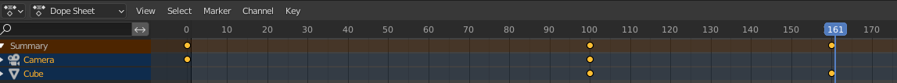

### Enfoque y desenfoque

Lo que vamos a hacer es que nuestra cámara enfoque y desenfoque. Para ello nos vamos a donde pone cámara y donde pone de **perfil de profundidad de campo** y como veis automáticamente se ha desenfocado todo.


Podemos decirle que enfoque un objeto en concreto, por ejemplo nuestro cubo. Hará un autofocus hacia el objeto, esté donde esté.


# 4. Texturas 🎨

Las texturas en Blender son **imágenes** o **patrones** que se aplican a los modelos 3D para darles **apariencia** y realismo. Las texturas pueden ser de muchos tipos, y su uso permite simular detalles como superficies rugosas, colores, reflejos, transparencias, y otros efectos visuales sin tener que modelar cada detalle físicamente.

Las imágenes están descargadas de Internet y editadas en Inkscape. Recordad buscar imágenes con transparencias, preferiblemente png.

Podéis seguir el siguiente vídeo para realizar esta parte:

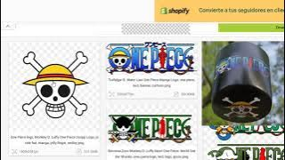

https://www.youtube.com/watch?v=P_f4C_0ohw4

# 5. Armadura 💀

Para animar nuestro personaje tendremos que dotarle, además del modelo, de un esqueleto. Al mover los huesos de este esqueleto, el modelo se moverá acorde a ellos.

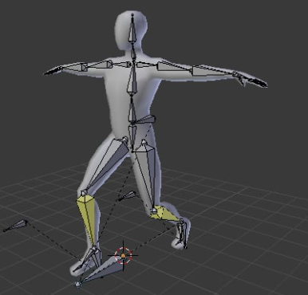

## Rigging

En Blender, el "rigging" se refiere al proceso de crear un **esqueleto virtual** (``armadura``) para un modelo 3D. Este esqueleto permite animar el modelo al asignarle huesos y controladores para manipular su forma y movimiento

## Crear un hueso

Con **shift+a** vamos a abrir el menú y vamos a crear el primer hueso en modo objeto.


El hueso ahora no lo veremos porque está dentro de mi figura. Vamos a activar esta opción para que se vea siempre por delante del personaje, aunque no lo está realmente.

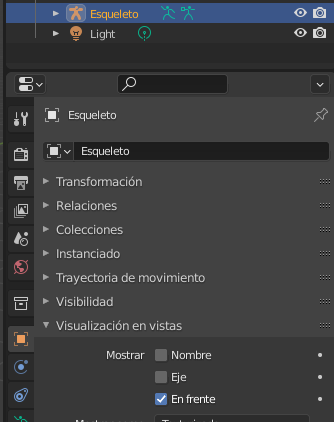

Desde la vista frontal con el hueso seleccionado y la **tecla s** lo vamos a escalar hasta que tenga el tamaño del cuerpo

## Columna vertebral

Ahora para editar el hueso hay que entrar en el **modo edición**. Lo que quiero es hacer lo que sería la columna vertebral así que vamos a seleccionar el hueso y **clic derecho** le vamos a dar a subdivide por defecto sólo se subdivide una vez.

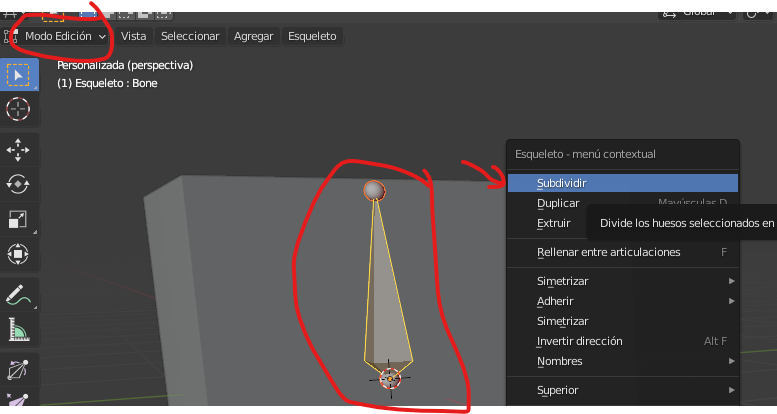

Aquí abajo podemos cambiar el número de subdivisiones en total le vamos a dejar tres huesos para el cuerpo. O sea, le metemos dos subdivisiones desde la vista frontal pulsando 1 del teclado numérico


## Cadera

Vamos a seleccionar el circulito debajo del hueso y le vamos a dar a la para escribir el hueso y sacarlo que sería la cadera con la **tecla G** lo movemos y con R lo rotamos yo lo coloca donde más o menos iría la cadera para que luego todo funciona lo mejor posible.

## Pierna

De esa cadera vamos a sacar la pierna igual que antes seleccionamos el circulito y con la **tecla E** extremos para que tenga rodilla necesitamos otro hueso más así que como ante CBD encima del hueso y los dividimos una vez desde la vista lateral pulsando la **tecla 3** del teclado numérico de coloco los huesos siguiendo un poco mejor la forma del personaje hacer con la tecla G o las flechitas.

Vamos a duplicar los huesos del lado izquierdo, pero para que funcione correctamente se tienen que renombrar en este caso nos sirve esta opción automática 11seleccionamos el hueso pulsamos CBD encima y dentro de names pulsamos en auto name let bright

Se hace lo mismo con los tres huesos y hecho esto lo seleccionamos pulsamos CBD encima y le damos a la opción de simetría y ahí lo tenemos le toca un poco el hueso de la columna que creo que está un poco bajo y ya nos queda duplicar el hueso de arriba con sic depara el cristal y duplicar el hueso del medio para poder mover la mochila también esto no tiene que ver con eltuto pero lo voy a poner rápidamente al otro lado por si me está molestando con los cuadrados que salen ahí a veces

## Terminar

ya tenemos todos los huesos necesarios así que vamos a salir del **modo edición** con ``tab`` al offset mount y lo que hacemos es seleccionar todas las partes del personaje primero manteniendo la tecla ``⬆️ ``⬆️ shift`` ` pulsada y por último seleccionamos los huesos.

A continuación, pulsamos ``ctrl``+P y elegimos esta opción para unir los huesos al personaje de forma automática para comprobar que no ha funcionado seleccionamos los huesos en esta esquina le damos a la opción pose mode donde podemos mover los huesos para apoyar a nuestro personaje.

Comprobamos que todo funciona y ahora vamos a mejorar un par de cosas para que nuestro rey funciones aún mejor

Cambiamos del modo pose al **modo edición** seleccionamos el hueso de la mochila y luego el de la espalda. El orden es importante una vez seleccionado pulsamos ``ctrl``+``P`` y le damos aquí offset así cuando movamos ese huevo ese huevo ese huevo y así cuando movamos ese hueso la mochila lo seguirá y con el cristal podemos hacer lo mismo.

Primero seleccionamos el hueso del cristal y luego el hueso de la cabeza lo ponemos todo un poco para asegurarnos de que funcione bien y para volver atrás pulso ``ctrl``+``z`` obviamente todos los ríos tienen un límite y si hacéis los movimientos muy extremos se os va a romper, pero la verdad que me ha quedado bastante bien y creo que soporta posturas extremas ya podemos mover todas las partes del personaje

## Mover todo el personaje

Necesitamos un último hueso que nos permita moverlo todo a la vez así que volvemos a **modo edición** con la parte de abajo del hueso seleccionada pulsamos la ``e`` para extruir un nuevo hueso y lo colocamos por aquí.

Ahora lo tenemos que conectar así que primero seleccionamos el hueso de la columna y luego el del suelo pulsamos ``ctrl``+P y le damos a keep offset. Como veis ya está conectado así que ahora hacemos lo mismo con los huesos de la cadera recordad desde el **modo edición** primero seleccionamos el hueso de la cadera y después el del suelo pulsamos ``ctrl``+P y tipo offset desde el pose mode comprobamos que funciona volvemos **modo edición** y hacemos exactamente lo mismo con el hueso de la otra cadera y ya tenemos nuestro gris completo listo para ser animado.

# 6. Renderizado

El proceso de renderización es importante porque nos permite visualizar el resultado final de nuestro trabajo y asegurarnos de que se vea exactamente como lo queremos.

**Renderizar** es el proceso mediante el cual se genera una **imagen** final o una secuencia de imágenes (en el caso de **vídeos**) a partir de la escena 3D creada en un software de modelado y animación como Blender.

Al renderizar, el programa toma todos los datos de la escena (modelos 3D, luces, cámaras, texturas, materiales, efectos especiales, etc.) y los convierte en un **archivo** visual (como una imagen estática o una animación).

Este proceso puede ser **intensivo** en cuanto a recursos, ya que depende de factores como la complejidad de la escena, la calidad de los materiales, la resolución, y los efectos visuales aplicados (sombras, reflejos, iluminación global, etc.).

Antes de renderizar es importante elegir los parámetros necesarios como:

- El ``motor`` de renderizado
- La ``resolución`` y ``tasa de frames`` de renderizado
- El ``lugar`` en el que se guardará el archivo de video final.

## Motor de renderizado

El renderizado 3D es un proceso computarizado y, por lo tanto, requiere de una gran cantidad de **recursos**. Es importante tener en cuenta esto al seleccionar el software de renderizado adecuado, ya que algunos programas son más exigentes en cuanto a los recursos necesarios que otros.

En general, el renderizado 3D es un proceso largo y complejo. Sin embargo, existen algunas formas de acelerar el proceso de renderizado, como la utilización de un PC con una tarjeta gráfica potente o el uso de un servidor de renderizado en la nube.

## Eligiendo el motor de renderizado

Para renderizar estamos usando el motor de renderizado **eevee** que es el más rápido, aunque también tendríamos el **cicles** que éste es más realista pero también lleva mucho más tiempo de renderizado


## Parámetros de renderizado

Lo que vamos a hacer va a ser irnos a este segundo icono aquí tenemos el tamaño, los fotogramas, fotogramas por segundo, cuánto queremos que dure.

Vamos a configurar los siguientes parámetros

- Resolución FullHD
- Frame inicio y finalización
- Ubicación del archivo guardado
- Formato
- Contenedor
- Códec de video
- Calidad

## Dimensiones

Cuando renderizas una animación o imagen en Blender, los parámetros de la sección Dimensiones en el panel de Properties > Output Properties (icono de **impresora**) son clave para definir el tamaño, formato y calidad del resultado.

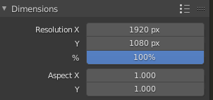

### **Parámetros de Dimensiones:**

1. **Resolution (Resolución):**
   - Define el tamaño de la imagen o animación en **píxeles**.
   - **X (ancho):** Número de píxeles horizontales.
   - **Y (alto):** Número de píxeles verticales.
   - Ejemplo: Para Full HD, ajusta `X = 1920` y `Y = 1080`.

2. **% Scale (Escala porcentual):**
   - Controla un porcentaje de la resolución definida.
   - Útil para realizar pruebas de renderizado a menor resolución sin cambiar los valores de X e Y.
   - Ejemplo: Un ajuste de 50 % en Full HD renderiza a 960x540 píxeles.

3. **Aspect Ratio (Relación de aspecto):**
   - Define la relación de píxeles en términos de ancho y alto.
   - Usualmente se deja en `1:1` para píxeles cuadrados.
   - Valores diferentes pueden distorsionar la imagen (por ejemplo, para renderizar con píxeles no cuadrados en cine o televisión).

#### **Consejos prácticos:**

- Si planeas subir tu render a plataformas como YouTube, usa una resolución estándar como **1920x1080** (Full HD) o **3840x2160** (4K).
- Para proyectos más pequeños o pruebas rápidas, puedes usar una escala del 50 % o una resolución menor, como 1280x720 (HD).
- Revisa siempre que el FPS coincida con el estándar del proyecto o del medio donde lo publicarás.

## Frames y framerate

Aquí podemos seleccionar el primer y último frame que queremos renderizar, así como los pasos.

Por otro lado, el framerate nos determinará cuantos frames pondremos en cada segundo. A mayor tasa de frames, más fluída quedará la animación, pero durará menos.

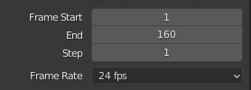

### Parámetros

4. **Frame Range (Rango de fotogramas):**
   - Determina el inicio y final de la animación:
     - **Start (Inicio):** Número del primer fotograma.
     - **End (Fin):** Número del último fotograma.
   - Ejemplo: Si la animación dura 5 segundos a 30 fps, el rango debe ser de 1 a 150.

5. **Frame Step (Paso de fotogramas):**
   - Define cuántos fotogramas se saltan al renderizar.
   - Un valor de `1` renderiza todos los fotogramas, mientras que `2` renderiza solo cada segundo fotograma (útil para pruebas rápidas).

6. **FPS (Frames Per Second - Cuadros por segundo):**
   - Establece la velocidad de la animación.
   - Valores comunes:
     - **24 fps:** Cine estándar.
     - **30 fps:** Videos online.
     - **60 fps:** Animaciones suaves o videojuegos.

## Output

En esta parte elegiremos la carpeta donde queremos guardar el vídeo renderizado, así como el formato. Es importante elegir aquí un formato de vídeo.

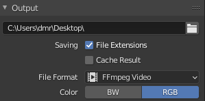

## Codificación

La codificación es un poco más compleja. Podéis dejar estos parámetros por defecto.

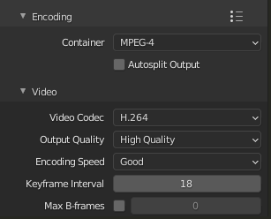

## Renderizar animación

Por último, vamos a renderizar el vídeo. Aquí es cuando tendremos que esperar más o menos tiempo, en función de la duración del vídeo, calidad y la tasa de frames, entre otros factores.

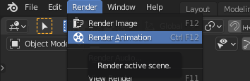

### **Render Image vs Render Animation**

- **Render Image:** Renderiza un solo fotograma de la escena (tecla `F12`), ideal para imágenes estáticas o pruebas rápidas.
- **Render Animation:** Renderiza todos los fotogramas de la animación definida en el rango (tecla `Ctrl + F12`), guardando una secuencia de imágenes o un video.
- **Usos:** *Image* para imágenes individuales; *Animation* para videos o proyectos animados.
- Configura previamente el formato (imagen o video) y la carpeta de salida en **Output Properties**.

# 7. Sistemas de partículas ❄️

Un sistema de partículas es un conjunto de ``partículas`` que se mueven de forma coordinada. En ``Blender``, un sistema de partículas se puede usar para crear efectos como humo, nieve, lluvia, etc.

Los sistemas de partículas en ``Blender`` se pueden configurar de forma muy detallada, permitiendo a los usuarios controlar cosas como la velocidad, el tamaño y la forma de las partículas.

La simulación con sistemas de partículas permite obtener animaciones complejas de objetos que responden a **fuerzas gravitatorias** y acciones como las que produce el **viento** o un campo magnético. De esta forma podemos recrear **lluvia, nieve, y otros**.

## Vista lateral del resultado

En este ejemplo podemos ver cómo quedará el plano emisor de las partículas y las propias partículas.


## Crear copo

Como simularemos nieve, la partícula fundamental será un **copo de nieve**. Este será el objeto que luego multiplicaremos para crear las demás partículas.

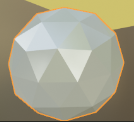

Colocamos una ``esfera geodésica`` con ````⬆️ shift`` `+`a` > ``malla``

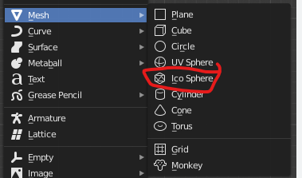

Con ``g`` nos la colocamos en un sitio que no vea la cámara,  fuera de plano. Esto que véis es desde  shading

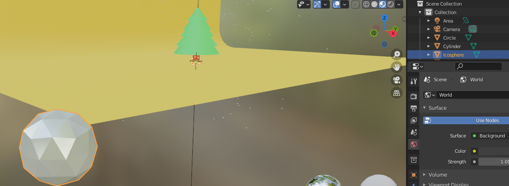

Le damos material y color para que se vea. Vamos a crear un material nuevo y le vamos a cambiar el nombre a nieve.

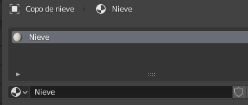

Le damos las características que queramos, que hagan que los copos se vean lo más similares posibles a la nieve real.

Metálico y especular son ambos tipos de materiales que se pueden usar en ``Blender``. Los materiales **metálicos** generalmente se usan para crear objetos metálicos, mientras que los materiales **especulares** se usan para crear objetos más brillantes o reflectantes.


## 2. Crear un plano con emisiones

Los sistemas de partículas en ``Blender`` se pueden controlar usando **emisores**, que son objetos que se usan para generar las partículas.

Los **emisores** pueden estar configurados para emitir partículas de forma continua o bajo ciertas condiciones, como cuando se colisionan con otro objeto.

Colocamos un plano con ``⬆️ shift``+``a`` > ``plano``.

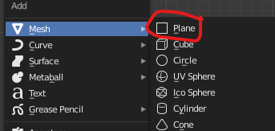

Lo pondremos encima del árbol, pero que no salga en el plano de la cámara. con las teclas ``g`` y después ``z`` lo movemos hacia arriba, para colocarlo sobre la escena.

El plano tiene que estar **fuera de la vista de la cámara**, para que no se vea.

Con ``s`` escalamos para que cubra toda la zona en la que queremos que nieve.


Al plano que lanza nieve le he cambiado el nombre para poder luego identificarlo más fácilmente.


## 3. Configuramos el plano para que emita partículas

Seleccionamos el plano generador de nieve


Le agregamos un particlesystem y configuramos los parámetros necesarios. Yo le he cambiado el nombre con ``F2`` a partículas de nieve para identificarlo.


Configuramos los parámetros necesarios como número de copos, frames de inicio y fin y vida de los copos (cantidad de frames hasta que desaparecen).


Podemos ver la animación (tecla espacio), y veremos el efecto creado. De todos modos, tal como está en el render final no aparecerían las partículas.

## 4. Cambiamos el tipo de emisión para emitir objetos

Elegimos más abajo en **render** elegimos **render as object**.

El objeto tiene un **flag** que indica si el emisor está activo o no. Si se activa un emisor, se empieza a emitir partículas de forma continua, y si se desactiva, se para la emisión. Puede usar esta función para crear efectos de partículas en respuesta a eventos del juego (por ejemplo, una explosión).

En el submenú object seleccionamos en instance object la icosfera que habíamos creado. De este modo, le estamos diciendo que cree todos los objetos a partir de este.


También cambiaremos ``velocity`` y ``physics`` para ajustar el comportamiento de los copos  y que este sea más realista.


Volved a simular la animación y veréis que ya se comportan más como copos de nieve.

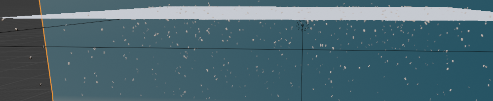

## Colisiones y amortiguación

Al fondo hay que ponerle un modificador de colisión para que las partículas no lo atraviesen.

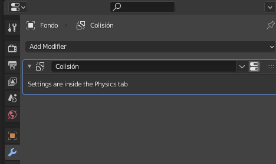

Veréis que los copos rebotan como si fueran canicas, esto se puede modificar. En Physics podéis cambiar el comportamiento para que amortigüe los copos al tocar el suelo.


Ahora los copos ya no atraviesan el plano y no rebotan, sino que se quedan parados en el suelo.


# 8. Iluminación

Vamos a colocar una luz sobre la escena a fin de iluminar correctamente todos los objetos.

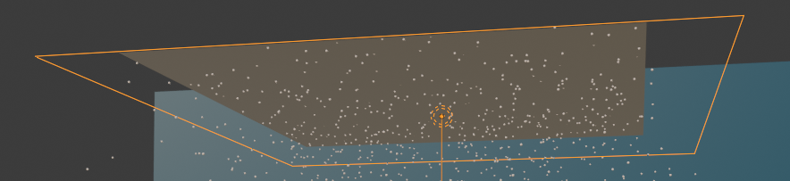

## Insertar luz de área

Insertar una **luz de área 🌟** que esté justo encima de los objetos que queremos iluminar.
Creamos un plano con ``shift`` ` y ``a`` continuación luz plana.


### Escalar la luz

La luz creada es de 1m por 1m, demasiado pequeña para nuestra escena.

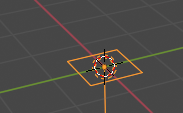

Con `S 2 0` , lo podemos escalar a 20 metros cuadrados. Al ser un objeto plano, solo escalará en los ejes X e Y.

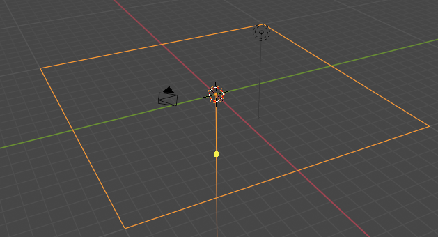

### Subir la luz

Ahora nuestra iluminación está a ras de suelo, por lo que no iluminará nada. Subiremos nuestra luz a la altura que consideréis. Si queréis subirla 10 metros: `G Z 10`.

Pensada que la luz deberá estar debajo del plano emisor de partículas. De lo contrario, el plano emisor bloqueará la luz, al quedar por encima de él.

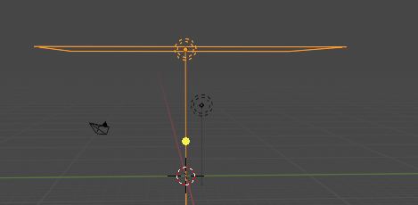

### Potencia

La potencia de la luz se mide en Vatios (W). A mayor potencia, más iluminará la luz la escen.
En propiedades de la luz, ajustamos la potencia a ``10.000 W``.

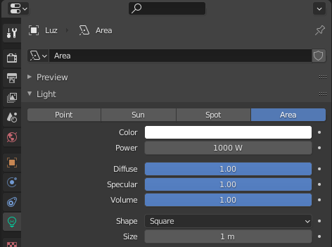

### Altura de la luz

En mi caso he colocado la luz a 12 metros de altura, como referencia, por si lo queréis hacer así, y centrado en origen de coordenadas para la x y la y.


### Cámara

La cámara la podéis poner donde queráis. Yo la he modificado a ojo y en una posición en la que se vea bien la escena.

Tened en cuenta que la cámara tiene:

- Una ``posición``
- Una ``rotación``, que habrá que modificar para que enfoque en la dirección correcta.


# 9. Crear telón de fondo

A base de combinar dos planos podemos crear un telón de fondo para nuestra escena.

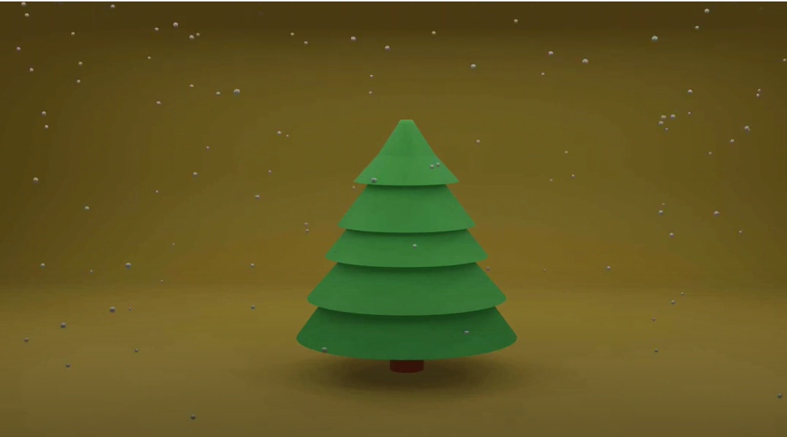

- Creamos un plano con ``⬆️ shift`` ` y a continuación malla y plano.

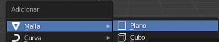

- Escalamos el plano con ``S 2 0``, y por último ````enter````. De esta forma tendremos un plano de 20 metros cuadrados

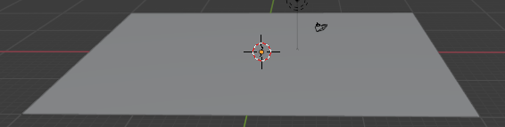

Seleccionamos en ``modo vértices`` (tecla numérica 1) y

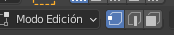

Seleccionamos los dos vértices de la arista que queremos extruir.

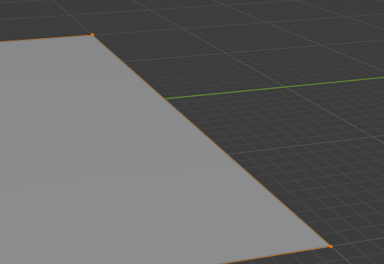

Los extruimos en el eje Z con ``E`` y luego ``Z``. Estiramos hacia arriba.

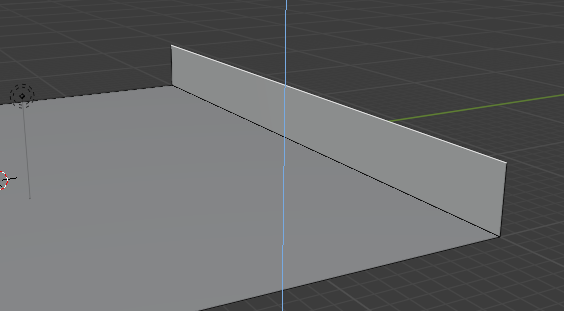

Por último, seleccionamos las arista que conecta pared y suelo

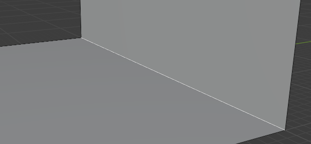

Volvemos a seleccionar los dos vértices

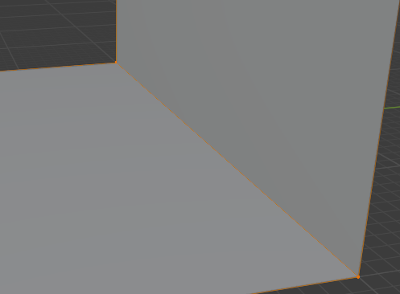

Hacemos un biselado utilizando ``Ctrl`` + ``B``, lo cual permite suavizar los bordes de la geometría seleccionada y añadir un efecto de chaflán.


Al mover la rueda del ratón podemos escoger el número de caras que queremos aplicar.


En modo objeto seleccionando con botón derecho del ratón podemos elegir `sombrear suave` para suavizar nuestra figura.


Vamos al menú materiales para darle un nuevo material a nuestro fondo.


Creáis un nuevo material llamado telón con el color que queráis:


Deberéis ir a `sombreado de la vista` para ver el resultado:


## 10. Texto

Para agregar texto:


A continuación, podemos cambiar el texto:


Para modificar el texto entramos en modo edición:


Por último para extruirlo:


Rotarlo: ``R X 90``


# 11. Galeria de objetos

**BlenderKit** es una plataforma que proporciona una amplia gama de recursos 3D, como **modelos, materiales, pinceles** y más, que los usuarios pueden utilizar **directamente** en sus proyectos dentro de Blender. Funciona a través de un **complemento** dedicado que los usuarios pueden instalar en Blender, lo que les permite acceder a su biblioteca de recursos directamente desde la interfaz del programa.

Una vez instalado, BlenderKit integra un panel dentro de Blender desde donde los usuarios pueden buscar, previsualizar y descargar activos de forma rápida y sencilla

Ir a Preferencias:

- Ve al menú "Editar" en la esquina superior izquierda de la ventana de Blender.
- Selecciona "Preferencias".
- Ir a la Pestaña de Complementos:


En la ventana de Preferencias, selecciona la pestaña "Complementos" en el lado izquierdo.

**Instalar el Complemento:**

En la parte inferior de la ventana de Preferencias, busca el botón que dice "Instalar".
Selecciona el archivo del complemento BlenderKit que descargaste.

**Activar el Complemento**

Después de instalar el complemento, debería aparecer en la lista de complementos instalados en la ventana de Preferencias.
Asegúrate de marcar la casilla junto al nombre del complemento para activarlo.


Los objetos que no tienen candado los podéis usar sin problema.


## Escena final

Aquí podéis ver un resumen de como queda la escena, con todos los elementos.


## Ejemplos


