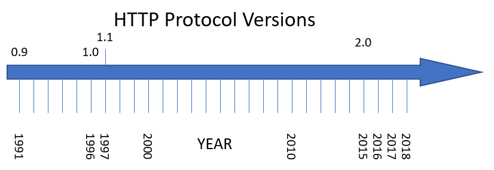
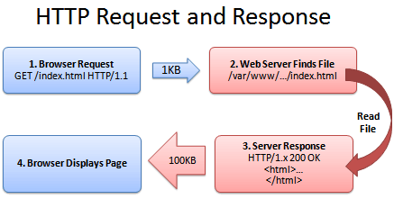

# Protocolo HTTP

* La URL es una cadena de texto formada por:
  * _Protocolo_  de comunicaciones ( **http, ftp, https...) ** – HTTP en muchos casos
  * _Host o IP _ ( **www.softuni.bg, gmail.com, 127.0.0.1, web** )
  * _Puerto_  al que queremos conectar. El puerto por defecto es 80, pero podría ser uno del rango \[0…65535\]
  * _Ruta_  ( **/**  **forum**  **, /**  **path**  **/**  **index.php** )
  * _Cadena query_  <span style="color:#FFC000"> </span> ( **?id=27&lang=en** )
  * _Fragmento_  ( **\#lectures** ) – usado en el cliente para navegar a alguna sección


**URL válidas y no válidas**

* Las URL se codifican acorde a la norma RFC 1738 ([https://www.ietf.org/rfc/rfc1738.txt](https://www.ietf.org/rfc/rfc1738.txt))
* Únicamente se pueden utilizar los siguientes caracteres dentro de la URL

```
[0-9a-zA-Z], $, -, _, . , +, *, ', (, ), ,, !
```

* Si queremos utilizar en la URL un carácter no válido, se pueden indicar codificados precedidos por  **%\+ un código hexadecimal**
* No están permitidos los espacios en una URL, para indicarlo utilizaríamos el carácter %20

| Char  | URL<br /> Encoding |
| :---: | :----------------: |
| space |        %20         |
|   щ   |       %D1%89       |
|   "   |        %22         |
|   #   |        %23         |
|   $   |        %24         |
|   %   |        %25         |
|   &   |        %26         |

URL según diferentes protocolos


## El protocolo HTTP

El protocolo de transferencia de hipertexto o HTTP establece el protocolo para el intercambio de documentos de hipertexto y contenido multimedia en Internet

HTTP fue desarrollado por la W3C y la IETF en 1999 a través de la especificación RFC 2616

Las  _versiones_  de HTTP son HTTP/1.0, 1.1, 1.2 y 2



## Clientes y servidores

Los **clientes web** son máquinas que acceden a la información en la web a través de un **navegador**.

El **servidor web**, por otro lado, proporciona contenido web a través del protocolo HTTP. Para ello, se debe instalar algún programa que actúe como servidor web en la máquina, como por ejemplo Apache.


## ¿Qué es una página web?

* Una  _página web _ (web page) consiste en un archivo HTML base que incluye referencias a un conjunto de objetos, que pueden ser:
  * Páginas HTML, Imágenes JPEG
  * Applets Java, Archivos de Audio
  * Scripts (JavaScript), Hojas de estilos (CSS)
* Estos objetos están localizados en diferentes servidores de internet. Una imagen o un vídeo de la página puede estar alojada en otro servidor.
* Cada objeto se puede direccionar mediante una dirección URL diferente, que indica la ruta para llegar a él.

## El servicio HTTP

* **Las principales características de HTTP son:**
* Utiliza una estructura  _cliente/servidor. _ Los servidores alojan las páginas web, y los clientes acceden a ellas a través de un navegador.
* Para visualizar los datos a través de HTTP se requiere un  _navegador_  _ _  _web. _ El navegador analiza el contenido de las páginas, interpreta la forma de la página y la representa en pantalla.
* Las páginas se pueden ver  _en cualquier dispositivo_ , independientemente del hardware y SO que utilice.

* **Las principales características de HTTP son:**
  * Para la comunicación se establece una conexión TCP a través del  _puerto 80 _ (por defecto). Todos los servidores web escuchan en el mismo puerto, y por ello no hace falta especificarlo cada vez que se visita una página.
  * La comunicación se basa en mensajes de  _petición y respuesta. _ Para cada página diferente a la que accedemos, se crea una petición. El servidor contesta a esta petición con el contenido de la página.
  * Se crea una petición y respuesta por cada  _objeto_  que contiene la página.

## Ejemplo de sesión

Una **sesión** HTTP consiste en una secuencia de transacciones solicitud y respuesta, en la cual el usuario escribe una dirección en su navegador, el cual realiza una consulta **DNS** para averiguar la dirección IP asociada a la URL y luego intenta establecer una conexión **TCP** al **puerto** 80.

Después de establecer la conexión, el navegador envía la **petición HTTP** solicitando la URL; el servidor responde con un **código de estado** y el **recurso** solicitado. Este proceso es completamente transparente al usuario, que únicamente ve la carga de la página, que en realidad fue realizada por el navegador.




Cuando una página web es visitada, el navegador debe solicitar todos los **objetos externos** que la componen, como una hoja de estilos CSS para definir la apariencia de la página, un archivo de script JavaScript para hacerla dinámica, e incluso una imagen en formato png.


