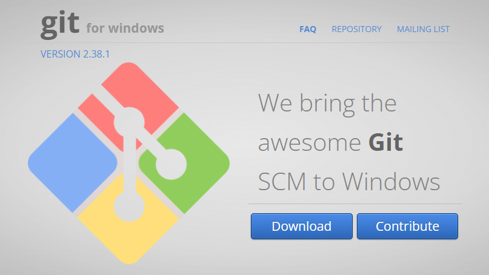
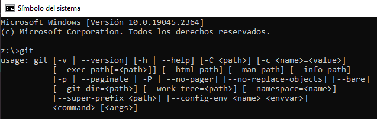
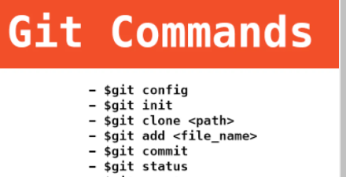

# 02. Instalación de git

## Descargar e instalar Git

Antes de nada, necesitas tener Git instalado en tu sistema Windows.

Una vez descargado, podemos seguir los pasos y finalizar la instalación. Para comprobar que se ha instalado correctamente, podemos comprobar si el comando ``git`` está disponible.

Para ello, buscaremos la aplicación símbolo del sistema:

A continuación nos aparecerá la aplicación que utilizaremos.

Al escribir el comando ``git`` y pulsar ++enter++, debería aparecer el siguiente mensaje.

A través de esta aplicación, podemos usar ``git`` como comando, y realizar diferentes acciones, pasándole los argumentos correspondientes:

