- [Control de versiones](#control-de-versiones)
  - [01. Git y GitHub](#01-git-y-github)
- [02. Github](#02-github)
- [03. Crear un nuevo repositorio](#03-crear-un-nuevo-repositorio)
  - [03. Subir archivos a través del navegador](#03-subir-archivos-a-través-del-navegador)
  - [04. Git](#04-git)
- [05. Instalación de git](#05-instalación-de-git)
  - [06. Enlazar con Git con nuestra carpeta local y Github](#06-enlazar-con-git-con-nuestra-carpeta-local-y-github)
  - [07. Activar pages en nuestro repositorio](#07-activar-pages-en-nuestro-repositorio)
  - [08. Guardar cambios](#08-guardar-cambios)
  - [09. Actualizar carpeta local](#09-actualizar-carpeta-local)

# Control de versiones

## 01. Git y GitHub

Git y GitHub son herramientas de control de versiones y plataformas de desarrollo de software de código abierto respectivamente.

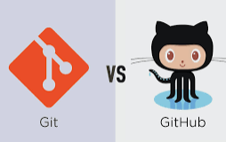

``Git`` es una herramienta de control de versiones distribuida, lo que significa que los desarrolladores pueden trabajar en el mismo proyecto desde diferentes ubicaciones.

``GitHub`` es una plataforma en línea que almacena sus proyectos de código, los facilita colaborar con otros desarrolladores y los ayuda a administrar cambios en el código.

# 02. Github

``GitHub`` es un servicio web en la nube en el que podemos alojar nuestros repositorios para poder tenerlos guardarlos y también poder compartirlos con otros usuarios.

Es importante distinguir entre ``git`` y ``GitHub``.


Si queremos guardar nuestro repositorio en ``GitHub``, tenemos que crearlo en la [página web de GitHub](http://github.com). Para ello, nos tendremos que registrar como usuarios previamente.

Ve a github.com y crea una cuenta.


A partir de aquí sigue los pasos y registrate con la cuenta del instituto:

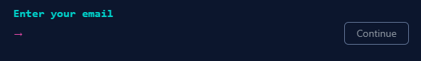

El password tiene que ser complejo, para que te salga en verde. De lo contrario, no te dejará continuar. Al menos ocho caracteres que incluyan un número y una letra minúscula

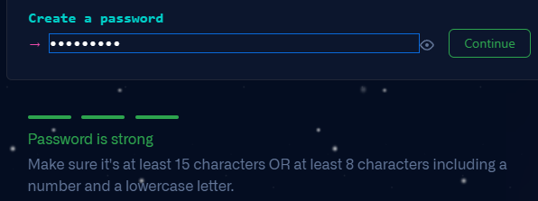

# 03. Crear un nuevo repositorio

Para crear un repositorio nuevo en GitHub.

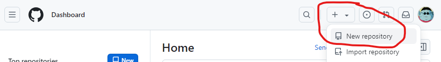

Damos nombre a nuestro repositorio:

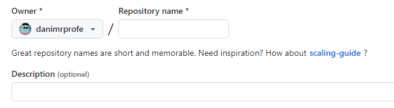

Decidimos si queremos que sea público o privado:

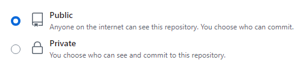

Al crear el repositorio, este estará vacío.

Crea un repositorio nuevo (botón verde). Los repositorios son como carpetas donde guardaremos nuestros proyectos.

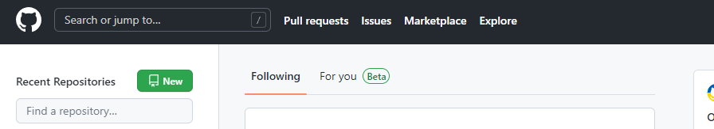

Posteriormente, haz click en create repository.

Ahora tendremos nuestro repositorio creado, pero estará vacío. Lo único que veremos son instrucciones para subir archivos, o enlazar el repositorio con nuestro ordenador utilizando **Git**.

## 03. Subir archivos a través del navegador

Aunque esto no lo vamos a hacer, podemos subir archivos directamente desde el navegador, como si se tratase de google drive. Sin embargo, no es la opción más recomendable. Si lo queremos hacer así:

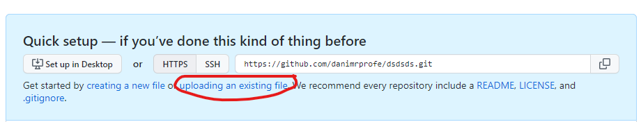

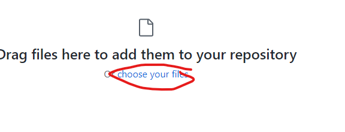

Para confirmar la subida de archivos:

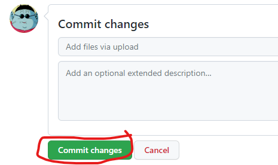

## 04. Git

Git es un software de **control de versiones** que permite a los desarrolladores llevar un seguimiento de las diferentes **versiones** de un archivo o conjunto de archivos mientras se crea un nuevo software.


Esto es útil porque permite a los desarrolladores volver a una **versión anterior** de un archivo si hicieron un cambio que resultó en un error. También permite a los desarrolladores **colaborar** en el mismo proyecto al mismo tiempo.

Para usar git, primero debe instalarlo en tu ordenador. Luego, debe configurarlo para que sepa quién está haciendo cambios en qué archivos. Esto se hace mediante el uso de una cuenta de git. Una vez que haya configurado git, puede empezar a usarlo para controlar las versiones de sus archivos.

# 05. Instalación de git

Git viene instalado en algunos sistemas, pero en Windows no, por lo que habrá que instalarlo en primer lugar. El programa se llama **Git for windows**.


Una vez descargado, podemos seguir los pasos y finalizar la instalación. Para comprobar que se ha instalado correctamente, podemos comprobar si el comando ``git`` está disponible.

Para ello, buscaremos la aplicación símbolo del sistema:

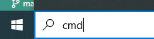

A continuación nos aparecerá la aplicación que utilizaremos.

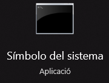

Al escribir el comando ``git`` y pulsar ++enter++, debería aparecer el siguiente mensaje.


A través de esta aplicación, podemos usar ``git`` como comando, y realizar diferentes acciones, pasándole los argumentos correspondientes:


## 06. Enlazar con Git con nuestra carpeta local y Github

Una vez creado, deberemos **asociar** la carpeta donde tenemos nuestro repositorio en nuestro ordenador, con el repositorio de github.

Si queremos enlazar nuestro proyecto, que tenemos en una carpeta de nuestro ordenador, con este repositorio de Github, deberemos seguir estos comandos. Los comandos los podemos introducir en el **símbolo del sistema** o a través de una **terminal** de VS Code.

En el que aparece: `git remote add origin https://github.com/danimrprofe/prueba.git`, deberemos cambiar la URL por la que nos indique github.

```cmd
git init
git add *
git commit -m "primer commit"
git branch -M main
git remote add origin https://github.com/danimrprofe/prueba.git
git push -u origin main
```

Una vez seguidos estos pasos, el contenido de la carpeta se habrá sincronizado con GitHub. Lo podremos comprobar recargando la página. En lugar de las instrucciones anteriores, aparecerá un listado de archivos.

## 07. Activar pages en nuestro repositorio

Si queremos que nuestro repositorio pueda también visitarse como página web, como si de un hosting se tratase, deberemos activar la opción de **pages** en nuestro repositorio.

Vamos a settings:

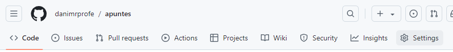

En el menú izquierdo, pages:

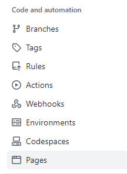

Seleccionamos la rama (branch) que queremos desplegar, en este caso main:

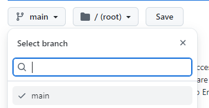

## 08. Guardar cambios

A partir de aquí, cada vez que queramos guardar cambios, necesitaremos hacer **add, commit y pushear**.

```cmd
git add *
git commit -m "segundo commit"
git push -u origin main
```

En el mensaje entre comillas, introduciremos una descripción que nos ayude a saber qué cambios se han realizado.

## 09. Actualizar carpeta local

Si queremos actualizar los cambios locales en otro ordenador a partir de un repositorio porque hemos modificado nosotros u otro usuario parte del contenido, tendremos que **pullear** los cambios. Para ello utilizaremos ``git pull`` (sin argumentos).

Esto hará que nuestra carpeta local se actualice con la última versión de archivos que haya disponible en github.

Para ello:

```cmd
PS Z:\apuntes\39.Git i github> git pull
warning: redirecting to https://github.com/danimrprofe/apuntes/
remote: Enumerating objects: 60, done.
remote: Counting objects: 100% (60/60), done.
remote: Compressing objects: 100% (31/31), done.
remote: Total 60 (delta 24), reused 51 (delta 24), pack-reused 0 (from 0)
Unpacking objects: 100% (60/60), 968.74 KiB | 1.01 MiB/s, done.
From http://github.com/danimrprofe/apuntes
 + 34c5a5c22...1b4d0c73f gh-pages   -> origin/gh-pages  (forced update)
Already up to date.
```

Aquesta darrera frase ens informa de que el contingut està al dia amb la versió de github.

Quan ens surti això, voldrà dir que ja es troba actualitzat.

```
PS Z:\apuntes\39.Git i github> git pull
warning: redirecting to https://github.com/danimrprofe/apuntes/
Already up to date.
```

A partir d'aquí, quan facem canvis en local i acabem de treballar, farem un commit i pushearem els canvis.