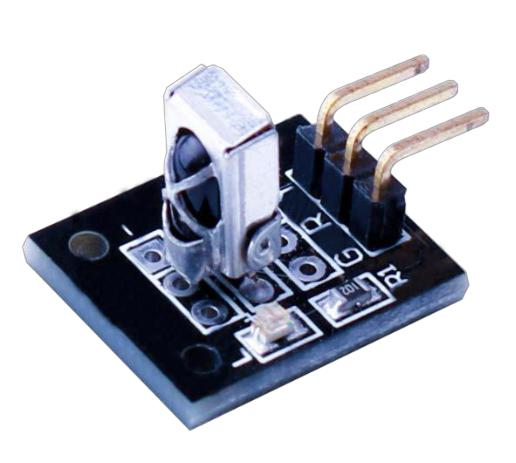
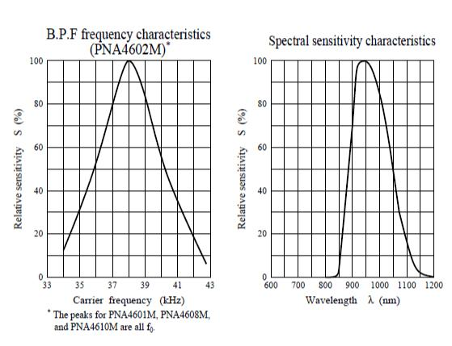
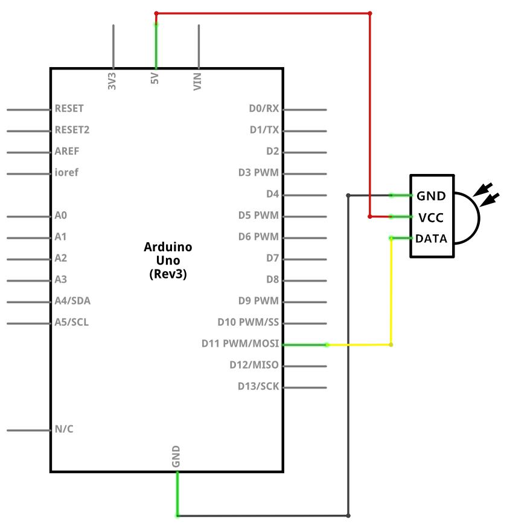

## Lección 13 Módulo de receptor IR

### Resumen

Usando un control remoto es una gran manera de tener el control inalámbrico de su proyecto.

Los mandos a distancia infrarrojos son simples y fáciles de usar. En este tutorial nos conectando el receptor IR para el UNO y luego use una **librería** que fue diseñada para este sensor en particular.

En nuestro dibujo tenemos todos los códigos de IR Hexadecimal que están disponibles en este control remoto, también detectará si el código fue reconocido y también si estamos manteniendo pulsada una tecla



### Componentes necesarios
```
(1) x Elegoo Uno R3
x IR modulo receptor
x IR control remoto
x F-M cables (cables de hembra a macho DuPont)ç
```

### Sensor receptor de infrarrojos

Los detectores infrarrojos son pequeños microchips con una célula fotoeléctrica que están configurados para recibir a la luz infrarroja. Casi siempre se utilizan para la detección de control remoto - cada TV y reproductor de DVD tiene uno de estos en la parte delantera para escuchar la señal de IR desde el clicker. Dentro del control remoto es un juego IR LED, que emite pulsos IR para comunicar al televisor para encender, apagar o cambiar de canal. Luz infrarroja no es visible para el ojo humano, lo que significa que tarda un poquito más de trabajo para probar una configuración. Hay algunas diferencias entre ellos y decir unas fotocélulas CdS:

Detectores infrarrojos son especialmente filtrados para IR ligero, no son buenos para detectar luz visible. Por otro lado, las fotocélulas son buenas para detectar luz visible de amarillo/verde y no son buenas para luz IR.

Detectores infrarrojos tienen un demodulador en ese aspecto para IR modulada a 38 KHz. Sólo brilla un LED IR no detectada, tiene que ser PWM intermitente en 38 KHz. fotocélulas no tienen ningún tipo de demodulador y puede detectar cualquier frecuencia (incluyendo CC) dentro de la velocidad de respuesta de la fotocélula (que es aproximadamente 1KHz)

Detectores infrarrojos son salida digital - tampoco detectan señal 38KHz IR y salida bajo (0V) o no detecta ninguno y salida alto (5V). Fotocélulas actúan como resistencias, los cambios de resistencia dependiendo de cuánto se exponen a la luz

Lo que se puede medir



Como se puede ver en estos gráficos de hoja de datos, la detección de frecuencia de peak es a 38 KHz y el pico color del LED es de 940 nm. Se puede usar desde unos 35 KHz kHz 41 pero la sensibilidad se desprenderá para que no detecte asídesde lejos. Asimismo, puede utilizar LEDs de 850 a 1100 nm pero no funcionan tan bien como 900 a 1000nm asíque asegúrese de obtener coincidencia de LEDs! Compruebe la ficha técnica para su IR LED verificar la longitud de onda.

¡Trate de conseguir un 940nm - Recuerde que 940nm no es luz visible!

### Conexión

### Esquema




### Diagrama de cableado

Hay 3 conexiones para el receptor de infrarrojos.

Las conexiones son: señal, voltaje y tierra.

- El "-" es la tierra"S" es señal y medio es voltaje de 5V.

### Código

Después de efectuar el cableado, por favor, abra el programa en la carpeta de código-Lección 14 módulo de receptor de IR y haga clic en UPLOAD para cargar el programa. Ver Lección 2 para más detalles sobre el programa cargar si hay algún error.

Antes de ejecutar esto, asegúrese de que ha instalado el < IRremote > Biblioteca o volver a instalarlo, si es necesario. De lo contrario, el código no funciona.

Para obtener más información sobre carga el archivo de **librería**, ver Lección 1.

A continuación nos trasladaremos el < RobotIRremote > fuera de la carpeta de **librería**, para ello ya que entra en conflicto con la **librería** va a utilizar. Sólo puede arrastrarlo dentro de la carpeta de la **librería** una vez que haya terminado de programar el microcontrolador.


Una vez que ha instalado la **librería**, sólo seguir adelante y reiniciar su Software IDE.

Abrir al monitor y puede ver los datos:

Haga clic en el Serial Monitor botón para encender el monitor serie. Se introducen los conceptos básicos sobre el monitor serial en detalles en la lección 1


