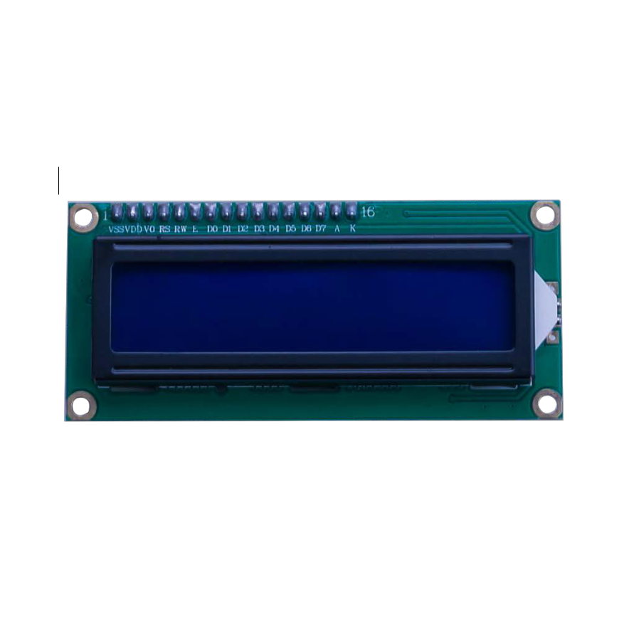
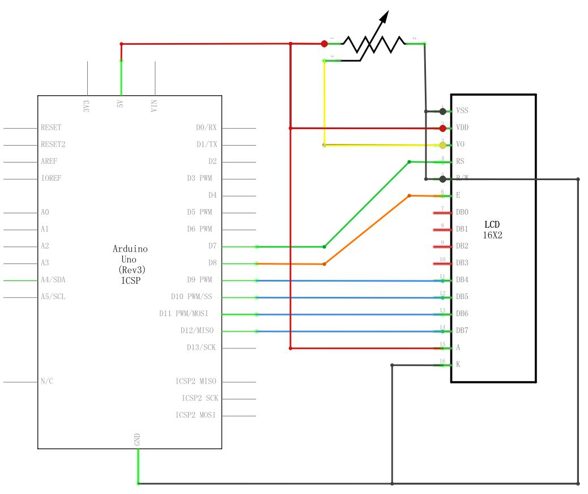
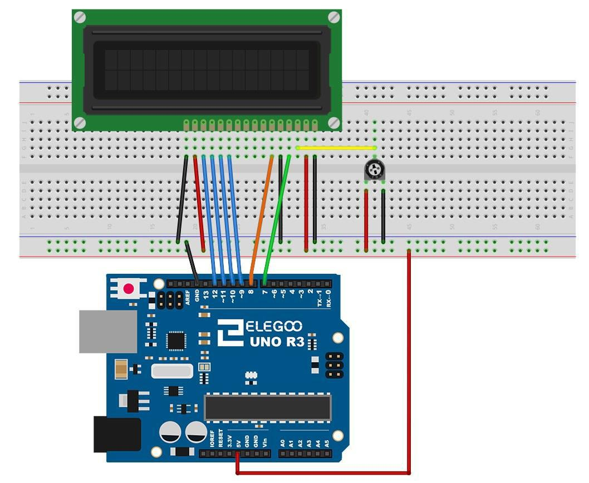
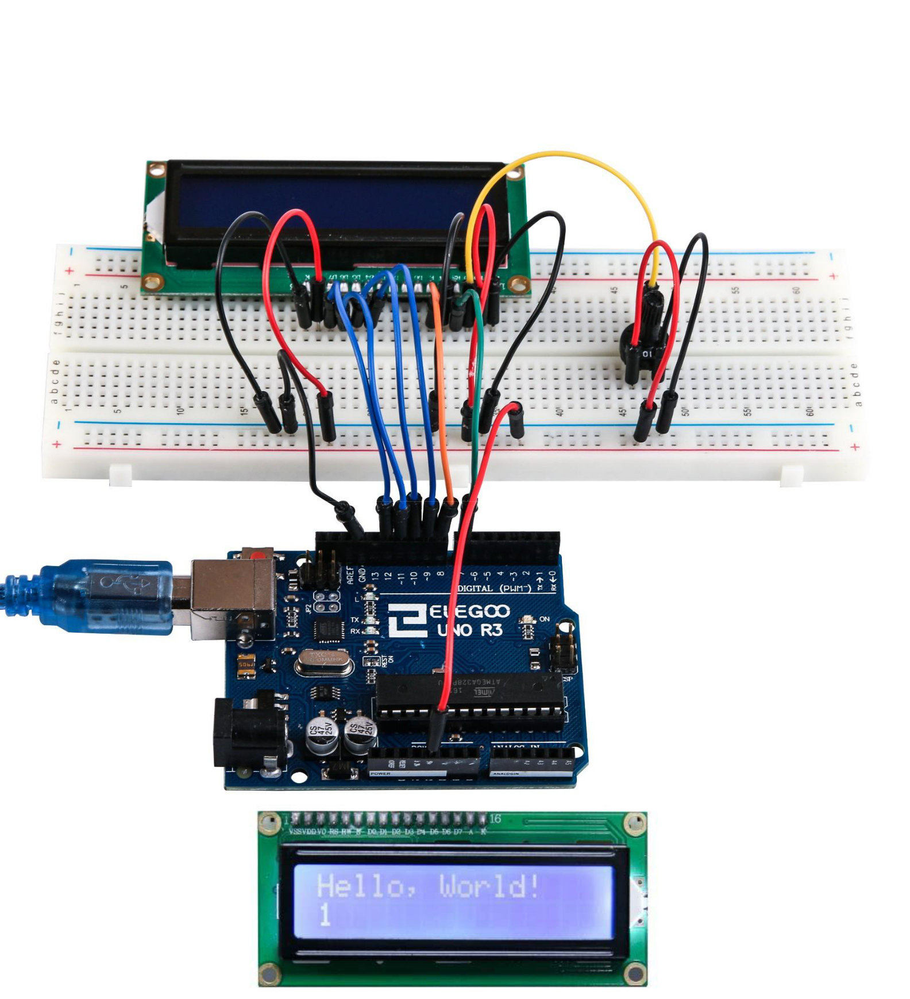

## Lección 14 Pantalla LCD

### Resumen

En esta lección, usted aprenderá cómo conectar y usar una pantalla LCD alfanumérico.

La pantalla tiene una retroiluminación de LED y puede mostrar dos filas con hasta 16 caracteres en cada fila. Puede ver los rectángulos para cada carácter en la pantalla y los píxeles que componen cada carácter. La pantalla es blanca en azul y está diseñada para mostrar texto.



En esta lección, se ejecutará el programa de ejemplo de Arduino para la **librería** de la LCD, pero en la siguiente lección, nos pondremos nuestra pantalla para mostrar la temperatura mediante sensores.

### Componentes necesarios

* > Elegoo Uno R3
* > LCD1602 módulo
* > Potenciómetro (10k)
* > 830 tie-puntos Breadboard
* > M-M cables (cables de puente de macho a macho)

### LCD1602

Introduccion a las patillas del LCD1602:

- VSS: Un pin que se conecta a tierra
- VDD: Un pin que se conecta a un + 5V fuente de alimentación

VO: Un pasador que ajusta el contraste de LCD1602

RS: Un registro seleccione pin que controla donde en memoria de la pantalla LCD datos de escritura. Usted puede seleccionar el registro de datos, que es lo que pasa en la pantalla, o un registro de instrucción, que es donde busca controlador de LCD para obtener instrucciones sobre qué hacer.

- R/W: Pin A lectura y escritura que selecciona el modo de lectura o escritura a modo de E:, Permitiendo a un perno con energía de bajo nivel, módulo causas la LDC para ejecutar instrucciones.
- D0-D7: Pernos que leer y escribir datos

A y K: Que el control de la retroiluminación LED de los pernos

### Conexión

### Esquema



### Diagrama de cableado



La pantalla LCD necesita seis pines de Arduino, todo listo para ser salidas digitales.

También necesita 5V y GND conexiones.

Hay un número de conexiones a realizar. Alineación de la pantalla con la parte superior de la placa ayuda a identificar sus pines sin demasiada cuenta, especialmente si la placa tiene sus filas numeradas con la fila 1 como la fila superior de la Junta. No lo olvides, el cable largo amarillo que conecta el regulador de la olla a la clavija 3 de la pantalla. La 'olla' se utiliza para controlar el contraste de la pantalla. Usted puede encontrar que su pantalla se suministra sin cabecera pins conectados a él. Si es así, siga las instrucciones en la sección siguiente.

### Codigo

Después de efectuar el cableado, por favor, abra el programa en el código de carpeta lección 22 LCD pantalla y haga clic en UPLOAD para cargar el programa. Ver Lección 2 para obtener más información sobre programa cargar si hay algún error.

Antes de ejecutar esto, asegúrese de que ha instalado la **librería** < LiquidCrystal > o volver a instalarlo, si es necesario. De lo contrario, el código no funcionará.

Para obtener más información sobre carga el archivo de **librería**, ver Lección 1. Subir el código a la placa Arduino y usted debería ver el mensaje 'Hola, mundo' aparece, seguido de un número que cuenta de cero.

Lo primero que nota en el dibujo es la línea:

```arduino
#include < LiquidCrystal.h >
```

Esto dice Arduino que queremos utilizar la **librería** de cristal líquido.

A continuación tenemos la línea que teníamos que modificar. Esto define qué pines de Arduino son para conectarse a que pines de la pantalla.

```
LiquidCrystal lcd (7, 8, 9, 10, 11, 12);
```

Después de subir este código, asegúrese de que se enciende la retroiluminación y ajustar el potenciómetro de toda la manera alrededor hasta que aparezca el mensaje de texto

En la función de **setup**, tenemos dos comandos:

```arduino
LCD.Begin (16, 2);
LCD.Print ("Hola, mundo!");
```
La primera cuenta la **librería** de cristal líquido cuántas columnas y filas tiene la pantalla. La segunda línea muestra el mensaje que vemos en la primera línea de la pantalla.

En la función de 'loop', aso tienen dos comandos:

```
lcd.setCursor (0, 1);
LCD.Print(Millis()/1000);
```

El primero establece la posición del cursor (donde aparecerá el siguiente texto) columna 0 y fila 1. Los números de columna y fila comienzan en 0 en lugar de 1.



La segunda línea muestra el número de milisegundos desde que se restableció el Arduino.


