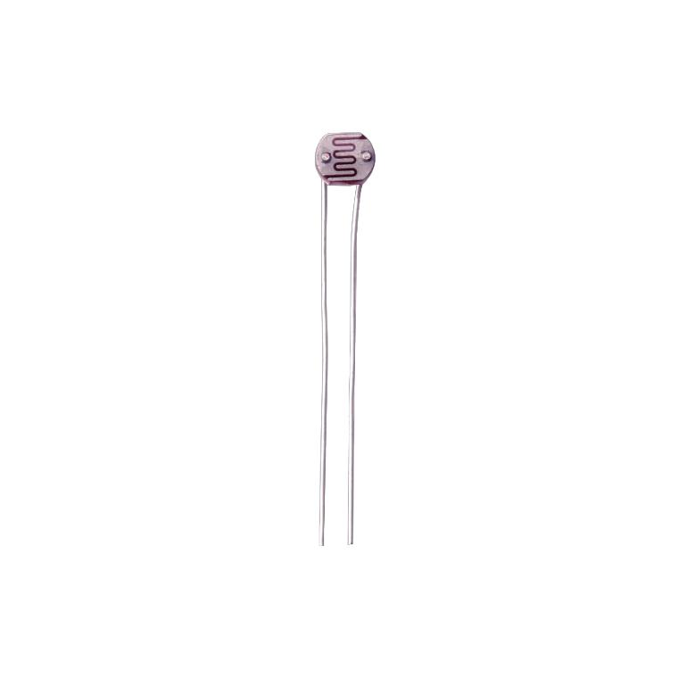
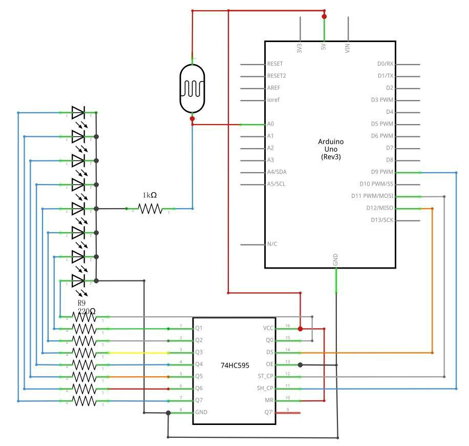
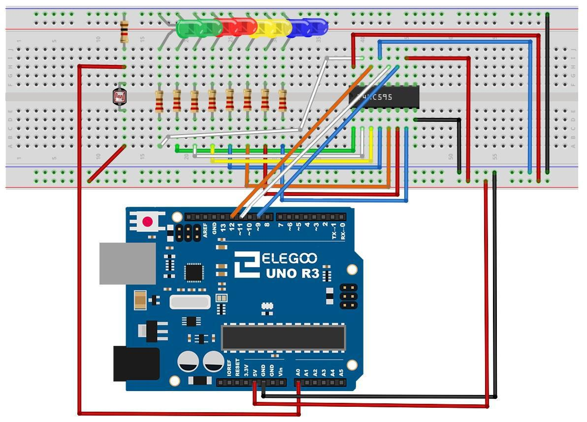
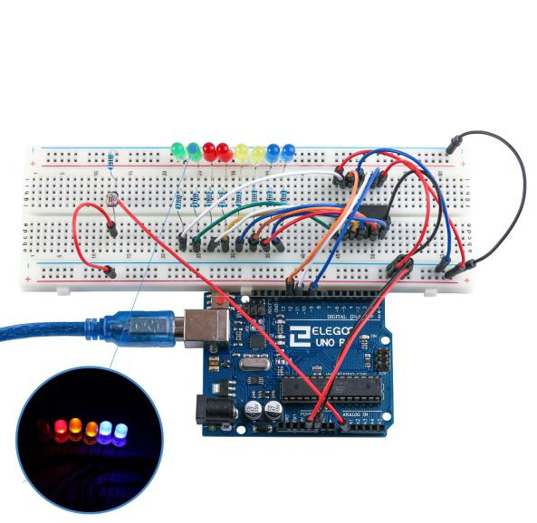

## Lección 18 Fotocélula

### Resumen

En esta lección, usted aprenderá cómo medir la intensidad de la luz utilizando una entrada analógica. Se construirá en la lección 26 y utilice el nivel de luz para controlar el número de LEDs que se encenderán.

La fotocélula es en la parte inferior de la placa, donde estaba el bote por encima.

### Componentes necesarios:



- [x] Elegoo Uno R3
- [x]830 tie puntos breadboard
- [x]leds
- [x]resistencias de 220 ohmios
- [x]resistencia de 1 k ohm
- [x] (1) x IC74hc595
- [x] (1) x fotoresistor (fotocélula)
- [x] (16) x M M cables (cables de puente de macho a macho)

## Fotocélula

La fotocélula utilizada es de un tipo llamado un resistor dependiente de luz, a veces llamado un LDR. Como su nombre indica, estos componentes actúan como una resistencia, excepto que la resistencia cambia en respuesta a cuanta luz está cayendo sobre ellos.

Esta tiene una resistencia de cerca de 50 kΩ en cerca de oscuridad y Ω 500 en luz brillante. Para convertir este valor variable de la resistencia en algo que podemos medir en la entrada analógica de la Junta de un R3 de UNO, debe ser convertida en un voltaje.

La forma más sencilla de hacerlo es combinar con una resistencia fija.


La resistencia y fotocélula junto se comportan como una sola. Cuando la luz es muy brillante, entonces la resistencia de la fotocélula es muy baja en comparación con la resistencia de valor fijo, y asíes como si el bote se dio vuelta a máximo.

Cuando la fotocélula está en una luz apagada, la resistencia es mayor que la resistencia fija de 1 kΩ y es como si el recipiente estuviera girando hacia GND. Cargue el croquis dado en la siguiente sección y trate de cubrir la fotocélula con el dedo y, a continuación, sosténgalo cerca de una fuente de luz.

### Conexión

### Esquema



### Diagrama de cableado



### Código

Después de efectuar el cableado, por favor, abra el programa en el código de carpeta lección 26 fotocélula y haga clic en UPLOAD para cargar el programa. Ver Lección 2 para obtener más información sobre programa cargar si hay algún error.

Lo primero que note es que hemos cambiado el nombre del pin analógico a ser 'apagado' en lugar de 'potPin' ya que no tenemos una olla conectada.

El sólo cambio substancial al dibujo es la línea que calcula cuántos de los LEDs de luz:
```
int numLEDSLit = reading / 57;// all LEDs lit at 1k
```
Este tiempo, dividimos la lectura cruda 57 en lugar de 114. En otras palabras, nos dividirlo por la mitad, tanto como lo hicimos con el bote para dividirlo en nueve zonas, de ningún LED encendido a ocho todas iluminada. Este factor adicional es para tener en cuenta la resistencia fija de kΩ 1. Esto significa que cuando la fotocélula tiene una resistencia de 1 kΩ (igual a la resistencia fija), la lectura cruda será 1023 / 2 = 511. Esto se proporcionan a todos los LED se enciende y luego un poco (numLEDSLit) será 8.


