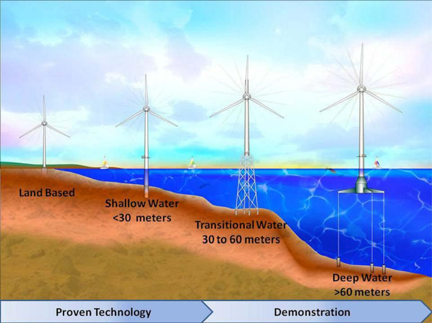

# Energía eólica

La energía eólica es una forma de **energía cinética** producida por el movimiento del viento. El viento se genera debido a las **diferencias en la insolación** (cantidad de radiación solar recibida) en distintas áreas del planeta. Estas diferencias provocan variaciones de temperatura y presión, que a su vez generan el flujo de aire que conocemos como viento.

Se puede utilizar:

- Directamente (barcos de vela, molinos de viento para moler)
- Transformada en electricidad, mediante aerogeneradores.

El aire se mueve desde zonas de alta presión (más frío y denso) hacia zonas de baja presión (más caliente y menos denso).

La **rotación** terrestre desvía el movimiento del aire, generando patrones de vientos curvados en lugar de lineales. En el hemisferio norte, los vientos se desvían hacia la derecha, y en el hemisferio sur, hacia la izquierda.

https://www.windfinder.com/

https://www.aemet.es/es/eltiempo/prediccion/mapa_frentes

Durante el día, la tierra se calienta más rápido que el agua, creando vientos marinos (**brisas** marinas), y durante la noche ocurre lo contrario, con vientos terrestres (brisas terrestres).

Las diferentes direcciones del viento

Escala de velocidades

## Densidad del aire

La densidad del aire (\(\rho\)) varía en función de la temperatura y puede ser calculada utilizando la siguiente ecuación derivada de la ley de los gases ideales:

Donde:

-  es la densidad del aire (kg/m³)
- **P** es la presión atmosférica (Pa),
- **R** es la constante de los gases para el aire seco, que tiene un valor de aproximadamente \(287.05 \, \text{J/(kg·K)}\),
- **T** es la temperatura absoluta en Kelvin (K), que se obtiene sumando 273.15 a la temperatura en grados Celsius.

### Relación con la temperatura

- A medida que la **temperatura aumenta**, la **densidad del aire disminuye**, porque el aire se expande cuando se calienta.
- Cuando la **temperatura disminuye**, la **densidad del aire aumenta**, ya que el aire se contrae al enfriarse.

Este fenómeno es importante en el contexto de la energía eólica, ya que la densidad del aire afecta directamente la cantidad de energía que un aerogenerador puede capturar.

## Molinos antiguos

Antes de la invención de la electricidad los molinos de viento se utilizaban para extraer agua de los pozos, o bien para moler el trigo para hacer harina. En Mallorca todavía se conservan muchos de estos molinos, aunque la mayoría de ellos ya no están operativos.

Un molino impulsado por un burro (entrada de energía de 300 W) producía 10-25 kg/h de harina.Las piedras de molino equipadas de una pequeña noria (1,5 kW) molían 80-100 kg/h. La harina se utilizaba para hornear pan, suministrando como mínimo la mitad de toda la energía alimentaria consumida (el pan solía representar más del 70% de la misma). En 10 h un molino producía harina para 2.500-3.000 personas, es decir, una ciudad medieval de tamaño considerable.

## Molinos de extracción de agua

En Mallorca, los **molins de vent** han sido utilizados desde finales del siglo XIX para extraer agua subterránea con fines agrícolas y de riego. A diferencia de los aerogeneradores modernos, estos molinos tradicionales estaban diseñados para aprovechar la energía del viento para accionar un mecanismo que bombeaba agua desde pozos o acuíferos subterráneos.

En la actualidad, existen alrededor de 2.300 **molinos de extracción de agua** por toda Mallorca y los municipios de Campos, sa Pobla, Muro, ses Salines y Palma son aquellos que recogen un mayor número de estos ingenios.

## Ventajas y desventajas

### Ventajas

- Es **inagotable**: La energía eólica proviene del viento, una fuente renovable y que no se agota.
- Los **aerogeneradores tienen un bajo coste** de instalación y mantenimiento comparado con otras tecnologías energéticas.
- Se consigue un **alto rendimiento**, ya que los aerogeneradores modernos son altamente eficientes en la conversión de energía cinética en electricidad.
- Ayuda a **reducir la dependencia energética** de los combustibles fósiles, disminuyendo así las emisiones de CO₂.

### Inconvenientes

- Es **intermitente, aleatoria y difícil de almacenar**: La energía eólica depende de la velocidad y disponibilidad del viento, lo que la hace variable.
- Los **aerogeneradores representan un peligro para las aves**, ya que pueden chocar contra las aspas en movimiento.
- Los **parques eólicos ocupan grandes extensiones** de terreno, lo que puede generar un impacto visual en el paisaje y también ruido.
- Pueden generar **interferencias con radares, televisión y radio**, afectando las señales en áreas cercanas a los aerogeneradores.

## Aerogeneradores

Son aparatos que disponen de unas **palas** que giran gracias al viento, y en su interior un generador transforma la energía mecánica del viento en energía eléctrica, que es transferida a la red de distribución.

### Relación área - potencia

a potencia que un aerogenerador puede generar depende directamente del **área de barrido** de sus aspas y de la **velocidad del viento**. Por lo tanto, al diseñar aerogeneradores, es importante considerar tanto el tamaño de las aspas como las condiciones de viento del sitio donde se instalarán.

### Relación entre área y potencia de aerogeneradores

La relación entre el área y la potencia de un aerogenerador es fundamental para comprender cómo se captura y convierte la energía del viento en energía eléctrica. A continuación se explica esta relación.

#### Área de barrido

El área de barrido (\(A\)) es el área que ocupan las aspas del aerogenerador cuando giran. Se calcula como el área del círculo formado por las aspas y se determina mediante la siguiente fórmula:

Donde:

- **A** es el área de barrido (m²).
- **r** es el radio del rotor (la longitud de una de las aspas, en metros).
- **π** es una constante aproximadamente igual a 3.1416.

#### Potencia del viento

La potencia del viento (\(P\)) que atraviesa el área de barrido se calcula utilizando la siguiente fórmula:

Donde:

- P es la potencia del viento (W)
- **ρ** es la densidad del aire (kg/m³).
- A es el área de barrido (m²).
- v es la velocidad del viento (m/s).

#### Relación entre área y potencia

La fórmula para la potencia del viento muestra que la potencia disponible aumenta con el **cubo de la velocidad del viento** (\(v^3\)) y es directamente proporcional al **área de barrido** (\(A\)). Esto significa que:

1. **Aumentar el área de barrido** (por ejemplo, usando aspas más largas) aumentará la cantidad de energía que el aerogenerador puede capturar del viento. Esto es crucial para mejorar la eficiencia del aerogenerador, especialmente en áreas con vientos más suaves.

2. **El efecto de la velocidad del viento** es significativo: pequeñas variaciones en la velocidad del viento pueden tener un gran impacto en la potencia generada. Por ejemplo, si la velocidad del viento se duplica, la potencia del viento se incrementa por un factor de ocho.

La góndola: Situada sobre la torre. Es el elemento estructural, y está formado por el bastidor y el armazón. El bastidor es la pieza sobre la que se ensamblan los elementos mecánicos principales.

El funcionamiento de un aerogenerador implica una serie de componentes interrelacionados que trabajan en conjunto para convertir la energía cinética del viento en energía eléctrica. El **eje de baja velocidad** es el primer elemento que recibe el movimiento de las aspas del rotor, que gira lentamente debido a la baja velocidad del viento. Este eje está conectado a una **caja de cambios**, que incrementa la velocidad de rotación del eje antes de que el movimiento se transfiera al **eje de alta velocidad**.

Gracias a esta transformación de velocidad, el eje de alta velocidad puede girar a una velocidad mucho mayor, lo que es necesario para accionar el **generador**, que convierte la energía mecánica en energía eléctrica. Por último, el **controlador** juega un papel crucial al supervisar y gestionar el funcionamiento del aerogenerador, asegurando que la energía generada se optimice y se ajuste según las variaciones en la velocidad del viento y las condiciones operativas, protegiendo así el sistema de posibles daños.

## Construcción, transporte y montaje

http://www.youtube.com/watch?v=ACGEJbfWGmA

## Velocidades

### Velocidad de arranque

La **velocidad de arranque** es la velocidad mínima del viento a la cual un aerogenerador comienza a producir electricidad. Antes de alcanzar esta velocidad, el viento no genera la suficiente fuerza para mover las aspas del generador de manera eficiente. Generalmente, esta velocidad oscila entre **3 y 4 metros por segundo (m/s)**. A partir de este punto, el aerogenerador puede comenzar a convertir la energía cinética del viento en energía eléctrica.

### Velocidad de corte

La **velocidad de corte** es la velocidad máxima del viento a la que un aerogenerador puede operar de manera segura. Si el viento supera esta velocidad, que suele estar alrededor de **25 metros por segundo (m/s)**, el aerogenerador se detiene automáticamente. Esto sucede para evitar daños en la estructura y las partes mecánicas del aerogenerador, ya que vientos extremadamente fuertes pueden ejercer demasiada fuerza sobre las aspas y otros componentes. Al desconectarse, la turbina se protege hasta que el viento vuelva a condiciones seguras.

## Tipos de instalaciones

### Instalaciones aisladas

No conectadas a la red eléctrica. Se utilizan para aplicaciones tales como electrificaciones rurales, aplicaciones agrícolas, señalización, repetidores de comunicaciones, bombeo de agua, etc.
Utilizan, en la mayoría de los casos aerogeneradores de pequeña potencia. Tienen que disponer de un sistema de acumulación (baterías) para asegurar el suministro eléctrico

### Parques eólicos

Los parques eólicos son un conjunto de aerogeneradores que producen energía eléctrica de forma conjunta trabajando en paralelo. Los aerogeneradores suelen ser iguales y de elevadas potencias.

Parques eólicos que generan importantes cantidades de energía eléctrica, con potencias superiores a 1 MW, también reciben el nombre de centrales eólicas.

## Energía eólica marina

La energía eólica es más fuerte en el océano que en tierra.
Hasta hace poco tiempo, al basarse en estructuras fijas, no podían instalarse en lugares de fondos marinos muy profundos o complejos, algo que ha cambiado con la aparición de las estructuras flotantes.
Sobre estas plataformas ya se pueden instalar aerogeneradores, que se anclan al fondo marino mediante anclajes flexibles, cadenas o cables de acero.

## Videos

1. [¿Cómo funciona un aerogenerador? | Sostenibilidad - ACCIONA](https://www.youtube.com/watch?v=Hx1cOrIJcpQ)
2. [SUBIMOS num GERADOR EÓLICO #Boravê](https://www.youtube.com/watch?v=PHdrLRcOGCA)

¿Sabías que la harina es inflamable al volatilizarse?
¿Qué pasa si combinas HARINA con FUEGO?

Curiosidades
