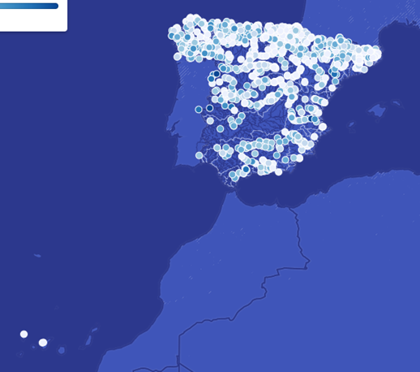

# Energía hidráulica

## Introducción

En toda España (menos en las Islas Baleares) se produce energía hidráulica
Un  20% del total de la energía eléctrica que se genera.

Podemos encontrar más de **1.300 centrales hidroeléctricas** en España, tanto convencionales como no convencionales

## Molinos de agua

Los **molinos de agua** son máquinas que convierten la energía del agua en energía mecánica. El agua fluye sobre una rueda hidráulica, la cual gira gracias a la fuerza del agua y acciona un mecanismo que, tradicionalmente, se utilizaba para moler grano.

Las **norias** son ruedas de gran tamaño que también aprovechan la energía del agua, pero su función principal es elevar agua para el riego o abastecimiento de poblaciones. La noria tradicional consta de una rueda que lleva acoplados recipientes o cangilones que recogen agua de un río o arroyo cuando la rueda gira.

https://www.youtube.com/watch?v=xl6LqdmEbCQ

## Embalses y presas

Los **embalses** sonon grandes depósitos de agua. Estos cuerpos de agua artificiales se forman al bloquear el flujo de un río o arroyo mediante una **presa**, lo que provoca que el agua se acumule en un área detrás de la estructura.

Los embalses se utilizan para diversos fines, como:

- Abastecimiento de agua
- Generación de energía hidroeléctrica
- Control de inundaciones
- Riego agrícola
- Ocio

## Presas de gravedad

Son aquellas que se mantienen en pie y contienen el agua principalmente debido a su propio peso. Estas presas están construidas generalmente con hormigón o piedra y están diseñadas para resistir la presión del agua detrás de ellas. La fuerza de la gravedad impide que la presa se desplace.

## Presas de arco

Estas presas tienen una forma arqueada con el lado cóncavo orientado hacia el agua. El diseño en arco permite que la presión del agua sea distribuida a los lados del valle o las paredes del cañón. Por lo general, se construyen en lugares estrechos con márgenes rocosos y sólidos, donde la estructura puede apoyarse eficazmente.

## Acueductos

Los acueductos son estructuras que se utilizan para transportar agua desde una fuente de agua hasta las zonas de consumo. Estas estructuras pueden ser construidas en forma de túneles, puentes o conductos elevados.

## Canales

Los canales son conductos artificiales construidos para transportar agua desde un lugar a otro. Estos se utilizan para el riego de cultivos y para el suministro de agua potable a las ciudades.

## Sistemas de drenaje

Los sistemas de drenaje son infraestructuras hidráulicas que se utilizan para controlar las inundaciones y el exceso de agua en las zonas urbanas.

Estos sistemas incluyen alcantarillas, canales y estanques de retención.

## Plantas de tratamiento de agua

Se utilizan para limpiar el agua antes de su distribución al consumo humano.

Estas plantas pueden utilizar una variedad de procesos, como la filtración y la desinfección, para eliminar los contaminantes del agua.

## Central hidroeléctrica

Una **central hidroeléctrica** es una instalación cuya misión es convertir la **energía potencial y cinética** del agua en **energía eléctrica** disponible para el consumo. Este proceso se realiza aprovechando el movimiento del agua, que al caer desde una altura o al ser liberada a presión, impulsa las turbinas conectadas a generadores eléctricos. A través de este mecanismo, la energía contenida en el agua se transforma en electricidad limpia y renovable.

A mediados del **siglo XX**, la energía hidráulica era una de las principales fuentes de energía en España, llegando a producir **casi la totalidad de la electricidad del país**.

En una época en la que las tecnologías de generación eléctrica a partir de combustibles fósiles aún no estaban tan desarrolladas, la energía hidráulica desempeñó un papel crucial en el suministro eléctrico, aprovechando los abundantes ríos y las condiciones geográficas favorables del territorio español.

http://www.youtube.com/watch?v=7uWhK0Z-eUo

## Componentes de una central

Vista exterior

Vista interior

## Detección de movimientos

Los péndulos directos e invertidos se usan generalmente para medir rotaciones y traslaciones de estructuras grandes como presas, diques de concreto, edificios altos, torres, estaciones nucleares, etc.

- El **péndulo directo** se usa generalmente para medir la rotación de una estructura.

- El **péndulo invertido** se usa para detectar movimientos horizontales (traslación) de una estructura con respecto a puntos profundos en la roca fundamental.

Los **azudes** son estructuras más pequeñas que las presas que se utilizan para desviar el agua de un río hacia un canal o acequia.
Las presas son estructuras que se construyen en un río para elevar el nivel del agua y crear un embalse
Retención y almacenaje

## Captación de agua

El agua es canalizada desde su fuente (generalmente un embalse o un río) hacia una cámara donde se encuentra la **turbina**. Durante este trayecto, el agua posee una alta **energía potencia**l debido a su elevación, y también una significativa **energía cinética** derivada de su velocidad. Este movimiento natural del agua es lo que permite la generación de energía en una central hidroeléctrica.

El agua se guía a través de **rejas** o rejillas que filtran posibles residuos y partículas grandes que puedan dañar los componentes de la central. Su función es retener objetos sólidos que podrían obstruir o dañar los equipos.

Luego, el agua pasa por una serie de **canales** que la conducen hasta la **cámara de carga**, una estructura donde se regula la presión y el flujo del agua antes de su entrada en las turbinas.

## Turbinas

Desde esta cámara, el agua se libera con una presión controlada hacia las turbinas, donde su energía es aprovechada para hacer girar las **palas**. Estas turbinas están conectadas a **generadores eléctricos**, que convierten la energía mecánica producida por el movimiento del agua en energía eléctrica.

Existen diferentes tipos de **turbinas hidroeléctricas**, cada una diseñada para maximizar el aprovechamiento de la energía del agua según las características de la **altura** de la caída (salto) y el **caudal** del flujo.

Las turbinas están formadas por una serie de **álabes** o palas, que giran cuando son impulsados por el agua, convirtiendo la energía cinética y potencial del fluido en energía mecánica. Este movimiento rotatorio es lo que se convierte finalmente en energía eléctrica a través de un generador.

https://www.youtube.com/watch?v=k0BLOKEZ3KU

https://www.youtube.com/watch?v=Lx6UfiEU3Q0

## Generación de electricidad

La electricidad generada se eleva antes de trasladarla a la red eléctrica mediante un **transformador**. Posteriormente, una línea eléctrica transporta la electricidad hacia alguna **subestación**.

La electricidad se transmite a través de **líneas de transmisión** hacia los hogares, industrias y negocios cercanos , donde se utiliza para alimentar dispositivos eléctricos y contribuye a la red eléctrica general.

## Tipos de centrales hidroeléctricas

### Centrales de embalse

En estas centrales existe un embalse en el que se almacena agua y del que se realiza la toma.

Se permite regular el caudal
Se puede elegir el momento de funcionamiento para mayor demanda o mejor precio.

### Centrales de bombeo o reversibles

as centrales hidroeléctricas de bombeo o centrales reversibles son un tipo especial de instalación hidroeléctrica que no solo genera electricidad, sino que también actúa como un sistema de almacenamiento de energía. Su funcionamiento se basa en la existencia de dos embalses: uno ubicado aguas arriba de la central y otro aguas abajo. Estas centrales pueden operar tanto en modo de generación de electricidad como en modo de bombeo, según la demanda de energía en la red eléctrica.

- En momentos de alta demanda funcionan como centrales que turbinan agua.
- En momento de baja demanda. El precio es bajo y el nivel del embalse superior lo permite, bombean agua del embalse inferior al superior

Funcionan como almacenes energéticos.

https://www.youtube.com/watch?v=ZcJCVwF9yNQ

### Centrales de agua fluyente

Las centrales de agua fluyente son instalaciones hidroeléctricas que aprovechan el caudal de un río o canal para generar electricidad sin la necesidad de embalses de regulación. Esto significa que no almacenan agua para su uso posterior, sino que turbinan el agua que pasa en el momento, generando energía en tiempo real.

https://www.youtube.com/watch?v=Ac6sqA6zmoI

- **Centrales sobre el azud:** No detraen agua del cauce. No dejan zona seca o con bajo caudal.
El azud eleva el nivel del agua, incrementa la altura del salto. Crea zona de aguas tranquilas de donde se detrae el agua

- **Con canal de derivación:** Toman el agua mediante una obra dispuesta en el azud y dirigen hacia la central mediante un canal. Detraen agua del cauce. Deben asegurar un caudal de servidumbre.
Cuando el caudal es superior al que se puede turbinar, el sobrante pasa por encima del azud.
Si la turbina para, el caudal pasa por encima del azud, circulando por el cauce del río.

## Centrales en circuitos de agua potable

El desnivel entre los depósitos y el núcleo urbano es muy elevado. Se instalan válvulas de disipación energética que reducen la presión adecuada.
Se pueden sustituir estas válvulas por turbinas hidráulicas.
En estas instalaciones se debe dejar presión suficiente para que llegue a los usuarios en condiciones adecuadas.

