# Hidrógeno

## Introducción

El hidrógeno no es una fuente de energía primaria, sino un **vector energético**. Nos servirá para almacenar energía en un punto, y utilizarla en otro.

El hidrógeno no lo extraemos de la naturaleza, sino que lo generamos a partir de **agua**.
Este proceso lo realizaremos utilizando **electricidad generada por placas solares**.

## Autobuses EMT

Durante este año, se han puesto en marcha 5 autobuses de la EMT que funcionan a base de hidrógeno verde. Veremos de dónde se obtiene, cómo se obtiene y cuáles son las aplicaciones.

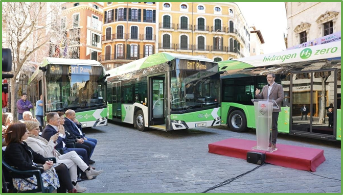

1 autobús H2 = 1.000.000 €
1 autobús gas natural = 280.000 €

## Tipos de hidrógeno

El hidrógeno como fuente de energía recibe diferentes nombres, en función de cómo ha sido generado.

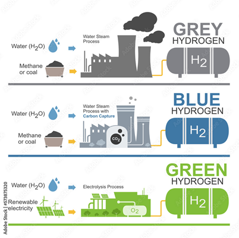

- El hidrógeno **verde**, en su producción, es el único que no contamina pues no se generan gases. Hidrógeno verde = producido a partir de fuentes renovables de energía (solar, eólica, etc.).
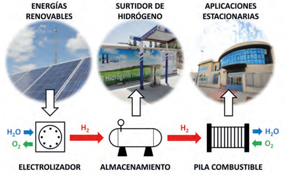

## ¿Cómo obtenemos el hidrógeno?

La **electrólisis** se descubrió por primera vez en el año 1800. Tras la invención de la pila eléctrica por Alessandro Volta ese mismo año, otros químicos probaron a conectar sus polos en un recipiente con agua.

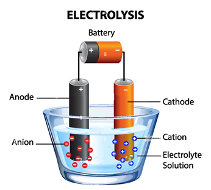

Así descubrieron que la corriente fluía por el agua y que en los electrodos aparecían separados el **hidrógeno** y el **oxígeno**.

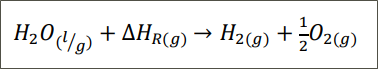

Este proceso implica la descomposición del agua en sus componentes básicos, hidrógeno y oxígeno, utilizando electricidad.

## Tecnologías de hidrólisis

Hay 3 tecnologías que pueden distinguirse por el electrolito que usan:

- **Alcalina**, con un electrolito líquido (generalmente potasa)
- **Polimérica** (PEM), con un ionómero ácido
- De **alta temperatura**, con un óxido sólido como electrolito.

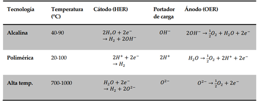

## Generación a partir de energía solar

Podemos generar hidrógeno a partir de luz solar:
Las placas fotovoltaicas capturan la luz solar y la convierten en electricidad.

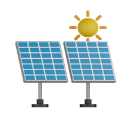

El electrolizador utiliza la electricidad para dividir el agua en sus componentes básicos, hidrógeno y oxígeno.
El hidrógeno se recoge en un **tanque** separado para su uso posterior.

El hidrógeno se puede almacenar de forma **comprimida** o **líquida** para su uso posterior. (350-700 bares de presión)

Hidrógeno utilizando placas solares
Este proceso de producción de hidrógeno verde no emite gases con efecto invernadero.

## ¿Cuanta agua necesitamos?

Para producir hidrógeno necesitamos un suministro de agua cercano y suficiente. Para producir  necesitamos 10 kg de agua desionizada.
Necesitamos la1 kg de hidrógeno verde, mitad de agua que el hidrógeno azul y el hidrógeno gris.

## El proyecto Green Hysland

El proyecto de producción de hidrógeno verde en la planta de Lloseta forma parte de la iniciativa europea "Green Hysland". Nace en la antigua "fábrica de cemento de Cemex".

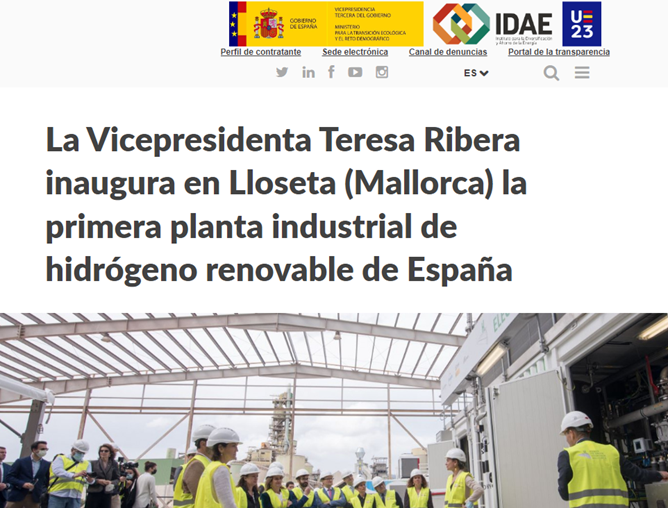

Ha sido el primer proyecto mediterráneo que ha recibido financiación europea para su ejecución.
Proyecto “Green Hysland”
https://greenhysland.eu/acerca-de-green-hysland/

El objetivo es el de descarbonizar la isla en 2050. El proyecto 'Power to Green Hydrogen Mallorca' incluye la construcción de

- Una planta de electrólisis
- El desarrollo de 2 plantas fotovoltaicas que la alimentan
- Una estación de servicio de hidrógeno verde en la isla.

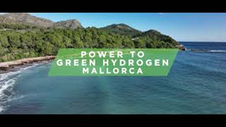

La UE ha comprometido "10 millones de euros" para su puesta en marcha.

## Producción del hidrógeno

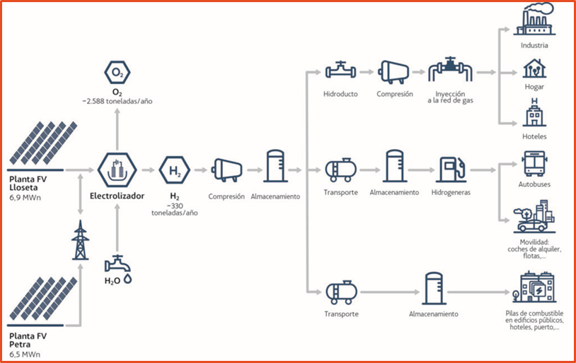

La **electrolizadora** es la encargada de, utilizando la electricidad producida por los paneles solares, realizar la electrólisis que da lugar al **hidrógeno** a partir del agua.

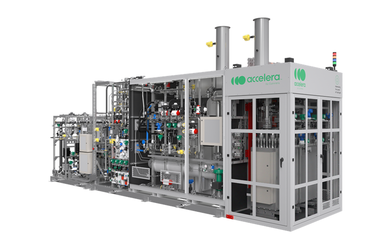

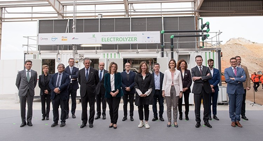

Una vez que esté plenamente operativo cuando se complete el despliegue de las infraestructuras para su consumo, tendrá una producción de al menos 300 toneladas de hidrógeno renovable anuales.

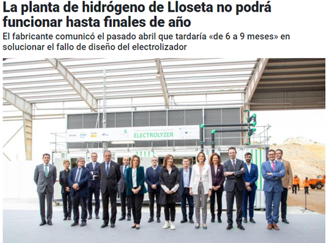

Está formado por un conjunto de **celdas**, cada una de las cuales consta de dos electrodos, uno positivo y otro negativo, sumergidos en agua. Cuando se aplica una corriente eléctrica a los electrodos, se produce una reacción química que separa el hidrógeno y el oxígeno.

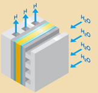

Un **stack** es el conjunto de celdas que se ensamblan. Formado por un marco que sostiene las celdas, un sistema de distribución de agua que suministra agua a las celdas y un sistema de recolección de gases que recoge el hidrógeno y el oxígeno producidos.

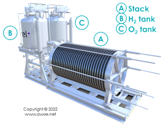

Ejemplo:

- Electrolizador de 20 MW
- 16 stacks de 1, 25 MW
- Cada stack de 200 celdas

## ¿De dónde extraemos la electricidad?

Para generar hidrógeno, es necesaria **electricidad**.
Si es hidrógeno verde, esta electricidad se debe obtener de energías renovables, como por ejemplo la energía solar fotovoltaica.
Para ello se aprovechan para alimentar el electrolizador las plantas fotovoltaicas de Lloseta (8,5MW) y Petra (5,85MW).

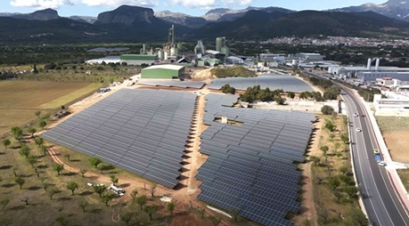

## Vehículos eléctricos de hidrógeno

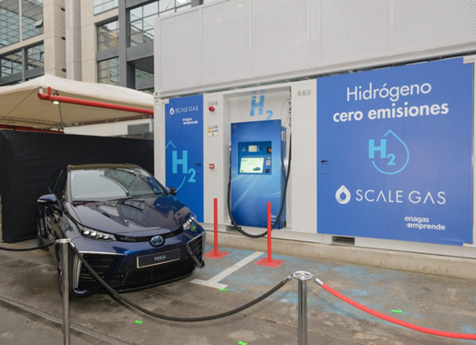

Cuando un vehículo de celdas de combustible necesita combustible, se acerca a la **hidrogenera**. En ella el hidrógeno se dispensa y se suministra al vehículo.

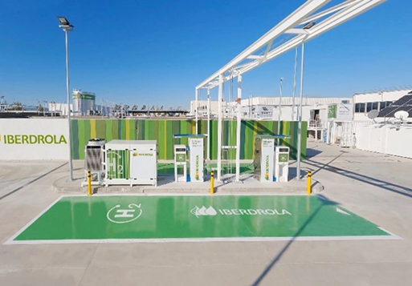

Existe una en Mallorca, pero no está operativa. Por el momento, se traen **cartuchos** de hidrógeno de la península.

## Hidrogeneras en España

Poco a poco se van instalando más hidrogeneras en España.
A fecha de 26 de enero de 2024, España cuenta con **11 hidrogeneras en activo**. De estas, 2 son públicas y 9 privadas. Las hidrogeneras públicas están abiertas a cualquier usuario, mientras que las hidrogeneras privadas están reservadas a clientes específicos, como empresas o flotas de vehículos.

El hidrógeno se suministra al motor del autobús a través de una "tubería de alta presión".

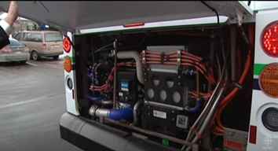

Se almacenan a presión en cilindros de almacenamiento reforzados

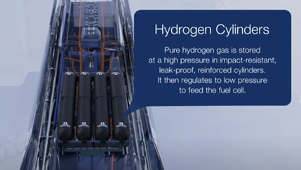

En el caso del coche, podemos ver como los depósitos de hidrógeno se sitúan en la parte inferior del coche, bajo los asientos.
Los tres depósitos del Mirai pueden albergar un máximo de unos 7,8 kg

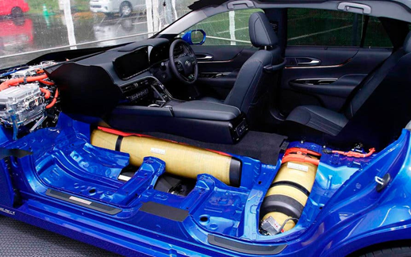

Vehículos de combustión interna:
utilizan un motor de combustión interna que quema combustible para generar energía mecánica.
Utilizan combustibles fósiles como la gasolina, el diésel o el gas natural.

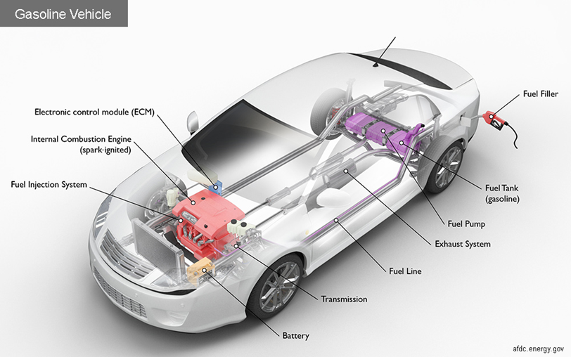

vehículos eléctricos
utilizan "baterías" eléctricas para almacenar energía y motores eléctricos para generar energía mecánica.
vehículos híbridos

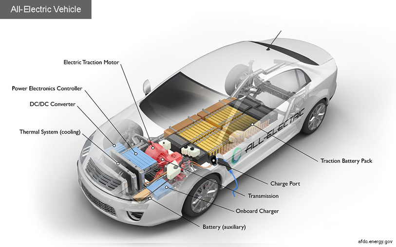

Combinan un motor de combustión interna con un motor eléctrico y una batería.
Estos vehículos pueden funcionar con combustibles fósiles y electricidad.

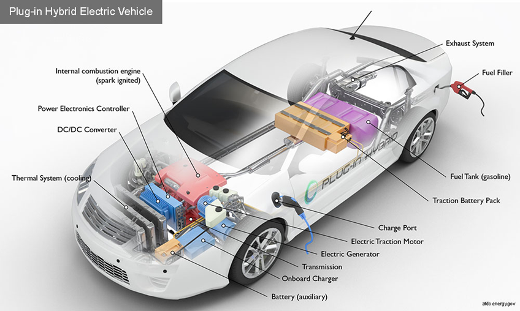

## Pila de combustible

Genera **electricidad** para el motor del coche a partir de hidrógeno

En la parte delantera encontramos la celda de combustible, que genera la electricidad a partir del hidrógeno que proviene de los tanques. Esta electricidad se transporta al motor eléctrico, que mueve las ruedas del coche.

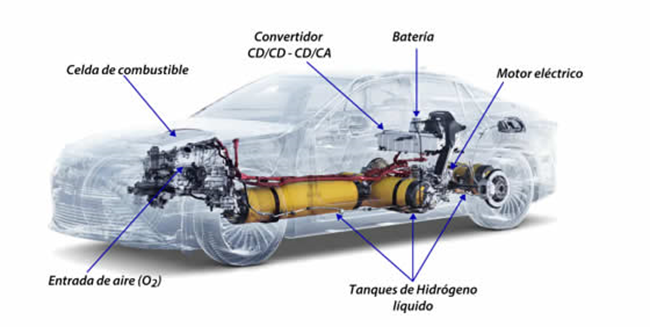

Convierte la energía química almacenada en un combustible, como el hidrógeno, directamente en electricidad y calor.
Cuando el hidrógeno entra en la célula de combustible, se encuentra con un catalizador que descompone las moléculas de hidrógeno en protones (H+) y electrones (e-).

Los protones se mueven cruzando una membrana de intercambio de protones hacia la sección de cátodo de la célula
Los electrones se desplazan a través de un circuito externo para generar electricidad.
Pila de combustible

En el cátodo, los protones y los electrones se combinan con oxígeno del aire exterior para producir agua en forma de vapor de agua.

Cuando los protones y electrones reaccionan con el oxígeno en el cátodo durante el proceso de generación de electricidad, se forma agua
El agua que se produce sale en forma de vapor de agua.

Estas dos placas de platino son el catalizador. Favorecen la reacción que disocia las moléculas
En este lado el hidrógeno se adhiere a la superficie de platino y rompe el enlace molecular
H2 → 2H+ + 2e-

## Coches de hidrógeno

Son coches con motor eléctrico que utilizan hidrógeno para producir la electricidad Actualmente (2022), en España solo se venden 3 modelos comerciales. Toyota vende en España el **Mirai**, una berlina con una longitud de 4,97 metros. Parte de un precio de 68.900 euros. Existen ayudas estatales para la adquisición de estos coches.

Esta es la pila de combustible o FUEL CELL del coche
Dentro se genera la electricidad que utiliza el motor eléctrico para mover el coche
Un tubo trae el hidrógeno de los depósitos
Otro lleva el oxígeno captado del aire
Otro se lleva el vapor de agua producido para expulsarlo al exterior
Los cables rojos son cables de alto voltaje. Transportan la electricidad generada hacia el motor eléctrico

## Consumo y coste

Un coche 100% eléctrico tiene un costo de recarga que oscila entre 1-2 € / 100 km si se hace en casa.
El precio depende del coste de la energía en el momento de la recarga.
Mercado

El hidrógeno se vende ahora a 10 € por kilogramo.
Consumo: 0,8 kg / 100 km
Capacidad depósito: 8 kg
Coste: 8 € / 100 km
