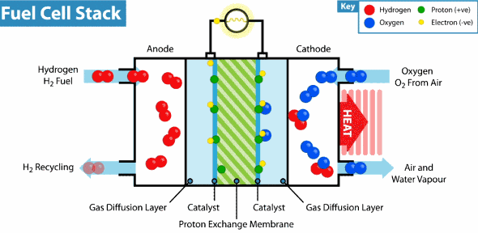
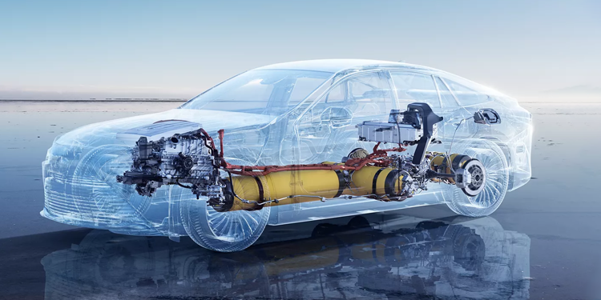
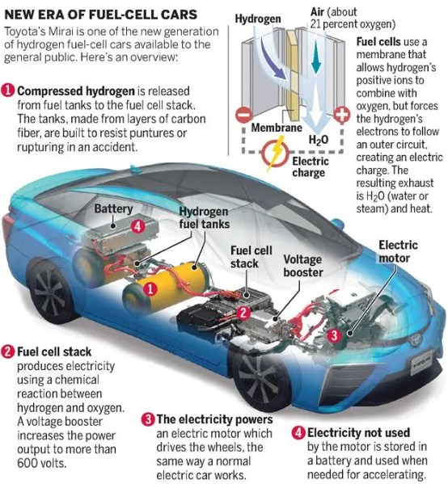

- [Hidrógeno](#hidrógeno)
  - [1. INTRODUCCIÓN](#1-introducción)
  - [2. TIPOS DE HIDRÓGENO](#2-tipos-de-hidrógeno)
  - [3. OBTENCIÓN DE HIDRÓGENO](#3-obtención-de-hidrógeno)
  - [4. HIDROGENERAS](#4-hidrogeneras)
  - [5. PILA DE COMBUSTIBLE](#5-pila-de-combustible)
  - [6. COCHES ACTUALES](#6-coches-actuales)

# Hidrógeno

El hidrógeno ha ganado importancia como fuente de energía en los últimos años debido a su potencial para descarbonizar sectores clave que son difíciles de electrificar, como la industria pesada, el transporte de larga distancia y la generación de energía. A diferencia de los combustibles fósiles:

- El hidrógeno verde (producido con energías renovables) **no genera emisiones de CO₂**, lo que lo convierte en una opción crucial en la lucha contra el cambio climático.
- Es **versátil, almacenable y puede integrarse en redes energéticas existentes**, facilitando la transición hacia una economía más limpia y sostenible.
- Su papel en la diversificación energética también ayuda a **reducir la dependencia de los combustibles fósiles** y mitiga los riesgos asociados con la volatilidad de los mercados energéticos globales.

## 1. INTRODUCCIÓN

El hidrógeno no es una fuente de energía primaria, sino un **vector energético**. Nos servirá para almacenar energía en un punto, y utilizarla en otro.

El hidrógeno no lo extraemos de la naturaleza, sino que lo generamos a partir de **agua**, utilizando para separarlo **electricidad**.

Recientemente se han puesto en marcha 5 autobuses de la EMT que funcionan a base de **hidrógeno** verde. Veremos de dónde se obtiene, cómo se obtiene y cuáles son las aplicaciones.

1 autobús H2 = 1.000.000 €
1 autobús gas natural = 280.000 €

## 2. TIPOS DE HIDRÓGENO

El hidrógeno como fuente de energía recibe diferentes nombres, en función de cómo ha sido generado.

| **Características**       | **Hidrógeno Gris**                                        | **Hidrógeno Azul**                                                              | **Hidrógeno Verde**                                                          |
| ------------------------- | --------------------------------------------------------- | ------------------------------------------------------------------------------- | ---------------------------------------------------------------------------- |
| **Fuente de producción**  | Gas natural o carbón (a través de reformado de metano).   | Gas natural (reformado de metano) con captura de carbono.                       | Energía renovable (electrólisis del agua usando energía solar, eólica, etc.) |
| **Proceso de producción** | Reformado con vapor o gasificación.                       | Reformado con vapor, pero con captura y almacenamiento de CO₂ (CCS).            | Electrólisis del agua, sin emisiones directas de carbono.                    |
| **Emisiones de CO₂**      | Altas emisiones de CO₂.                                   | Emisiones reducidas debido a la captura de CO₂.                                 | Emisiones nulas durante la producción.                                       |
| **Impacto ambiental**     | Alto, debido a la emisión de gases de efecto invernadero. | Moderado, se reducen las emisiones, pero sigue utilizando combustibles fósiles. | Muy bajo, sin emisiones directas ni uso de combustibles fósiles.             |

El hidrógeno **verde**, en su producción, es el único que no contamina pues no se generan gases. Hidrógeno verde = producido a partir de fuentes renovables de energía (solar, eólica, etc.).

## 3. OBTENCIÓN DE HIDRÓGENO

La **electrólisis** se descubrió por primera vez en el año 1800. Tras la invención de la pila eléctrica por Alessandro Volta ese mismo año, otros químicos probaron a conectar sus polos en un recipiente con agua.

Así descubrieron que la corriente fluía por el agua y que en los electrodos aparecían separados el **hidrógeno** y el **oxígeno**.

Este proceso implica la descomposición del agua en sus componentes básicos, hidrógeno y oxígeno, utilizando electricidad.

Hay 3 tecnologías que pueden distinguirse por el electrolito que usan:

- **Alcalina**, con un electrolito líquido (generalmente potasa)
- **Polimérica** (PEM), con un ionómero ácido
- De **alta temperatura**, con un óxido sólido como electrolito.

Podemos generar hidrógeno a partir de luz solar:
Las placas fotovoltaicas capturan la luz solar y la convierten en electricidad.

El proyecto de producción de hidrógeno verde en la planta de Lloseta forma parte de la iniciativa europea "Green Hysland". Nace en la antigua "fábrica de cemento de Cemex".

Ha sido el primer proyecto mediterráneo que ha recibido financiación europea para su ejecución.
Proyecto “Green Hysland”
https://greenhysland.eu/acerca-de-green-hysland/

El objetivo es el de descarbonizar la isla en 2050. El proyecto 'Power to Green Hydrogen Mallorca' incluye la construcción de

- Una planta de electrólisis
- El desarrollo de 2 plantas fotovoltaicas que la alimentan
- Una estación de servicio de hidrógeno verde en la isla.

La UE ha comprometido "10 millones de euros" para su puesta en marcha.

La **electrolizadora** es la encargada de, utilizando la electricidad producida por los paneles solares, realizar la electrólisis que da lugar al **hidrógeno** a partir del agua.

El electrolizador utiliza la electricidad para dividir el agua en sus componentes básicos, hidrógeno y oxígeno.

- El hidrógeno se recoge en un **tanque** separado para su uso posterior.
- El hidrógeno se puede almacenar de forma **comprimida** o **líquida** para su uso posterior. (350-700 bares de presión)

Este proceso de producción de hidrógeno verde no emite gases con efecto invernadero.

Para producir hidrógeno necesitamos un suministro de agua cercano y suficiente. Para producir  necesitamos 10 kg de agua desionizada. Necesitamos la1 kg de hidrógeno verde, mitad de agua que el hidrógeno azul y el hidrógeno gris.

Una vez que esté plenamente operativo cuando se complete el despliegue de las infraestructuras para su consumo, tendrá una producción de al menos 300 toneladas de hidrógeno renovable anuales.

Está formado por un conjunto de **celdas**, cada una de las cuales consta de dos electrodos, uno positivo y otro negativo, sumergidos en agua. Cuando se aplica una corriente eléctrica a los electrodos, se produce una reacción química que separa el hidrógeno y el oxígeno.

Un **stack** es el conjunto de celdas que se ensamblan. Formado por un marco que sostiene las celdas, un sistema de distribución de agua que suministra agua a las celdas y un sistema de recolección de gases que recoge el hidrógeno y el oxígeno producidos.

Ejemplo:

- Electrolizador de 20 MW
- 16 stacks de 1, 25 MW
- Cada stack de 200 celdas

Para generar hidrógeno, es necesaria **electricidad**. Si es hidrógeno verde, esta electricidad se debe obtener de energías renovables, como por ejemplo la energía solar fotovoltaica.

Para ello se aprovechan para alimentar el electrolizador las plantas fotovoltaicas de Lloseta (8,5MW) y Petra (5,85MW).

## 4. HIDROGENERAS

Los vehículos que utilizan hidrógeno son coches con **motor eléctrico**. La electricidad, en lugar de cargarse en baterías, se va generando a medida que el coche circula. Hoy en día se utiliza, entre otros, en coches eléctricos y autobuses.

Poco a poco se van instalando más hidrogeneras en España.
A fecha de 26 de enero de 2024, España cuenta con **11 hidrogeneras en activo**. De estas, 2 son públicas y 9 privadas. Las hidrogeneras públicas están abiertas a cualquier usuario, mientras que las hidrogeneras privadas están reservadas a clientes específicos, como empresas o flotas de vehículos.

Cuando un vehículo de celdas de combustible necesita combustible, se acerca a la **hidrogenera**. Es similar a una gasolinera o estación de servicio, pero en lugar de gasolina, suministran hidrógeno a los vehículos.

Existe una en Mallorca, pero no está operativa. Por el momento, se traen **cartuchos** de hidrógeno de la península.

El hidrógeno se suministra al motor del autobús a través de una "tubería de alta presión".

Se almacenan a presión en cilindros de almacenamiento reforzados

En el caso del coche, podemos ver como los depósitos de hidrógeno se sitúan en la parte inferior del coche, bajo los asientos.
Los tres depósitos del Mirai pueden albergar un máximo de unos 7,8 kg

## 5. PILA DE COMBUSTIBLE

La pila de combustible genera **electricidad** para el motor del coche a partir del hidrógeno de los tanques de almacenamiento y del oxígeno que va captando del aire. Esta electricidad se transporta al **motor eléctrico**, que mueve las ruedas del coche.

.png)

El funcionamiento de la celda de combustible es el siguiente:

1. Cuando el hidrógeno entra en la célula de combustible, se encuentra con un catalizador que descompone las moléculas de hidrógeno en protones (H+) y electrones (e-).
2. Los protones se mueven cruzando una membrana de intercambio de protones hacia la sección de cátodo de la célula
3. Los electrones se desplazan a través de un circuito externo para generar electricidad.
4. En el cátodo, los protones y los electrones se combinan con oxígeno del aire exterior para producir agua en forma de vapor de agua.

Estas dos placas de platino son el **catalizador**. Favorecen la reacción que disocia las moléculas
En este lado el hidrógeno se adhiere a la superficie de platino y rompe el enlace molecular
H2 → 2H+ + 2e-

## 6. COCHES ACTUALES

### Vehículos de combustión interna

utilizan un motor de combustión interna que quema combustible para generar energía mecánica.
Utilizan combustibles fósiles como la gasolina, el diésel o el gas natural.

### vehículos eléctricos

utilizan "baterías" eléctricas para almacenar energía y motores eléctricos para generar energía mecánica.
vehículos híbridos

### Vehículos híbridos

Combinan un motor de combustión interna con un motor eléctrico y una batería.
Estos vehículos pueden funcionar con combustibles fósiles y electricidad.

### Vehículos de hidrógeno

Actualmente (2022), en España solo se venden 3 modelos comerciales. Toyota vende en España el **Mirai**, una berlina con una longitud de 4,97 metros. Parte de un precio de 68.900 euros. Existen ayudas estatales para la adquisición de estos coches.

Un tubo trae el hidrógeno de los depósitos, otro lleva el oxígeno captado del aire y otro se lleva el vapor de agua producido para expulsarlo al exterior. Los **cables rojos** son cables de alto voltaje. Transportan la electricidad generada hacia el motor eléctrico

**Consumo y coste**

Un coche 100% eléctrico tiene un costo de recarga que oscila entre 1-2 € / 100 km si se hace en casa.
El precio depende del coste de la energía en el momento de la recarga.
Mercado

- El hidrógeno se vende ahora a 10 € por kilogramo.
- Consumo: 0,8 kg / 100 km
- Capacidad depósito: 8 kg
- Coste: 8 € / 100 km
