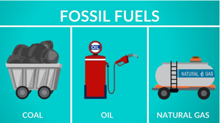

# ENERGÍA

## Concepto e introducción
 Se define ENERGÍA como la capacidad de producir TRABAJO
 El 99% de la energía proviene directa o indirectamente del Sol

Existen diferentes tipos de energía: calorífica, electromagnética, mecánica, química, etc.).

## Leyes de la energía

Todos los intercambios de energía siguen las leyes de la termodinámica:

- 1ª ley: Ley de la conservación de la energía: la energía no se crea ni se destruye, solo se transforma
- 2ª ley: Ley del aumento de la entropía: En cada transferencia la energía se transforma y suele pasar de una forma más concentrada y organizada a otra forma más dispersa y desorganizada (aumento de la entropía)

## Evolución

La evolución de los recursos energéticos utilizados a lo largo de la historia del ser humano son:

1. Madera (leña)
2. Carbón
3. Petróleo
4. Gas natural
5. ¿H2, energías alternativas, fusión nuclear?

El consumo de energía de un país es un índice que refleja el grado de desarrollo y bienestar de la sociedad

## Calidad de la energía

Llamamos calidad de la energía a la capacidad para producir trabajo útil por unidad de masa o volumen. Cuanto más concentrada sea, más calidad posee:

Para valorar la calidad de la energía utilizamos 2 unidades básicas:

- TEC (Tonelada Equivalente de Carbón): Es la energía liberada por la combustión de una tonelada de carbón (aprox. 7 · 106 Kcal)
-  TEP (Tonelada Equivalente de Petróleo): Es la energía liberada en la combustión de una tonelada de petróleo (aprox. 10 · 106 Kcal)

## Energía primaria y secundaria

Se denomina SISTEMA ENERGÉTICO al conjunto de operaciones necesarias para la utilización de la energía:

- ENERGÍA PRIMARIA: Es la energía procedente del medio natural, la cual no puede ser aprovechada de forma directa si antes de ser utilizada no sufre un proceso de transformación Ej , Carbón
- ENERGÍA SECUNDARIA O FINAL: Es la energía útil obtenida por transformación de la energía primaria. Esta energía ya puede ser utilizada para producir calor, trabajo, luz, etc.

## Cadena energética

La cadena energética está formada por 4 operaciones:

1. Generación de energía: Esta etapa implica la producción de energía a partir de recursos naturales, como el petróleo, el gas natural, la biomasa, la energía solar, la energía eólica, la energía hidroeléctrica y la energía geotérmica.

2. Transporte de energía: Esta etapa implica el transporte de energía desde la ubicación de la generación hasta los usuarios finales. Esto se puede lograr mediante el transporte de combustibles, la transmisión de electricidad a través de líneas de transmisión y la distribución a través de redes de distribución.

3. Transformación de energía: Esta etapa implica la conversión de la energía desde una forma a otra, como la conversión de la energía eléctrica en energía térmica o la conversión de energía mecánica en energía eléctrica.

4. Uso de energía: Esta etapa implica el uso final de la energía por los usuarios finales. Esto puede incluir la alimentación de maquinaria, la producción de productos y el suministro de energía a casas, edificios y otros usos comerciales.

## Rendimiento

En cada fase se pierde parte de la energía en forma de calor o de residuos no utilizados

El rendimiento es siempre < 100% en cada paso, por tanto, cuantas más conversiones energéticas hayan en la cadena del sistema energético, mayores son las pérdidas acumuladas y el proceso global es menos eficiente. Ej: La calefacción eléctrica es menos eficiente energéticamente que la de gas natural (el gas natural es la única fuente de energía que puede utilizarse directamente como energía final)

Un convertidor es cualquier componente que permite transformar una forma de energía en otra. Ej
 Los organismos fotosintéticos  transforman la E, luz en E. química
  Una dinamo convierte la E. mecánica (movimiento) en E. eléctrica
 Los motores convierten la E. eléctrica/ E. Química en E. mecánica (movimiento)

En todos los casos, hay pérdidas y el rendimiento es menor al  100%

## Rendimiento energético

El **rendimiento energético** se define como el porcentaje de energía aprovechada en relación al total suministrado. Se trata de un valor siempre inferior a 100%, debido a las pérdidas que se producen.

Por ejemplo, el rendimiento del coche es del 19% y el del sistema energético de los Estados Unidos es del 16%, lo que indica que se desperdicia gran cantidad de energía. Con el aumento de los precios de la energía, es necesario mejorar la eficiencia de todos los sistemas energéticos para reducir estas pérdidas.

## Coste energético

El **coste energético** es el precio que pagamos por utilizar la energía secundaria, pero hay numerosos costes ocultos adicionales que no están incluidos en la factura de la luz o el precio de la gasolina, como las **infraestructuras asociadas** (construcciones, instalaciones, mantenimiento, desmantelamiento e impactos ambientales) o los **impactos ambientales** de los procesos implicados (minería, transportes, fugas, accidentes, etc.).

Las energías convencionales como los combustibles fósiles, la fisión nuclear y la hidroeléctrica generan el 86,2% del consumo de energía a nivel mundial, mientras que las fuentes renovables como la solar, la eólica, la geotérmica y la biomasa aportan el 13,8%, de acuerdo a los datos más recientes.

## Fuentes de energía en el mundo

## Combustibles fósiles

Los combustibles fósiles representan el 80 % de la energía utilizada en el mundo, lo que causa graves problemas medioambientales. Esta realidad nos lleva a la necesidad de sustituirlos progresivamente por fuentes de energía alternativas, ya que el ritmo de consumo actual amenaza con agotar estos combustibles a medio plazo.

## Recursos y reservas

 El **recurso** se refiere a la cantidad total estimada de un determinado combustible o mineral en la corteza terrestre, que es un valor fijo y limitado.

 Por otro lado, la **reserva** se refiere a la cantidad descubierta de ese mismo recurso, cuya explotación es económicamente rentable. Esta cantidad varía dependiendo del avance técnico y del precio de mercado. La mejora de la tecnología de prospección y extracción puede incrementar las reservas, mientras que un aumento del precio del mineral puede hacer que explotaciones previamente no rentables, ahora sí lo sean.