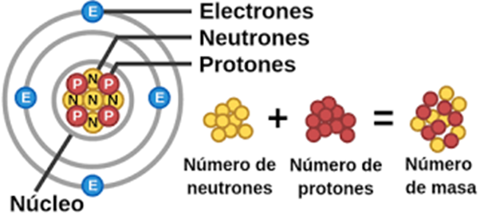
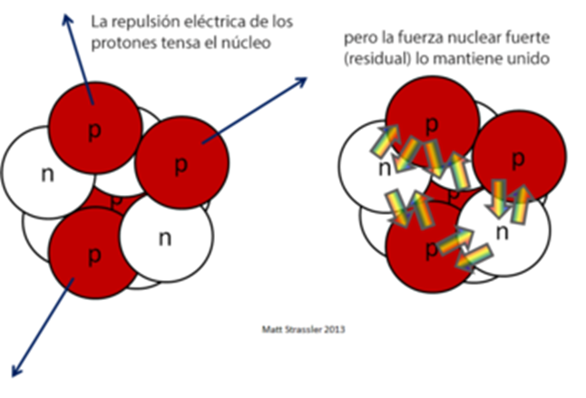

Energías no renovables
Energía nuclear
Tecnologia e ingeniería I - 1º de bachillerato
Curso 24-25

# Energía nuclear

# El átomo

Es átomo la unidad más pequeña de un elemento químico que mantiene todas las propiedades químicas de ese elemento.
Está compuesto por un núcleo central y una nube de electrones que giran alrededor del núcleo.

El **núcleo** es el centro del átomo, donde se encuentran los protones (partículas con carga positiva) y los neutrones (partículas sin carga).

¿Qué es la energía nuclear?

Es la energía que mantiene unidas las partículas en el núcleo de un átomo, es decir, los protones y neutrones.

¿Qué fuerza hace esto?

Esta energía se debe a la fuerza nuclear fuerte, vence la repulsión eléctrica que existiría entre los protones cargados positivamente.

Energía nuclear
Introducción
3

La energía almacenada en los núcleos atómicos se libera o se absorbe durante procesos nucleares.
La energía nuclear es la energía que se libera:
Al dividir el núcleo de un átomo (fisión nuclear)
Al unir dos átomos para convertirse en un átomo individual (fusión nuclear).
Energía nuclear
¿Cómo se libera energía nuclear?
4

## Fisión nuclear

Se produce cuando un átomo de un elemento pesado, como el uranio o el plutonio, es bombardeado con un neutrón.
El neutrón provoca la división del núcleo en dos núcleos más pequeños, liberando una gran cantidad de energía.

## Fusión nuclear

Se produce cuando dos átomos ligeros, como el hidrógeno o el helio, se combinan para formar un átomo más pesado.
La fusión requiere una gran cantidad de energía para iniciarse, pero libera una gran cantidad de energía cuando se produce.
Energía nuclear
Procesos de generación de energía nuclear
5

## Centrales nucleares

Las centrales nucleares convencionales, son instalaciones de generación de electricidad para el consumo humano.
Para ello, a partir de una reacción nuclear de fisión, utilizando Uranio como combustible.

Central nuclear
Edificio de contención
7

En estas instalaciones se genera una reacción en cadena de fisión nuclear de forma controlada, cuya energía liberada en forma de calor aprovechamos para generar electricidad.

Central nuclear
Edificio de contención
8

El reactor es el lugar en el cual encontramos el combustible radioactivo, y donde se genera la reacción de fisión nuclear.
Generación de electricidad
9

El combustible consiste en barras de Uranio. Los átomos de uranio son bombardeados con neutrones, y como resultado se dividen en núcleos más pequeños, correspondientes a otros elementos de la tabla periódica.

Además de nuevos átomos, esta reacción libera una gran cantidad de energía en forma de calor, luz y radiación.

En la fisión se liberan también 2 -3 nuevos neutrones que producen a su vez nuevas fisiones.

Se trata de una reacción en cadena que si no se controla produciría una explosión atómica.

Centrales nucleares
6. Generación de electricidad
11

12
Los tipos de centrales nucleares más habituales son las de reactor de agua a presión o PWR

Central nuclear
Central PWR
Una central PWR tiene 3 circuitos hidráulicos principales.
El primario extrae la energía calorífica del reactor.
El secundario refrigera el primario formando vapor, que mueve una turbina antes de reutilizarse.
El terciario refrigera el secundario y proviene de un río, mar o lago.
13

Central nuclear
Circuito primario
14

Central nuclear
Central PWR
Dentro del reactor nuclear, los núcleos de materiales radiactivos se dividen en una reacción de fisión nuclear.

Esta reacción libera grandes cantidades de calor.

Circuito primario: Este calor generado en el reactor se transfiere a un circuito de refrigerante (que puede ser agua o algún otro fluido), que circula a través del núcleo del reactor. El agua en este circuito no hierve, pero se calienta considerablemente debido a la energía de la fisión.

Agua presurizada (155 bar, 300ºC)
Agua presurizada (70 bar, 300ºC)
15

Central nuclear
Central PWR
En las plantas nucleares con un diseño de reactor de agua a presión (PWR), el calor del circuito primario se transfiere al circuito secundario a través de un intercambiador de calor llamado generador de vapor. Aquí, el agua del circuito secundario se convierte en vapor debido al calor recibido.
16

Central nuclear
Central PWR
Tras pasar por las turbinas, el vapor se enfría y se condensa en agua a través de un condensador a través del circuito terciario.

Esta agua se recicla y regresa al sistema para ser calentada nuevamente, completando el ciclo.
17

El vapor a alta presión generado en el circuito secundario es dirigido hacia unas turbinas.

Al pasar por las palas de las turbinas, el vapor hace que estas giren rápidamente, transformando la energía térmica en energía mecánica.

Las turbinas están conectadas a un generador eléctrico, que convierte la energía mecánica en electricidad mediante la rotación de un rotor dentro de un campo magnético
Centrales nucleares
6. Generación de electricidad
18

El edificio de contención se considera el edificio más característico de una central nuclear y alberga el reactor y todos los elementos que contengan material radiactivo.
Es una estructura hermética de hormigón armado o pretensado, que, por norma general, suele tener forma esférica o cilíndrica rematada en cúpula semiesférica, cuyas paredes interiores van recubiertas de chapas de acero soldadas que aseguran la estanqueidad.
Central nuclear
Edificio de contención
19

20

Su arquitectura está diseñada para soportar, tanto el propio peso, como cargas accidentales como podrían ser
Terremotos u otros fenómenos naturales
Escapes de gases radiactivos
Su misión principal es aislar y proteger el exterior de la emisión de la radiación
Derivada del funcionamiento del reactor
De la consecuencia de un accidente.
Central nuclear
Edificio de contención
21

## Preparación del combustible de las centrales

El uranio es un elemento que se encuentra en la naturaleza en forma de minerales, como la uranitita.
La minería se utiliza para extraer el mineral de uranio de depósitos subterráneos o de superficie.
Se muele y procesa para convertirlo en un concentrado de uranio.

## ¿Dé donde se obtiene el uranio?

De un mismo elemento químico, en la naturaleza puede haber diferentes **isótopos**, que tienen mismo número de protones pero tienen un número neutrones distinto.
Al tener composiciones distintas, sus propiedades nucleares también lo son.

EL U-235

- Es fisionable, puede ser dividido por neutrones lentos,liberando una gran cantidad de energía.
- Ideal para uso en reactores y armas nucleares.

El U-238

- No fisionable directamente
- Contribuye a la producción de energía de forma indirecta, formando plutonio.
- Este plutonio puede ser utilizado para la fisión en reactores reproductores o en algunos reactores convencionales.

## Procesado

El uranio natural tiene solo alrededor del 0,7% de U-235, pero para su uso en reactores nucleares, se necesita alrededor del 3-5% de U-235.

¿Cómo conseguimos aumentar este porcentaje?
Para conseguir esto utilizamos un proceso se llama enriquecimiento, con el que aumentar la proporción de uranio-235 en el material.  Esto se realiza por centrifugación.

¿Qué obtenemos al final del proceso?
El producto se conoce como uranio enriquecido.
¿Dé donde se obtiene el uranio?
3. Enriquecimiento del uranio
26

Si la concentración de U235 fuese menor a un 4-5%, el reactor tendría dificultades para mantener la reacción en cadena.
Si fuera mucho mayor, podría hacer que el reactor fuese más difícil de controlar. En el caso de las bombas nucleares, el porcentaje de U235 llega a ser del 90%.
¿Dé donde se obtiene el uranio?
3. Enriquecimiento del uranio
27

Una vez que se ha enriquecido el uranio, se convierte en forma de pastillas sólidas.
Las pastillas de polvo de uranio se conocen como pellets de combustible nuclear.
Están hechas de uranio enriquecido en forma de dióxido de uranio (UO₂) y se comprimen y sintetizan en cilindros sólidos

## Formación del combustible

Los **pellets** de uranio se empaquetan en largas **varillas** de combustible, que son tubos delgados de aleaciones metálicas resistentes al calor y la corrosión (generalmente de aleaciones de zirconio).
Estas varillas se ensamblan formando un conjunto de combustible, también conocido como **elemento combustible**.

Varios conjuntos de estos elementos combustibles se introducen en la vasija del reactor nuclear.
Estos elementos se insertan y se extraen cuando se hacen operaciones de recarga de combustible.

¿Dé donde se obtiene el uranio?
4. Formación del combustible
30

En la parte superior de la vasija se encuentran las barras de control (Control rods)
¿Para qué sirven?
En un reactor nuclear son componentes esenciales que controlan la reacción de fisión al absorber neutrones.
¿Cómo se utilizan?
Al introducir o retirar las barras de control, se puede regular la velocidad de la reacción y, por tanto, la energía eléctrica generada.
¿Dé donde se obtiene el uranio?
4. Formación del combustible
31

El combustible nuclear ensamblado se transporta con seguridad a la central nuclear.
En la planta de energía, las varillas de combustible se cargan en el núcleo del reactor, donde se llevarán a cabo las reacciones nucleares para producir energía.
¿Dé donde se obtiene el uranio?
5. Transporte y carga
32

33

## Armamento nuclear

Durante la Segunda Guerra Mundial, Estados Unidos lanzó bombas atómicas sobre las ciudades japonesas de Hiroshima y Nagasaki (1945).
Estas bombas, utilizaban la fisión nuclear de uranio y plutonio, respectivamente.
La enorme energía liberada al dividir átomos produjo explosiones devastadoras, matando a cientos de miles de personas y marcando el fin de la guerra.
Historia nuclear

Infografia bombas nagasaki e hiroshima

Tras los eventos de Hiroshima y Nagasaki, se comprendió mejor la fisión nuclear. Sin embargo, en lugar de usar este poder para armas, se empezó a investigar su uso con fines pacíficos, como la generación de electricidad.

La primera vez que se produjo electricidad en un reactor nuclear fue el 20 de diciembre de 1951 en la estación experimental de Arco, en Idaho (EEUU)
Historia nuclear

## Primera generación de electricidad

El 27 de junio de 1954 comenzó a funcionar la primera central nuclear del mundo en Obnisnks (Rusia).

A finales de 2023, en el mundo existían **412 reactores** nucleares en operación, de los que 100, están en la Unión Europea.

## La primera central nuclear de España

La primera central nuclear en España fue la **Central Nuclear José Cabrera**, comúnmente conocida como Zorita.

Comenzó a operar el 13 de agosto de 1968. La planta estuvo operativa **hasta el 30 de abril de 2006**.

Fue la primera instalación de este tipo en el país y marcó el inicio de la energía nuclear en España.

## Centrales nucleares de España

En España se encuentran en funcionamiento 5 centrales nucleares, 2 de las cuales disponen de 2 reactores cada una (Almaraz y Ascó), por lo que suman 7 reactores de agua ligera, con una potencia total instalada de 7.398,7 MWe.

Las centrales nucleares de Santa María de Garoña, Jose Cabrera y Vandellós I se encuentran en desmantelamiento.
Centrales nucleares
En España

## Ventajas y desventajas del uso de energía nuclear

Pros
Es una fuente de energía limpia y eficiente.
No emite gases de efecto invernadero.
Puede utilizarse para generar grandes cantidades de electricidad.
Energía nuclear
Contras
Es una fuente de energía peligrosa.
Los residuos nucleares son radiactivos y requieren un almacenamiento seguro.
El coste de la construcción y el funcionamiento de las centrales nucleares es elevado.
Existe la preocupación por la proliferación nuclear y el uso de material nuclear en armas.
42
Pros y contras

Las centrales nucleares requieren un **mantenimiento** regular y una **gestión segura de los residuos**.

Mantenimiento

Cada 18 meses, se detiene la operación de una central nuclear para sustituir un tercio del combustible nuclear.
Sustitución del Combustible
El proceso implica extraer 60 elementos de combustible nuclear, cada uno con dimensiones de 20 cm x 20 cm x 4 metros.

Gestión de residuos
43

## Almacenamiento Temporal

El combustible gastado se almacena en piscinas profundas, generalmente ubicadas fuera del edificio de contención del reactor, durante al menos 5 años.
El agua en estas piscinas actúa como blindaje, reduciendo la dosis radiactiva a la mitad cada 7 cm.
Almacenamiento a Largo Plazo
Debido al aumento del combustible gastado, se están implementando métodos de almacenamiento a largo plazo.
Gestión de residuos
Almacenamiento
44

Gestión de residuos
Almacenamiento en piscina
45

## Almacenamiento Geológico Profundo

El combustible gastado se coloca en contenedores de acero inoxidable con blindaje de plomo, cada uno con capacidad para 35 elementos.
Estos contenedores se almacenan en una instalación subterránea a 500 metros de profundidad en una formación geológicamente estable.
Finlandia está construyendo actualmente una instalación de este tipo.
Este método ofrece seguridad a largo plazo, ya que el combustible no puede explotar, fundirse ni disolverse en agua.
Gestión de residuos
Soluciones temporales a largo plazo
46

Gestión de residuos
47
Almacenamiento geológico profundo

## Reciclaje

El reciclaje de residuos nucleares es un método experimental que permite reutilizar el material.
Rusia y China operan reactores que utilizan combustible reprocesado, generando hasta el 80% de la potencia de un reactor convencional.○
Esta tecnología tiene el potencial de utilizar hasta el 95% del combustible nuclear, reduciendo significativamente los residuos.

## Propulsión naval

Los submarinos y buques de guerra nucleares están equipados con reactores nucleares que funcionan utilizando la fisión nuclear, similar al proceso en una central nuclear.
Estos reactores producen calor directamente, que se utiliza para impulsar una turbina conectada a una hélice.
La propulsión nuclear naval es una tecnología avanzada que se utiliza proporcionarles un mayor alcance, velocidad y capacidad de operación en silencio.
Energía nuclear
Aplicaciones

## Medicina

En diagnóstico, se emplea en técnicas como la Tomografía por Emisión de Positrones (PET) y gammagrafías, utilizando trazadores radiactivos.
En el tratamiento, se utiliza en radioterapia para dañar células cancerosas y en terapia con yodo radiactivo para tratar enfermedades tiroideas.
Energía nuclear
Aplicaciones
51

## Armas nucleares

Reacción en cadena
La reacción en cadena se produce en fracciones de segundo, liberando una enorme cantidad de energía en forma de explosión nuclear. La energía proviene de la conversión de una pequeña cantidad de masa en energía, según la ecuación de Einstein
Onda expansiva y radiación:
La explosión genera una onda expansiva devastadora y una liberación masiva de radiación (rayos gamma y neutrones), que destruyen todo a su alrededor.
Armas nucleares
53

Tratado sobre la No Proliferación de las Armas Nucleares (TNP)

Tratado internacional que busca evitar la proliferación de armas nucleares.

El TNP se divide en tres pilares:

- Prevenir la propagación de armas nucleares,
- Promover la cooperación en el uso pacífico de la energía nuclear y
- Impulsar el desarme nuclear y el desarme general y completo

El TNP entró en vigor en 1970 y ha sido ratificado por 191 países.
La función del Organismo Internacional de Energía Atómica (OIEA) en la verificación del cumplimiento del TNP por parte de los estados que no poseen armas nucleares, y en la promoción de la cooperación internacional para el uso pacífico de la energía nuclear.
Armas nucleares
Tratado de no proliferación
54

Efectos en el ser humano
55

Efectos en el ser humano
56

## Catástrofes nucleares

## Central nuclear de Lemóniz

La central nuclear de Lemóniz, ubicada en el País Vasco, España, fue un proyecto ambicioso de la dictadura de Franco para independizar el consumo energético de la región.
A pesar de la fuerte oposición ciudadana, liderada por grupos ecologistas y antinucleares, la construcción de la central avanzó hasta su finalización en 1982.
Sin embargo, la presión social, las acciones terroristas de ETA y la posterior moratoria nuclear impidieron su puesta en marcha
Central de Lemoniz
País Vasco
58

El Sol es una gigantesca esfera de plasma que genera su energía a través de la fusión nuclear, un proceso en el que los núcleos de hidrógeno se combinan bajo condiciones extremas de temperatura y presión para formar helio.
Durante esta fusión, una pequeña cantidad de masa se convierte en una enorme cantidad de energía
Esta energía es la que emite el Sol en forma de luz y calor, permitiendo que la vida prospere en la Tierra y manteniendo el equilibrio en el sistema solar.

https://nuclearinst.com/nuclear-reactor-simulator
https://phet.colorado.edu/sims/cheerpj/nuclear-physics/latest/nuclear-physics.html?simulation=nuclear-fission&locale=es
https://dalton-nrs.manchester.ac.uk/#

Simuladores
60

# Energía nuclear (Extra)

Se basa en la desintegración radiactiva de los átomos de Uranio. Estos átomos son inestables y se rompen o fisionan produciendo:

- núcleos más ligeros
- radiactividad
- GRANDES CANTIDADES DE CALOR, que es lo que aprovecha del proceso.

Es el combustible de las centrales nucleares, donde el calor producido por la reacción se utiliza para producir **vapor**, con el cual se mueve unas **turbinas** y se genera energía eléctrica.

En la **fisión** se liberan también 2 -3 nuevos neutrones que producen nuevas fisiones: es una **reacción en cadena** que si no se controla produciría una explosión atómica.

## Moderador

Para controlar la reacción, se introduce en el reactor un **moderador** que “enfría” la reacción (absorbe los neutrones en exceso). Este moderador puede ser:

- Agua ligera (75% de los reactores)
- Agua pesada (20%). El agua pesada es una forma especial de agua que contiene isótopos de oxígeno e hidrógeno pesados. Esta forma es especialmente rica en el isótopo de hidrógeno llamado deuterio, que es una forma de hidrógeno con un neutrón adicional.
- Grafito (5%)

## Sistema de refrigeración

Para extraer el calor producido hay un SISTEMA DE REFRIGERACIÓN POR AGUA que consta de 3 circuitos independientes entre sí (por seguridad):

- **Circuito primario**: En contacto con el material radiactivo, está confinado dentro de l  vasija del reactor y esta agua se recicla (no sale nunca)
- **Circuito secundario**: Enfría al primario y es el que genera el VAPOR que mueve las turbinas
- **Circuito terciario**: Licua el vapor del 2º. Esta agua entra y sale del exterior (río, mar) y genera el vapor que vemos salir por la torres de refrigeración

## Impacto ambiental

Las centrales nucleares NO PRODUCEN CONTAMINANTES ATMOSFÉRICOS, pero sus principales inconvenientes son:

- Contaminación térmica del agua del río, etc. Que altera el ecosistema acuático (el aumento de tª no debe superar los 3ºC y la Tª máx no debe superar los 30ªC)
- Alteración del microclima de la zona (más cálido y húmedo) por el vapor de refrigeración
- Minería, transporte y tratamiento de los productos radiactivos
- Riesgo de accidentes (Fukushima 2011, Three Mile Island 1979, Chernóbil 1986)
- Tratamiento de los residuos radiactivos

Instalaciones y mantenimientos muy caros, sobre todo si su funcionamiento se limita a 40 años y luego debe ser desmantelada también con altos costes económicos. Prometía ser barata y resulta tener enormes gastos ocultos.

Actualmente, con la crisis medioambiental, hay muchos partidarios de la energía nuclear (incluidos algunos padres del ecologismo como James Lovelock), ya que no produce CO2 (no contribuye al cambio climático) y se producen grandes cantidades de energía que requiere el modo de vida moderno. Ven la energía nuclear menos peligrosa que un inminente cambio climático catastrófico. Podría ser una solución temporal hasta desarrollar adecuadamente las energías alternativas limpias para su total implantación.  Además, con las mejoras tecnológicas, cada vez podrían ser más seguras y tratar sus residuos más adecuadamente.

## IMPACTO AMBIENTAL DE LA ENERGÍA DE FISIÓN NUCLEAR

Actualmente, la energía nuclear se genera a partir de la fisión del uranio-235, un mineral con una vida útil relativamente corta. El proceso comienza con la extracción de grandes cantidades de mineral de uranio (pechblenda o uraninita, UO2). Estas reservas se procesan en plantas de enriquecimiento, donde se separa el isótopo U-235 del resto mediante métodos físicos. A continuación, el U-235 se enriquece añadiendo plutonio-239 para mejorar la reacción de fisión. Esta mezcla se fabrica en barras de combustible, que se sumergen en los reactores intercaladas con las barras de moderador.

Las barras de combustible se extraen de los reactores cada 3-4 años, ya que su concentración de U-235 ha bajado demasiado para mantener la reacción. Estas barras se almacenan en **piscinas de enfriamiento** dentro del propio reactor, hasta que su temperatura baje lo suficiente.

Una vez hay suficientes barras, éstas se transportan a centrales de reciclaje, donde se extrae el Plutonio-239 para reutilizarlo, así como los isótopos de vida corta (residuos). El resto continúa activo como residuos radiactivos de alta actividad durante un periodo de 10.000-100.000 años.

Las reservas actuales de mineral de uranio están calculadas en 2 millones de toneladas, suficientes para unos 60 años al ritmo actual de consumo. Además, el Plutonio usado en el combustible nuclear puede ser usado como componente del armamento nuclear o el de las bombas atómicas, lo cual aumenta el riesgo de terrorismo.

## Residuos de alta actividad

Las centrales nucleares no producen contaminantes atmosféricos, pero generan una gran cantidad de residuos radiactivos peligrosos para la salud y el medio ambiente, por lo que deben ser almacenados de forma segura durante centenares o miles de años que dura su radiactividad:

1) El combustible gastado primero se enfría durante 4-10 años en piscinas de agua pura situadas en el interior de la propia central.
2) Después deben ser trasladados a un almacén temporal en superficie y vigilado. Puede ser centralizado (ATC), donde se almacenan los residuos de muchas centrales. Esto tiene el peligro de ser posible diana de terrorismo y el rechazo de la población próxima. Algunos proponen pequeños almacenes de superficie diseminados o incluso dentro del territorio de la propia central donde ya existe una fuerte vigilancia.
3) Almacenamiento geológico definitivo, enterrado a profundidad en zonas adecuadas: macizos graníticos o salinos de grosor suficiente para absorber posibles fugas, estables sísmicamente, impermeables y sin contacto con los acuíferos.

Almacén de residuos de baja y media actividad de El Cabril, (Córdoba)
Actualmente se está investigando un proceso de fisión basado en el Torio- 232 que no se activa por sí mismo (necesita de un acelerador de partículas haga que los protones choquen con el combustible). Ventajas:
Sustitución de los residuos por otros menos peligrosos
La reacción se para automáticamente en caso de accidente

CICLO VITAL DEL URANIO:

MINERAL
URANINITA/PECHBLENDA
 99,3 % U- 238
  0,7 %  U- 235 (útil x fisión)

A continuación, en una planta de enriquecimiento de uranio:

1. Aumento del % U-235 hasta 3-5%  (Uranio enriquecido)
        ( Met. Físicos: gasificación + centrifugación)
2. Adición de Plutonio-239 (mejora la reacción de fisión)

BARRAS DE COMBUSTIBLE
(Largos cilindros de acero rellenos de pastillas  cerámicas)

Reactor

Se colocan en la parte más externa y cada 1-2 años se desplazan hacia el centro. Las barras más antiguas del centro se retiran. Cada barra permanece en el reactor 3 ciclos (3-6 años) antes de ser retiradas. Para entonces el % de U-235 ya no es suficiente para mantener la reacción.

COMBUSTIBLE GASTADO (“residuos nucleares”)

Formado por:  95,6 % de URANIO NO GASTADO
	3,4 % PRODUCTOS DE FISIÓN (calor)(vida ½)
	1 % ACTÍNIDOS (U + neutrón) (Larga vida)

## PISCINAS DE ENFRIAMIENTO
(Hormigón revestido de acero y agua ligera pura (5-10años)

## ALMACEN TEMPORAL EN SUPERFICIE “CONTENEDORES SECOS (50-60años)

- In situ (junto al reactor en cada central)
- Centralizado (ATC)
Grandes contenedores de hormigón donde se almacenan manguitos de acero   sellados y refrigerado por la circulación natural del aire (enfriamiento residual)

## CENTRAL DE RECICLAJE

Se trata de una forma de almacenamiento seguro de residuos radiactivos, con el objetivo de limitar el riesgo de proliferación de armas nucleares. Los residuos recuperados, como el plutonio y el uranio (90%), se eliminan con un confinamiento geológico profundo, que es definitivo.

El confinamiento se lleva a cabo en zonas de gran **estabilidad sísmica y geotérmica**, que son impermeables y sin contacto con aguas subterráneas, con un grosor suficiente para absorber posibles fugas. Se han utilizado macizos graníticos, domos salinos y depósitos arcillosos. Estas técnicas se conocen como "ciclo abierto" y "ciclo cerrado".

## Curiosidades

### Bombas nucleares

Las bombas atómicas más importantes son la bomba atómica Fat Man y la bomba atómica Little Boy. La bomba atómica Fat Man fue utilizada en la ciudad japonesa de Nagasaki el 9 de agosto de 1945. La bomba atómica Little Boy fue utilizada en Hiroshima el 6 de agosto de 1945.

La estructura interna de una bomba atómica está compuesta por una cápsula de uranio o plutonio con un núcleo de uranio enriquecido, una caja de explosivos, una cápsula de iniciación y una batería. La cápsula de uranio o plutonio contiene el material fisionable que es la fuente de energía de la bomba. La caja de explosivos se utiliza para comprimir el material fisionable y aumentar su temperatura y presión para iniciar la reacción nuclear. La cápsula de iniciación contiene una mezcla de combustible y oxígeno para asegurar la reacción nuclear. La batería alimenta el circuito eléctrico para activar la cápsula de iniciación.

