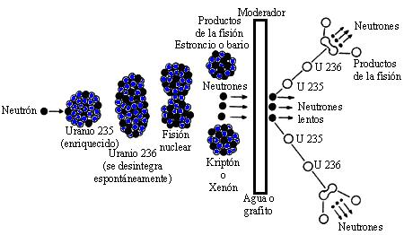
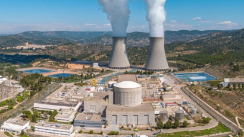
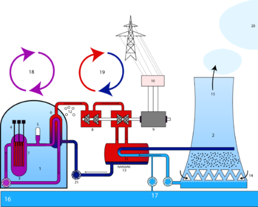
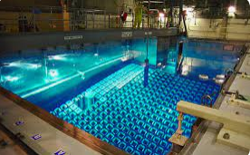
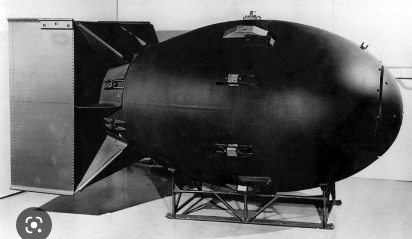
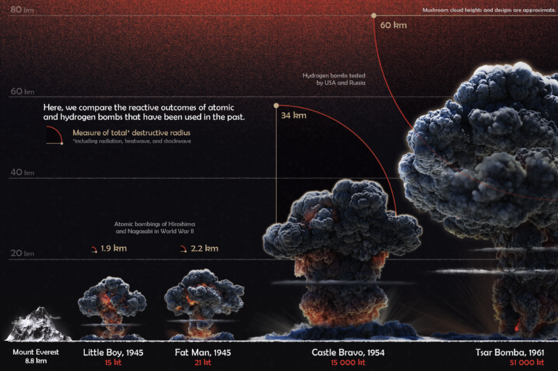

# Energía nuclear

Se basa en la desintegración radiactiva de los átomos de Uranio. Estos átomos son inestables y se rompen o fisionan produciendo:

- núcleos más ligeros
- radiactividad
- GRANDES CANTIDADES DE CALOR, que es lo que aprovecha del proceso.

Es el combustible de las centrales nucleares, donde el calor producido por la reacción se utiliza para producir **vapor**, con el cual se mueve unas **turbinas** y se genera energía eléctrica.

En la **fisión** se liberan también 2 -3 nuevos neutrones que producen nuevas fisiones: es una **reacción en cadena** que si no se controla produciría una explosión atómica.

## Moderador

Para controlar la reacción, se introduce en el reactor un **moderador** que “enfría” la reacción (absorbe los neutrones en exceso). Este moderador puede ser:

- Agua ligera (75% de los reactores)
- Agua pesada (20%). El agua pesada es una forma especial de agua que contiene isótopos de oxígeno e hidrógeno pesados. Esta forma es especialmente rica en el isótopo de hidrógeno llamado deuterio, que es una forma de hidrógeno con un neutrón adicional.
- Grafito (5%)

## Sistema de refrigeración

Para extraer el calor producido hay un SISTEMA DE REFRIGERACIÓN POR AGUA que consta de 3 circuitos independientes entre sí (por seguridad):

- **Circuito primario**: En contacto con el material radiactivo, está confinado dentro de l  vasija del reactor y esta agua se recicla (no sale nunca)
- **Circuito secundario**: Enfría al primario y es el que genera el VAPOR que mueve las turbinas
- **Circuito terciario**: Licua el vapor del 2º. Esta agua entra y sale del exterior (río, mar) y genera el vapor que vemos salir por la torres de refrigeración

## Impacto ambiental

Las centrales nucleares NO PRODUCEN CONTAMINANTES ATMOSFÉRICOS, pero sus principales inconvenientes son:

- Contaminación térmica del agua del río, etc. Que altera el ecosistema acuático (el aumento de tª no debe superar los 3ºC y la Tª máx no debe superar los 30ªC)
- Alteración del microclima de la zona (más cálido y húmedo) por el vapor de refrigeración
- Minería, transporte y tratamiento de los productos radiactivos
- Riesgo de accidentes (Fukushima 2011, Three Mile Island 1979, Chernóbil 1986)
- Tratamiento de los residuos radiactivos

Instalaciones y mantenimientos muy caros, sobre todo si su funcionamiento se limita a 40 años y luego debe ser desmantelada también con altos costes económicos. Prometía ser barata y resulta tener enormes gastos ocultos.

Actualmente, con la crisis medioambiental, hay muchos partidarios de la energía nuclear (incluidos algunos padres del ecologismo como James Lovelock), ya que no produce CO2 (no contribuye al cambio climático) y se producen grandes cantidades de energía que requiere el modo de vida moderno. Ven la energía nuclear menos peligrosa que un inminente cambio climático catastrófico. Podría ser una solución temporal hasta desarrollar adecuadamente las energías alternativas limpias para su total implantación.  Además, con las mejoras tecnológicas, cada vez podrían ser más seguras y tratar sus residuos más adecuadamente.

## IMPACTO AMBIENTAL DE LA ENERGÍA DE FISIÓN NUCLEAR

Actualmente, la energía nuclear se genera a partir de la fisión del uranio-235, un mineral con una vida útil relativamente corta. El proceso comienza con la extracción de grandes cantidades de mineral de uranio (pechblenda o uraninita, UO2). Estas reservas se procesan en plantas de enriquecimiento, donde se separa el isótopo U-235 del resto mediante métodos físicos. A continuación, el U-235 se enriquece añadiendo plutonio-239 para mejorar la reacción de fisión. Esta mezcla se fabrica en barras de combustible, que se sumergen en los reactores intercaladas con las barras de moderador.

Las barras de combustible se extraen de los reactores cada 3-4 años, ya que su concentración de U-235 ha bajado demasiado para mantener la reacción. Estas barras se almacenan en **piscinas de enfriamiento** dentro del propio reactor, hasta que su temperatura baje lo suficiente.

Una vez hay suficientes barras, éstas se transportan a centrales de reciclaje, donde se extrae el Plutonio-239 para reutilizarlo, así como los isótopos de vida corta (residuos). El resto continúa activo como residuos radiactivos de alta actividad durante un periodo de 10.000-100.000 años.

Las reservas actuales de mineral de uranio están calculadas en 2 millones de toneladas, suficientes para unos 60 años al ritmo actual de consumo. Además, el Plutonio usado en el combustible nuclear puede ser usado como componente del armamento nuclear o el de las bombas atómicas, lo cual aumenta el riesgo de terrorismo.

## Residuos de alta actividad

Las centrales nucleares no producen contaminantes atmosféricos, pero generan una gran cantidad de residuos radiactivos peligrosos para la salud y el medio ambiente, por lo que deben ser almacenados de forma segura durante centenares o miles de años que dura su radiactividad:

1) El combustible gastado primero se enfría durante 4-10 años en piscinas de agua pura situadas en el interior de la propia central.
2) Después deben ser trasladados a un almacén temporal en superficie y vigilado. Puede ser centralizado (ATC), donde se almacenan los residuos de muchas centrales. Esto tiene el peligro de ser posible diana de terrorismo y el rechazo de la población próxima. Algunos proponen pequeños almacenes de superficie diseminados o incluso dentro del territorio de la propia central donde ya existe una fuerte vigilancia.
3) Almacenamiento geológico definitivo, enterrado a profundidad en zonas adecuadas: macizos graníticos o salinos de grosor suficiente para absorber posibles fugas, estables sísmicamente, impermeables y sin contacto con los acuíferos.

Almacén de residuos de baja y media actividad de El Cabril, (Córdoba)
Actualmente se está investigando un proceso de fisión basado en el Torio- 232 que no se activa por sí mismo (necesita de un acelerador de partículas haga que los protones choquen con el combustible). Ventajas:
Sustitución de los residuos por otros menos peligrosos
La reacción se para automáticamente en caso de accidente

CICLO VITAL DEL URANIO:

MINERAL
URANINITA/PECHBLENDA
 99,3 % U- 238
  0,7 %  U- 235 (útil x fisión)

A continuación, en una planta de enriquecimiento de uranio:

1. Aumento del % U-235 hasta 3-5%  (Uranio enriquecido)
        ( Met. Físicos: gasificación + centrifugación)
2. Adición de Plutonio-239 (mejora la reacción de fisión)

BARRAS DE COMBUSTIBLE
(Largos cilindros de acero rellenos de pastillas  cerámicas)

Reactor

Se colocan en la parte más externa y cada 1-2 años se desplazan hacia el centro. Las barras más antiguas del centro se retiran. Cada barra permanece en el reactor 3 ciclos (3-6 años) antes de ser retiradas. Para entonces el % de U-235 ya no es suficiente para mantener la reacción.

COMBUSTIBLE GASTADO (“residuos nucleares”)

Formado por:  95,6 % de URANIO NO GASTADO
	3,4 % PRODUCTOS DE FISIÓN (calor)(vida ½)
	1 % ACTÍNIDOS (U + neutrón) (Larga vida)

## PISCINAS DE ENFRIAMIENTO
(Hormigón revestido de acero y agua ligera pura (5-10años)

## ALMACEN TEMPORAL EN SUPERFICIE “CONTENEDORES SECOS (50-60años)

- In situ (junto al reactor en cada central)
- Centralizado (ATC)
Grandes contenedores de hormigón donde se almacenan manguitos de acero   sellados y refrigerado por la circulación natural del aire (enfriamiento residual)

## CENTRAL DE RECICLAJE

Se trata de una forma de almacenamiento seguro de residuos radiactivos, con el objetivo de limitar el riesgo de proliferación de armas nucleares. Los residuos recuperados, como el plutonio y el uranio (90%), se eliminan con un confinamiento geológico profundo, que es definitivo.

El confinamiento se lleva a cabo en zonas de gran **estabilidad sísmica y geotérmica**, que son impermeables y sin contacto con aguas subterráneas, con un grosor suficiente para absorber posibles fugas. Se han utilizado macizos graníticos, domos salinos y depósitos arcillosos. Estas técnicas se conocen como "ciclo abierto" y "ciclo cerrado".

## Curiosidades

### Bombas nucleares

Las bombas atómicas más importantes son la bomba atómica Fat Man y la bomba atómica Little Boy. La bomba atómica Fat Man fue utilizada en la ciudad japonesa de Nagasaki el 9 de agosto de 1945. La bomba atómica Little Boy fue utilizada en Hiroshima el 6 de agosto de 1945.

La estructura interna de una bomba atómica está compuesta por una cápsula de uranio o plutonio con un núcleo de uranio enriquecido, una caja de explosivos, una cápsula de iniciación y una batería. La cápsula de uranio o plutonio contiene el material fisionable que es la fuente de energía de la bomba. La caja de explosivos se utiliza para comprimir el material fisionable y aumentar su temperatura y presión para iniciar la reacción nuclear. La cápsula de iniciación contiene una mezcla de combustible y oxígeno para asegurar la reacción nuclear. La batería alimenta el circuito eléctrico para activar la cápsula de iniciación.

