# Energía nuclear

# El átomo

Es átomo la unidad más pequeña de un elemento químico que mantiene todas las propiedades químicas de ese elemento.
Está compuesto por un núcleo central y una nube de electrones que giran alrededor del núcleo.

El **núcleo** es el centro del átomo, donde se encuentran los protones (partículas con carga positiva) y los neutrones (partículas sin carga).

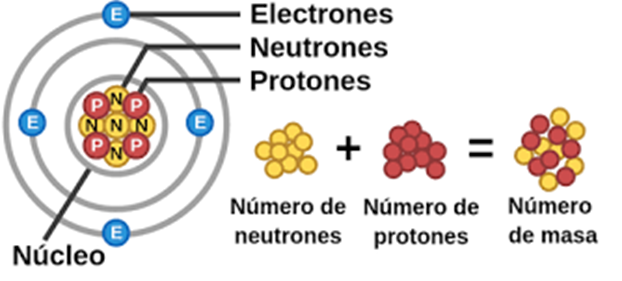

La energía nuclear es la energía que mantiene **unidas las partículas en el núcleo** de un átomo, es decir, los protones y neutrones.
Esta energía se debe a la **fuerza nuclear fuerte**, vence la repulsión eléctrica que existiría entre los protones cargados positivamente.

La energía almacenada en los núcleos atómicos se libera o se absorbe durante procesos nucleares.

La energía nuclear es la energía que se libera:

- Al **dividir** el núcleo de un átomo (**fisión** nuclear)
- Al **unir** dos átomos para convertirse en un átomo individual (**fusión** nuclear).

## Fisión nuclear

Se produce cuando un átomo de un elemento pesado, como el **uranio** o el **plutonio**, es bombardeado con un neutrón.
El neutrón provoca la división del núcleo en dos núcleos más pequeños, liberando una gran cantidad de energía.

## Fusión nuclear

Se produce cuando dos átomos ligeros, como el **hidrógeno** o el **helio**, se combinan para formar un átomo más pesado.
La fusión requiere una gran cantidad de energía para iniciarse, pero libera una gran cantidad de energía cuando se produce.

## Centrales nucleares

Las centrales nucleares convencionales, son instalaciones de generación de electricidad para el consumo humano.
Para ello, a partir de una reacción nuclear de fisión, utilizando Uranio como combustible.

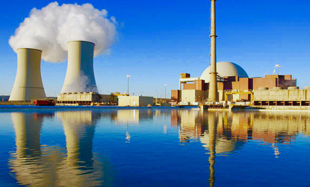

En estas instalaciones se genera una reacción en cadena de fisión nuclear de forma controlada, cuya energía liberada en forma de calor aprovechamos para generar electricidad.

El reactor es el lugar en el cual encontramos el combustible radioactivo, y donde se genera la reacción de fisión nuclear.
Generación de electricidad

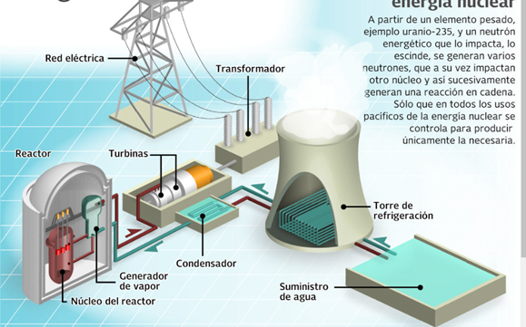

El combustible consiste en barras de Uranio. Los átomos de uranio son bombardeados con neutrones, y como resultado se dividen en núcleos más pequeños, correspondientes a otros elementos de la tabla periódica.

Además de nuevos átomos, esta reacción libera una gran cantidad de energía en forma de calor, luz y radiación.

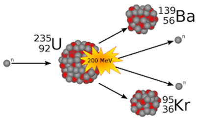

En la fisión se liberan también 2 -3 nuevos neutrones que producen a su vez nuevas fisiones.

Se trata de una reacción en cadena que si no se controla produciría una explosión atómica.

## Centrales PWR

Los tipos de centrales nucleares más habituales son las de **reactor de agua a presión** o **PWR**

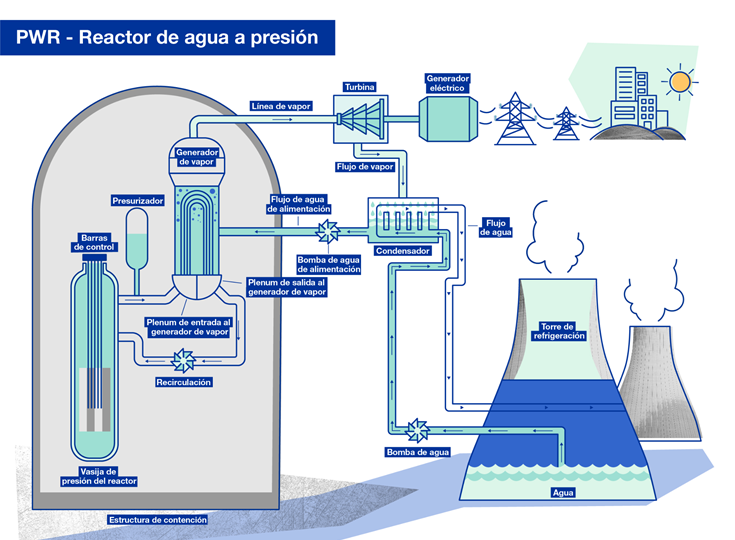

Una central PWR tiene 3 circuitos hidráulicos principales.

- El primario extrae la energía calorífica del reactor.
- El secundario refrigera el primario formando vapor, que mueve una turbina antes de reutilizarse.
- El terciario refrigera el secundario y proviene de un río, mar o lago.

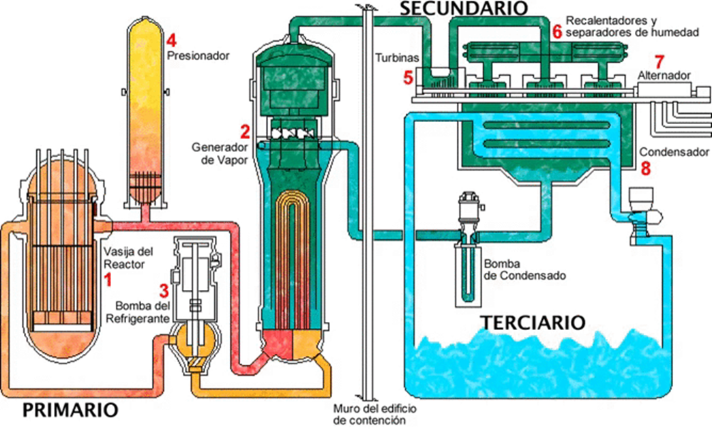

Dentro del reactor nuclear, los núcleos de materiales radiactivos se dividen en una reacción de fisión nuclear.

Esta reacción libera grandes cantidades de calor.

Circuito primario: Este calor generado en el reactor se transfiere a un circuito de refrigerante (que puede ser agua o algún otro fluido), que circula a través del núcleo del reactor. El agua en este circuito no hierve, pero se calienta considerablemente debido a la energía de la fisión.

## Generación de vapor

En las plantas nucleares con un diseño de reactor de agua a presión (PWR), el calor del circuito primario se transfiere al **circuito secundario** a través de un intercambiador de calor llamado **generador de vapor**. Aquí, el agua del circuito secundario se convierte en vapor debido al calor recibido.

## Generación de electricidad

El vapor a alta presión generado en el circuito secundario es dirigido hacia unas **turbinas**.

Al pasar por las **palas** de las turbinas, el vapor hace que estas giren rápidamente, transformando la energía térmica en energía mecánica.

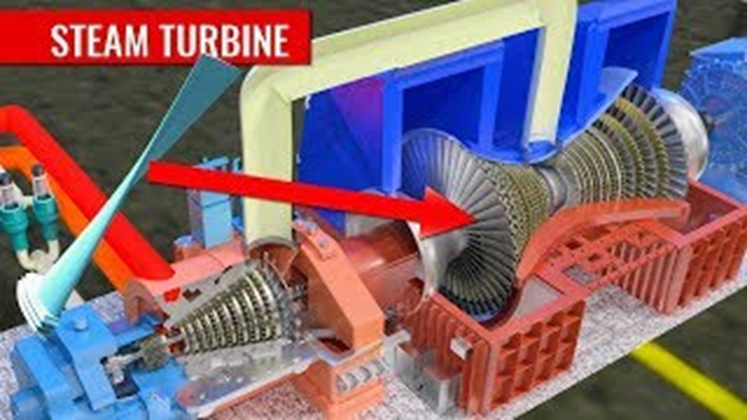

Las turbinas están conectadas a un generador eléctrico, que convierte la energía mecánica en **electricidad** mediante la rotación de un rotor dentro de un campo magnético.

El vapor, trTras pasar por las turbinas, el vapor se enfría y se condensa en agua a través de un condensador a través del **circuito terciario**. Esta agua se recicla y regresa al sistema para ser calentada nuevamente, completando el ciclo.

## Edificio de contención

El edificio de contención se considera el edificio más característico de una central nuclear y alberga el reactor y todos los elementos que contengan material radiactivo.
Es una estructura hermética de hormigón armado o pretensado, que, por norma general, suele tener forma esférica o cilíndrica rematada en cúpula semiesférica, cuyas paredes interiores van recubiertas de chapas de acero soldadas que aseguran la estanqueidad.

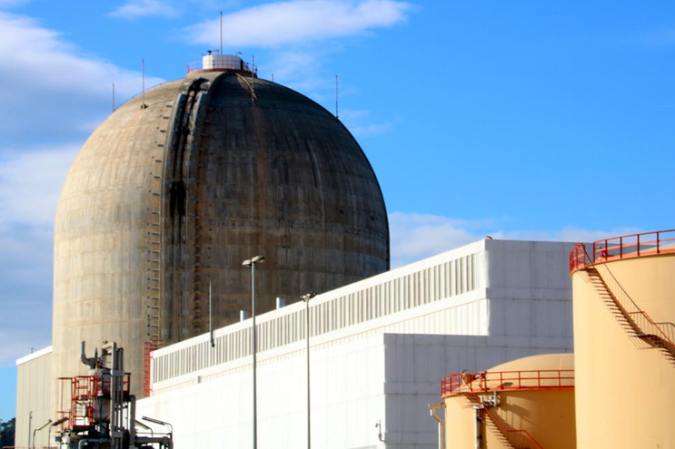

Su misión principal es aislar y proteger el exterior de la emisión de la radiación derivada del funcionamiento del reactor
o consecuencia de un accidente. Su arquitectura está diseñada para soportar, tanto el propio peso, como cargas accidentales como podrían ser

- Terremotos u otros fenómenos naturales
- Escapes de gases radiactivos

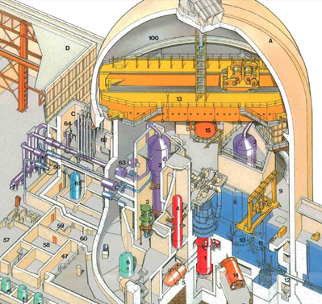

## Preparación del combustible de las centrales

El uranio es un elemento que se encuentra en la naturaleza en forma de minerales, como la **uranitita**.

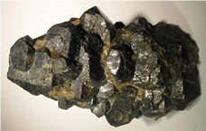

La minería se utiliza para extraer el mineral de uranio de depósitos subterráneos o de superficie.
Se muele y procesa para convertirlo en un concentrado de uranio.

## ¿Dé donde se obtiene el uranio?

De un mismo elemento químico, en la naturaleza puede haber diferentes **isótopos**, que tienen mismo número de protones pero tienen un número neutrones distinto. Al tener composiciones distintas, sus propiedades nucleares también lo son.

Los isótopos se nombran con su símbolo y el número másico (suma de protones y neutrones).

EL U-235

- Es fisionable, puede ser dividido por neutrones lentos,liberando una gran cantidad de energía.
- Ideal para uso en reactores y armas nucleares.

El U-238

- No fisionable directamente
- Contribuye a la producción de energía de forma indirecta, formando plutonio.
- Este plutonio puede ser utilizado para la fisión en reactores reproductores o en algunos reactores convencionales.

## Enriquecimiento del uranio

El uranio natural tiene solo alrededor del 0,7% de U-235, pero para su uso en reactores nucleares, se necesita alrededor del 3-5% de U-235.

Para conseguir esto utilizamos un proceso se llama **enriquecimiento**, con el que aumentar la proporción de uranio-235 en el material.  Esto se realiza por centrifugación. El producto se conoce como **uranio enriquecido**.

Si la concentración de U235 fuese menor a un 4-5%, el reactor tendría dificultades para mantener la reacción en cadena.
Si fuera mucho mayor, podría hacer que el reactor fuese más difícil de controlar. En el caso de las bombas nucleares, el porcentaje de U235 llega a ser del 90%.

## Elaboración de pellets

Una vez que se ha enriquecido el uranio, se convierte en forma de pastillas sólidas.
Las pastillas de polvo de uranio se conocen como pellets de combustible nuclear.
Están hechas de uranio enriquecido en forma de dióxido de uranio (UO₂) y se comprimen y sintetizan en cilindros sólidos

## Formación del combustible

Los **pellets** de uranio se empaquetan en largas **varillas** de combustible, que son tubos delgados de aleaciones metálicas resistentes al calor y la corrosión (generalmente de aleaciones de zirconio).
Estas varillas se ensamblan formando un conjunto de combustible, también conocido como **elemento combustible**.

## Fabricación del elemento combustible

Varios conjuntos de estos elementos combustibles se introducen en la **vasija del reactor** nuclear.

Estos elementos se insertan y se extraen cuando se hacen operaciones de recarga de combustible.

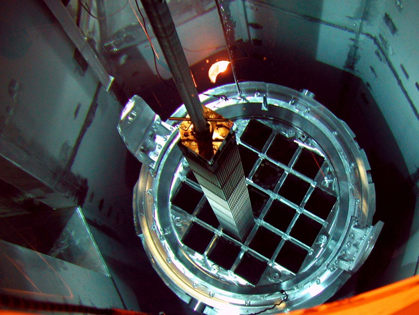

## Transporte y carga

El combustible nuclear ensamblado se transporta con seguridad a la central nuclear.
En la planta de energía, las varillas de combustible se cargan en el núcleo del reactor, donde se llevarán a cabo las reacciones nucleares para producir energía.

## Moderador

Para controlar la reacción, se introduce en el reactor un **moderador** que “enfría” la reacción (absorbe los neutrones en exceso). Este moderador puede ser:

- Agua ligera (75% de los reactores)
- Agua pesada (20%). El agua pesada es una forma especial de agua que contiene isótopos de oxígeno e hidrógeno pesados. Esta forma es especialmente rica en el isótopo de hidrógeno llamado deuterio, que es una forma de hidrógeno con un neutrón adicional.
- Grafito (5%)

## Barras de control

En la parte superior de la vasija se encuentran las barras de control (Control rods)

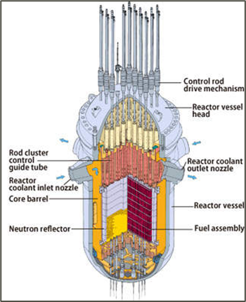

En un reactor nuclear son componentes esenciales que controlan la reacción de fisión al absorber neutrones.

Al introducir o retirar las barras de control, se puede regular la velocidad de la reacción y, por tanto, la energía eléctrica generada.

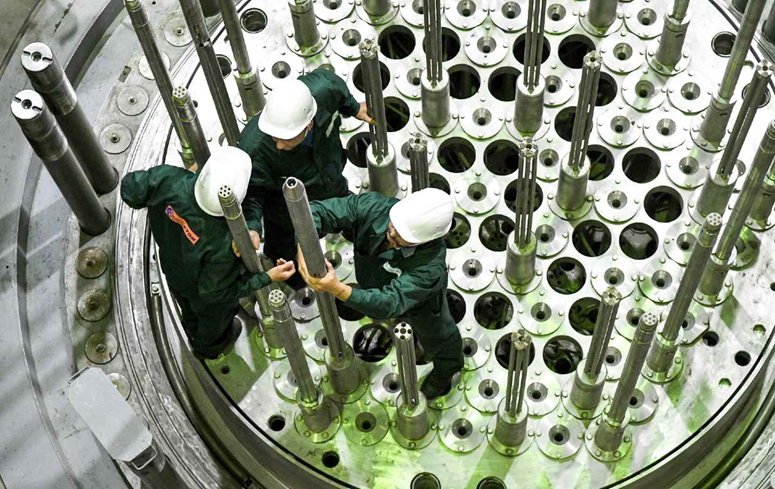

## Armamento nuclear

Durante la Segunda Guerra Mundial, Estados Unidos lanzó bombas atómicas sobre las ciudades japonesas de Hiroshima y Nagasaki (1945).
Estas bombas, utilizaban la fisión nuclear de uranio y plutonio, respectivamente.
La enorme energía liberada al dividir átomos produjo explosiones devastadoras, matando a cientos de miles de personas y marcando el fin de la guerra.

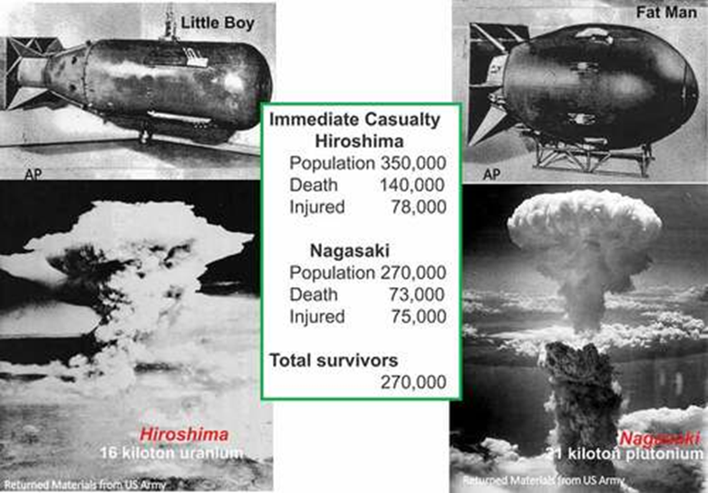

La estructura interna de una bomba atómica está compuesta por una cápsula de uranio o plutonio con un núcleo de uranio enriquecido, una caja de explosivos, una cápsula de iniciación y una batería. La cápsula de uranio o plutonio contiene el material fisionable que es la fuente de energía de la bomba. La caja de explosivos se utiliza para comprimir el material fisionable y aumentar su temperatura y presión para iniciar la reacción nuclear. La cápsula de iniciación contiene una mezcla de combustible y oxígeno para asegurar la reacción nuclear. La batería alimenta el circuito eléctrico para activar la cápsula de iniciación.

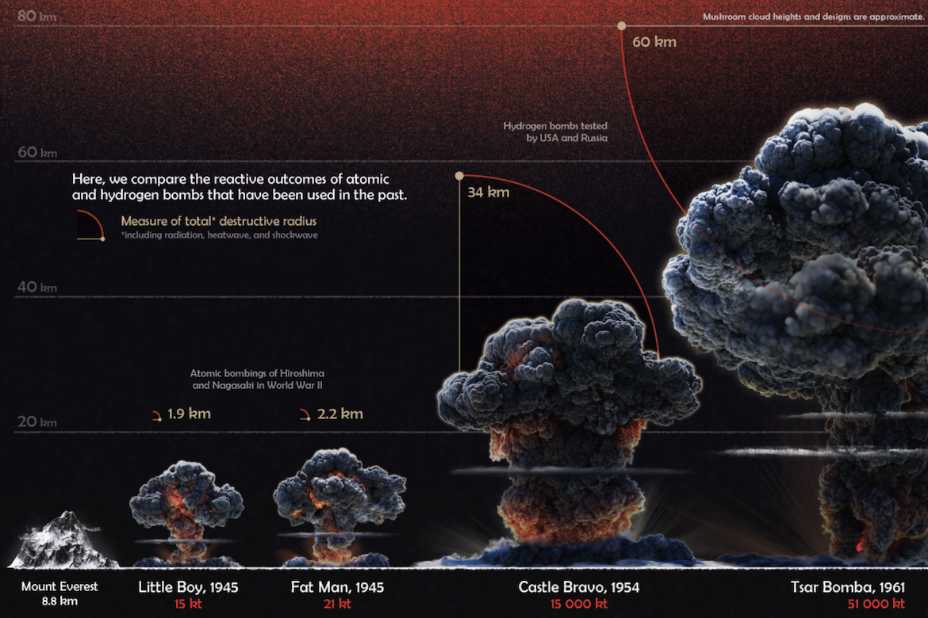

Tras los eventos de Hiroshima y Nagasaki, se comprendió mejor la fisión nuclear. Sin embargo, en lugar de usar este poder para armas, se empezó a investigar su uso con fines pacíficos, como la generación de electricidad.

## Tratado sobre la No Proliferación de las Armas Nucleares (TNP)

Tratado internacional que busca evitar la proliferación de armas nucleares entró en vigor en 1970 y ha sido ratificado por 191 países.

El TNP se divide en tres pilares:

- Prevenir la propagación de **armas nucleares**.
- Promover la cooperación en el **uso pacífico** de la energía nuclear
- Impulsar el **desarme nuclear** y el desarme general y completo

## Primera producción de electricidad con energía nuclear

La primera vez que se produjo electricidad en un reactor nuclear fue el 20 de diciembre de **1951** en la estación experimental de **Arco, en Idaho (EEUU)**

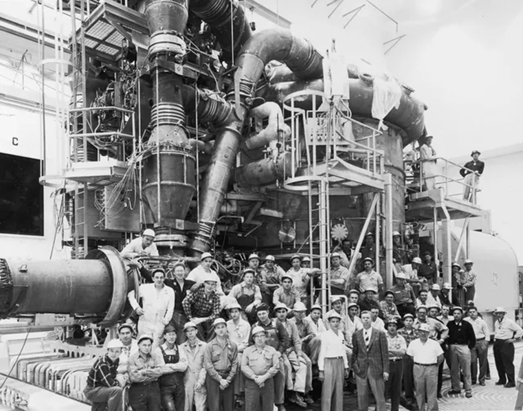

## Primera central

El 27 de junio de 1954 comenzó a funcionar la primera central nuclear del mundo en Obnisnks (Rusia).

A finales de 2023, en el mundo existían **412 reactores** nucleares en operación, de los que 100, están en la Unión Europea.

A raíz de los accidentes nucleares de los años 70 y 80, el ritmo de construcción de nuevas centrales descendió.

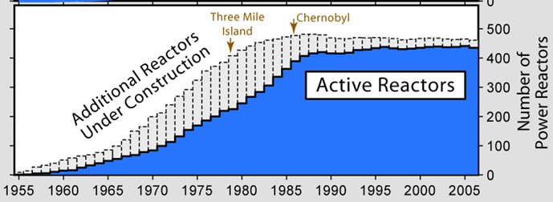

## La primera central nuclear de España

La primera central nuclear en España fue la **Central Nuclear José Cabrera**, comúnmente conocida como Zorita. Comenzó a operar el 13 de agosto de 1968. La planta estuvo operativa **hasta el 30 de abril de 2006**.  Fue la primera instalación de este tipo en el país y marcó el inicio de la energía nuclear en España.

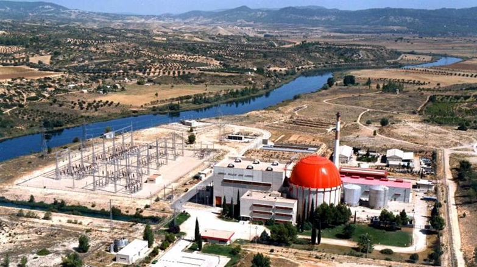

## Centrales nucleares de España

En España se encuentran en funcionamiento 5 centrales nucleares, 2 de las cuales disponen de 2 reactores cada una (Almaraz y Ascó), por lo que suman 7 reactores de agua ligera, con una potencia total instalada de 7.398,7 MWe.

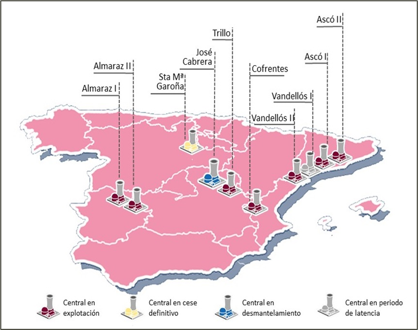

Las centrales nucleares de Santa María de Garoña, Jose Cabrera y Vandellós I se encuentran en desmantelamiento.

## Ventajas y desventajas del uso de energía nuclear

Ventajas de la energía nuclear:

- Es una fuente de energía limpia y eficiente.
- No emite gases de efecto invernadero.
- Puede utilizarse para generar grandes cantidades de electricidad.

Contras:

- Puede ser una fuente de energía peligrosa.
- Los residuos nucleares son radiactivos y requieren un almacenamiento seguro.
- El coste de la construcción y el funcionamiento de las centrales nucleares es elevado.
- Existe la preocupación por la proliferación nuclear y el uso de material nuclear en armas.

## Gestión de residuos

Las centrales nucleares requieren un **mantenimiento** regular y una **gestión segura de los residuos**.

Cada 18 meses, se detiene la operación de una central nuclear para sustituir un tercio del combustible nuclear.
Sustitución del Combustible.

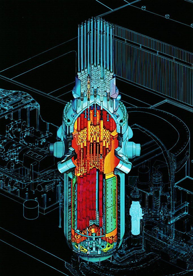

El proceso implica extraer 60 elementos de combustible nuclear, cada uno con dimensiones de 20 cm x 20 cm x 4 metros.

## Almacenamiento Temporal

El combustible gastado se almacena en piscinas profundas, generalmente ubicadas fuera del edificio de contención del reactor, durante al menos 5 años.

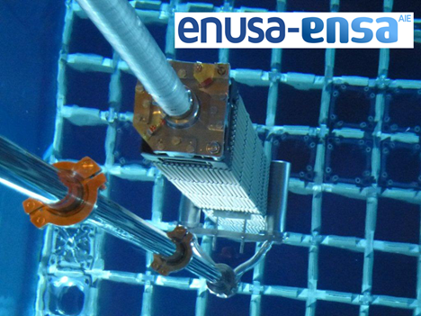

El agua en estas piscinas actúa como blindaje, reduciendo la dosis radiactiva a la mitad cada 7 cm.

Debido al aumento del combustible gastado, se están implementando métodos de almacenamiento a largo plazo.

## Almacenamiento Geológico Profundo

El combustible gastado se coloca en contenedores de acero inoxidable con blindaje de plomo, cada uno con capacidad para 35 elementos.
Estos contenedores se almacenan en una instalación subterránea a 500 metros de profundidad en una formación geológicamente estable.

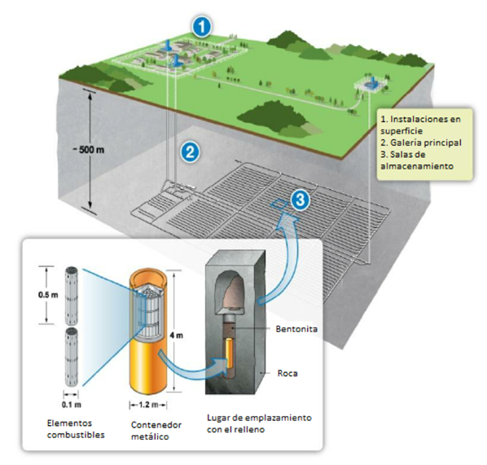

**Finlandia** está construyendo actualmente una instalación de este tipo.
Este método ofrece seguridad a largo plazo, ya que el combustible no puede explotar, fundirse ni disolverse en agua.

## Reciclaje

El reciclaje de residuos nucleares es un método experimental que permite reutilizar el material.
Rusia y China operan reactores que utilizan combustible reprocesado, generando hasta el 80% de la potencia de un reactor convencional.○
Esta tecnología tiene el potencial de utilizar hasta el 95% del combustible nuclear, reduciendo significativamente los residuos.

## Propulsión naval

Los submarinos y buques de guerra nucleares están equipados con reactores nucleares que funcionan utilizando la fisión nuclear, similar al proceso en una central nuclear.
Estos reactores producen calor directamente, que se utiliza para impulsar una turbina conectada a una hélice.
La propulsión nuclear naval es una tecnología avanzada que se utiliza proporcionarles un mayor alcance, velocidad y capacidad de operación en silencio.

## Medicina

En diagnóstico, se emplea en técnicas como la **Tomografía** por Emisión de Positrones (PET) y gammagrafías, utilizando trazadores radiactivos.

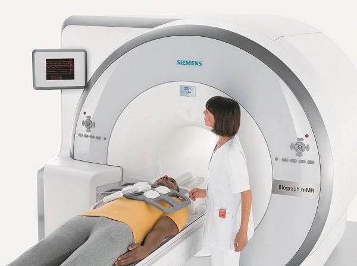

En el tratamiento, se utiliza en radioterapia para dañar células cancerosas y en terapia con yodo radiactivo para tratar enfermedades tiroideas.

## Central nuclear de Lemóniz

La central nuclear de Lemóniz, ubicada en el País Vasco, España, fue un proyecto ambicioso de la dictadura de Franco para independizar el consumo energético de la región. A pesar de la fuerte oposición ciudadana, liderada por grupos ecologistas y antinucleares, la construcción de la central avanzó hasta su finalización en 1982. Sin embargo, la presión social, las acciones terroristas de ETA y la posterior moratoria nuclear impidieron su puesta en marcha.

- Video Marc Vilas: https://www.youtube.com/watch?v=1yQk3Qg61sM
- Vídeo JF Calero: https://www.youtube.com/watch?v=UyaL9KK0C0E

## Fusión nuclear

La fusión nuclear es el proceso en el que núcleos ligeros, como los del hidrógeno (isótopos deuterio y tritio), se combinan para formar núcleos más pesados, como el helio, liberando enormes cantidades de energía. Este fenómeno ocurre a **temperaturas extremadamente altas**, donde la materia se encuentra en estado de **plasma**, un gas ionizado.

Para que ocurra la fusión, los núcleos de los átomos deben superar la repulsión electrostática entre ellos, lo cual requiere temperaturas extremadamente altas, del orden de **100 a 150 millones de grados Celsius**.

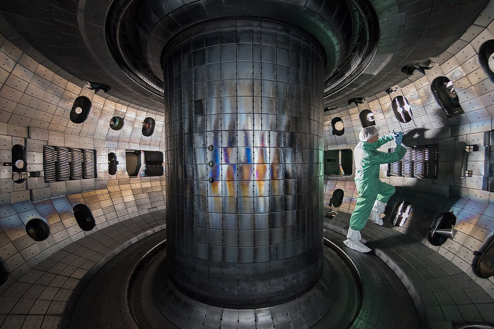

Para controlarla, se emplea el **confinamiento magnético** (en reactores como el tokamak) o **inercial** (láseres).  El plasma se mantiene a temperaturas extremadamente altas utilizando campos magnéticos muy fuertes. Estos campos evitan que el plasma toque las paredes del reactor, lo que lo enfriaría rápidamente. Los imanes superconductores generan estos campos.

Hoy en día, la fusión aún no es comercialmente viable, pero tiene el potencial de proporcionar energía limpia y casi ilimitada si se resuelven los desafíos tecnológicos del confinamiento estable y el mantenimiento del plasma.

El Sol es una gigantesca esfera de plasma que genera su energía a través de la fusión nuclear, un proceso en el que los núcleos de hidrógeno se combinan bajo condiciones extremas de temperatura y presión para formar helio.
Durante esta fusión, una pequeña cantidad de masa se convierte en una enorme cantidad de energía
Esta energía es la que emite el Sol en forma de luz y calor, permitiendo que la vida prospere en la Tierra y manteniendo el equilibrio en el sistema solar.

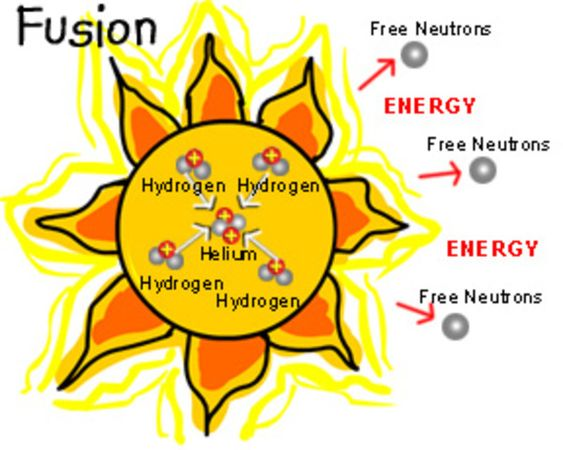

## Simuladores

- https://nuclearinst.com/nuclear-reactor-simulator
- https://phet.colorado.edu/sims/cheerpj/nuclear-physics/latest/nuclear-physics.html?simulation=nuclear-fission&locale=es
- https://dalton-nrs.manchester.ac.uk/#
