- [Energía solar](#energía-solar)
  - [La energía del sol](#la-energía-del-sol)
- [Energía solar térmica](#energía-solar-térmica)
  - [Elementos de una instalación](#elementos-de-una-instalación)
  - [Estructura del captador](#estructura-del-captador)
- [Energía solar fotovoltaica](#energía-solar-fotovoltaica)
  - [La luz como partículas](#la-luz-como-partículas)
  - [¿Cómo se crea electricidad a partir de la luz?](#cómo-se-crea-electricidad-a-partir-de-la-luz)
  - [Semiconductores](#semiconductores)
  - [Celdas solares](#celdas-solares)
  - [Potencia](#potencia)
  - [Paneles](#paneles)
  - [Tipos de células](#tipos-de-células)
  - [Tipos de sistemas](#tipos-de-sistemas)
  - [Cálculos](#cálculos)

# Energía solar

## La energía del sol

El sol es la principal fuente de energía de la tierra. La energía solar nos permite calentarnos, permite a las plantas desarrollar la fotosíntesis, entre otros.

La energía que llega del Sol en forma de radiaciones electromagnéticas.  La luz está formada por **ondas electromagnéticas** como, las microondas y las ondas de radio, que se propagan a través del espacio.

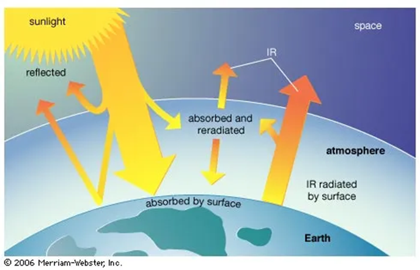

España, por su elevado número de horas de Sol al año, tiene un gran potencial de aprovechamiento de esta energía.

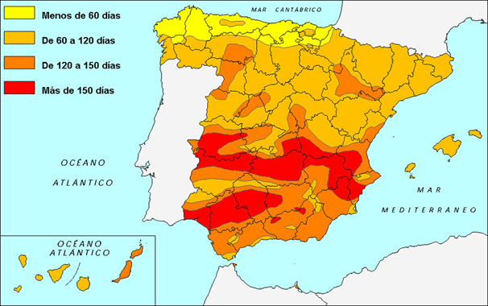

# Energía solar térmica

Consiste en utilizar la energía solar para calentar un fluido, generalmente agua. El proceso tiene lugar en aparatos denominados colectores.

La energía obtenida se utiliza fundamentalmente para obtener agua caliente y calefacción.

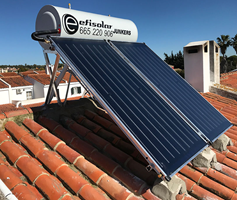

En el caso de los hornos solares, se obtienen altas temperaturas que se utilizan también para generar energía eléctrica.

## Elementos de una instalación

Una instalación solar térmica consiste, básicamente, en:

- Un **captador** solar (también llamado panel solar) que capta la radiación solar
- Un **depósito acumulador** que almacena la energía térmica obtenida
- Unos **elementos auxiliares** (tuberías, bombas, válvulas, etc.) que se encargan de la distribución del calor hasta los sitios de consumo.

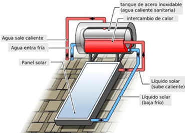

## Estructura del captador

Plano de cubierta acristalada es uno de los tipos más populares y utilizados. Los elementos que lo forman son: cubierta transparente, tubos de circulación, superficie absorbente y material aislante.

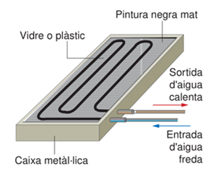

Su funcionamiento se basa en el **efecto invernadero**. La radiación solar que atraviesa la cubierta transparente y captada por la superficie absorbente, y es transmitida en forma de **calor** en el fluido que circula.

El vidrio o plástico de la cubierta impiden que la radiación salga al exterior, lo que provoca el **aumento de la temperatura en el interior** de la caj.

# Energía solar fotovoltaica

## La luz como partículas

Imagina que estas ondas electromagnéticas, como la luz, no fluyen simplemente de forma contínua, sino que se comportan también como partículas.

La luz se compone de pequeños paquetes de energía llamados **fotones**, que son partículas subatómicas sin masa.
Los fotones llevan consigo la energía de las ondas electromagnéticas.

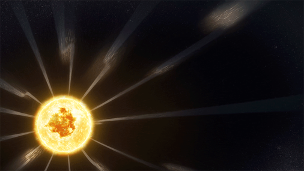

Cada **fotón** tiene una cantidad específica de **energía**, que depende de la frecuencia de la onda electromagnética a la que pertenece. Cuanto más alta es la frecuencia, más energía tiene cada fotón

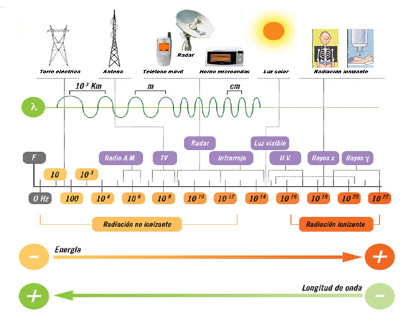

## ¿Cómo se crea electricidad a partir de la luz?

Los **fotones** de la luz interactúan con los **electrones** en los átomos.
Cuando un fotón con la cantidad correcta de energía golpea un átomo, puede hacer que un electrón salte a un **nivel de energía superior**. Esto es lo que sucede cuando vemos la absorción de luz por un átomo.

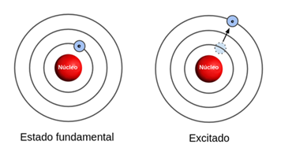

Si este electrón baja de nivel de energía, emite un fotón. Esto es lo que causa la **emisión de luz**. Este efecto es el que presenciamos cuando vemos luz reflejada en un objeto que llega a través de nuestros ojos.

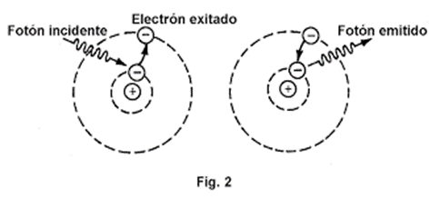

Si la energía es suficientemente alta, el fotón de luz que choca contra un átomo de silicio puede hacer que uno de los electrones tenga suficiente energía para deshacerse de la atracción del núcleo del átomo.

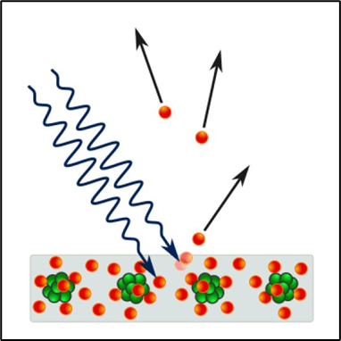

Este electrón se convierte en un **electrón libre** y se puede mover entre los átomos del semiconductor.

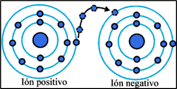

Este fenómeno de movimiento de electrones a través de los átomos es lo que conocemos como electricidad.

## Semiconductores

Los **semiconductores** son materiales que son capaces de conducir la electricidad en ciertas condiciones.

Los más habituales se fabrican a partir de **silicio**. Es el 2º material más común en la tierra. Con él fabricamos los materiales semiconductores.

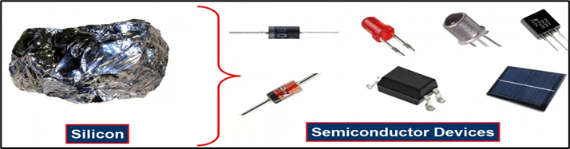

Con estos semiconductores se fabrican los **circuitos electrónicos de los chips**.

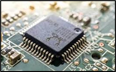

Los tipos de semiconductores que usan mayoritariamente en electrónica se obtienen del **silicio (Si)**. A él le debe el nombre **Silicon valley**, una zona de California en la que se concentran las mayores empresas tecnológicas de Estados Unidos.

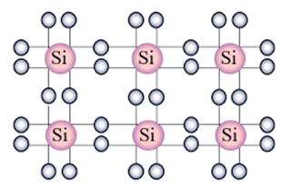

El silicio tiene 4 electrones en la capa de valencia

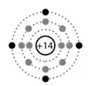

Los átomos de Si se combinan mediante enlaces covalentes (compartiendo electrones), por lo que cada átomo de Silicio se combina con otros 4 átomos del mismo elemento.

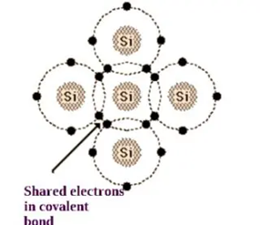

Para fabricar los semiconductores, con los que haremos componentes como diodos o transistores, vamos a crear dos tipos de materiales diferentes que combinaremos más adelante: el semiconductor tipo N y el semiconductor tipo P.

**Semiconductor tipo N**

Al primero lo **doparemos** agregando impurezas (átomos de otros elementos), como por ejemplo  **fósforo** que tiene 5 electrones en su última capa.

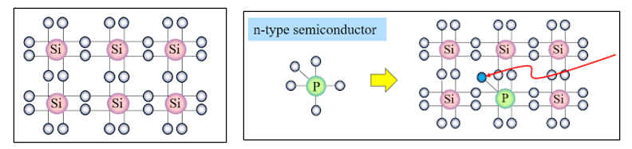

De este modo sobrará un electrón por enlace y por tanto el resultado tendrá más electrones de los que tendría si únicamente estuviera formado por silicio., formando semiconductor **tipo N** (negativo).

**Semiconductor tipo P**

Doparemos al segundo tipo con átomos de valencia 3, como por ejemplo  boro. Estos elementos tienen 3 electrones en su última capa

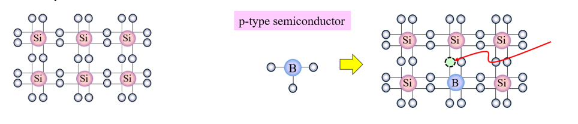

De este modo faltará un electrón por enlace (eso se llama un hueco) y por tanto el resultado tendrá menos electrones de lo normal, formando semiconductor **tipo P** (positivo)

Ahora que tenemos los materiales tipo P y tipo N, los juntaremos en una capa para crear dispositivos semiconductores.

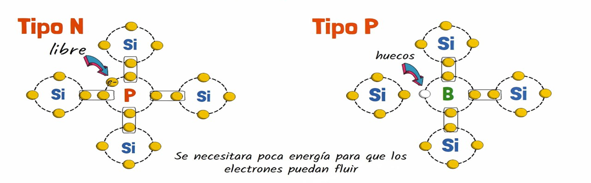

 La combinación de regiones tipo P y tipo N permite la creación de **transistores, diodos** y otros componentes electrónicos. Para obtener **diodos**, juntaremos uno tipo P con uno tipo N.

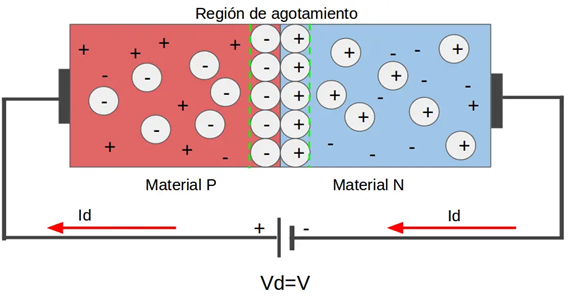

Combinando semiconductores N, otro P y otro N obtenemos un **transistor**.

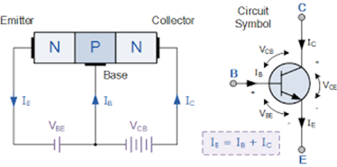

Al juntar una capa N y una P obtenemos un semiconductor N-P
Los electrones sólo se mueven al aplicar corriente en un sentido

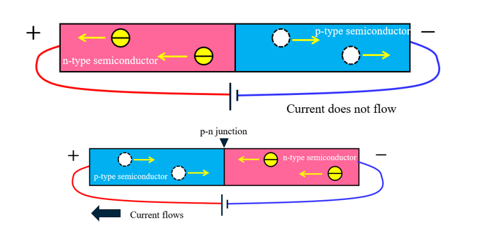

Una de las aplicaciones de los semiconductores de silicio que hemos visto son las **células solares**. Son el componente fundamental de los **paneles fotovoltaicos**.

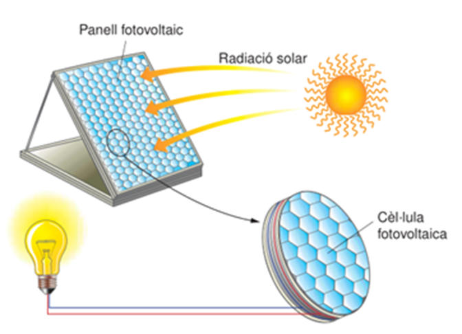

Resumen de la fabricación:

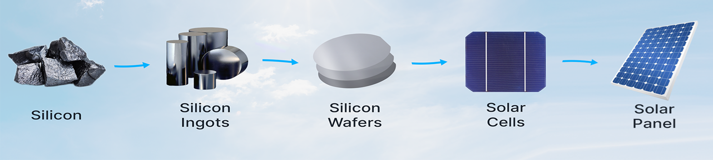

## Celdas solares

La capa de silicio tipo n tiene exceso de electrones, mientras que la capa tipo p tiene falta de electrones.
Unión P-N.

Al poner en contacto estas dos capas se forma una unión p-n, un campo eléctrico que induce a los electrones libres a moverse hacia la capa n.

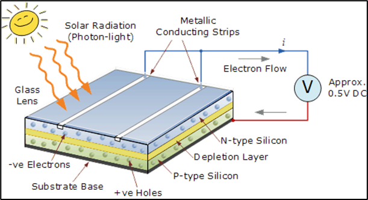

Al iluminar la célula, se acumulan cargas negativas y en la capa p cargas positivas.

Si conectamos un cable entre las dos capas, los electrones que están en exceso en la capa n se mueven a la capa p y generan corriente eléctrica.

## Potencia

La potencia es la cantidad de energía máxima que pueden proporcionar las placas por unidad de tiempo. Se mide en vatios (W).

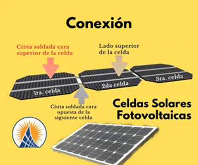

Una instalación doméstica suele tener entre 3 y 5 Kw. Una célula individual normal tiene una superficie de 75 cm2 y una potencia aproximada de 1 W para una radiación de 1000 W/m2.
Suele suministrar una tensión de 0,5 V y una corriente continua de unos 2 A.

## Paneles

Para obtener potencias superiores, se unen un determinado número de células, formando un panel fotovoltaico.
Uniendo entre 24 y 48 células, podemos producir corriente continua de 12 o 24 V

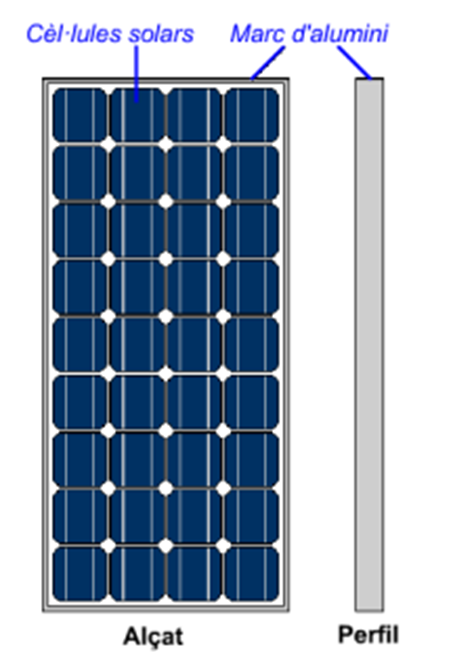

El voltaje obtenido es de corriente contínua (CC)

## Tipos de células

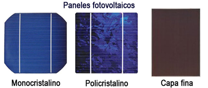

### Silicio Monocristalino

Se forma un único cristal gigante a partir del silicio fundido. Todas las estructuras atómicas del material están alineadas en la misma dirección
Da como resultado una mayor eficiencia en la conversión de energía solar en electricidad.
También son más caras.

### Silicio Policristalino

Se produce a partir de silicio fundido que se enfría más rápidamente, lo que da como resultado la formación de múltiples cristales.
Las estructuras atómicas en el material están dispuestas en diferentes direcciones.
Son menos eficientes que las de silicio monocristalino, son más económicas de fabricar debido a un proceso más simple.

### Silicio Amorfo

Conocido como silicio no cristalino, tiene una estructura atómica desordenada en lugar de una estructura cristalina.
Esto lo hace menos eficiente en comparación con el silicio cristalino.
Es más flexible y ligero, lo que lo hace adecuado para dispositivos solares portátiles o integrados en materiales flexibles.

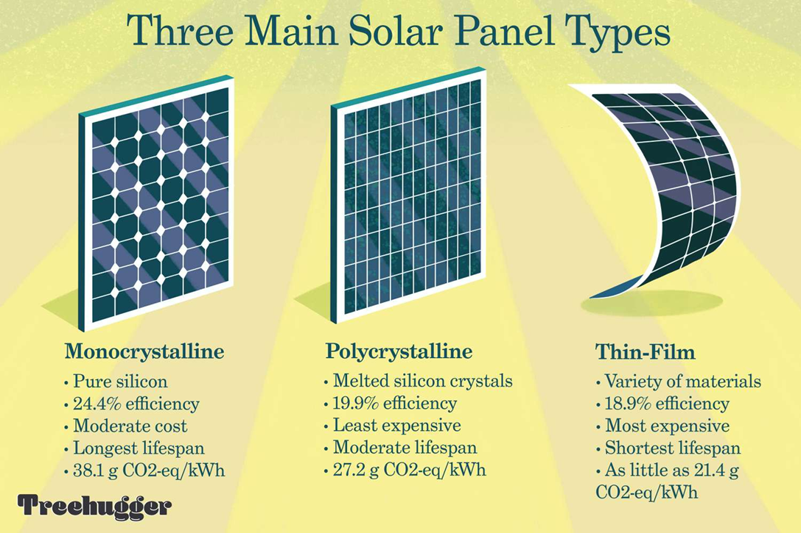

## Tipos de sistemas

### Sistemas aislados

Tienen total autonomía energética, útil cuando no es posible o conveniente hacer llegar la red eléctrica.
La energía creada se utiliza para alimentar directamente a los receptores

La sobrante se pierde o se almacena en baterías

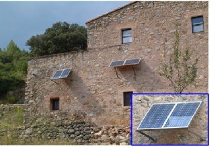

### Sistemas conectados a la red

La energía producida por los paneles solares se inyecta a la red eléctrica (se vende).  En algunos casos se puede también consumir electricidad de la red de electricidad cuando no es suficiente.

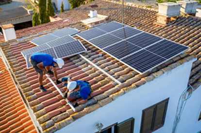

### Instalación doméstica

Para disponer de energía fotovoltaica en nuestra casa necesitamos realizar una instalación, consistente en:

Placas o paneles solares, que captarán la energía del sol y generarán corriente eléctrica

Otros dispositivos que transformarán la energía, nos permitirá regularla o almacenarla

Además de las células fotovoltaicas, forman parte de una instalación solar fotovoltaica, como componentes habituales.

**Batería o acumulador**

Se utiliza en instalaciones autónomas no conectadas a la red eléctrica para almacenar energía eléctrica.

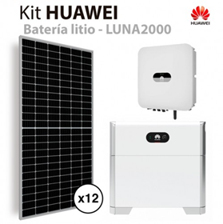

**Inversor**

El inversor tiene la función de transformar la corriente continua generada por la instalación solar fotovoltaica en corriente alterna, para así poder utilizar aparatos de consumo más habituales, de 220 V en corriente alterna, o bien para poder entregar la energía a la red eléctrica.

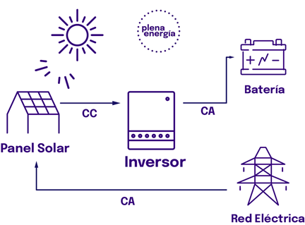

Instalación doméstica

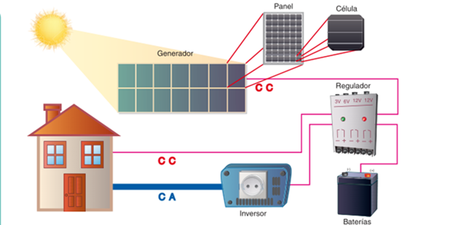

## Cálculos

Antes de comprar los equipos y realizar la instalación, necesitamos calcular cuales son las necesidades energéticas que tenemos.

Voltaje e intensidad
Las principales magnitudes con las que podemos medir la electricidad son el voltaje y la intensidad.
El voltaje (V) es el responsable de que los electrones se muevan a través de un circuito.
La corriente (I) es el movimiento de electrones a través de dicho circuito.

Potencia
Mucho voltaje o mucha corriente no indican gran cosa. Lo importante es la potencia.
La potencia eléctrica es el producto del voltaje por la intensidad.
Unidades
En instalaciones domésticas se mide en vatios (w) y kilovatios (w).
En instalaciones más grandes hablaríamos de megavatios y gigavatios (MW y GW)

Una única celda como esta nos podría dar 12*6 = 72 W

Una casa promedio puede necesitar una potencia de 3000W.

¿Qué podemos hacer para conseguir más potencia?

Módulos en serie
Si conectamos módulos en serie, los voltajes se suman y la corriente es la misma.
Juntando 3 módulos de 12 voltios hemos conseguido un voltaje de 36V

Módulos en serie y paralelo
Si los conectamos en paralelo, las corrientes se suman y el voltaje es el mismo.
12+12+12 = 36 V
6A
36 V
6A
36 V
6A
36 V
18 A

Ejercicio
Diseñar un campo solar de 60 voltios y 30 amperios
Este panel nos daría una potencia de
P = V * I
P = 60 V * 30 A = 1.800 W

Enlaces
Extrayendo SILICIO de unas rocas | Colección de elementos químicos
