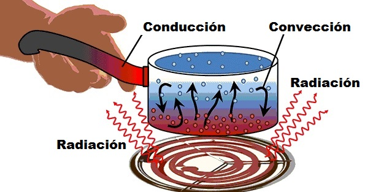
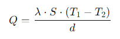
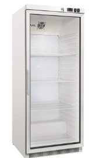
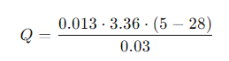
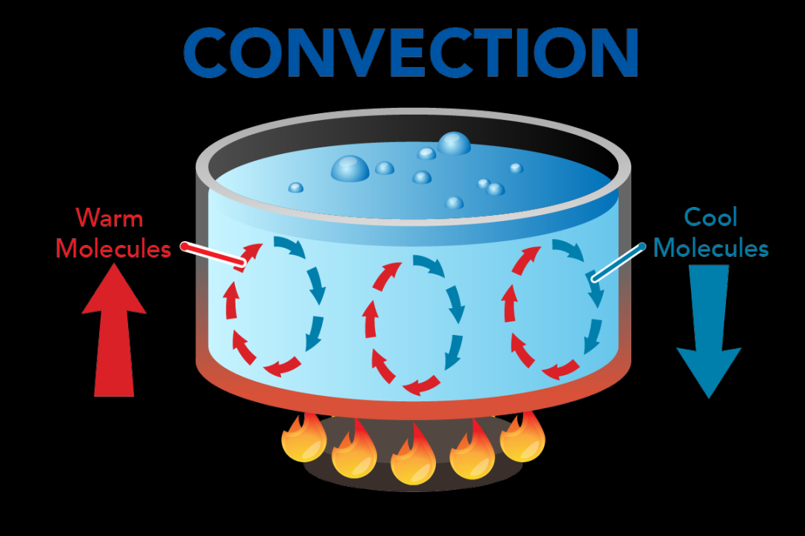
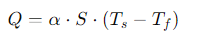

La temperatura, el calor, y la energía térmica son conceptos fundamentales en la física, especialmente cuando se estudian procesos de transferencia de calor. Aquí te dejo un desglose de cada concepto:

Temperatura:

Es una medida de la energía cinética promedio de las partículas en una sustancia. No es una medida directa de energía, sino una manifestación de cuán rápido se mueven las partículas en un objeto. Se mide en unidades como grados Celsius (°C), Kelvin (K) o Fahrenheit (°F).

Unidades:

- **Grado Celsius (°C).** Para establecer una base de medida de la temperatura Anders Celsius utilizó (en 1742) los puntos de fusión y ebullición del agua. Celsius dividió el intervalo de temperatura que existe entre estos dos puntos en 100 partes iguales a las que llamó grados centígrados °C
- **Grado Fahrenheit (°F).** Toma divisiones entre el punto de congelación de una disolución de cloruro amónico (a la que le asigna valor cero) y la temperatura normal corporal humana (a la que le asigna valor 100).
Con la nueva definición de kelvin se mantiene un único punto fijo en la escala Kelvin, el cero absoluto.
- **Kelvin (K)** El kelvin es la unidad de temperatura termodinámica, una de las unidades básicas del Sistema Internacional de Unidades.

La **energía térmica** es la energía **interna** de un sistema debida al movimiento de sus partículas. Cuanto mayor sea la energía térmica, mayor será la temperatura del sistema. La energía térmica puede cambiar como resultado de la transferencia de calor.

El **calor** es una forma de energía que se transfiere entre cuerpos o sistemas debido a una **diferencia de temperatura**. El calor siempre fluye de la región de mayor temperatura a la de menor temperatura hasta que ambas alcanzan un equilibrio térmico.

## Transferencia de calor

Es el proceso por el cual el calor se transfiere de un objeto a otro. Existen tres métodos principales de transferencia de calor:

- Transferencia de calor por **conducción**
- Transferencia de calor por **convección**
- Transferencia de calor por **radiación**

### Conducción

Es la transferencia de calor a través de un material sólido. Ocurre cuando las moléculas cercanas a la fuente de calor se excitan y transfieren su energía cinética a las moléculas adyacentes, como en un metal caliente.

Donde:

- Q es la cantidad de calor transferido por conducción
- S es la superficie a través de la cual se transfiere el calor (en metros cuadrados)
- 𝑇1 y 𝑇2 son las temperaturas en los dos extremos del material (en kelvin, K, o grados Celsius, °C).
- d es el espesor del material (en metros, m).
- La conductividad térmica **λ**, se puede expresar en kcal/m·°C.

**Ejemplo nevera**

En el caso de una nevera, nos interesa aislar la temperatura exterior de la temperatura ambiente y, al mismo tiempo, ir sacando ese calor interior hacia el exterior de la nevera.

Es por ello que las neveras en sus paredes utilizan **fibra de vidrio**, pues es un material con muy bajo coeficiente de conductividad, de únicamente **0,013 kcal/mhK**.

Así pues, el calor que tenemos que extraer es el que se introduce desde el exterior, a fin de mantener la temperatura.

- La temperatura exterior T2 es de 28ºC
- La temperatura interior T1 es de 5ºC

Por ello hay una transferencia de calor del exterior al interior, que podemos calcular:

La superficie total de la nevera con dimensiones de 55 cm de ancho, 55 cm de fondo y 125 cm de alto es aproximadamente **3.36 m²**.

Es decir, deberemos extraer **33,49 kcal** por hora para mantener la temperatura interior de 5ºC

### Convección

Es el proceso de transferencia de calor en líquidos y gases:

- Parte del líquido al
- Las partículas calientes se mueven de una región a otra, transportando calor.
- Un ejemplo es el movimiento del aire caliente en una habitación o el agua hirviendo en una olla.

El líquido que está abajo, en contacto con la fuente de calor, al calentarse disminuye su densidad.
Al volverse menos denso, sube a la superficie.

En cambio, el líquido de la superficie, cede calor y se enfría. Al estar más frio, es menos denso, por lo que se mueve a la parte inferior.
Esto crea una corriente de agua.

La cantidad de calor Q transferido por convección está dada por la Ley de Enfriamiento de Newton:

### Radiación

Es la transferencia de calor en forma de ondas electromagnéticas, como la luz o los rayos **infrarrojos**.
A diferencia de la conducción y la convección, **no necesita un medio material** como el aire para propagarse, lo que permite,
por ejemplo, que el calor del sol llegue a la Tierra a través del vacío del espacio.

