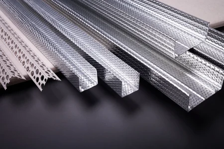
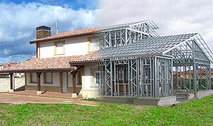

# Perfils

Els perfils són un recurs molt utilitzat per a la construcció d'estructures. Consisteixen en barres de diferents seccions, com bigues i columnes massisses. Aquests elements, però, són molt pesats i, per tant, serien molt cars. Si no els utilitzéssim, no podríem fabricar grans estructures.

Per això, els perfils són una opció més lleugera i econòmica. Els perfils es poden fabricar en una àmplia gamma de materials, com ara alumini, acer, fibra de vidre i polietilè. Els perfils es poden fabricar en seccions rectes i es pot fer servir una varietat de connexions per unir els elements entre si. També es pot fabricar una àmplia gamma de formes diferents, com ara arcs, cercles, ovals i formes geomètriques complexes. Els perfils es poden utilitzar per a construir estructures en forma de sostres, tancaments, ponts, edificis i molt més.

