# Transport i distribució de l'energia elèctrica

El transport i la distribució de l’energia elèctrica són components fonamentals del sistema elèctric que permeten que l’energia generada arribi als consumidors finals. A continuació es detallen alguns aspectes importants:

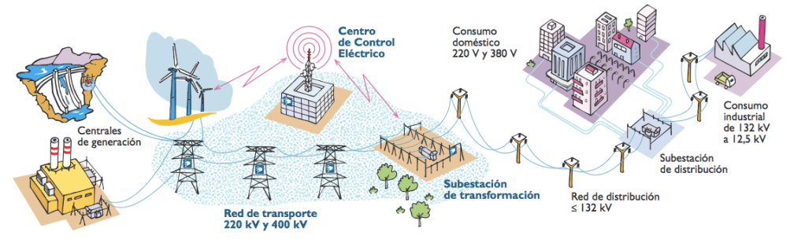

En instalaciones eléctricas, las tensiones se clasifican en baja, media y alta tensión según el voltaje utilizado:

- **Baja Tensión:** Hasta 1 kV, uso doméstico e industrial pequeño.Instalaciones eléctricas en viviendas, edificios, pequeños comercios y talleres.
- **Media Tensión:** De 1 kV a 36 kV (o hasta 72,5 kV), para distribución regional y grandes industrias. Subestaciones de distribución eléctrica, grandes complejos industriales y líneas de distribución que alimentan áreas urbanas o industriales.
- Alta Tensión: Más de 36 kV, para transporte a largas distancias. Líneas de transmisión de energía que conectan centrales eléctricas con redes de distribución.

## 1. Transport de l'energia:

El transport de l'energia elèctrica es fa a través de grans infraestructures, com les línies d'alta tensió, que són capaces de portar l'electricitat a llargues distàncies amb pèrdues mínimes.

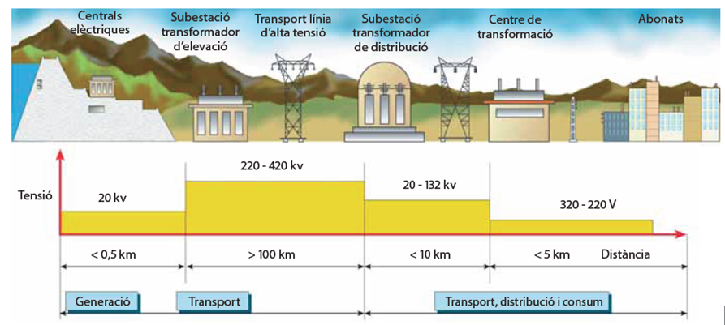

Infraestructures de transport:

Les línies d'alta tensió són utilitzades per transportar l'energia des dels punts de generació fins als centres de distribució o consum. Poden ser línies aèries o subterrànies.

Les torres d'alta tensió: Suporten les línies aèries i garanteixen una separació adequada per motius de seguretat.

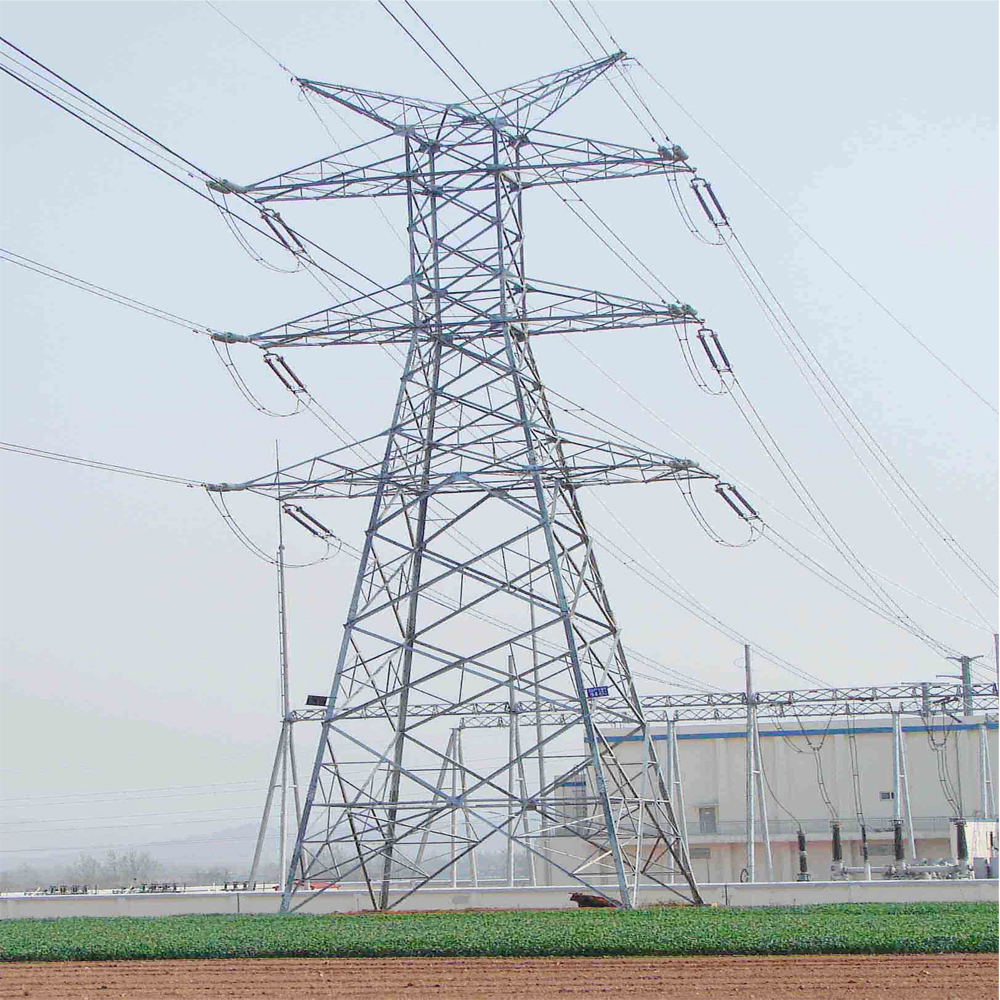

Les **subestacions** són instal·lacions que transformen la tensió de l'electricitat per adaptar-la a les necessitats de la xarxa de transport i distribució.

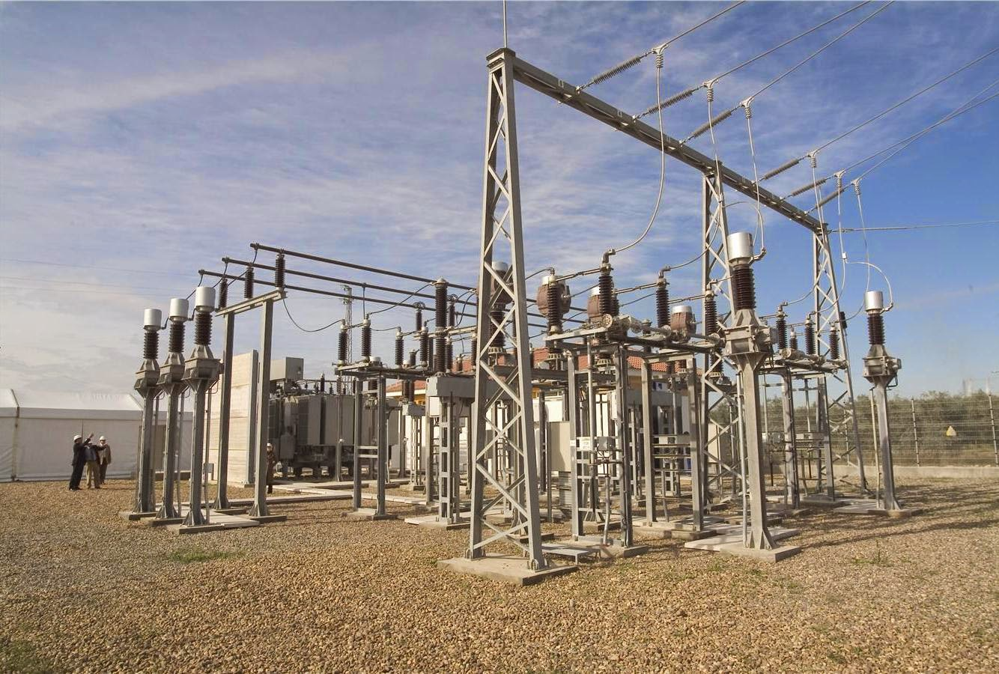

## 2. Xarxa de distribució

La xarxa de distribució és l'encarregada de portar l'energia des de les subestacions fins als usuaris finals, com llars, empreses i indústries.

Infraestructures de distribució:
Línies de mitja i baixa tensió: Distribueixen l'energia a distàncies més curtes. La tensió és reduïda en diferents punts fins a arribar a les necessitats dels consumidors.
Transformadors: Redueixen la tensió de l'electricitat per fer-la compatible amb els dispositius i instal·lacions dels usuaris finals.

### Centres de transformació

Reben l'energia de la xarxa de mitja tensió i la transformen a baixa tensió per al seu ús en la xarxa urbana o rural

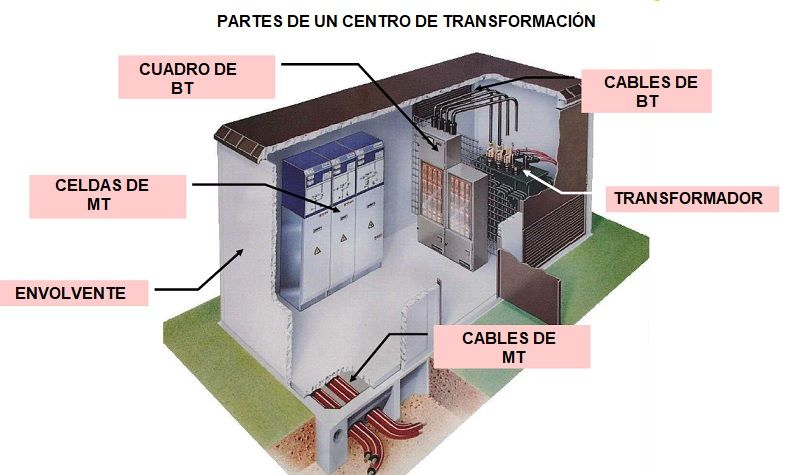

Desde las Subestaciones Eléctricas salen las líneas de distribución en **media tensión** hacia los Centros de Transformación (CT)

En el **centro de transformación** la energía que proviene de la red de media tensión (entre 1 kV y 36 kV) se transforma a baja tensión (230/400 V), que es la adecuada para el uso doméstico e industrial.
Líneas de distribución de baja tensión: Desde el centro de transformación, la energía es enviada a través de cables de baja tensión (230/400 V). Estos cables pueden ser subterráneos o aéreos, según la infraestructura del lugar.

Red de Distribución

Postes o canalizaciones subterráneas: En áreas rurales es común que la distribución sea aérea, utilizando postes y cables aéreos.

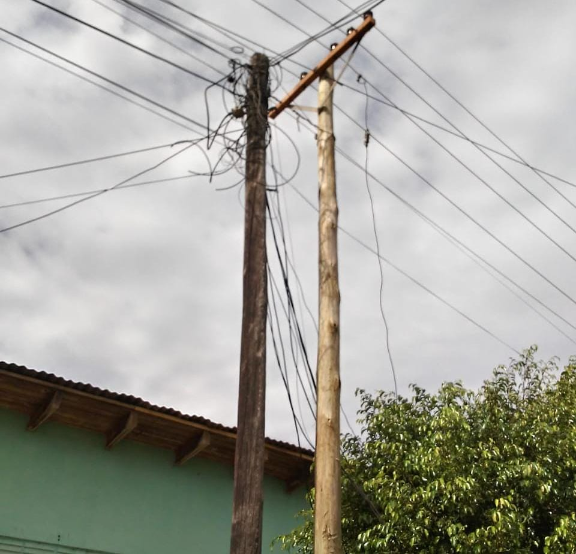

En áreas urbanas, la distribución suele ser subterránea, utilizando canalizaciones (tuberías) por donde circulan los cables eléctricos.

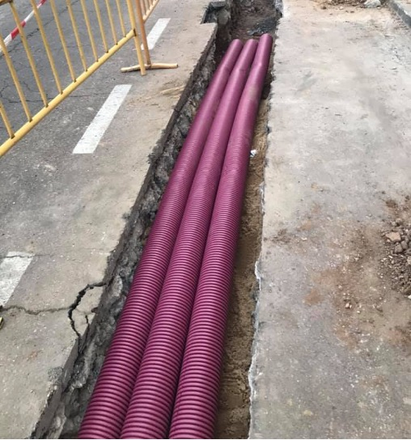

Empalmes y derivaciones: A lo largo del trayecto, se realizan empalmes y derivaciones para conectar varias líneas y abastecer a distintas zonas o edificios.

## Red interior

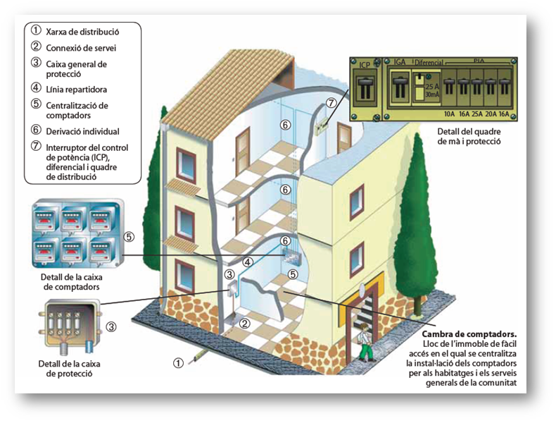

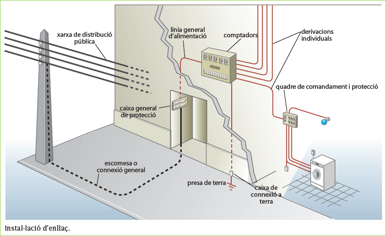

En el interior de las casas existen diferentes elementos, entre la instalación exterior y las viviendas aprticulares, formada por:

- Acometida
- Caja general de protección
- Cuadro de contadores
- Derivaciones individuales

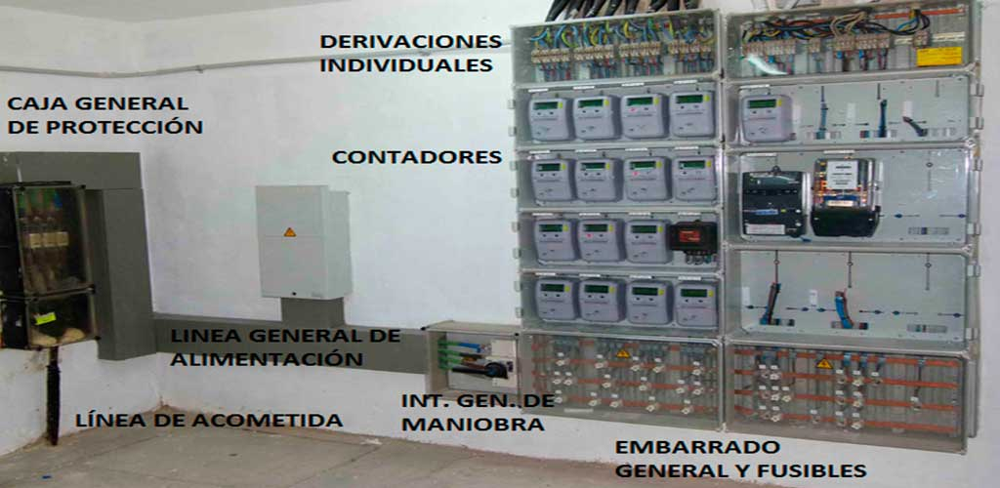

### Acometida

La entrada de la línea eléctrica en los edificios se llama **línea de acometida**.  Es el conjunto de cablesque conecta la red de distribución general con el edificio o vivienda.

Puede ser **aérea** (cables desde un poste) o **subterránea** (desde una caja de registro bajo tierra). La acometida llega hasta la caja general de protección.

### Caja general de protección

La **Caja general de protección (CGP)** es el primer elemento que se encuentra tras la acometida, y su función es **proteger la instalación** de sobrecargas o cortocircuitos. Se coloca en la entrada de los edificios.

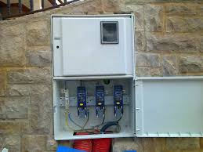

## Cuarto de Contadores

En los edificios colectivos, existe un **cuarto de contadores ** donde se encuentran los contadores eléctricos de cada vivienda. Estos contadores miden el consumo eléctrico individual.

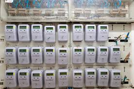

El **contador eléctrico** es el dispositivo encargado de registrar el **consumo de energía**. Hoy en día, los contadores son mayoritariamente digitales, permitiendo la telemedida y gestión remota del consumo.

Definició
Instrument que permet registrar l’energia elèctrica (en kWh) que ha consumit un circuit durant un temps determinat.
Estructura i funcionament
Motor elèctric que fa girar un disc d’alumini.
A major consum, la velocitat augmenta.
Engranatges compten nombre de revolucions
Permet calcular l’energia que ha travessat el motor
I, amb ella, el consum total

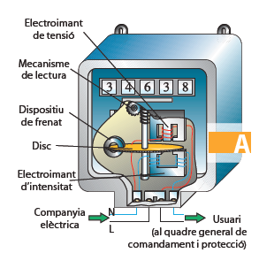

Actualment són digitals, i envien les dades de consum telemàticament.

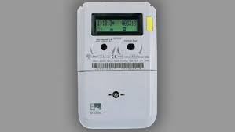

## 6. Instalación Interior

Desde el cuarto de contadores o el cuadro de maniobra, se lleva la electricidad hasta cada vivienda o unidad mediante una **derivación individual**. Esta línea conecta directamente con el cuadro de distribución de la vivienda.

### Cuadro general de maniobra y protección

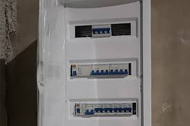

Aquí se encuentran los dispositivos de protección, como diferenciales e interruptores magnetotérmicos, que protegen los circuitos internos de la vivienda. Estos circuitos distribuyen la energía a puntos de consumo como enchufes, iluminación y electrodomésticos.

El cuadro eléctrico recibe la energía a través de la derivación individual y está localizado a la entrada de la vivienda. Está compuesto por:

- 1 Interruptor de Control de Potencia (ICP)
- 1 Interruptor General Automático (IGA)
- 1 Interruptor Diferencial (ID)
- Varios Pequeños Interruptores Automáticos (PIA)

La función principal de estos dispositivos es controlar y proteger tanto la instalación como los equipos, y también garantizar la seguridad de los usuarios ante posibles fallos eléctricos.

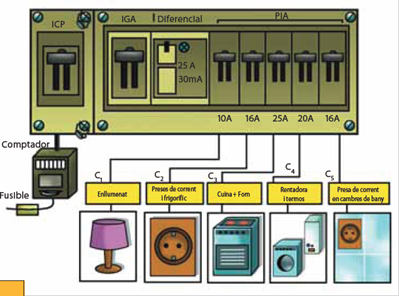

En este ejemplo, el general permite un máximo de:

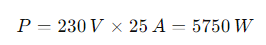

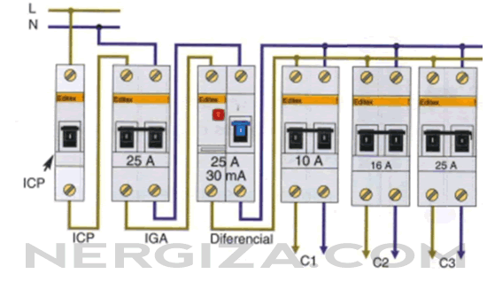

## 7. Consumo Final

Puntos de consumo: Finalmente, la energía llega a los puntos de consumo dentro de la vivienda o edificio (enchufes, lámparas, electrodomésticos, calefacción eléctrica, etc.).

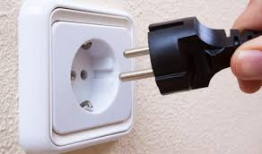

En cada aparato, esta electricidad se transforma en otro tipo de energía.

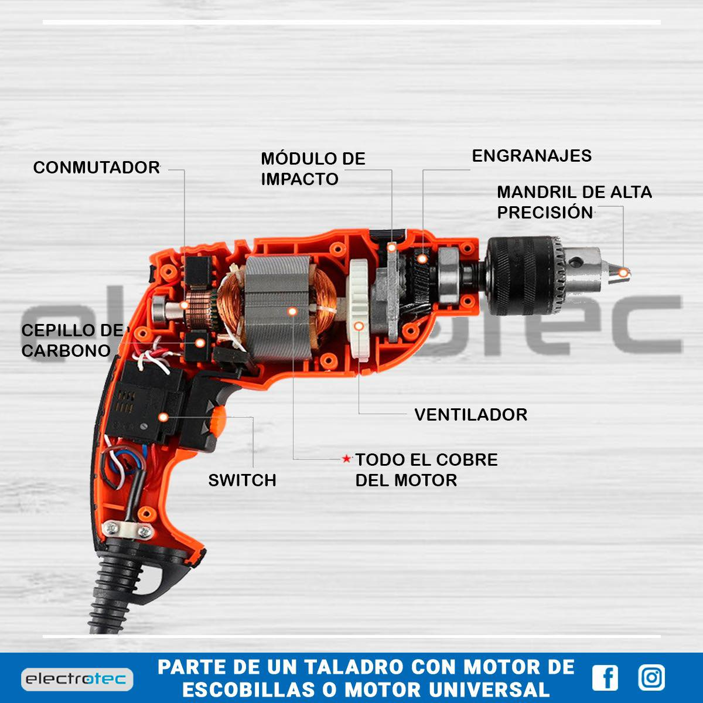

## 8. Factura eléctrica

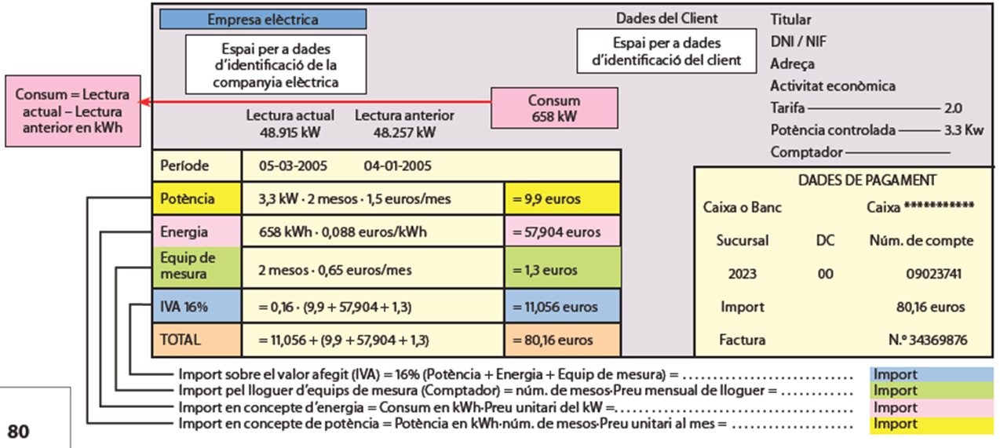

Exemple real:

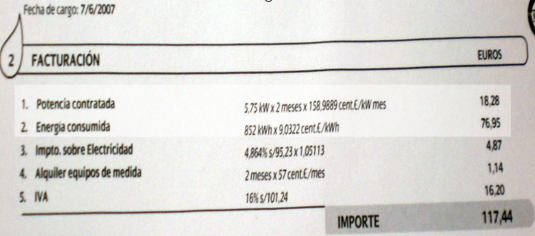

Caràcter bimensual
Components habituals:

- Potència contractada: 5,75 kW x 158,9889 cent/kW/mes = - Subtotal : 18,28 €
- Energia consumida: 9,0922 cent/kWh x 852 KWh = Subtotal: 76,95 €
- Impost sobre l’electricitat: Subtotal: 4,87 €
- Lloguer d’equips de mesura: 57 cents per mes
- IVA (impost sobre el valor afegit): 16%. Sobre 101,24-> 16,20 €

Total: 117,44 €
