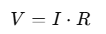

# TEMA 54Fenòmens, magnituds i lleis fonamentals dels circuits elèctrics

* Naturalesa de l’electricitat\.
* Composició de l’àtom\. moviment d’electrons\.
* Camp elèctric\. Força electromotriu\.
* Efectes de l’electricitat\.
* Corrent elèctric\.
  * INTENSITAT\. SENTIT\. TIPUS\.
* Corrent continu i altern\.
* Corrent altern\. Paràmetres característics\.
* Resistitivat\. Resistència\. Conductors\, semiconductors i aïllants\.
* Tensió\, potència i energia\.
* Fenòmen d’inducció\. Lleis de faradai i lenz
* Lleis fonamentals
  * Llei d’Ohm\. Llei de Joule\.
  * Lleis de Kirchoff
  * Teoremes de Thevenin i Norton\.
  * Teorema de Superposició\.
  * Transformacions Delta\-Estrella

# Cronologia de descobriments

* 1600\.  __William Gilbert __
  * __empra el mot __  _electricitat _ per primer cop i publica l'obra  _De Magnete _ on exposa\, per primera vegada\, la teoria del magnetisme terrestre\.
* 1672\. Otto von Guericke
  * __Construi la primera __ maquina electrostatica per produir carregues electriques\.
* 1745\.Pieter van Musschenbroek i Ewald Georg von Kleist
  * __Van inventar el primer condensador __ o ampolla de Leyden\.
* 1785\. Charles Augustin de  __Coulomb __
  * __Va obtenir __ la llei que regeix les atraccions i repulsions entre carregues electriques\.
* 1800\. Alessandro  __Volta __
  * __Construi la pila electrica __ denominada  _galvànica\. _
* 1826\. Georg Simon  __Ohm __
  * __Estudia la conduccio __ electrica en els metalls i formula la llei que relaciona les tres magnituds mes importants:  _voltatge\, intensitat i resistència\. _
* 1827\. André\-Marie  __Ampère __
  * __Estudia l'accio __ entre l'imant i els corrents electrics i formula les lleis basiques de l'electromagnetisme\.
* 1831\. Michael  __Faraday __
  * __Descobri la induccio __ electromagnetica\.

* 1845\. Gustav Robert  __Kirchhoff __
  * __formula les __ lleis de nusos i malles que posteriorment van permetre resoldre circuits complexos\.
* 1868\. James Clerk  __Maxwell __
  * __formula el fonament __ teoric de l'electromagnetisme\.
* 1879\. Thomas Alva  __Edison __
  * __inventa la lampada __ de filament de grafit i desenvolupa l'enllumenat electric\.
* 1882\.  __Lucian Gaulard i John Dixon __
  * __van inventar __ el transformador\.
* 1884\. Heinrich __ Hertz __
  * __demostra que l'electricitat __ es pot transmetre en forma d'ones electromagnetiques que es propaguen a la velocitat de la llum\.
* 1887\.  __Mijail Osipovich Dolivo\-Dobrowolski __
  * desenvolupa el sistema de corrent trifasic\.
* 1895\.  __Wihelm Conrad Röntgen __
  * __descobri els __ raigs X en la descarrega electrica en gasos enrarits\.
* 1897\. Joseph John  __Thomsom __
  * __estudia les __ propietats de la materia en relacio amb l'electricitat i descobri l'electro com a  particula constituent\.

# Electroestàtica

* Naturalesa de l’electricitat
  * L’àtom sera l’element basic de tot el proces\, es per aixo
  * A la natura trobem 111 elements diferents\, reflectits a la taula periodica\.
  * L’atom part mes petita d’aquests elements\, que mante\, pero\, les seves propietats fisiques i quimiques\.

* __Àtom__  significa en grec \`indivisible´\, i aixi es va considerar durant molt de temps\.
* Posteriorment\, els treballs de Rutherford\, Bohr i altres investigadors van revelar que esta format per particules subatomiques molt mes petites\,
  * com ara els electrons\, els protons\, els neutrons\, els positrons\, els mesons\, els neutrins\, els antiprotons\, etc\.
* Tot i aixo\, els mes importants son els tres primers:
  * Electrons
    * Giren al voltant del nucli i descriuen orbites el·liptiques i es mantenen en aquestes orbites gracies a l’atraccio del nucli\.
    * La carrega electrica dels electrons es negativa\.
  * Protons:
    * formen el nucli de l’atom\.
    * El valor absolut de la seva carrega electrica es igual a la de l’electro pero es positiva\.
  * Neutrons
    * Particules elementals sense carrega\, situades al nucli de l’atom i amb una massa aproximadament igual a la del proto\.
    * Cada atom te el mateix nombre d’electrons que de protons\.

* Si càrrega de l’electro es igual que la del protó
  * Àtom electricament neutre\.
* Electrons sotmesos a
  * Força
    * D’atraccio del camp electric del nucli
    * De repulsio dels electrons de les capes inferiors \(energia potencial\)\.
  * A causa de la seva velocitat tenen tambe energia cinetica\.
  * Si sumem aquestes dues energies obtenim l’energia total de l’electro en una determinada orbita o capa\.
* Com mes allunyats estiguin els electrons del nucli
  * \+ petita sera la forca d’atraccio d’aquest nucli
  * \+ petita sera l’energia que li hem de subministrar per vencer la forca d’atraccio
    * Per fer que salti de l’ultima capa o capa periferica
* L’atom\, en perdre un electro\,
  * Queda instantaniament sense equilibri electric
  * Nº de protons > Nº d’electrons\.
    * L’Àtom restara carregat positivament i es convertira en un ió positiu o catió\.
* L’àtom captura un electro
  * Queda carregat negativament i es convertira en un ió negatiu o anió\.

# Curiositat. Àtom de coure

El coure és un material molt utilitzat en electrotècnica, especialment en la fabricació de cables elèctrics, gràcies a la seva excel·lent conductivitat.

L'àtom de coure conté 29 electrons, distribuïts en quatre òrbites o capes electròniques. Aquesta configuració permet que l'electró més extern, que es troba a l’última capa, es mogui amb facilitat, convertint el coure en un excel·lent conductor elèctric.

# Camp elèctric

* Quan col·loquem en una zona de l’espai una carrega electrica es crea una zona d’influencia que es manifesta quan hi acostem una altra carrega i aquesta rep unes forces d’atraccio o de repulsio\.
  * La zona en la qual es manifesten aquestes forces s’anomena  __camp elèctric__  _ \(C\.E\.\)_
* C\.E\. es representa per les  __línies de força__
  * __Corresponen als camins que seguiria __ una carrega electrica puntual positiva en ser atreta o repel·lida per la carrega electrica que ha creat el camp
* Podem deduir que la intensitat de C\.E\.  en un punt es d’1 N/C quan
  * En col·locar una carrega d’1 C en aquest camp\, rep una forca d’1 N\.
* Direccio del C\.E\. en un punt coincideix amb la direccio de la forca realitzada sobre una carrega positiva en aquest punt\.
* El modul del vector intensitat de C\.E\. és determinat per la densitat de linies de forca\.
* __Principi de superposició__
  * Si en lloc d’una carrega puntual\, la que crea el camp electric es una distribucio de carregues\, la intensitat del camp sera la suma vectorial de les intensitats de camp que creen cadascuna de les carregues\.
* El  __camp elèctric degut a una càrrega __  _Q_
  * Regió de l’espai al voltant d’aquesta càrrega on es manifesten les forces d’atracció o de repulsió sobre altres càrregues elèctriques situades en aquest espai\.
* __Intensitat de camp elèctric __
  * Creada per una càrrega Q en un punt de l’espai és la força elèctrica que actua sobre una unitat de càrrega situada en aquest punt\.

# Força electromotriu

* Fonaments
  * Per aconseguir que un corrent travessi de forma permanent un conductor\, necessita mantenir un camp elèctric permanent\.
  * Això s’aconsegueix mitjançant generadors químics i electromagnètics\.
  * En aquests es produeix una transformació d’energia química o mecànica en elèctrica\.
* Força electromotriu
  * Es defineix com el treball que el dispositiu elèctric realitza per fer passar pel seu interior una unitat de càrrega positiva\, del pol negatiu al pol positiu\, dividit pel valor d'aquesta càrrega\.

# Energia potencial, potencial i D.D.P.

* Energia potencial elèctrica en un punt
  * Treball \(canviat de signe\) necessari per portar la càrrega des de l’exterior del camp \(infinit\) fins a aquest punt\.
* Potencial elèctric en un punt
  * Treball \(canviat de signe\) que cal fer per vèncer les forces del camp elèctric\, per tal de traslladar la unitat de càrrega positiva des de l’infinit fins a aquest punt
* Diferència de potencial
  * Si partim de l’expressio obtinguda anteriorment en el calcul de la diferencia d’energia potencial  electrica entre dos punts\, tindrem:
  * L’expressio \(VA – VB\) es coneix amb el nom de diferència de potencial entre dos punts\.
  * Diferència de potencial elèctric és el treball per unitat de càrrega elèctrica \(canviatde signe\) necessari per traslladar una càrrega entre dos punts del camp elèctric\.
  * La  __diferència de potencial entre dos punts A i B __ es el treball \(canviat de signe\) necessari per traslladar la unitat de carrega positiva des de B fins a A:

# Resistivitat i resistència

* __Resistivitat__  d’un material
  * La seva capacitat a oposar\-se a la circulació del corrent elèctric\.
  * Es correspon amb la resistència elèctrica d'un troç de material d‘1 m de longitud i d‘1 m2 de secció
  * S'expressa en ohms per metre \(Ω·m\, ohmmetre\)\.
  * Permet classificar materials en:Conductors\, semiconductors i aïllants
  * Es correspon amb l’invers de la  __conductivitat__  elèctrica de material
* __Resistència__  elèctrica
  * Grau d'oposició que oposa un objecte al pas del corrent elèctric\.
  * La unitat del Sistema Internacional és l'ohm
  * Se simbolitza amb la lletra grega omega majúscula \(Ω\)
  * La seva recíproca és la  __conductància__  elèctrica s mesura en siemens\.

# Corrent elèctric. Intensitat de corrent

  * Magnitud que ens dona una idea de la quantitat d’electrons que passen per un conductor en un temps determinat
  * Si la carrega electrica que circula per un conductor es constant\,
* Intensitat del corrent elèctric \(I \)
  * És la quantitat de càrrega elèctrica que passa per una secció transversal d’un conductor en la unitat de temps\.
* Unitats
  * La intensitat es mesura en amperes \(A\)\.
  * S’utilitzen també els seus múltiples i submúltiples
* On
  * Q: carrega electrica en coulombs \[C\]\.
  * I: intensitat electrica en amperes \[A\]\.
  * t: temps en segons \[s\]\.

# Corrent elèctric. Sentit

* Corrent electric
  * Moviment d’electrons per un conductor
  * Surten del pol negatiu \(–\) i es dirigiran\, cap al positiu \(\+\)
  * Circulant en sentit contrari a les linies del camp electric\.
  * A la practica
    * S’utilitza el sentit contrari\, anomenat  __sentit convencional__
    * Es el que va escollir Michael Faraday abans de coneixer que el corrent era el moviment de carregues electriques negatives
    * No s’alteren els resultats finals i els esquemes logics de raonament a vegades son mes senzills\.

# Corrent elèctric. Tipus

* Segons com sigui el flux de carregues podem tenir diferents tipus de corrent electric
  * Corrent  __continu__  constant
    * Aquell en que el flux de carregues o electrons es constant en tot moment i no canvia de sentit\.
  * Corrents  __variables__
    * Corrents electrics la intensitat dels quals es variable en el temps es denominen\.
* Tipus de corrents variables
  * segons la seva variacio en el temps i el sentit de circulacio\.
    * Si el sentit de circulacio del corrent electric sempre es el mateix
      * Direm que es tracta d’un corrent  __continu__  variable en el temps\.
    * Si el sentit de circulacio del corrent electric es alternatiu
      * Sera corrent  __altern__  i el seu nom dependra de la forma del senyal\.
      * El mes utilitzat es el
        * sinusoïdal \(forma de la funcio sinus\) i el pulsatiu\.

# Conductors, aïllants i semiconductors

* Introducció
  * En l’estrictura de la matèria\, els àtoms tenen electrons orbitant al voltant del nucli en diverses capes
  * Els electrons de la darrera capa són els que provoquen que un material sigui conductor\, semiconductor o aïllant
* Tipus de materials
  * __Conductors__
    * És facil extreure d’ells els electrons de la seva darrera capa
    * Ex: Els metalls
  * __Aïllants__
    * És dificil extreure electrons de la seva darrera capa \(normalment tenen 8\)
    * Solen estar complets o units a altres àtoms mitjançant enllaços forts
    * Ex: Els plàstics i la fusta
  * __Semiconductors__
    * Al comunicar energia\, podem obtenir alguns electrons de la seva darrera capa
    * Es pot aconseguir el fluxe dels mateixos
    * Ex: Silici i germani

# Tipus de conductors (II)

En els metalls, els àtoms es disposen en posicions fixes i ordenades, formant una estructura geomètrica molt rígida. Aquests àtoms tenen pocs electrons a l’última capa electrònica, la qual es troba relativament allunyada del nucli. Per aquesta raó, els electrons més externs queden poc subjectes al nucli atòmic.

Els electrons externs poden moure's lliurement i de manera desordenada pel metall; aquests es denominen **electrons lliures**. Aquest conjunt, format per cations fixos i electrons lliures, és el que constitueix l’enllaç metàl·lic. A més, els electrons lliures són responsables de les excel·lents propietats conductores dels metalls, tant d’electricitat com de calor.

# Inducció electromagnètica

L'inducció electromagnètica és el fenomen en què un canvi en el flux magnètic a través d'una espira genera una força electromotriu (fem). Aquest procés es regula mitjançant les lleis de Faraday i Lenz.

## Llei de Faraday

- La **força electromotriu (fem)** induïda en una espira és igual a la **taxa de canvi** al llarg del temps del flux magnètic a través de l'espira.
- La direcció d'aquesta força electromotriu és **oposada** a la causa que la produeix.
- En el cas d'una **bobina inductora** amb **N voltes** de fil, la fórmula es modifica per tenir en compte el nombre de voltes.

## Llei de Lenz

- La **força electromotriu** o els **corrents induïts** seran generats en una direcció tal que **s'oposin** a la variació del flux magnètic que els ha creat.
- Aquesta llei és una conseqüència del **principi de conservació de l'energia**.
- Rep el nom en honor del físic alemany **Heinrich Lenz**, qui la va formular el **1834**.

# Llei d’Ohm

### Llei d'Ohm

La Llei d'Ohm descriu la relació entre la tensió, el corrent i la resistència en un circuit elèctric. A continuació, es presenten els seus conceptes clau:

- **Definició:**
  - *El corrent que travessa un circuit elèctric és directament proporcional a la diferència de potencial (tensió) que hi ha entre els seus extrems i inversament proporcional a la resistència del circuit.*

- **Expressió matemàtica:**
  - La Llei d'Ohm s’expressa amb l’equació: 
    On:
    - **V**: Caiguda de voltatge o diferència de potencial (en volts, V).
    - **I**: Corrent elèctric (en amperes, A).
    - **R**: Resistència elèctrica (en ohms, Ω).

- **Resistència elèctrica (R):**
  - Aquesta equació determina la constant de proporcionalitat **R**, que és la resistència elèctrica del circuit.
  - En circuits amb resistències, superar certs límits pot provocar una **pèrdua de proporcionalitat directa** a causa de l'efecte Joule.

- **Unitats al Sistema Internacional (SI):**
  - Corrent: **Ampere (A)**.
  - Diferència de potencial: **Volt (V)**.
  - Resistència: **Ohm (Ω)**.

- **Història:**
  - Rep el seu nom en honor al físic alemany **Georg Ohm**.
  - L’any **1827**, Ohm va publicar un tractat amb:
    - Experiències i mesures sobre l’aplicació de diferents voltatges i corrents a circuits simples amb diverses longituds de cable.

# Lleis fonamentals. Lleis de Kirchoff

* Lleis de  __Kirchoff__
  * Tracten de la conservació de la càrrega i l'energia als circuits elèctrics
  * Foren descrites per primera vegada el 1845 pel físic alemany Gustav Robert Kirchhoff\.
  * Ambdues lleis poden ser deduïdes de les equacions de Maxwell\.
  * Kirchhoff precedí a Maxwell i generalitzà el treball de Georg Ohm\.
* 1º Llei: Llei dels nodes \(Conservació de la càrrega\)
  * En qualsevol punt d'un circuit elèctric on la densitat de càrrega no canvia amb el temps\, la suma dels corrents que flueixen cap a aquell punt és igual a la suma de corrents que surten d‘aquell punt\.
* 2ª Llei: Llei de les malles \(Conservació de l’energia\)
  * La suma algebraica \(amb signe\) de totes les diferències de potencials al voltant d'un circuit ha de ser zero\.

# Teoremes de Thevenin i Norton

* Teorema de  __Thevenin__  per a circuits elèctrics
  * Redescobert en 1883 per l'enginyer francès de telègrafs Léon Charles Thévenin\.
  * Un circuit de fonts de voltatge i resistències poden ésser convertides a un equivalent thevenià\.
  * Es una tècnica de simplificació emprada en l'analisi de circuïts
* Enunciat
  * Qualsevol combinació de fonts de voltatge fonts de corrent i resistències amb dos terminals és elèctricament equivalent a una única font de voltatge V i una única resistència R\.

* Teorema de  __Norton__
  * El teorema fou publicat en 1926 per l'enginyer Edward Lawry Norton \(1898\-1983\)\, dels Laboratoris Bell\.
* Enunciat
  * Qualsevol conjunt de fonts de voltatge i resistències amb dos terminals és elèctricament equivalent a una font de corrent I en paral·lel am una única resistència R\.

# Llei de Joule

* La quantitat de calor originada en una resistència\, al pas d’un corrent a través d’ella\, es directament proporcional a
  * El quadrat de la intensitat del corrent que el travessa
  * Al temps que aquest la recor
  * La quantitat de calor en Joules
* En  __calories__ \, seria:
  * Q = 0\,24 \* i^2 \* R \* t

# Lleis fonamentals

* Principi de superposició
  * L'efecte que dos o més fonts tenen sobre una resistència és igual\, a la suma de cada un dels efectes de cada font presos per separat\, substituint totes les fonts de tensió restants per un curt circuit\.

Transformació Delta\-Estrella

# Efectes de l’electricitat

* Corrent electric\, al seu pas per un receptor o un conductor\, pot produir els efectes:
  * __Efecte calorífic__
    * __En passar el corrent electric per un conductor\, aquest s’escalfa\. __
    * Es el principi del funcionament de les lampades d’incandescencia\, estufes\, fogons\, forns electrics\, escalfadors\, etc\.
  * __Efecte magnètic__
    * __Quan un corrent circula per un conductor\, crea al seu voltant un camp magnetic __
    * Aquest camp servira\, com veurem mes endavant\, per fer girar un motor\.
  * __Efecte lluminós__
    * __L’enllumenat electric mitjancant les lampades fluorescents i de descarrega__
    * Degut a fenomen de luminescencia
      * Produir radiacions lluminoses per la descarrega electrica en el si d’un gas com ara l’argo o el neo\.
    * Efecte produït tambe en les lampades d’incandescencia per l’efecte calorific o de termoradiacio
      * Consisteix en l’emissio de llum i calor d’un cos calent\.
  * __Efecte químic__
    * __El pas d’un corrent per un electrolit produeix reaccions quimiques\.__
  * __Efectes fisiològics__
    * __El pas d’un corrent electric elevat a traves del cos huma pot produir lesions __ que poden arribar a la mort\. Aquest efecte es utilitzat en aparells d’electromedicina i en el sacrifici de bestiar\.

# Mesura de magnituds elèctriques

* __Magnituds__  electriques es poden mesurar amb els  __instruments de mesura __ seguents:
  * __Amperímetre__
    * Permet mesurar la intensitat electrica\.
    * S’ha de connectar interrompent el circuit
    * Per obligar que totes les carregues electriques hi circulin a traves\. S’anomena connexió en sèrie\.
  * __Voltímetre__
    * Instrument que ens permet mesurar la diferencia de potencial o el voltatge\. Per poder mesurar la diferencia de potencial\, haurem de connectar el voltimetre entre aquests dos punts
    * La connexió es  fa en paral·lel\.
  * __L’òhmmetre__
    * Instrument que ens permet mesurar la resistencia electrica d’un circuit\, receptor  o resistor\.
    * Per realitzar la mesura d’una resistencia en un circuit cal procedir de la manera seguent:
      * Assegurar\-se que al circuit o a la resistencia no hi hagi tensio
      * Pot provocar el deteriorament de l’aparell i la mesura realitzada no seria la correcta\.
  * Per efectuar la mesura haurem de connectar l’ohmmetre entre els dos punts entre els quals volem mesurar la resistencia\.
