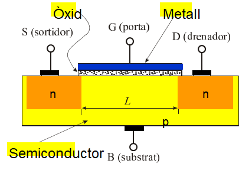
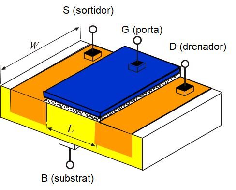
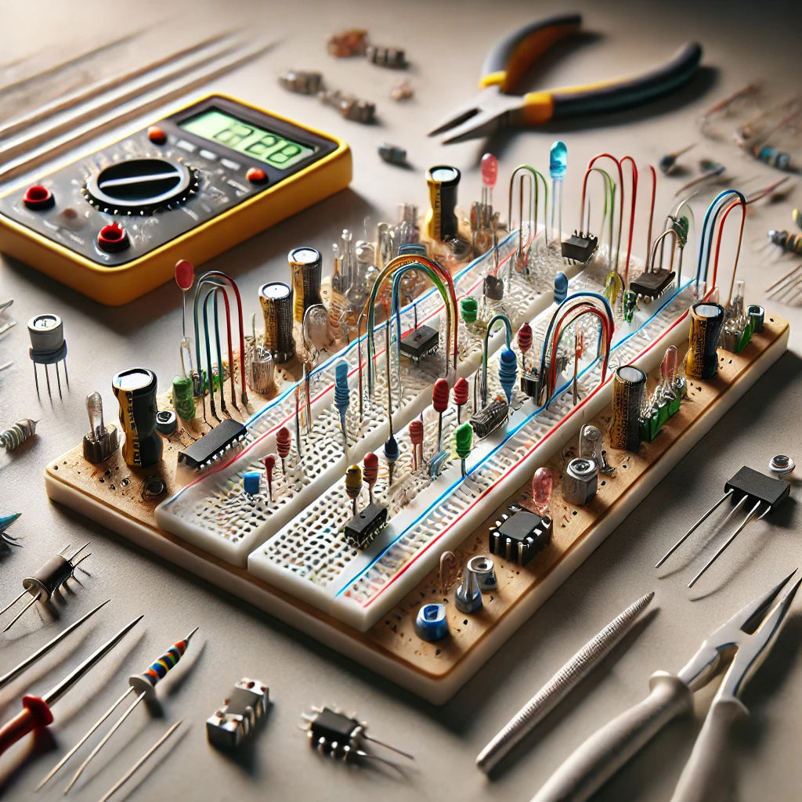
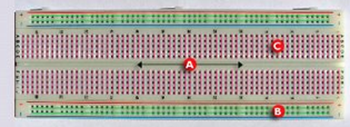
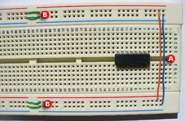

# Tema 57

Circuits electrònics

Elementos components i el seu funcionamient\.

Procedimients de connexió\.

# Índex

* __Introducción__
* __Componentes pasivos__
  * Resistencias
    * Resistencias fijas
    * Resistencias variables
    * Código de colores
  * Condensadores
  * Inductancias
* __Materiales semiconductores__
  * Conducción en los semiconductores
  * Semiconductores intrínsecos y extrínsecos
  * Unión PN
  * Diodos semiconductores
* __Transistores bipolares de unión__
  * Constitución\. Tipos
  * Diferentes configuraciones con transistores
  * Parámetros híbridos
  * Polarización de los transistores
* __Transistores de efecto de campo__
  * Transistores FET de unión
  * Transistores FET de puerta de salida
* __Semiconductores empleados en circuitos de control de potencia__
  * El tiristor
  * El triac
  * Elementos de disparo
    * El diac
    * El transistor uniunión
* __Resistencias no lineales__
  * Resistencias con coeficiente de temperatura negativo
  * Resistencias con coeficiente de temperatura positivo
  * Resistencias sensibles a la luz
  * Resistencias dependientes de la tensión
* __Dispositivos fotoeléctricos__
  * Fotocélulas
  * Fotosemiconductores
    * Fotodiodos
    * Fototransistor
  * Diodos emisores de luz
* __Amplificadores lineales integrados__
  * Estructura interna
    * El amplificador diferencial

# Components i elements

## Components electrònics

- Dispositivo que forma parte de un circuit electrònic.
- Normalment encapsulat.
- Té dos o més terminals o patilles metàl·liques.
- Estan dissenyats per a ser connectats entre ells, formant un circuit.

## Components Actius i Passius

Els components electrònics es poden classificar en dues categories:

## Components Actius

- Són capaços d'excitar circuits o de realitzar guanys o controls dins del circuit.
- Necessiten una font d'energia externa per al seu funcionament.
- Són components que poden modificar el flux de corrent a través d’un circuit i amplificar senyals.

## Components Passius

- No necessiten una font d'energia externa per al seu funcionament.
- No tenen la capacitat de controlar el corrent dins del circuit.
- Són components que simplement emmagatzemen, resisteixen, filtren o redirigeixen l'energia.

# Resistències (I)

Els **resistors** s'intercalen en un circuit per ajustar el valor de la intensitat del corrent que hi circula. Poden ser de dos tipus:

## Resistors Fixes

- El valor d'un resistor fixe ve indicat per un **codi de colors** que permet identificar la seva resistència.

## Resistors Variables

Els **resistors variables** permeten ajustar el seu valor entre 0 i un valor màxim. El valor es modifica mitjançant un **cursor** que es pot moure. Es poden classificar en:

- **Lineals**: La variació de la resistència és proporcional al moviment del cursor.
- **Angulars**: La resistència canvia segons l'angle del cursor.

Els resistors variables més habituals en electrònica són els **potenciòmetres**.

# Resistències. Codis de Colors

## Codis de Colors

Els codis de colors en les resistències es componen de diverses bandes que indiquen el valor i la tolerància de la resistència.

### 1. Codis de 3 bandes de color a un extrem
- **Valor de la resistència**:
  - El valor es determina multiplicant el nombre representat per les dues primeres bandes de color per la potència de 10 indicada per la tercera banda.

### 2. Tolerància de la resistència
- **Tolerància**:
  - Indica la màxima diferència entre el valor nominal i el valor real de la resistència.
  - Es pot identificar per una banda extra de color en l'altre extrem de la resistència. Els colors comuns per a la tolerància són:
    - Or
    - Plata
    - Marró
    - Vermell

# Resistències Variables

Les resistències variables són aquelles que poden modificar el seu valor en funció d'algun paràmetre extern.

## 1. Resistències dependents de la llum
- **LDR (Light Dependent Resistor)**:
  - Les LDR canvien la seva resistència segons la intensitat de la llum que les incideix. Quan hi ha més llum, la seva resistència disminueix.

## 2. Resistències dependents de la temperatura
- Aquestes resistències varien el seu valor en funció de la temperatura a la qual estan exposades.
  - **Termistores**: Un tipus de resistència que varia segons la temperatura, amb dues classes:
    - NTC (Coeficient de temperatura negatiu): La resistència disminueix quan la temperatura augmenta.
    - PTC (Coeficient de temperatura positiu): La resistència augmenta quan la temperatura augmenta.

# Condensador

Un condensador és un component electrònic dissenyat per emmagatzemar càrrega elèctrica.

## 1. Estructura
- Està format per:
  - **Dues plaques metàl·liques paral·leles**, anomenades armadures.
  - Separades per un **dielèctric**, que pot ser un material aïllant com ceràmica, paper o plàstic.

## 2. Funció
- **Emmagatzemar càrrega elèctrica**:
  - Un condensador emmagatzema càrrega quan s’aplica una diferència de potencial entre les seves plaques.
  - La seva **capacitat** determina la quantitat de càrrega que pot emmagatzemar.
  - La capacitat es mesura en **Farads (F)**.
    - Com un **Farad** és molt gran, sovint s’utilitzen unitats més petites com **milifarads (mF)**, **microfarads (μF)**, i **nanofarads (nF)**.

## 3. Aplicacions
- Es fan servir en una gran varietat de circuits, incloent:
  - **Circuits sintonitzadors**, **oscil·ladors**, **rectificadors de C.A.**, etc.

## 4. Comportament
- Quan un condensador rep **Corrent Continu (C.C.)**:
  - **Mentre es carrega**: Permet el pas de corrent.
  - **Quan està carregat**: Impedeix el pas de corrent.
- Quan rep **Corrent Altern (C.A.)**:
  - Permet el pas de corrent en qualsevol moment, ja que el seu comportament varia contínuament amb la senyal alterna.

# Bobina o Inductor

Una **bobina** (també coneguda com a **inductor**) és un component que genera un **camp magnètic** quan hi circula un corrent elèctric.

## 1. Funcionament
- Quan un corrent elèctric circula a través de la bobina, es crea un **camp magnètic** al seu voltant.
- Si un **imant** s'aproxima o s'allunya de la bobina, es genera un corrent elèctric en la bobina.

## 2. Fenòmens d'Inducció
- **Inducció mútua**:
  - Si s'apropa una bobina a una altra, la primera bobina genera una **corrent** en la segona.
- **Autoinducció**:
  - La bobina pot **induïr-se a si mateixa**, generant un corrent en ella mateixa quan hi ha un canvi en el corrent que hi circula.

## 3. Comportament segons el tipus de corrent
- **Corrent Continu (C.C.)**:
  - Quan una bobina rep corrent continu, **no es produeix inducció** ni autoinducció, ja que el corrent no canvia.
- **Corrent Altern (C.A.)**:
  - Quan una bobina rep corrent altern, es produeix inducció i autoinducció degut als canvis constants en la direcció i magnitud del corrent.
  - La **corrent induïda** té un sentit **contrari** al de la corrent que la provoca, segons la llei de Lenz.

# Components Semiconductors

Els components semiconductors són elements fonamentals en l'electrònica moderna i es classifiquen segons el seu comportament elèctric i les seves aplicacions.

## 1. Materials Semiconductors
Els semiconductors són materials que tenen una conductivitat elèctrica situada entre la d'un conductor i un aïllant. Són la base per a molts components electrònics.

- **Conducció en els semiconductors**:
  - Els semiconductors permeten la conducció d'electricitat en condicions específiques, com quan són sotmesos a certs nivells de temperatura o voltatge.

- **Semiconductors intrínsecos i extrínsecos**:
  - **Intrínsecs**: Semiconductors pures, com el silici, que tenen una conductivitat limitada.
  - **Extrínsecs**: Semiconductors modificats mitjançant la dopatge, afegint impureses per millorar la seva conductivitat.

- **Unió PN**:
  - És la unió entre dos tipus de semiconductors: un de tipus P (positiu) i un de tipus N (negatiu), que permet la creació de components com els diodes i transistors.

## 2. Diodos Semiconductores
Els diodos són components semiconductors que permeten el pas de corrent només en una direcció. Són utilitzats per rectificar corrent altern (CA) a corrent continu (CC).

## 3. Transistores

Els transistores són components semiconductors utilitzats per amplificar o commutar senyals elèctrics.

### 3.1. Transistores Bipolars de Unió (BJT)
- **Constitució**: Els transistores bipolars tenen tres capes de material semiconductor: l'emissor, la base i el col·lector.
- **Tipus**:
  - **NPN**: La capa base és de tipus P, i les altres dues (emissor i col·lector) són de tipus N.
  - **PNP**: La capa base és de tipus N, i les altres dues (emissor i col·lector) són de tipus P.

- **Configuracions dels Transistores**:
  - Els transistores poden operar en diferents configuracions segons les seves connexions: en emisor comú, base comuna i col·lector comú.

- **Polarització dels Transistores**:
  - La polarització del transistor determina la seva activació i el flux de corrent entre les seves terminals.

### 3.2. Transistores d'Efecte de Camp (FET)
Els FET són transistores en què el corrent es controla per un camp elèctric en lloc d'un corrent de base com en els BJT.

- **Transistores FET de Unió (JFET)**:
  - En aquests transistores, la conducció de corrent es fa a través d'una unió pn.

- **Transistores FET de Porta de Salida (MOSFET)**:
  - Són els transistores més utilitzats en aplicacions d'amplificació i commutació.

## 4. Semiconductores en Circuits de Control de Potència

Els components semiconductors també s'utilitzen en circuits per controlar la potència, com en sistemes de control de motors i en rectificadors de potència.

- **Tiristor**:
  - Un dispositiu semiconductor que permet el control de la potència elèctrica, utilitzat principalment en rectificadors i circuits de commutació de potència.

- **Triac**:
  - Un dispositiu similar al tiristor, però amb la capacitat de conduir corrent en ambdues direccions. S'utilitza principalment en circuits de control de potència alterna.

# Semiconductors. Bandes conductores

# Semiconductors Intrínsecs (I)

## 1. Cristal de Silicio (Si)

- **Estructura**:
  - El cristal de silicio té una estructura **tetraèdrica** on els àtoms es connecten mitjançant **enllaços covalents**.

## 2. Comportament a Temperatura Ambient

Quan el cristal es troba a temperatura ambient, alguns electrons poden absorbir energia i:

- **Saltar a la banda de conducció**.
- **Deixar un hueco** a la banda de valència.

### 2.1. Energia Requerida

- Per al **silici**: 1,12 eV
- Per al **germanio**: 0,67 eV

## 3. Fenòmen de Recombinació

- Els electrons poden caure des de la banda de conducció fins a un hueco a la banda de valència, **liberant energia**.
- Aquest procés es coneix com a **recombinació**.

## 4. Equilibri entre Creació i Recombinació

- A una temperatura determinada, les **velocitats de creació de parells e-h** (electrons i huecos) i **recombinació** es **igualen**.
- Això provoca que la concentració global de electrons i huecos es mantingui invariable.

## 5. Concentració de Càrregues

- **n**: Concentració d'electrons (càrregues negatives).
- **p**: Concentració de huecos (càrregues positives).
- **ni**: Concentració intrínseca del semiconductor, depenent exclusivament de la temperatura.

La relació entre aquestes concentracions es compleix així:

- **n = p = ni**

## 6. Efecte d'una Diferència de Tensió

Quan el cristal es sotmet a una **diferència de tensió**, es generen **dues corrents** elèctriques:

- La **corrent d'electrons lliures** que es desplacen a través de la banda de conducció.
- La **corrent de huecos** que es desplaça en la direcció contrària al camp elèctric:
  - Els electrons en la banda de valència tendeixen a saltar a **huecos pròxims**.
  - La velocitat i magnitud de la corrent de huecos és **molt inferior** a la de la banda de conducció.

# Tensió de Ruptura de la Unió PN

## 1. Comportament de la Tensió Inversa

- Quan la tensió inversa és **alta**, el corrent invers creix ràpidament a mesura que augmenta la tensió.
- Això pot provocar l'**efecte de ruptura de la unió**.

## 2. Causes de la Ruptura

La ruptura de la unió PN es pot deure a dos efectes principals:

### 2.1. Efecte Avalanxa

- Es produeix quan la tensió inversa provoca que els electrons en les bandes de valència guanyin suficient energia per alliberar altres electrons, produint una **allau** d'electrons.

### 2.2. Efecte Zener

- Es produeix quan l'augment del valor del **camp elèctric** a la zona de la unió provoca l'**arrancada** d'electrons d'enllaç, augmentant el corrent invers.

  - A l'invertir la tensió inversa, el **camp elèctric** arranca electrons d'enllaç, incrementant el corrent invers a través de la unió.

# Semiconductors. Diodes semiconductors

* Molts tipus diferents\. Aplicacions diverses:
  * Rectificació de senyals alterns
  * Detecció de radiofreqüències
  * Estabilització de senyals de contínua
* __Diodes d’unió__
  * Mètodes de construcció: Aleació\, difussió i allargament\.
  * Valors característics
    * Resistència directa
    * Resistència inversa
    * Tensió inversa màxima
    * Temperatura màxima de treball
  * Aplicacions
    * Rectificació i commutació

* __Diodes Zener__
  * En diodes normals\,a tensió inversa màxima diode es destrueix
* __Diodes PIN__
  * Diode d’unió PN amb capa intermitja de silici intrínsec
  * Aquesta capa actua com barrera dieléctrica
  * Redueix la seva capacitat\, i millora la velocitat de commutació
  * Interesants en aplicacions de radiofreqüència i microones

# Semiconductors

## 1. Definició
- Els **semiconductors** són materials que, en determinades circumstàncies, permeten el pas de corrent elèctric.
- Els semiconductors més utilitzats són:
  - **Silici (Si)**
  - **Germani (Ge)**
- A aquests materials se'ls afegeixen petites quantitats d'impureses per modificar les seves propietats elèctriques.

## 2. Tipus de Semiconductors
Segons el tipus d'impureses que s'hi afegeixen, els semiconductors es poden classificar en dos tipus:

### 2.1. Tipus N
- S'obtenen afegint impureses com el fòsfor o l'antimoni.
- Aquest tipus de semiconductor té una **major concentració d'electrons lliures**, i per tant, tendeixen a cedir electrons.

### 2.2. Tipus P
- S'obtenen afegint impureses com el bor o l'indi.
- Aquest tipus de semiconductor té una **major concentració de forats** (l'espai buit que deixen els electrons en moure's), que es comporten com a càrregues positives.

# Diodes (I)

## 1. Definició
Un **diode** és un component electrònic que permet el pas de corrent en un sentit i impedeix el pas de corrent en l'altre.
- El diode té **2 terminals**:
  - **Ànode** (terminal positiu)
  - **Càtode** (terminal negatiu)

## 2. Polarització
Quan un diode es connecta a una tensió elèctrica, pot estar polaritzat de dues maneres:

### 2.1. Polarització Directa
- El **pol positiu** del generador es connecta al **ànode (+)** del diode.
- El **pol negatiu** es connecta al **càtode (-)** del diode.
- El diode es comporta com un **material conductor**, permetent el pas de corrent.

### 2.2. Polarització Inversa
- El **pol positiu** del generador es connecta al **càtode (-)** del diode.
- El **pol negatiu** es connecta al **ànode (+)** del diode.
- El diode es comporta com un **aïllant**, impedint el pas de corrent.

# Transistors (I)

## 1. Funcions del transistor
Un transistor pot utilitzar-se per a:
- **Amplificar senyals elèctriques**.
- **Actuar com a interruptor**.

## 2. Tipus de transistors
Els tipus més comuns de transistors són:
- **Bipolars**
- **De efecte de camp (FET)**

## 3. Transistors bipolars
Els transistors bipolars estan formats per **3 capes** de material semiconductor:
1. **Base** (interior)
2. **Colector** (exterior)
3. **Emissor** (exterior)

### 3.1. Tipus de transistors bipolars

- **NPN**
  - Una capa de semiconductor **P** ubicada entre dues capes de semiconductor **N**.

- **PNP**
  - Una capa de semiconductor **N** ubicada entre dues capes de semiconductor **P**.

# Transistors

## Configuracions de transistors

Les configuracions més comunes per a transistors són:

### 1. Emissor comú
- És una de les configuracions més utilitzades en circuits d'amplificació i en interruptors.
- En aquesta configuració, l'emissor es manté comú a les dues parts del circuit (entrada i sortida).

### 2. Col·lector comú
- **Descripció**:
  - El col·lector es connecta a les masses tant del senyal d'entrada com del senyal de sortida.
  - El senyal s'aplica a la **base** del transistor i s'extreu per l'**emissor**.
- **Propietats**:
  - Aquesta configuració proporciona **guany de corrent**, però **no de tensió**, ja que la tensió a la sortida és lleugerament inferior a la unitat.
  - **Impedància de sortida**: La configuració multiplica la impedància de sortida per **x 1 / β**, on β és el guany del transistor.

### 3. Base comuna
- En aquesta configuració, la base es manté comuna entre les parts d'entrada i sortida, amb la característica de no tenir guany de tensió ni de corrent en algunes aplicacions.

# Transistors (II)

* Formes de funcionament
  * __Tall__
    * No es subministra suficient corrent a la base
    * El transistor impedeix el pas de corrent entre colector i emisor
  * __Saturació__
    * Base reb suficient corrent per a que circuili la màxima corrent entre el colector i l’emisor
  * __Activa__
    * Base reb un corrent inferior al corrent de saturació
* Guany d’un transistor
  * Relació entre el corrent de sortida i el corrent d’entrada
  * Es calcula com el quocient de Ic \(colector\) i Ib \(base\)

# Transistors d'efecte de camp (FET)

Els **transistors d'efecte de camp** (FET) són una família de transistors que utilitzen el **camp elèctric** per controlar la conductivitat d'un "canal" en un material semiconductor.

## Característiques generals:
- Els FET es poden considerar com resistències controlades per voltatge.
- Aquests dispositius varien la seva resistència en funció del voltatge aplicat al seu **portador de control** (com la base en altres tipus de transistors).
- Són essencials en circuits de conmutació i amplificació on es vol controlar la corrent de manera eficient i amb una alta impedància d'entrada.

## Tipus més coneguts:
1. **JFET (Junction Field-Effect Transistor)**:
   - Utilitza una unió PN per controlar el corrent a través d'un canal semiconductor.
   - Són sovint utilitzats en aplicacions d'amplificació de senyals petits degut a la seva alta impedància d'entrada.

2. **MOSFET (Metal-Oxide-Semiconductor Field-Effect Transistor)**:
   - Utilitza una capa d'òxid de metall com a aïllant per controlar el flux de corrent a través d'un canal.
   - Són àmpliament utilitzats en circuits digitals i d'amplificació degut a la seva eficiència i velocitat de commutació.

# Transistors MOS (I)

# Semiconductors en circuits de control de potència

## TIRISTOR

* Se podría definir a un tiristor
  * Como un diodo que\, mediante la incorporación de otra patilla\, podemos controlar el paso de corriente a través del mismo\.
  * De aquí se deduce que un tiristor se comportaría como un diodo; sólo dejaría pasar la corriente en un sentido\.
  * Pero con la variación respecto a éste de que
    * Aplicándole una tensión en la tercera pata que hemos introducido\, éste conduciría
    * Si a esta patilla no le aplicamos tensión éste no conduciría\.
* Diferencia con transistor
* En el tiristor
  * Si hay tensión  _pasa toda la corriente_
  * Si no la hay\, en su tercera patilla\, no se dispara
  * No hay término medio como en el transistor\.
* Podría decirse que un tiristor es un interruptor controlado\.
* Hay otras tres formas de disparar un tiristor
  * Por variación brusca de tensión entre ánodo y cátodo
  * Por aumento de tensión entre ánodo y cátodo
  * Por aumento de temperatura
* Obtenido por primera vez en  __1\.957__ \, en los Estados Unidos\, por la empresa  __General Electric__ \.

## Triac

* Component electrònic equivalent a dos  __SCR__
  * Units en anti\-paral·lel \(en paral·lel\, però cadascun en un sentit\)
  * Amb les seues  _portes_  unides entre si\.
* Diferencia amb tiristor convencional
  * TIRISTOR és unidireccional y el TRIAC es bidireccional
* Això produeix
  * __Commutador electrònic bidireccional__  pot conduir corrent en qualsevol direcció quan és disparat \(engegat\)\.
  * Pot ser disparat per un voltatge positiu o negatiu aplicat en la  _porta_ \.
  * Una vegada activa\, t continua conduint fins que el corrent que el recorre disminueix per sota d'un valor límit
  * Commutador molt apropiat per a circuits AC
    * Permet control de molta potència
    * Amb una intensitat de l'escala de microampers\.
* Aplicant un pols d'activació en un cicle AC
  * Controla % de corrent que passarà pel triac cap a la càrrega \( _control de fase_ \)\.
* Triacs de baixa potència s'usen en aplicacions com
  * Control de llum
  * Control de velocitat per a ventiladors elèctrics i altres motors elèctrics
  * Control computeritzat modern en moltes aplicacions domèstiques\.

## 3. Procediments de connexió

### Placa de proves o entrenador
- Una **plaça de proves** (també coneguda com a "plaça de prototips" o "plaça de proves sense soldadura") és una base on es poden muntar components electrònics sense necessitat de soldar-los.
- Permet provar i modificar fàcilment els circuits en fase de disseny.

### Placa de tires
- Les **plaques de tires** són usades per muntar circuits de forma similar a les plaques de proves, però amb la diferència que els components es poden muntar sobre tires de contacte fixades sobre la base.

### Soldadura elèctrica
- La **soldadura elèctrica** s'utilitza per establir connexions permanents entre els components i les plaques de circuit.
- Es fa servir una **ferro de soldar** i **solda** (una alliatge que fon a baixa temperatura) per fixar els components als punts de connexió del circuit imprès o placa de proves.

### El circuit imprès
- Un **circuit imprès** (PCB, per les seves sigles en anglès) és una placa de material aïllant amb pistes de coure que connecten els components del circuit electrònic.

#### Tècniques per a construir circuits impresos:
1. **Fabricació amb rotuladors i cintes adhesives**:
   - Aquesta tècnica manual utilitza rotuladors per dibuixar les pistes del circuit sobre una placa, després de la qual es poden afegir elements com les cintes adhesives per protegir les zones que no s'han de gravar.

2. **Sistema fotogràfic o de fotogravat**:
   - El fotogravat és un procés que utilitza una capa fotosensible sobre el circuit per a transferir el disseny del circuit imprès de manera més precisa.
   - S'exposa la placa a la llum per a gravar el disseny sobre la placa de coure, i després s'afegeixen els components.

# Tècniques manuals

## 1) Placa de proves o entrenador

- Poden ser **perforades** o **interconnectades elèctricament** en l'interior, seguint una determinada seqüència.
- La inserció dels elements es fa a **pressió**.
- Aquest sistema s'utilitza per a **muntatges no permanents**.
- Els components podrien caure, però són **fàcilment extraïbles**.
- Una de les aplicacions més comunes és l'**elaboració de prototips**.

## 2) Placa de tires

- Les **plaques de tires** són de material **plàstic** o **aïllant** que, per una cara, porten tires perforades de **coure**.
- **Components**:
  - S'introdueixen en aquests forats i es **solden** a la placa seguint l'esquema prèviament dissenyat.
- El **circuit**:
  - Pot quedar muntat de manera **permanent**.
  - O bé es poden **recuperar els components** per a altres circuits.
- Els components es poden **treure fàcilment** amb un soldador.

## 3) Soldadura elèctrica

- La **soldadura elèctrica** és un procés habitual en el muntatge de circuits electrònics.
- Es fa servir per **connectar els diferents components**.

### Soldadura

- La **soldadura** és un sistema per unir permanentment dues peces metàl·liques o determinats productes sintètics mitjançant procediments tèrmics.
- La soldadura que s'utilitza en electrònica rep el nom de **soldadura tova**.

### Equipament

- Es realitza amb:
  - Un **soldador elèctric**.
  - Un **fil de soldadura** especial, constituït per una **aliatge d'estany i plom** que porta una **resina** incorporada per facilitar la unió de materials.

### Soldador

- El soldador té una **resistència elèctrica** en el seu interior que escalfa una punta de **coure** o un aliatge especial.
- La fusió es produeix a temperatures superiors als **180 ºC**.
- El soldador més usat per treballar amb circuits impresos és de **tipus llapis** i té una **potència de 25-30 W**.

### Avantatges de la soldadura

- Baixa **resistència elèctrica**.
- Gran **resistència mecànica** de la unió.

# Sistema fotogràfic o de gravat

* Molt útil per construir molts circuits iguals o quan la complexitat del circuit ens impedeix dibuixar a la placa\.
* Plaques recobertes amb uns papers negres que les protegeixen de la llum\.
* Sistema és semblant al que s'utilitza per revelar una fotografia\.
* Fases
  * 1\)  Obtenir un negatiu a escala natural del circuit que vulguis muntar\, amb paper vegetal\, acètic o plàstic transparent\. Sobre
  * 2\) Obre l'envàs que conté la placa presensibilizada de tipus positiva\, prenent precaucions perquè no li toqui la llum solar\.
  * 3\) Col·locar el teu dibuix sobre la placa del circuit imprès presensibilizado\.
  * 4\)Exposa el conjunt a l'acció de la llum\, preferiblement ultraviolada\. Per aquest procediment s'utilitzen isola amb llum de dia\.
    * El temps d'exposició serà de 2 a 5 minuts\.
  * 5\) Revelar amb un revelador per placa positiva\. Treure la placa i renta\-amb aigua sense rayarla\.
  * 6\) Després de comprovar que el dibuix és correcte\, rectificar amb un retolador o amb una fulla\.
  * Introdueix la placa en una safata d'atacar ràpid\. Mou el líquid a poc a poc fins que el coure hagi desaparegut\.
  * 7\) Treu la placa amb unes pinces de fotògraf i\, sense tocar\-la amb les mans\, Laval sota un raig d'aigua\.
  * 9\) Perfora els punts assenyalats i poseu els diferents components per la cara de material plàstic i soldar pel costat del coure

# Procediments de connexió. Protoboard

## Definició

- És un **tauler amb orificis**.
- S'hi poden inserir **components electrònics** i **cables** per fer circuits.
- Serveix per a **experimentar amb circuits electrònics**.
- El seu objectiu és **assegurar el bon funcionament** dels circuits abans de realitzar el muntatge definitiu.

## Recomanacions en utilitzar el **protoboard**

1. **Fer les següents connexions:**
   - **A)** Aquesta connexió serveix perquè ambdós parells de buses condueixin corrent quan se'ls afegeix una font d'alimentació. Això fa més fàcil manipular els circuits integrats.
   - **B)** Alguns protoboards tenen separada la part central dels buses, per això es realitza aquesta connexió per donar continuïtat a la corrent.

2. **Col·loca els circuits integrats en una sola direcció**, de dreta a esquerra o a l'inrevés.

3. **Evita el cablejat aeri**, ja que pot resultar confús en circuits complexos. Un cablejat ordenat millora la comprensió i la portabilitat.

## Estructura del **protoboard**

### A) Canal central:
- És la regió ubicada al centre del protoboard, utilitzada per col·locar els circuits integrats.

### B) Buses:
- Els buses es localitzen als dos extrems del protoboard.
- Es representen per les línies **roges** (buses positius o de voltatge) i **blaves** (buses negatius o de terra).
- Conduïxen d'acord amb aquestes línies, però no hi ha connexió física entre elles.
- La font d'alimentació es connecta aquí.

### C) Pistes:
- Les pistes es localitzen a la part central del protoboard.
- Es representen i condueixen segons les línies **roses**.

