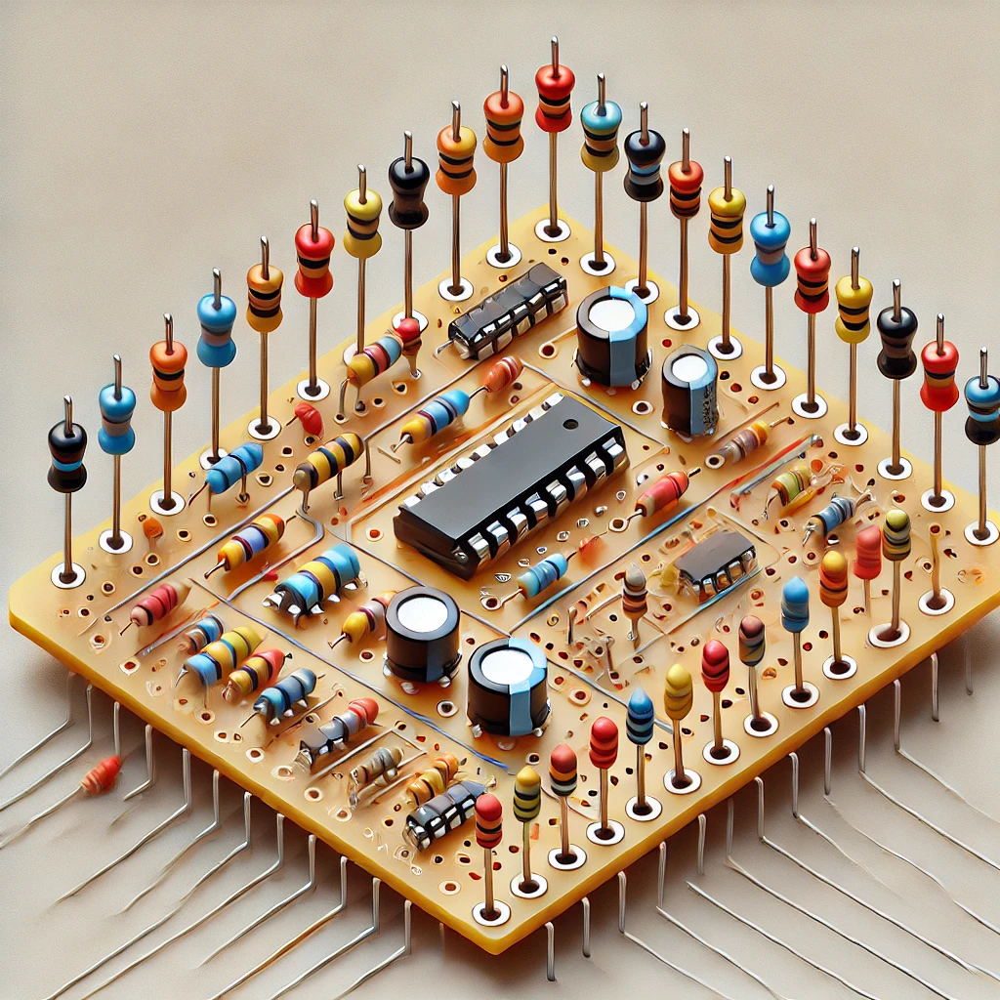

# Tema 57

Circuits electrònics

Elementos components i el seu funcionamient\.

Procedimients de connexió\.

# Índex

* __Introducción__
* __Componentes pasivos__
  * Resistencias
    * Resistencias fijas
    * Resistencias variables
    * Código de colores
  * Condensadores
  * Inductancias
* __Materiales semiconductores__
  * Conducción en los semiconductores
  * Semiconductores intrínsecos y extrínsecos
  * Unión PN
  * Diodos semiconductores
* __Transistores bipolares de unión__
  * Constitución\. Tipos
  * Diferentes configuraciones con transistores
  * Parámetros híbridos
  * Polarización de los transistores
* __Transistores de efecto de campo__
  * Transistores FET de unión
  * Transistores FET de puerta de salida
* __Semiconductores empleados en circuitos de control de potencia__
  * El tiristor
  * El triac
  * Elementos de disparo
    * El diac
    * El transistor uniunión
* __Resistencias no lineales__
  * Resistencias con coeficiente de temperatura negativo
  * Resistencias con coeficiente de temperatura positivo
  * Resistencias sensibles a la luz
  * Resistencias dependientes de la tensión
* __Dispositivos fotoeléctricos__
  * Fotocélulas
  * Fotosemiconductores
    * Fotodiodos
    * Fototransistor
  * Diodos emisores de luz
* __Amplificadores lineales integrados__
  * Estructura interna
    * El amplificador diferencial

# Components i elements

## Components electrònics

- Dispositivo que forma parte de un circuit electrònic.
- Normalment encapsulat.
- Té dos o més terminals o patilles metàl·liques.
- Estan dissenyats per a ser connectats entre ells, formant un circuit.

## Components Actius i Passius

Els components electrònics es poden classificar en dues categories:

## Components Actius

- Són capaços d'excitar circuits o de realitzar guanys o controls dins del circuit.
- Necessiten una font d'energia externa per al seu funcionament.
- Són components que poden modificar el flux de corrent a través d’un circuit i amplificar senyals.

## Components Passius

- No necessiten una font d'energia externa per al seu funcionament.
- No tenen la capacitat de controlar el corrent dins del circuit.
- Són components que simplement emmagatzemen, resisteixen, filtren o redirigeixen l'energia.

# Components Semiconductors

Els components semiconductors són elements fonamentals en l'electrònica moderna i es classifiquen segons el seu comportament elèctric i les seves aplicacions.

## 1. Materials Semiconductors
Els semiconductors són materials que tenen una conductivitat elèctrica situada entre la d'un conductor i un aïllant. Són la base per a molts components electrònics.

- **Conducció en els semiconductors**:
  - Els semiconductors permeten la conducció d'electricitat en condicions específiques, com quan són sotmesos a certs nivells de temperatura o voltatge.

- **Semiconductors intrínsecos i extrínsecos**:
  - **Intrínsecs**: Semiconductors pures, com el silici, que tenen una conductivitat limitada.
  - **Extrínsecs**: Semiconductors modificats mitjançant la dopatge, afegint impureses per millorar la seva conductivitat.

- **Unió PN**:
  - És la unió entre dos tipus de semiconductors: un de tipus P (positiu) i un de tipus N (negatiu), que permet la creació de components com els diodes i transistors.

## 2. Diodos Semiconductores
Els diodos són components semiconductors que permeten el pas de corrent només en una direcció. Són utilitzats per rectificar corrent altern (CA) a corrent continu (CC).

## 3. Transistores

Els transistores són components semiconductors utilitzats per amplificar o commutar senyals elèctrics.

### 3.1. Transistores Bipolars de Unió (BJT)
- **Constitució**: Els transistores bipolars tenen tres capes de material semiconductor: l'emissor, la base i el col·lector.
- **Tipus**:
  - **NPN**: La capa base és de tipus P, i les altres dues (emissor i col·lector) són de tipus N.
  - **PNP**: La capa base és de tipus N, i les altres dues (emissor i col·lector) són de tipus P.

- **Configuracions dels Transistores**:
  - Els transistores poden operar en diferents configuracions segons les seves connexions: en emisor comú, base comuna i col·lector comú.

- **Polarització dels Transistores**:
  - La polarització del transistor determina la seva activació i el flux de corrent entre les seves terminals.

### 3.2. Transistores d'Efecte de Camp (FET)
Els FET són transistores en què el corrent es controla per un camp elèctric en lloc d'un corrent de base com en els BJT.

- **Transistores FET de Unió (JFET)**:
  - En aquests transistores, la conducció de corrent es fa a través d'una unió pn.

- **Transistores FET de Porta de Salida (MOSFET)**:
  - Són els transistores més utilitzats en aplicacions d'amplificació i commutació.

## 4. Semiconductores en Circuits de Control de Potència

Els components semiconductors també s'utilitzen en circuits per controlar la potència, com en sistemes de control de motors i en rectificadors de potència.

- **Tiristor**:
  - Un dispositiu semiconductor que permet el control de la potència elèctrica, utilitzat principalment en rectificadors i circuits de commutació de potència.

- **Triac**:
  - Un dispositiu similar al tiristor, però amb la capacitat de conduir corrent en ambdues direccions. S'utilitza principalment en circuits de control de potència alterna.

# Semiconductors. Bandes conductores

# Semiconductors Intrínsecs (I)

## 1. Cristal de Silicio (Si)

- **Estructura**:
  - El cristal de silicio té una estructura **tetraèdrica** on els àtoms es connecten mitjançant **enllaços covalents**.

## 2. Comportament a Temperatura Ambient

Quan el cristal es troba a temperatura ambient, alguns electrons poden absorbir energia i:

- **Saltar a la banda de conducció**.
- **Deixar un hueco** a la banda de valència.

### 2.1. Energia Requerida

- Per al **silici**: 1,12 eV
- Per al **germanio**: 0,67 eV

## 3. Fenòmen de Recombinació

- Els electrons poden caure des de la banda de conducció fins a un hueco a la banda de valència, **liberant energia**.
- Aquest procés es coneix com a **recombinació**.

## 4. Equilibri entre Creació i Recombinació

- A una temperatura determinada, les **velocitats de creació de parells e-h** (electrons i huecos) i **recombinació** es **igualen**.
- Això provoca que la concentració global de electrons i huecos es mantingui invariable.

## 5. Concentració de Càrregues

- **n**: Concentració d'electrons (càrregues negatives).
- **p**: Concentració de huecos (càrregues positives).
- **ni**: Concentració intrínseca del semiconductor, depenent exclusivament de la temperatura.

La relació entre aquestes concentracions es compleix així:

- **n = p = ni**

## 6. Efecte d'una Diferència de Tensió

Quan el cristal es sotmet a una **diferència de tensió**, es generen **dues corrents** elèctriques:

- La **corrent d'electrons lliures** que es desplacen a través de la banda de conducció.
- La **corrent de huecos** que es desplaça en la direcció contrària al camp elèctric:
  - Els electrons en la banda de valència tendeixen a saltar a **huecos pròxims**.
  - La velocitat i magnitud de la corrent de huecos és **molt inferior** a la de la banda de conducció.

# Tensió de Ruptura de la Unió PN

## 1. Comportament de la Tensió Inversa

- Quan la tensió inversa és **alta**, el corrent invers creix ràpidament a mesura que augmenta la tensió.
- Això pot provocar l'**efecte de ruptura de la unió**.

## 2. Causes de la Ruptura

La ruptura de la unió PN es pot deure a dos efectes principals:

### 2.1. Efecte Avalanxa

- Es produeix quan la tensió inversa provoca que els electrons en les bandes de valència guanyin suficient energia per alliberar altres electrons, produint una **allau** d'electrons.

### 2.2. Efecte Zener

- Es produeix quan l'augment del valor del **camp elèctric** a la zona de la unió provoca l'**arrancada** d'electrons d'enllaç, augmentant el corrent invers.

  - A l'invertir la tensió inversa, el **camp elèctric** arranca electrons d'enllaç, incrementant el corrent invers a través de la unió.

# Semiconductors. 

## 3. Procediments de connexió

### Placa de proves o entrenador
- Una **plaça de proves** (també coneguda com a "plaça de prototips" o "plaça de proves sense soldadura") és una base on es poden muntar components electrònics sense necessitat de soldar-los.
- Permet provar i modificar fàcilment els circuits en fase de disseny.

### Placa de tires
- Les **plaques de tires** són usades per muntar circuits de forma similar a les plaques de proves, però amb la diferència que els components es poden muntar sobre tires de contacte fixades sobre la base.

### Soldadura elèctrica
- La **soldadura elèctrica** s'utilitza per establir connexions permanents entre els components i les plaques de circuit.
- Es fa servir una **ferro de soldar** i **solda** (una alliatge que fon a baixa temperatura) per fixar els components als punts de connexió del circuit imprès o placa de proves.

### El circuit imprès
- Un **circuit imprès** (PCB, per les seves sigles en anglès) és una placa de material aïllant amb pistes de coure que connecten els components del circuit electrònic.

#### Tècniques per a construir circuits impresos:
1. **Fabricació amb rotuladors i cintes adhesives**:
   - Aquesta tècnica manual utilitza rotuladors per dibuixar les pistes del circuit sobre una placa, després de la qual es poden afegir elements com les cintes adhesives per protegir les zones que no s'han de gravar.

2. **Sistema fotogràfic o de fotogravat**:
   - El fotogravat és un procés que utilitza una capa fotosensible sobre el circuit per a transferir el disseny del circuit imprès de manera més precisa.
   - S'exposa la placa a la llum per a gravar el disseny sobre la placa de coure, i després s'afegeixen els components.

# Tècniques manuals

## 1) Placa de proves o entrenador

- Poden ser **perforades** o **interconnectades elèctricament** en l'interior, seguint una determinada seqüència.
- La inserció dels elements es fa a **pressió**.
- Aquest sistema s'utilitza per a **muntatges no permanents**.
- Els components podrien caure, però són **fàcilment extraïbles**.
- Una de les aplicacions més comunes és l'**elaboració de prototips**.

## 2) Placa de tires

- Les **plaques de tires** són de material **plàstic** o **aïllant** que, per una cara, porten tires perforades de **coure**.
- **Components**:
  - S'introdueixen en aquests forats i es **solden** a la placa seguint l'esquema prèviament dissenyat.
- El **circuit**:
  - Pot quedar muntat de manera **permanent**.
  - O bé es poden **recuperar els components** per a altres circuits.
- Els components es poden **treure fàcilment** amb un soldador.

## 3) Soldadura elèctrica

- La **soldadura elèctrica** és un procés habitual en el muntatge de circuits electrònics.
- Es fa servir per **connectar els diferents components**.

### Soldadura

- La **soldadura** és un sistema per unir permanentment dues peces metàl·liques o determinats productes sintètics mitjançant procediments tèrmics.
- La soldadura que s'utilitza en electrònica rep el nom de **soldadura tova**.

### Equipament

- Es realitza amb:
  - Un **soldador elèctric**.
  - Un **fil de soldadura** especial, constituït per una **aliatge d'estany i plom** que porta una **resina** incorporada per facilitar la unió de materials.

### Soldador

- El soldador té una **resistència elèctrica** en el seu interior que escalfa una punta de **coure** o un aliatge especial.
- La fusió es produeix a temperatures superiors als **180 ºC**.
- El soldador més usat per treballar amb circuits impresos és de **tipus llapis** i té una **potència de 25-30 W**.

### Avantatges de la soldadura

- Baixa **resistència elèctrica**.
- Gran **resistència mecànica** de la unió.

# Sistema fotogràfic o de gravat

* Molt útil per construir molts circuits iguals o quan la complexitat del circuit ens impedeix dibuixar a la placa\.
* Plaques recobertes amb uns papers negres que les protegeixen de la llum\.
* Sistema és semblant al que s'utilitza per revelar una fotografia\.
* Fases
  * 1\)  Obtenir un negatiu a escala natural del circuit que vulguis muntar\, amb paper vegetal\, acètic o plàstic transparent\. Sobre
  * 2\) Obre l'envàs que conté la placa presensibilizada de tipus positiva\, prenent precaucions perquè no li toqui la llum solar\.
  * 3\) Col·locar el teu dibuix sobre la placa del circuit imprès presensibilizado\.
  * 4\)Exposa el conjunt a l'acció de la llum\, preferiblement ultraviolada\. Per aquest procediment s'utilitzen isola amb llum de dia\.
    * El temps d'exposició serà de 2 a 5 minuts\.
  * 5\) Revelar amb un revelador per placa positiva\. Treure la placa i renta\-amb aigua sense rayarla\.
  * 6\) Després de comprovar que el dibuix és correcte\, rectificar amb un retolador o amb una fulla\.
  * Introdueix la placa en una safata d'atacar ràpid\. Mou el líquid a poc a poc fins que el coure hagi desaparegut\.
  * 7\) Treu la placa amb unes pinces de fotògraf i\, sense tocar\-la amb les mans\, Laval sota un raig d'aigua\.
  * 9\) Perfora els punts assenyalats i poseu els diferents components per la cara de material plàstic i soldar pel costat del coure
