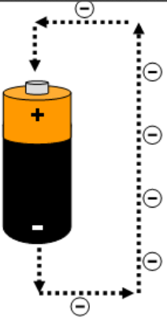

# Corriente alterna y corriente continua

* _Corriente continua \(CC o DC\)_
  * La corriente continua es un flujo continuo de electrones de un lado a otro con un sentido determinado\.
  * Ese flujo irá del polo negativo al polo positivo\.
* _Corriente alterna \(CA o AC\)_
  * Varía su valor desde 0 a un valor máximo  y luego disminuye hasta llegar a 0\.
  * Posteriormente cambia de sentido y  decrece desde 0 hasta un valor mínimo y  aumenta hasta llegar a 0\.

# Corrent altern. Valors característics

Els corrents alterns (CA) tenen diverses propietats que els caracteritzen. A continuació es descriuen els valors més importants en aquest tipus de corrent.

## Freqüència
- La **freqüència** és el nombre d'oscil·lacions que es produeixen per unitat de temps.
- Es mesura en **Hertz (Hz)**.

## Període
- El **període** és el temps transcorregut entre dos punts equivalents de l'oscil·lació.
- Equival al temps necessari per completar una oscil·lació.
- Es mesura en **segons (s)**.

## Valor Eficaç
- A causa de que la meitat del temps la senyal és positiva i l'altra meitat negativa, la mitjana de la magnitud sinusoïdal durant un període **T** és **zero**.
- Per això, la magnitud mesurable del corrent altern es mesura pel **valor eficaç**, també conegut com la **mitjana quadràtica**.

## Valor Mitjà
- El **valor mitjà** és una altra manera de mesurar una magnitud sinusoïdal, però no es fa servir sovint per a corrents alterns, ja que el valor eficaç ofereix una mesura més representativa.

## Factor de Forma
- El **factor de forma** és la relació entre el valor eficaç i el valor mitjà.
