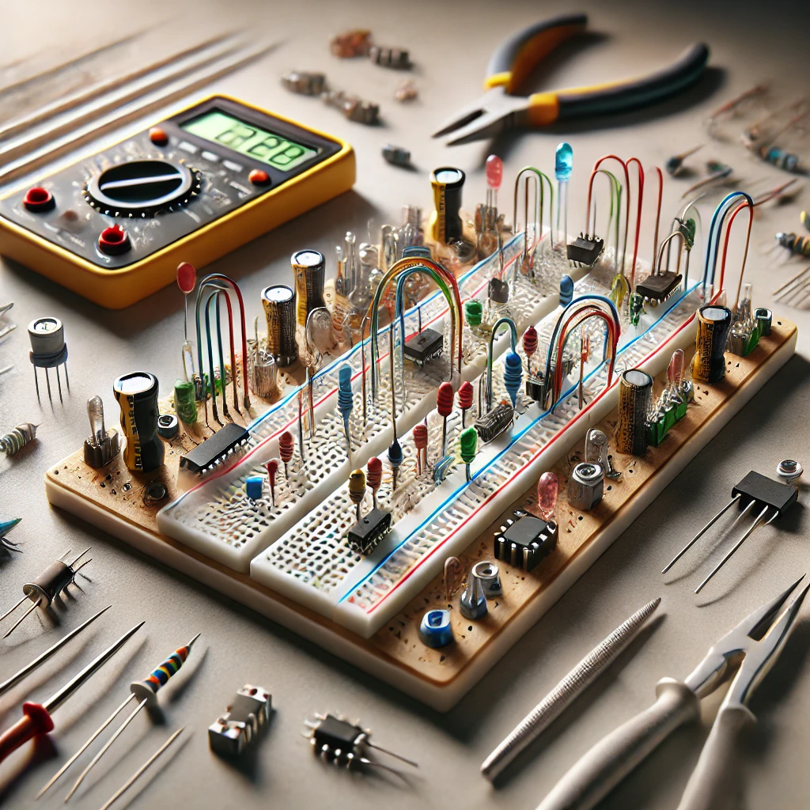
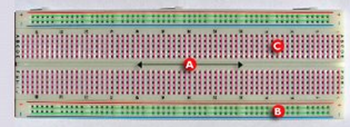
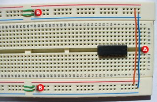

# Procediments de connexió. Protoboard

## Definició

- És un **tauler amb orificis**.
- S'hi poden inserir **components electrònics** i **cables** per fer circuits.
- Serveix per a **experimentar amb circuits electrònics**.
- El seu objectiu és **assegurar el bon funcionament** dels circuits abans de realitzar el muntatge definitiu.

## Recomanacions en utilitzar el **protoboard**

1. **Fer les següents connexions:**
   - **A)** Aquesta connexió serveix perquè ambdós parells de buses condueixin corrent quan se'ls afegeix una font d'alimentació. Això fa més fàcil manipular els circuits integrats.
   - **B)** Alguns protoboards tenen separada la part central dels buses, per això es realitza aquesta connexió per donar continuïtat a la corrent.

2. **Col·loca els circuits integrats en una sola direcció**, de dreta a esquerra o a l'inrevés.

3. **Evita el cablejat aeri**, ja que pot resultar confús en circuits complexos. Un cablejat ordenat millora la comprensió i la portabilitat.

## Estructura del **protoboard**

### A) Canal central:
- És la regió ubicada al centre del protoboard, utilitzada per col·locar els circuits integrats.

### B) Buses:
- Els buses es localitzen als dos extrems del protoboard.
- Es representen per les línies **roges** (buses positius o de voltatge) i **blaves** (buses negatius o de terra).
- Conduïxen d'acord amb aquestes línies, però no hi ha connexió física entre elles.
- La font d'alimentació es connecta aquí.

### C) Pistes:
- Les pistes es localitzen a la part central del protoboard.
- Es representen i condueixen segons les línies **roses**.

