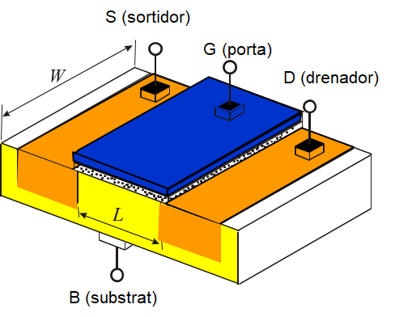

# Transistors (I)

## 1. Funcions del transistor
Un transistor pot utilitzar-se per a:
- **Amplificar senyals elèctriques**.
- **Actuar com a interruptor**.

## 2. Tipus de transistors
Els tipus més comuns de transistors són:
- **Bipolars**
- **De efecte de camp (FET)**

## 3. Transistors bipolars
Els transistors bipolars estan formats per **3 capes** de material semiconductor:
1. **Base** (interior)
2. **Colector** (exterior)
3. **Emissor** (exterior)

### 3.1. Tipus de transistors bipolars

- **NPN**
  - Una capa de semiconductor **P** ubicada entre dues capes de semiconductor **N**.

- **PNP**
  - Una capa de semiconductor **N** ubicada entre dues capes de semiconductor **P**.

# Transistors

## Configuracions de transistors

Les configuracions més comunes per a transistors són:

### 1. Emissor comú
- És una de les configuracions més utilitzades en circuits d'amplificació i en interruptors.
- En aquesta configuració, l'emissor es manté comú a les dues parts del circuit (entrada i sortida).

### 2. Col·lector comú
- **Descripció**:
  - El col·lector es connecta a les masses tant del senyal d'entrada com del senyal de sortida.
  - El senyal s'aplica a la **base** del transistor i s'extreu per l'**emissor**.
- **Propietats**:
  - Aquesta configuració proporciona **guany de corrent**, però **no de tensió**, ja que la tensió a la sortida és lleugerament inferior a la unitat.
  - **Impedància de sortida**: La configuració multiplica la impedància de sortida per **x 1 / β**, on β és el guany del transistor.

### 3. Base comuna
- En aquesta configuració, la base es manté comuna entre les parts d'entrada i sortida, amb la característica de no tenir guany de tensió ni de corrent en algunes aplicacions.

# Transistors (II)

* Formes de funcionament
  * __Tall__
    * No es subministra suficient corrent a la base
    * El transistor impedeix el pas de corrent entre colector i emisor
  * __Saturació__
    * Base reb suficient corrent per a que circuili la màxima corrent entre el colector i l’emisor
  * __Activa__
    * Base reb un corrent inferior al corrent de saturació
* Guany d’un transistor
  * Relació entre el corrent de sortida i el corrent d’entrada
  * Es calcula com el quocient de Ic \(colector\) i Ib \(base\)

# Transistors d'efecte de camp (FET)

Els **transistors d'efecte de camp** (FET) són una família de transistors que utilitzen el **camp elèctric** per controlar la conductivitat d'un "canal" en un material semiconductor.

## Característiques generals:
- Els FET es poden considerar com resistències controlades per voltatge.
- Aquests dispositius varien la seva resistència en funció del voltatge aplicat al seu **portador de control** (com la base en altres tipus de transistors).
- Són essencials en circuits de conmutació i amplificació on es vol controlar la corrent de manera eficient i amb una alta impedància d'entrada.

## Tipus més coneguts:
1. **JFET (Junction Field-Effect Transistor)**:
   - Utilitza una unió PN per controlar el corrent a través d'un canal semiconductor.
   - Són sovint utilitzats en aplicacions d'amplificació de senyals petits degut a la seva alta impedància d'entrada.

2. **MOSFET (Metal-Oxide-Semiconductor Field-Effect Transistor)**:
   - Utilitza una capa d'òxid de metall com a aïllant per controlar el flux de corrent a través d'un canal.
   - Són àmpliament utilitzats en circuits digitals i d'amplificació degut a la seva eficiència i velocitat de commutació.

# Transistors MOS (I)

