## Engranajes

Los engranajes de rueda dentada son uno de los mecanismos más utilizados para la transmisión del movimiento. En general, los engranajes de rueda dentada se componen de dos ruedas dentadas que están unidas por un eje. Las ruedas dentadas se encuentran en contacto y los dientes se interbloquean.

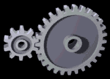

Las ruedas dentadas se pueden mover en el mismo sentido o en sentidos opuestos. Si las ruedas dentadas se mueven en el mismo sentido, se llama una reducción; si las ruedas dentadas se mueven en sentidos opuestos, se llama una transmisión.

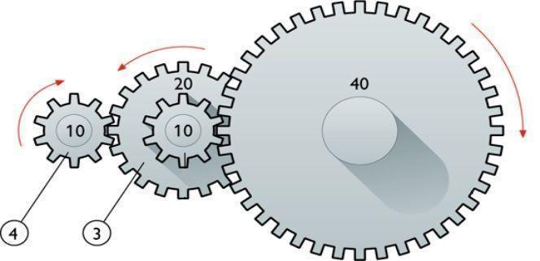

Los engranajes de rueda dentada de rueda dentada pueden transmitir un movimiento uniforme a una velocidad diferente.

https://geargenerator.com/

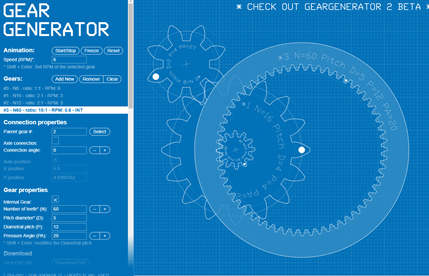

### Caja de cambios

La caja de cambios trabaja ajustando la ``relación de transmisión``, que es la proporción entre la velocidad de rotación del cigüeñal del motor y la velocidad de rotación de las ruedas. Esta relación se controla mediante la selección de diferentes ``engranajes`` que conectan el motor con las ruedas. En términos de energía, la caja de cambios ayuda a optimizar la eficiencia del motor y a proporcionar la potencia necesaria para diversas condiciones de conducción.

Reducción de RPM del Motor: Al subir de marcha, el motor opera a un régimen de RPM más bajo en comparación con la marcha anterior. Los motores a menudo son más eficientes en términos de consumo de combustible y desgaste a RPM más bajas. Esto puede mejorar la eficiencia del motor y, en última instancia, la eficiencia general del vehículo.

Aumento de la Eficiencia del Motor en su Rango Óptimo: Los motores tienen un rango de RPM en el que son más eficientes en términos de consumo de combustible y producción de potencia. Al cambiar a una marcha más alta, puedes mantener el motor dentro de este rango óptimo, mejorando así la eficiencia.

Vamos a suponer un diámetro de rueda de 50 cm, a fin de determinar cuanto avanza la rueda en una vuelta:

https://www.tecnologia-automovil.com/articulos/tecnologias-limpias/relacion-de-transmision/

https://www.youtube.com/watch?v=QmpB1-DJZY8&t=137s

Calculador motores y cambios de marchas: https://www.blocklayer.com/rpm-gear

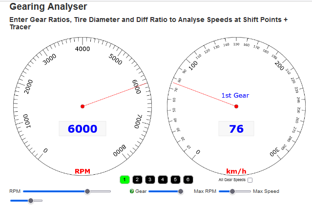

## Planetario

Se trata de un sistema mecánico con movimiento rotacional que, por su diseño, es capaz de cambiar, acumular y distribuir Velocidades angulares de entrada* y/o el par motor a los satélites a lo largo del mismo ejemplo
de rotación.

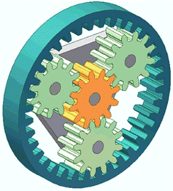

Incluye también la corona, el portasatélites y el piñón central o “planeta”.

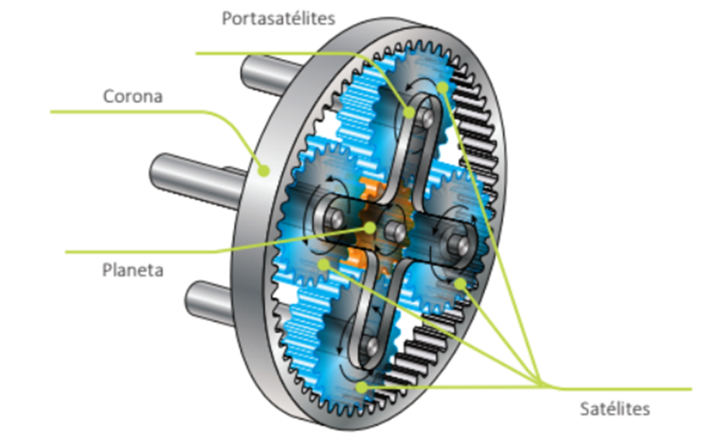

Video: https://www.youtube.com/watch?v=KWTuMyas5wo

## Diferencial

El diferencial permite que las ruedas izquierda y derecha giren a velocidades diferentes. Consiste en una serie de engranajes planetarios que distribuyen el par de manera variable entre las ruedas, permitiendo que cada rueda gire a una velocidad diferente según sea necesario.

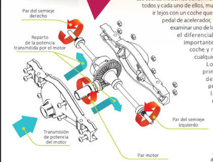

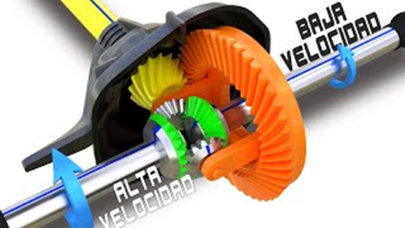

Video:

https://www.youtube.com/watch?v=NG2z5eFTflw

## Cadenas

Las cadenas son uno de los mecanismos más simples para transmitir el movimiento. Una cadena es una serie de eslabones conectados. Los eslabones pueden girar libremente en torno a su eje.

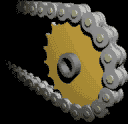

Las cadenas se utilizan principalmente en bicicletas, motocicletas, motores de bote y trenes de juguete.

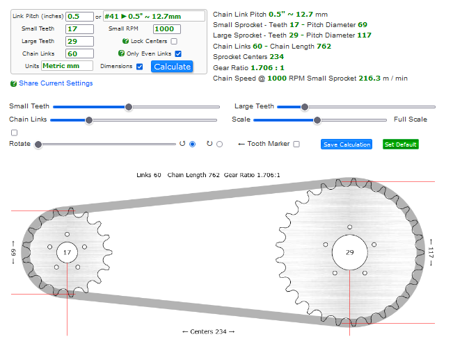

### Piñones y platos

Se denomina piñón a la rueda de un mecanismo de cremallera o a la rueda más pequeña de un par de ruedas dentadas

En una etapa de engranaje, la rueda más grande se denomina corona, mientras que en una transmisión por cadena como la de una bicicleta o motocicleta además de corona a la rueda mayor se le puede denominar plato, «estrella» o «catalina»

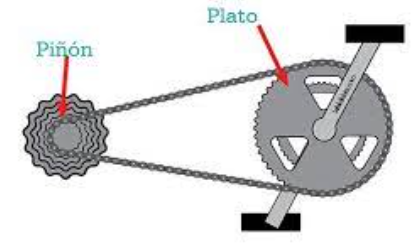
