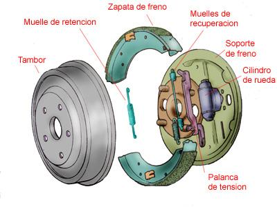
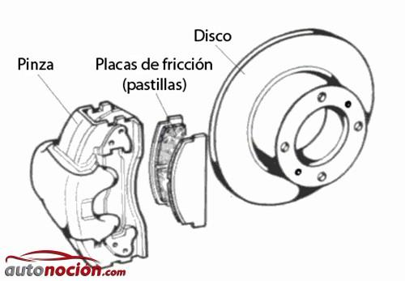
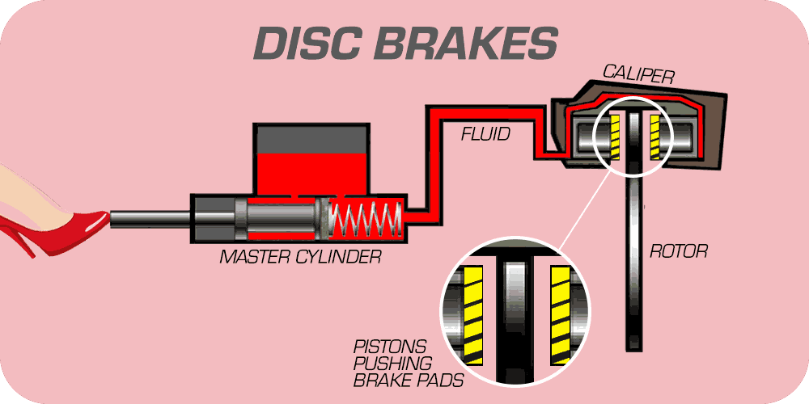
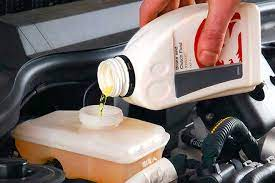
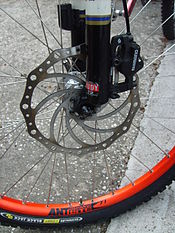
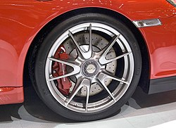
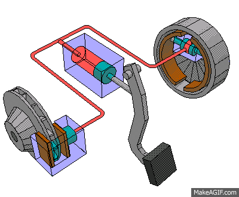
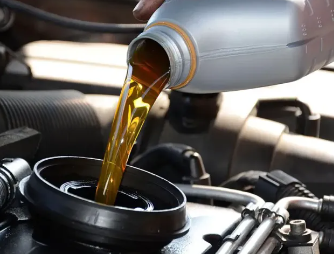
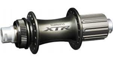
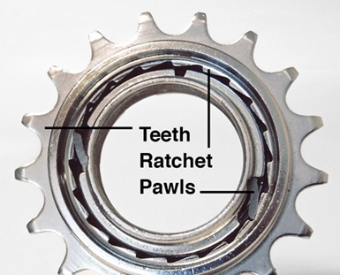

# Sistemas de retención

Destinados a interrumpir a voluntad el movimiento de rotación del eje.

## Frenos

Los sistemas de frenado son elementos mecánicos que se utilizan para reducir o detener el movimiento de una máquina.

Su funcionamiento consiste en aumentar las resistencias que se producen en una máquina durante su funcionamiento.

La energía cinética que poseen los elementos móviles se transforma en trabajo durante la deceleración, generando calor.

## Pastillas de freno

Las pastillas de freno pueden estar hechas de materiales metálicos o cerámicos, dependiendo del tipo de freno y de las condiciones de funcionamiento.

Las pastillas se van desgastando con el uso, y pierden gran parte del material, por lo que dejan de ser efectivas y tienen que ser sustituidas.

## Frenos de tambor

El sistema de freno de tambor se compone de un tambor que se encuentra en el interior de la rueda, y que gira junto con ella.

Las zapatas son piezas de metal en forma de arco que se ajustan dentro del tambor, y que se activan para crear fricción y detener la rotación del tambor y, por lo tanto, de la rueda.

Cuando se presiona el pedal de freno, una serie de piezas mecánicas e hidráulicas trabajan juntas para empujar las zapatas contra el tambor, lo que crea la fricción necesaria para detener el vehículo.

## Frens de disc

Els frens de disc funcionen mitjançant una pinça que pren un disc col·locat en l'eix de gir. La pinça pressiona dues pastilles de fre, una a cada costat del disc, per frenar el moviment. Això es fa mitjançant èmbols que s'accionen amb pressió hidràulica.

El líquid que circula en el sistema de frenat es diu líquid de frens.

Hi ha dos tipus de frens de disc: sistema rígid i sistema flotant. En el sistema rígid, els èmbols pressionen per ambdós costats del disc de manera simultània, mentre que en el sistema flotant, una pinça solidària duu dos pistons, un acciona directament sobre una de les pastilles de fre i l'altre acciona sobre l'altra per mitjà de la porta de la pinça.

## Accionament dels sistemes de frenat

Hi ha diferents tipus d'accionament dels sistemes de frenat que s'utilitzen en vehicles i altres màquines. Els dos tipus més comuns són els sistemes de frenat mecànics i hidràulics.

**Accionament mecànic**

Els sistemes de frenat mecànics utilitzen una vareta per mitjà d'una palanca per fer girar la lleva i separar les sabates de frens per aplicar-les contra el tambor.

**Accionament hidràulic**

Los sistemas de frenado hidráulicos utilizan un líquido para transmitir la presión a través de una columna de líquido que actúa como transmisor de energía.

## Líquidos de freno

El líquido de frenos es un fluido hidráulico que se utiliza en el sistema de frenos. El líquido transmite la presión ejercida por el conductor sobre el pedal del freno a las zapatas o pastillas de freno, que a su vez generan la fricción necesaria para detener el vehículo.

## Servofrens

Los servofrenos son un tipo especial de sistema de frenado que ayuda a reducir la fuerza de la fuerza que se debe realizar en el pedal de freno. 

Los servofrenos utilizan una fuente externa de energía, como el aire comprimido o la energía hidráulica, para ayudar a aplicar la fuerza a los frenos y reducir el esfuerzo que se debe hacer en el pedal.

Los servofrenos neumáticos son los más habituales y utilizan una válvula para dejar pasar aire comprimido que acciona los émbolos para aplicar la fuerza a los frenos.

## Trinquetes

Permite que una pieza o componente se mueva en una dirección determinada, pero no en la dirección opuesta.

El trinquete generalmente está compuesto por una rueda dentada y una palanca que se encajan entre las dientes de la rueda dentada para evitar que la pieza se mueva hacia atrás.

Permiten rotación de un eje en un sentido determinado le impiden en lo opuesto

Sistema de trinquet. Compost de:

- Roda dentada. Dents tenen un costat recte i l’altre corb.
- Nucli o trinquet. Articulat en una part fixa, encaixa en el costat recte de la dent
- Bon funcionament quan el trinquet, en contacte amb la dent, tendeix espontàniament a introduir-se a l’espai lliure.

<img src="media/image55.png" id="imag

### Carraca

Permite apretar o aflojar tornillos y tuercas, ya que te permite aplicar fuerza en un solo sentido sin tener que levantar y reposicionar la herramienta.

## Ruedas de bicicleta

Permite que la rueda gire en una dirección (hacia adelante) mientras el piñón se engancha para impulsar la bicicleta, pero permite que la rueda gire libremente en la dirección opuesta (hacia atrás) sin mover la cadena ni los pedales.

Esto es esencial para que puedas dejar de pedalear y la bicicleta pueda avanzar sin forzar la transmisión.

