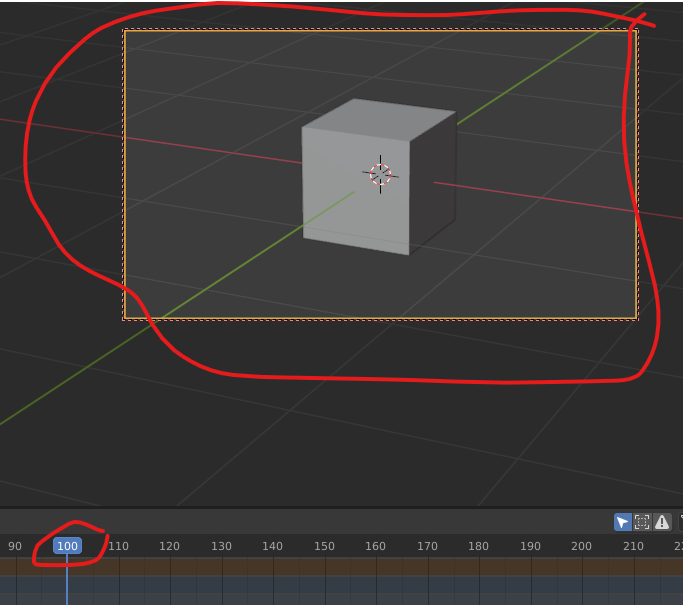
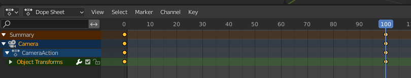
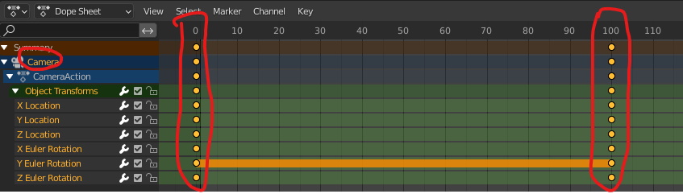
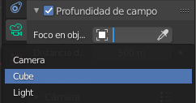

# Animación

Vamos a hacer que la cámara se mueva alrededor de la escena, mientras que el objeto permanecerá fijo.

## Crear una cámara

Lo siguiente va a ser crear una cámara. Para ello hacemos <kbd>shift</kbd> + a. Por defecto nos la genera ahí en el centro.

## Ver el punto de vista de la cámara

Podemos darle al 0 para irnos a la cámara, pero como veis si intentamos movernos nos salimos de la cámara. Al pulsar 0 otra vez saldremos de estas vista.

# Modificar la posición

La podemos mover como cualquier objeto, por ejemplo haciendo gx o gz.

También podemos colocarla con la tecla <kbd>n</kbd> y variando los parámetros de posición y rotación

## Mover la cámara con nosotros

Si le damos a la <kbd>n</kbd> , a continuación seleccionamos view y lo que es camera to view. Ahora cuándo movamos la vista también se mueve nuestra cámara, que nos seguirá.

## Configuración de la cámara

En la configuración de cámara le damos poner que queremos una distancia focal de 120 milímetros (mm)

Vamos a componer nuestra imagen de esta forma vale la animación que quiero que haga la cámara es muy simple simplemente quiero que haga una especie de órbita. 

## Insertar fotogramas clave

Los frames son las fotos que componen un video. 
- Cuantos más frames en un segundo, más fluida se verá la animacion.
- Si tenemos un framerate de 30 fps y grabamos 120 fps, nuestra animación durará 4 segundos.

**¿Qué es un fotograma clave o keyframe?**

Un keyframe es en realidad una marca que guarda la posición, escala, rotación y opacidad de un objeto en un momento específico de la escena. Si creas más de dos keyframes con una variación de posición, escala, rotación y opacidad entre ellos, verás que automáticamente ocurrirá una animación

Si le damos al 0 nos ponemos en la vista la cámara, y veremos que si nos movemos, la cámara nos sigue.

Lo que vamos a hacer para ello va a ser un aquí al primer fotograma le vamos a dar con nuestra cámara seleccionada aquí le damos a la i y esto nos va a insertar un keyframe un fotograma clave le vamos a localización y rotación 

Vamos a avanzar 100 fotograma movemos un poquito la cámara e insertamos otro fotograma localización y rotación

 Si ahora le damos al play ya tendríamos nuestra animación hecha. Veréis que la animación no se detiene en el 100, por lo que la tendremos que parar nosotros.

Analicemos el timeline

Aquí vemos que el único objeto animado ha sido la cámara. De hecho, el cubo sigue en su sitio.

Si ampliamos podemos ver la siguiente información. Tenemos dos **keyframes**

- Uno en el 0. Es la "foto" de nuestra escena en ese momento.
- Otro en el 100. Aquí las posiciones de los objetos habrán cambiado.

En medio, Blender calculará (extrapolará) todos los frames intermedios que conducirán al movimiento entre esas dos posiciones.

## Animando el cubo

Ahora vamos a hacer que el cubo se haga más pequeño poco a poco. Para ello, en primer lugar, debemos seleccionar el cubo.

Veremos que el timeline en la parte inferior está vacío, pues no lo hemos animado todavía el cubo (solo habíamos animado la cámara).

El primer keyframe lo ponemos en el 100. En este caso, repetiremos los mismos pasos, pero ahora seleccionamos Posición, rotación y escala.

Luego nos posicionamos en el 160, escalamos el cubo y fijamos el segundo keyframe

Al tener 160 frames:

- En un video de 24 FPS nuestra animación durará: 160 / 24 = 6,67 s
- Si fuera de 60 FPS, duraría 2,6 s

Si seleccionamos tanto la cámara como el cubo, veremos en el timeline ambos objetos, y sus correspondientes keyframes.

## Enfoque y desenfoque

Lo que vamos a hacer es que nuestra cámara enfoque y desenfoque. Para ello nos vamos a donde pone cámara y donde pone de **perfil de profundidad de campo** y como veis automáticamente se ha desenfocado todo.

Podemos decirle que enfoque un objeto en concreto, por ejemplo nuestro cubo. Hará un autofocus hacia el objeto, esté donde esté.

## Renderizar la animación

Ya lo tenemos casi todo preparado para irnos a renderizar, pero primero tengo que ajustar como queremos renderizar esta imagen. 

