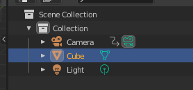
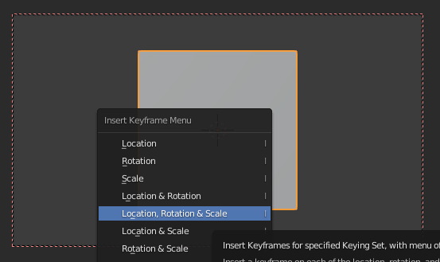
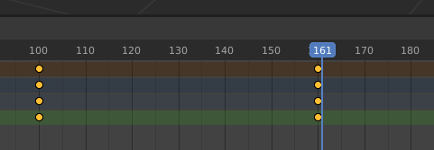
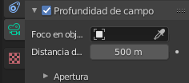

# 3.2 Animación de un objeto

Ahora vamos a hacer que el cubo se haga más pequeño poco a poco. Para ello, en primer lugar, debemos seleccionar el cubo.

Veremos que el timeline en la parte inferior está vacío, pues no lo hemos animado todavía el cubo (solo habíamos animado la cámara).

El primer keyframe lo ponemos en el 100. En este caso, repetiremos los mismos pasos, pero ahora seleccionamos Posición, rotación y escala.

Luego nos posicionamos en el 160, escalamos el cubo y fijamos el segundo keyframe

Al tener 160 frames:

- En un video de 24 FPS nuestra animación durará: 160 / 24 = 6,67 s
- Si fuera de 60 FPS, duraría 2,6 s

Si seleccionamos tanto la cámara como el cubo, veremos en el timeline ambos objetos, y sus correspondientes keyframes.

## Enfoque y desenfoque

Lo que vamos a hacer es que nuestra cámara enfoque y desenfoque. Para ello nos vamos a donde pone cámara y donde pone de **perfil de profundidad de campo** y como veis automáticamente se ha desenfocado todo.

Podemos decirle que enfoque un objeto en concreto, por ejemplo nuestro cubo. Hará un autofocus hacia el objeto, esté donde esté.

## Renderizar la animación

Ya lo tenemos casi todo preparado para irnos a renderizar, pero primero tengo que ajustar como queremos renderizar esta imagen. 

## Hacer que la cámara siga una curva y apunte a objeto

Los pasos seguidos son:

- Crear una curva
- Agregar restricción a la cámara para que siga trayecto
- Restablecer posición de la cámara
- Agregar restricción a la cámara para que apunte a objeto
- Modificar el trayecto de la curva (en edit mode)

Video: https://www.youtube.com/watch?v=M9XMEEMnRJk

