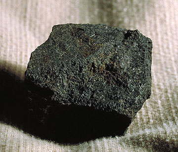
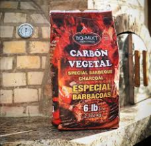
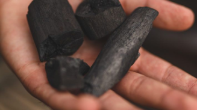
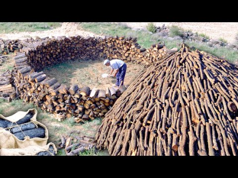
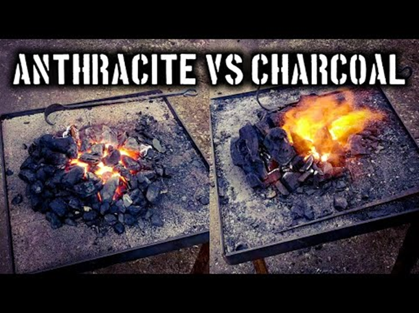
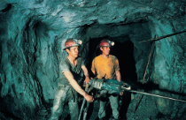
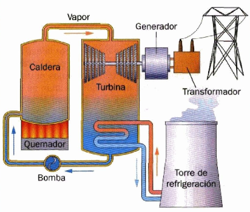
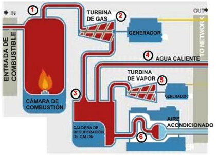
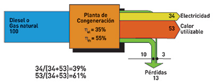

# Carbón

Es un material combustible, sólido, frágil y poroso, con un alto porcentaje de carbono.

Se produce mediante el calentamiento de la madera o residuos vegetales en ausencia de aire (carbonización) a temperaturas que oscilan entre los 400 y los 700 ºC.

Su poder calorífico suele oscilar entre los 25.000 y 35.000 kj/kg, llegando a tener hasta 3 veces más que el de la leña.

## Carbón vegetal

## Creación de carbón vegetal

- Primera etapa: hasta alcanzar los 170ºC, mayormente se produce la deshidratación de la madera y la destilación de algunos aceites esenciales; unido todo ello a una pequeña degradación de la madera. Hasta los 270ºC.
- Segunda etapa: existe unos abundantes desprendimientos de gases como el carbono dióxido y el carbono monóxido y también líquidos acuosos.
- Tercera etapa: se llegan a alcanzar temperaturas superiores a 600ºC donde se produce la carbonización, el desprendimiento de sustancias volátiles es máximo, y el residuo sólido resultante es el carbón vegetal.

### CARBÓN MINERAL

Existen distintos tipos de carbón según su antigüedad: A mayor antigüedad, mayor transformación, mayor % de C y menor % de otros elementos como N, S  y agua. Mayor calidad y poder calorífico.

- La **TURBA**  es el carbón de menor poder calorífico (300 Kcal/Kg), se está produciendo en la actualidad en zonas frías y húmedas en las que la materia orgánica no se degrada. Todavía se aprecian restos orgánicos a simple vista.
- El **LIGNITO** tiene un poder calorífico de 6000 Kcal/Kg. Su aspecto es más oscuro y compacto, pero no tiene brillo. Es el carbón más abundante en las cuencas mineras Españolas.
- La **HULLA**  tiene un poder calorífico de 7000-8000 Kcal/kg y su aspecto es más compacto y con cierto brillo.
- La **ANTRACITA** es la de mayor poder calorífico (8500 Kcal/Kg). Su aspecto es duro y seco y con intenso brillo metálico. Si las condiciones de presión y temperatura siguen aumentando, se transforma en GRAFITO (condiciones de metamorfismo)

### Ventajas

El carbón es un combustible de alto poder calorífico y abundante (existen reservas para unos 220 años al ritmo de consumo actual), pero también es un combustible muy **sucio**, con alto contenido en **azufre** que al quemarse produce SOX (lluvia ácida y smog clásico). Además emite el **doble de CO2** que el petróleo.

### Extracción del carbón

Dependiendo de la profundidad del carbón, se extrae de explotaciones a cielo abierto o de minas subterráneas:

**EXPLOTACIONES A CIELO ABIERTO**

- Económicas
- Gran impacto ambiental y paisajístico
- La actual legislación obliga a las compañías a hacer restauraciones paisajísticas una vez finalizada la explotación

**MINAS SUBTERRÁNEAS**

- Alto coste económico
- Alto riesgo de accidentes (explosiones, colapso de galerías, etc.)
- Alto riesgo de enfermedades derivadas (silicosis, pulmones negros)

### Impactos de la minería en general

Las minas generan:

- Grandes ESCOMBRERAS donde se acumulan los productos que no interesan de la extracción
- Contaminación del aire por polvo
- Contaminación del agua por lixiviados de las balsas de lavado

## CENTRALES TÉRMICAS

En las centrales térmicas se produce el 30% de la electricidad mundial. Existen varios tipos:

### 1) CENTRAL CLÁSICA

El carbón se quema para generar vapor, que hace girar unas turbinas que mueven los alternadores, donde se transforma la E. mecánica en E. eléctrica que va ya a la red de distribución.

Este proceso es muy poco eficiente (aprox. 32% de la E. del carbón se transforma en E. eléctrica) y de alto grado de impacto ambiental (produce gran cantidad de CO2, SOx y NOx y los impactos de la minería).
Para minimizar los efectos nocivos, se han buscado alternativas:

- Preprocesado del carbón: Triturarlo y lavarlo para eliminar el azufre. (Genera grave contaminación del agua)
- Gasificación del carbón: En una combustión incompleta con alto contenido en hidrógeno, se forma un conjunto de gases combustibles de los cuales es más fácil eliminar los compuestos de azufre
Filtros en la chimenea que retienen los SOx

Actualmente se sustituye el carbón por derivados del petróleo (fuel) y sobre todo gas natural (mayor poder calorífico, mayor eficiencia y menor contaminación, ya que reduce la generación de CO2,  SOx y NOx)

Productos derivados del carbón
PRINCIPAL USO DEL CARBÓN: CENTRALES TÉRMICAS

### 2) Centrales termoeléctricas de ciclo combinado

Funcionan con 2 turbinas:

- Una TURBINA DE GAS que utiliza gas natural o carbón gasificado como combustible, pero en lugar de calentar agua, se aprovechan los propios gases dela combustión para accionar una turbina y un generador eléctrico.
- Una TURBINA DE VAPOR clásica

En algunos casos también se aprovecha el calor de los gases de la combustión (600ºC) para general vapor de alta presión, que mueve una tercera turbina

Con este método se consiguen eficiencias mucho más altas (hasta 55%) y se produce menor contaminación.

### 3) SISTEMAS DE COGENERACIÓN

Son sistemas de alta eficiencia donde se aprovecha el mismo combustible para generar 2 o  más productos: electricidad y calor aprovechable (hornos, agua caliente, etc.) o electricidad y E. mecánica (movimiento de una máquina). Es muy útil en industrias Ej. Azulejeras de Castellón: aprovechan el calor de los hornos para generar vapor y mover una turbina (se autoabastecen de electricidad), pero también en viviendas, ej: calderas para generar electricidad, agua caliente sanitaria y calefacción

Su filosofía consiste en recuperar la E. útil del combustible para aprovecharla al máximo.
