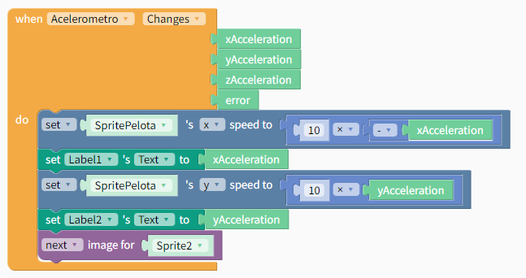

En primer lugar crearemos un canvas. Al crearlo, por defecto nos creará un stage y, dentro de este, un spritetype.

## Movimiento de pelota con acelerómetro

El evento changes nos permitirá recalcular la posición de la pelota cada vez que el acelerómetro cambie su valor.

En primer lugar asignaremos a dos label los valores actuales del acelerómetro para poder comprobar su funcionamiento. Esto al final lo podremos quitar.

Por otra parte, nos 

