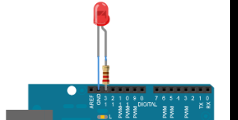
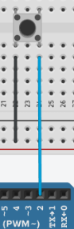

# Prácticas LED

Vamos a aprender a utilizar luces LED, botones y resistencias utilizando``Arduino``.

Para ello, diseñaréis, programaréis y simularéis circuitos variados utilizando principalmente resistencias, LEDs y botones.

# Práctica 1: Parpadeo LED integrado


# Práctica 2: Parpadeo LED Rojo externo

Parpadeo de un LED Rojo conectado a``Arduino``.



# Práctica 3: semáforo simple

## Semáforo de coches

En esta práctica programaremos un semáforo con tres leds: rojo, amarillo y verde, simulando un semáforo.

### Montaje


### Código

```c
// ``C++`` code
//
void setup()
{
  pinMode(13, OUTPUT);
  pinMode(10, OUTPUT);
  pinMode(7, OUTPUT);
}

void loop()
{
  //Encender verde
  digitalWrite(7, HIGH);
  digitalWrite(10, LOW);
  digitalWrite(13, LOW);
  delay(5000);
  //Encender amarillo
  digitalWrite(7, LOW);
  digitalWrite(10, HIGH);
  digitalWrite(13, LOW);
  delay(2000);
  //Encender rojo
  digitalWrite(7, LOW);
  digitalWrite(10, LOW);
  digitalWrite(13, HIGH);
  delay(5000);
}
```

# Práctica 4: semáforo de coches y peatones

Como ampliación, en este montaje controlaremos dos semáforos. Uno de peatones, y uno de coches.

- Cuando el de coches esté en rojo, el de peatones estará en verde, y viceversa
- El semáforo de coches pasa de verde a rojo pasando por el amarillo, y del rojo al verde directamente.

### Montaje


# Práctica 5: Semáforo con pulsador

En este ejemplo, el semáforo estará siempre en rojo, a no ser que pulsemos el botón. En ese caso, el semáforo pasará a verde, luego a ámbar y, por último, a rojo.

## Conexiones

Elegiremos 3 pines a los que colocar los LED, en mi caso 8, 9 y 10. Los 3 LED tendrán una resistencia en el camino, para protegerlos.

Tanto los LED como el pulsador se conectaran por la otra patilla hacia la entrada GND (tierra).


El pulsador irá conectado a otro pin, en mi caso he elegido el 2.




## Código del programa

```c
int ledVerde = 8;
int ledAmarillo = 9;
int ledRojo = 10;

int boton = 2;

void setup()
{
  pinMode(ledVerde, OUTPUT);
  pinMode(ledAmarillo, OUTPUT);
  pinMode(ledRojo, OUTPUT);

  pinMode(boton, INPUT_PULLUP);

  digitalWrite(ledRojo, HIGH);
}

void loop()
{
  if (digitalRead(boton) == LOW){
    delay(1000);
  	//Encender verde
  	digitalWrite(ledVerde, HIGH);
  	digitalWrite(ledAmarillo, LOW);
  	digitalWrite(ledRojo, LOW);
  	delay(5000);
  	//Encender amarillo
  	digitalWrite(ledVerde, LOW);
  	digitalWrite(ledAmarillo, HIGH);
  	digitalWrite(ledRojo, LOW);
  	delay(2000);
  	//Encender rojo
  	digitalWrite(ledVerde, LOW);
  	digitalWrite(ledAmarillo, LOW);
  	digitalWrite(ledRojo, HIGH);
  	delay(5000);
  }
}
```

Una vez que la simulación sea correcta, pasaremos a implementar el circuito físicamente y programarlo.


