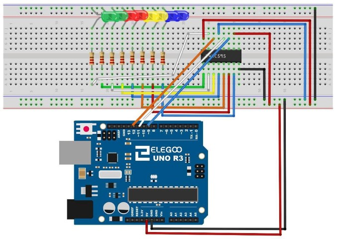

## Lección 16 Ocho LED con 74HC595

### Resumen

En esta lección, usted aprenderá cómo utilizar ocho LEDs rojo grandes con un UNO sin necesidad de renunciar a 8 patas de salida

Aunque usted podría conectar ocho LEDs con una resistencia a un pin UNO rápidamente empezaría a quedarse sin patas en su UNO. Si no tienes un montón de cosas conectadas a la ONU. Está bien hacerlo - pero a menudo tiempos queremos botones, sensores, servos, etc. y antes de saberlo que no tienes pernos de izquierda. Así, en lugar de hacer eso, vas a usar un chip llamado el 74HC595 Serial a paralelo convertidor. Este chip tiene ocho salidas (perfectos) y tres entradas que utilizas para alimentar datos en él un poco a la vez.


Este chip hace un poco más lento para los LEDs (sólo se puede cambiar el LED unos 500.000 veces por segundo en lugar de 8.000.000 por segundo) pero todavía es muy rápido, forma más rápido que los seres humanos puede detectar, asíque vale!

Componente necesario:

> * (1) x Elegoo Uno R3
> * 830 puntos tie breadboard
> * leds
> * resistencias de 220 ohmios
> * IC x 74hc595
> * M M cables (cables de puente de macho a macho)

### 74HC595 Registro de desplazamiento

El registro de desplazamiento es un tipo de chip que tiene lo que puede considerarse como posiciones de memoria ocho, cada uno de ellos puede ser un 1 o un 0. Para definir cada uno de estos valores encendido o apagado, alimentamos en los datos mediante los pines del chip 'Datos' y 'El reloj'.


El pin de reloj debe recibir ocho pulsos. En cada pulso, si el pin de datos es alto, entonces un 1 obtiene empujado en el registro de desplazamiento; de lo contrario, un 0. Cuando se han recibido los ocho impulsos, permitiendo el pin 'Pestillo' copia esos ocho valores en el registro de cierre. Esto es necesario; de lo contrario, parpadean mal los LEDs como se carga los datos en el registro de desplazamiento.

El chip también tiene un pin de salida activado (OE), que se utiliza para activar o desactivar las salidas a la vez. Podría conectar esto a un pin PWM capaz UNO y usar 'analogWrite' para controlar el brillo de los LEDs. Este pin es baja activa, por lo que nos ate a la tierra GND.


### Conexión

### Esquema

### Diagrama de cableado



Ya que tenemos ocho LEDs y ocho resistencias para conectar, hay realmente muy pocas conexiones a realizar.

Es probablemente más fácil poner el **chip 74HC595** en primer lugar, como casi todo lo demás se conecta a él. Ponerlo de modo que la muesca en forma de U poco hacia la parte superior de la placa. 

Pin 1 del chip es a la izquierda de esta muesca.
Digital 12 del UNO va al pin #14 del registro de desplazamiento 
Digital 11 del UNO va al pin #12 del registro de desplazamiento

9 digital a partir de la UNO va al pin #11 del registro de desplazamiento

Todos sino una de las salidas de la IC está en el lado izquierdo del chip. Por lo tanto, para facilitar la conexión, es donde están los LEDs, también.

Después de la viruta, poner las resistencias en su lugar. Usted necesita tener cuidado de que ninguno de los cables de las resistencias tocan. Usted debe comprobar esto otra vez antes de conectar la energía a la ONU. Si le resulta difícil organizar las resistencias sin sus conductores tocando, entonces ayuda a acortar los cables que están mintiendo más cercanos a la superficie de la placa.

A continuación, coloque los LEDs en la protoboard. Cuanto más positivo lleva LED debe ser hacia el chip, de cualquier lado de la placa están en.

Conecte los conductores del puente como se muestra arriba. No olvide que va desde el pin 8 del IC a la columna GND de la placa.

Carga el bosquejo aparece un poco más adelante y probar. Cada LED debe encenderse alternadamente hasta que todos los LEDs están encendidos y luego se apagara y el ciclo se repite.

### Código

Después de cableado, por favor, abra el programa en el código de carpeta lección 24 8 LED con 74HC595 y haga clic en UPLOAD para cargar el programa. Ver Lección 2 para más detalles sobre el programa cargar si hay algún error.

Lo primero que hacemos es definir los tres pernos que vamos a utilizar. Estos son los UNO salidas digitales que se conectarán a los pines de datos, reloj y cierre de los 74HC595.

```
int latchPin = 11;
clockPin int = 9;
int dataPin = 12;
```

A continuación, se define una variable llamada 'leds'. Esto se utiliza para sostener el patrón de que LED actualmente es activado o desactivados. Datos de tipo 'byte' representan números de ocho bits. Cada bit puede estar encendido o apagado, esto es perfecto para realizar un seguimiento de cuáles de nuestros ocho LEDs son on u off.

leds de byte = 0;

La función de **setup** sólo establece los tres pernos que estamos utilizando para ser de salidas digitales.

```
void setup()
{
pinMode (latchPin, salida);
pinMode (dataPin, salida);
pinMode (clockPin, salida);
}
```

La **función loop** inicialmente apaga todos los LEDs, al darle a los variable 'leds' el valor 0. A continuación, llama 'updateShiftRegister' que enviará el patrón de 'leds' para el registro de desplazamiento para que el LED se apague. Se tratará con 'updateShiftRegister' funcionamiento más adelante.

La función loop hace una pausa de medio segundo y entonces empieza a contar de 0 a 7 usando el bucle 'for' y la variable 'i'. Cada vez utiliza la función de Arduino 'verdadera' para establecer el bit que controla ese LED en la variable 'leds'. A continuación también llama 'updateShiftRegister' para que los leds actualizar para reflejar lo que está en la variable 'leds'.

Hay entonces medio segundo de retraso antes de 'i' se incrementa y se ilumina el LED próximo.

```
void loop()
{
LED = 0;
updateShiftRegister();
Delay(500);
for (int i = 0; i < 8; i ++)
{
bitSet(leds, i);
updateShiftRegister();
Delay(500);

}

}
```

La función 'updateShiftRegister', en primer lugar se establece la latchPin baja, entonces llama al UNO función 'shiftOut' antes de poner el 'latchPin' alta otra vez. Esto toma cuatro parámetros, los dos primeros son los pines para datos y el reloj respectivamente.

El tercer parámetro especifica que final de los datos que desea iniciar en el. Vamos a empezar con la derecha más poco, que se conoce como el 'Bit menos significativo' (LSB).

El último parámetro es los datos reales para ser cambiado de puesto en el registro de desplazamiento, que en este caso es 'leds'.

```
void updateShiftRegister()
{
digitalWrite (latchPin, bajo);
shiftOut (dataPin, clockPin, LSBFIRST, leds);
digitalWrite (latchPin, HIGH);
}
```

Si usted deseó dar vuelta a uno de los LED apagado en lugar, llamaría una función similar de Arduino (bitClear) con la variable de 'leds'. Esto ajustará ese poco de 'leds' para ser 0 y entonces sólo necesitará seguir con una llamada a 'updateShiftRegister' para actualizar la actual LED.


