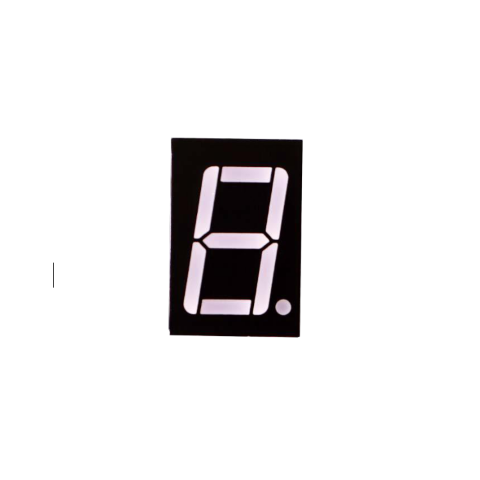
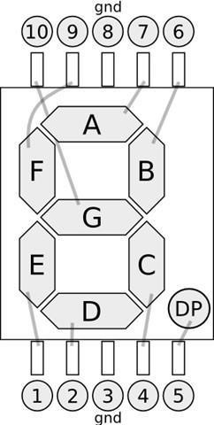
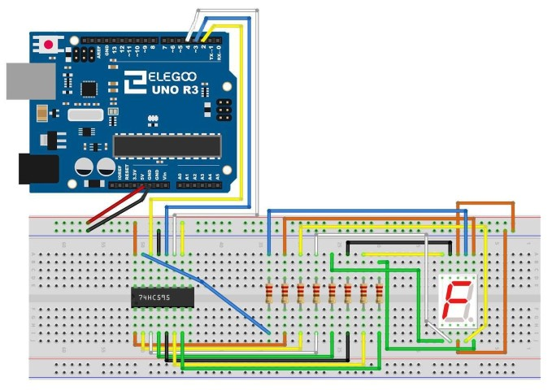
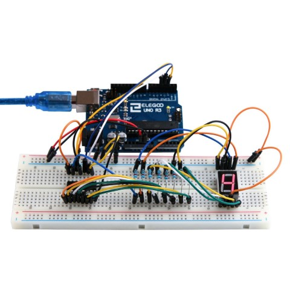

## Lección 19 74HC595 y display Segmentado

### Resumen

Después de aprender la lección 24, 25 y 26, vamos a utilizar el registro de desplazamiento 74HC595 para controlar la visualización del segmento. La pantalla mostrará el número de 9-0.



### Componentes necesarios

(1) x Elegoo Uno R3

x 830 tie-puntos breadboard

x 74HC595 IC

x 1 Pantalla de 7 dígitos segmentada

x 220 ohm resistencias

x M-M cables (cables de puente de macho a macho)

### Display de siete segmentos

Abajo está el diagrama de pines de siete segmentos



0-9 diez dígitos se corresponden con cada segmento es los siguientes (en la tabla siguiente se aplica común cátodo dispositivo de exhibición de segmento siete, si se utiliza un ánodo común, de la mesa debe ser reemplazado cada 1 0 0 si todos sustituidos por 1):

<table id="table1">
<tr>
<td>Display digital</td>
<td>dp</td>
<td>a</td>
<td>b</td>
<td>c</td>
<td>d</td>
<td>e</td>
<td>f</td>
<td>g</td>
</tr>
<tr>
<td></td>
<td></td>
<td></td>
<td></td>
<td></td>
<td></td>
<td></td>
<td></td>
<td></td>
</tr>
<tr>
<td>0</td>
<td>0</td>
<td>1</td>
<td>1</td>
<td>1</td>
<td>1</td>
<td>1</td>
<td>1</td>
<td>0</td>
</tr>
<tr>
<td></td>
<td></td>
<td></td>
<td></td>
<td></td>
<td></td>
<td></td>
<td></td>
<td></td>
</tr>
<tr>
<td>1</td>
<td>0</td>
<td>0</td>
<td>1</td>
<td>1</td>
<td>0</td>
<td>0</td>
<td>0</td>
<td>0</td>
</tr>
<tr>
<td></td>
<td></td>
<td></td>
<td></td>
<td></td>
<td></td>
<td></td>
<td></td>
<td></td>
</tr>
<tr>
<td>2</td>
<td>0</td>
<td>1</td>
<td>1</td>
<td>0</td>
<td>1</td>
<td>1</td>
<td>0</td>
<td>1</td>
</tr>
<tr>
<td></td>
<td></td>
<td></td>
<td></td>
<td></td>
<td></td>
<td></td>
<td></td>
<td></td>
</tr>
<tr>
<td>3</td>
<td>0</td>
<td>1</td>
<td>1</td>
<td>1</td>
<td>1</td>
<td>0</td>
<td>0</td>
<td>1</td>
</tr>
<tr>
<td></td>
<td></td>
<td></td>
<td></td>
<td></td>
<td></td>
<td></td>
<td></td>
<td></td>
</tr>
<tr>
<td>4</td>
<td>0</td>
<td>0</td>
<td>1</td>
<td>1</td>
<td>0</td>
<td>0</td>
<td>1</td>
<td>1</td>
</tr>
<tr>
<td></td>
<td></td>
<td></td>
<td></td>
<td></td>
<td></td>
<td></td>
<td></td>
<td></td>
</tr>
<tr>
<td>5</td>
<td>0</td>
<td>1</td>
<td>0</td>
<td>1</td>
<td>1</td>
<td>0</td>
<td>1</td>
<td>1</td>
</tr>
<tr>
<td></td>
<td></td>
<td></td>
<td></td>
<td></td>
<td></td>
<td></td>
<td></td>
<td></td>
</tr>
<tr>
<td>6</td>
<td>0</td>
<td>1</td>
<td>0</td>
<td>1</td>
<td>1</td>
<td>1</td>
<td>1</td>
<td>1</td>
</tr>
<tr>
<td></td>
<td></td>
<td></td>
<td></td>
<td></td>
<td></td>
<td></td>
<td></td>
<td></td>
</tr>
<tr>
<td>7</td>
<td>0</td>
<td>1</td>
<td>1</td>
<td>1</td>
<td>0</td>
<td>0</td>
<td>0</td>
<td>0</td>
</tr>
<tr>
<td></td>
<td></td>
<td></td>
<td></td>
<td></td>
<td></td>
<td></td>
<td></td>
<td></td>
</tr>
<tr>
<td>8</td>
<td>0</td>
<td>1</td>
<td>1</td>
<td>1</td>
<td>1</td>
<td>1</td>
<td>1</td>
<td>1</td>
</tr>
<tr>
<td></td>
<td></td>
<td></td>
<td></td>
<td></td>
<td></td>
<td></td>
<td></td>
<td></td>
</tr>
<tr>
<td>9</td>
<td>0</td>
<td>1</td>
<td>1</td>
<td>1</td>
<td>1</td>
<td>0</td>
<td>1</td>
<td>1</td>
</tr>
<tr>
<td></td>
<td></td>
<td></td>
<td></td>
<td></td>
<td></td>
<td></td>
<td></td>
<td></td>
</tr>
</table>

129 / 165

### Conexión


### Esquema

130 / 165

### Diagrama de cableado



131 / 165

La siguiente tabla muestra la tabla de correspondencias pantalla de siete segmentos 74HC595 pin

<table id="table2">
<tr>
<td rowspan="2">74HC595 pin</td>
<td colspan="2">Seven  shows  remarkable</td>
<td></td>
</tr>
<tr>
<td colspan="2" rowspan="2">control pin (stroke)</td>
<td></td>
</tr>
<tr>
<td></td>
<td></td>
</tr>
<tr>
<td></td>
<td></td>
<td></td>
<td></td>
</tr>
<tr>
<td>Q0</td>
<td>7</td>
<td>(A)</td>
<td></td>
</tr>
<tr>
<td></td>
<td colspan="2"></td>
<td></td>
</tr>
<tr>
<td>Q1</td>
<td colspan="2">6 (B)</td>
<td></td>
</tr>
<tr>
<td></td>
<td colspan="2"></td>
<td></td>
</tr>
<tr>
<td>Q2</td>
<td colspan="2">4 (C)</td>
<td></td>
</tr>
<tr>
<td></td>
<td></td>
<td></td>
<td></td>
</tr>
<tr>
<td>Q3</td>
<td>2</td>
<td>(D)</td>
<td></td>
</tr>
<tr>
<td></td>
<td></td>
<td></td>
<td></td>
</tr>
<tr>
<td>Q4</td>
<td>1</td>
<td>(E)</td>
<td></td>
</tr>
<tr>
<td></td>
<td></td>
<td></td>
<td></td>
</tr>
<tr>
<td>Q5</td>
<td>9</td>
<td>(F)</td>
<td></td>
</tr>
<tr>
<td></td>
<td colspan="2"></td>
<td></td>
</tr>
<tr>
<td>Q6</td>
<td colspan="2">10 (G)</td>
<td></td>
</tr>
<tr>
<td></td>
<td></td>
<td></td>
<td></td>
</tr>
<tr>
<td>Q7</td>
<td>5</td>
<td>(DP)</td>
<td></td>
</tr>
<tr>
<td></td>
<td></td>
<td></td>
<td></td>
</tr>
</table>

Paso uno: conexión 74HC595

En primer lugar, el cableado está conectado a la alimentación y tierra:

VCC (pin 16) y Señor (pin 10) conectado a 5V

GND (pin 8) y OE (pin 13) a tierra

Pin conexión DS, ST_CP y SH_CP:

DS (pin 14) conectado al pin de tablero UNO R3 2 (la cifra por debajo de la línea amarilla)

ST_CP (pin 12, perno de pestillo) conectado al pin de tablero UNO R3 3 (línea azul de la figura abajo)

SH_CP (pin 11, pin de reloj) conectado al pin de tablero UNO R3 4 (figura debajo de la línea blanca)

Paso 2: conectar el display de siete segmentos

El display de siete segmentos 3, 8 pin a UNO R3 Junta GND (este ejemplo utiliza el cátodo común, si se utiliza el ánodo común, por favor conecte el 3, 8 pines para tablero UNO R3 + 5V)

Según la tabla anterior, conecte el 74HC595 Q0 ~ Q7 a siete segmentos pantalla pin correspondiente (A ~ G y DP) y luego cada pie en una resistencia de 220 ohmios en serie.

### Código



```c 

int tDelay = 100;
int latchPin = 11;      // (11) ST_CP [RCK] on 74HC595
int clockPin = 9;      // (9) SH_CP [SCK] on 74HC595
int dataPin = 12;     // (12) DS [S1] on 74HC595

byte leds = 0;

void updateShiftRegister()
{
   digitalWrite(latchPin, LOW);
   shiftOut(dataPin, clockPin, LSBFIRST, leds);
   digitalWrite(latchPin, HIGH);
}

void setup() 
{
  pinMode(latchPin, OUTPUT);
  pinMode(dataPin, OUTPUT);  
  pinMode(clockPin, OUTPUT);
}

void loop() 
{
  leds = 0;
  updateShiftRegister();
  delay(tDelay);
  for (int i = 0; i < 8; i++)
  {
    bitSet(leds, i);
    updateShiftRegister();
    delay(tDelay);
  }
}
```
