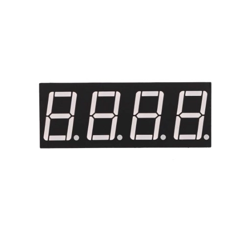
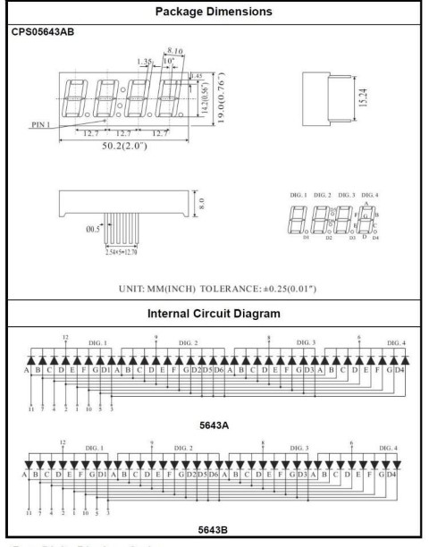

## Lección 20 Display de 7 segmentos de cuatro dígitos

### Resumen

En esta lección, aprenderá a utilizar una pantalla de 7 segmentos de 4 dígitos. Cuando se utiliza 1 dígitos de 7 segmentos, tenga en cuenta que si es ánodo común, el pin común del ánodo se conecta a la fuente de energía; Si es de cátodo común, el pin común del cátodo se conecta a la tierra.

Cuando se utilizan 4 dígitos de 7 segmentos, el ánodo común o pin de cátodo común se utiliza para controlar qué dígito aparece. A pesar de que hay sólo un dígito de trabajo, el principio de persistencia de la visión le permite ver todos los números de muestra ya que cada uno es tan rápida que apenas notará los intervalos de la velocidad de exploración.

### Componentes necesarios

- (1) x Elegoo Uno R3
- x 830 tie-punto breadboard
- x 74HC595 IC

- x display de 4 dígitos de 7 segmentos
- x 220 ohm resistencias
- x M-M cables (cables de puente de macho a macho)

### Muestra de 4 dígitos de 7 segmentos

135 / 165

### Conexión

### Esquema

136 / 165

### Diagrama de cableado

137 / 165

### Código

Después de efectuar el cableado, por favor, abra el programa en el código de carpeta - lección 28 cuatro siete segmentos pantalla Digital y haga clic en UPLOAD para cargar el programa. Ver Lección 2 para obtener más información sobre programa cargar si hay algún error.

138 / 165

