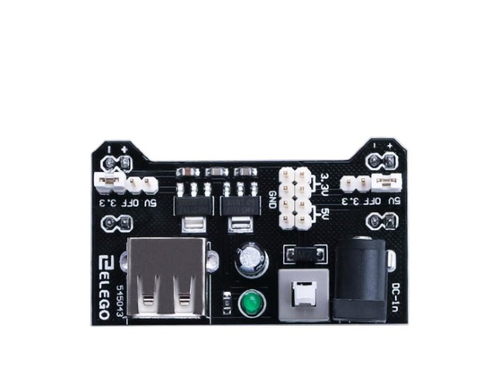
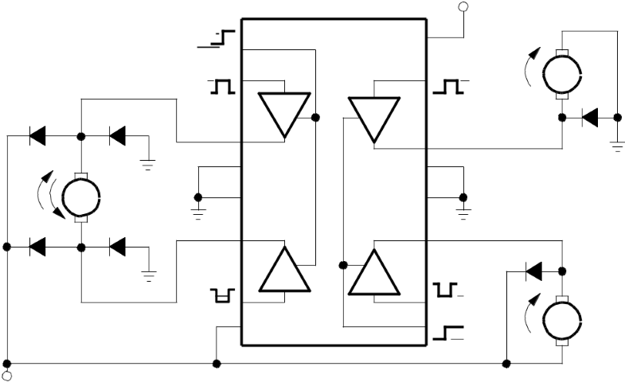
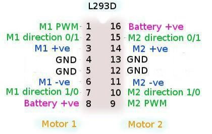
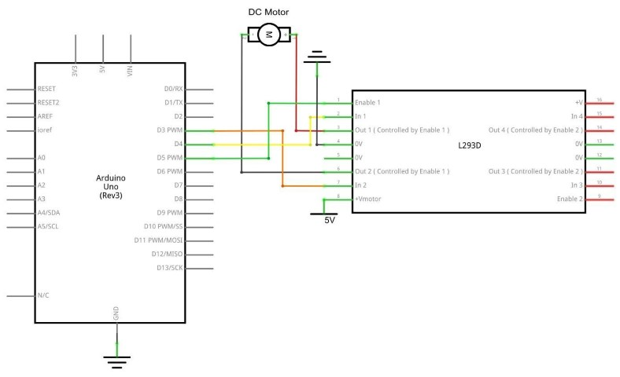
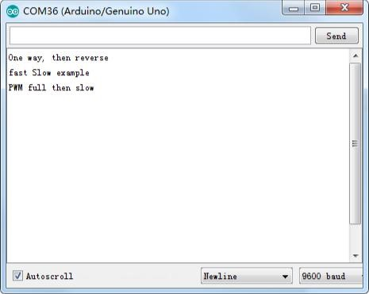
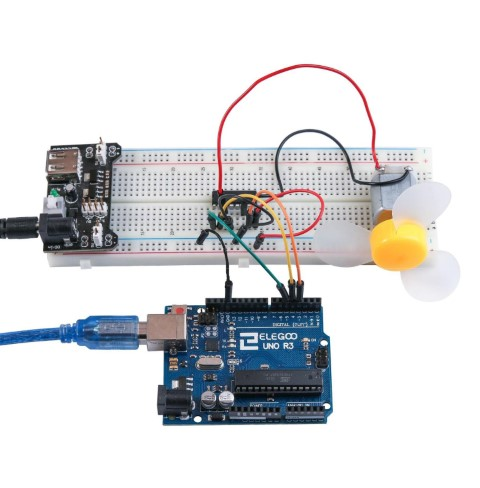

## Lección 21 Motor de corriente continua

### Resumen

En esta lección, aprenderá a controlar un pequeño motor DC (corriente continua) usando un R3 de UNO y un transistor.

### Componentes necesarios

- (1) x Elegoo Uno R3
- x 830 tie-punto breadboard
- x L293D IC
- (1) x Aspa de ventilador y motor de3-6v
- x M- M cables (cables de puente de macho a macho)
- x Módulo de alimentación
- x 9V1A adaptador corriente

### Fuente de alimentación de la placa

El pequeño motor de corriente continua es probable que use más energía que la que Arduino puede suministrar. Si tratamos de conectar el motor directamente a un pin, podríamos dañarlo. Para ello usar un módulo de alimentación que proporciona alimentación

**Especificaciones del producto:**

- Bloqueo Encendido interruptor LED Power indicador
- Entrada voltaje: 6.5-9v (CC) través 5.5mm x 2,1 mm enchufe
- Salida voltaje: 3.3V / 5v
- Máximo salida actual: 700 mA
- Independiente control riel salida. 0v, 3.3v, 5v a protoboard Salida pins principal para usos externos
- Tamaño: 2.1 en x 1.4 en
- USB dispositivo conector a bordo a power externos dispositivo

Configuración de voltaje de salida:

La izquierda y derecha de la tensión de salida puede configurarse independientemente. Para seleccionar la tensión de salida, mover el puente a los pines correspondientes. Nota: indicador de energía LED y los carriles de la energía de protoboard no se enciende si ambos puentes están en la posición "OFF".

Nota IMPORTANTE:

Asegúrese de alinear el módulo correctamente en la placa de pruebas. 

- El pin negativo (-) en el módulo se alinea con la línea azul (-) de la placa-
- El pin positivo (+) se alinea con la línea roja (+). 

### L293D

Este es un chip muy útil, pues puede controlar dos motores **independientemente**. Estamos usando sólo la mitad del chip en esta lección, la mayoría de los pines en el lado derecho del chip son para el control de un segundo motor.

Especificaciones del producto:

|                            |                                      |
| -------------------------- | ------------------------------------ |
| Tensión de alimentación    | 4,5 V a 36 V                         |
| Salida de corriente        | 1 A por canal (600 mA para el L293D) |
| Máxima salida de corriente | 2 A por canal (1.2 A para L293D)     |

## Diagrama de pines

## Descripción

El L293 y L293D son cuádruples controladores  de alta corriente. 

- El L293 está diseñado para proporcionar corrientes de transmisión bidireccional de hasta 1 A con tensiones de 4,5 V a 36 V. 
- El L293D está diseñado para proporcionar bidireccional corrientes de impulsión de hasta 600 mA en tensiones de 4,5 V a 36 V. 

Ambos dispositivos están diseñados para manejar cargas inductivas como relés, solenoides, dc y motores paso a paso bipolares, así como otras cargas de alta corriente de alta tensión en aplicaciones de suministro de positivo.

Todas las entradas son TTL compatible. Cada salida es un circuito de coche completa totem-pole, con un fregadero de transistor Darlington y una fuente de pseudo-Darlington. Conductores están habilitados en pares, con conductores de 1 y 2 de 1, 2EN y drivers 3 y 4 de 3, 4EN. 

- Cuando una entrada **enable** está en valor alto, están habilitados los controladores asociados, y sus salidas son activas y en fase con sus aportaciones. 
- Cuando la entrada **enable**está en valor bajo, se deshabilitan los controladores y sus salidas quedan en estado de alta impedancia. 

Con las entradas de datos adecuadas, cada par de conductores forma una unidad reversible completo-H (o puente) adecuada para aplicaciones de solenoide o motor.

### Diagrama de bloques

<table id="table3">
<tr>
<td></td>
<td></td>
<td></td>
<td></td>
<td>VCC1</td>
<td></td>
<td></td>
</tr>
<tr>
<td></td>
<td>1</td>
<td rowspan="2">1</td>
<td rowspan="2">16</td>
<td></td>
<td></td>
<td></td>
</tr>
<tr>
<td></td>
<td></td>
<td></td>
<td></td>
<td></td>
</tr>
<tr>
<td></td>
<td rowspan="2">1</td>
<td>2</td>
<td rowspan="2">15</td>
<td rowspan="2">1</td>
<td rowspan="2">M</td>
<td></td>
</tr>
<tr>
<td></td>
<td></td>
<td></td>
</tr>
<tr>
<td></td>
<td>0</td>
<td></td>
<td></td>
<td>0</td>
<td></td>
<td></td>
</tr>
<tr>
<td></td>
<td></td>
<td>1</td>
<td></td>
<td></td>
<td></td>
<td></td>
</tr>
<tr>
<td></td>
<td></td>
<td>3</td>
<td>14</td>
<td></td>
<td></td>
<td></td>
</tr>
<tr>
<td></td>
<td></td>
<td>4</td>
<td>13</td>
<td></td>
<td></td>
<td></td>
</tr>
<tr>
<td>M</td>
<td></td>
<td>5</td>
<td>12</td>
<td></td>
<td></td>
<td></td>
</tr>
<tr>
<td></td>
<td></td>
<td>6</td>
<td>11</td>
<td></td>
<td></td>
<td></td>
</tr>
<tr>
<td></td>
<td></td>
<td>2</td>
<td>3</td>
<td rowspan="2">1</td>
<td></td>
<td></td>
</tr>
<tr>
<td></td>
<td rowspan="2">1</td>
<td rowspan="3">7</td>
<td rowspan="3">10</td>
<td></td>
<td></td>
</tr>
<tr>
<td></td>
<td rowspan="2">0</td>
<td></td>
<td></td>
</tr>
<tr>
<td></td>
<td rowspan="2">0</td>
<td></td>
<td></td>
</tr>
<tr>
<td></td>
<td></td>
<td rowspan="2">9</td>
<td></td>
<td></td>
<td></td>
</tr>
<tr>
<td></td>
<td></td>
<td rowspan="2">8</td>
<td rowspan="2">1</td>
<td>M</td>
<td></td>
</tr>
<tr>
<td></td>
<td></td>
<td></td>
<td></td>
<td></td>
</tr>
<tr>
<td></td>
<td></td>
<td></td>
<td></td>
<td>0</td>
<td></td>
<td></td>
</tr>
<tr>
<td>VCC2</td>
<td></td>
<td></td>
<td></td>
<td></td>
<td></td>
<td></td>
</tr>
</table>

Me harté de diagramas de pinout indescifrables dentro de las hojas de datos, por lo que han diseñado mi propio que creo que da más información pertinente.

Hay 3 cables conectados al Arduino, 2 cables conectados al motor y 1 alambre conectado a una batería.

Para utilizar este pin:

Ocupa el lado izquierdo con el primer motor, el lado derecho trata con un segundo motor.

Sí, usted puede funcionar con solamente un motor conectado.

## Control de la velocidad

**M1 PWM** lo conectaremos a un pin PWM de Arduino. Está marcados en la ONU, el pin 5 es un ejemplo. Cualquier número entero entre 0 y 255, donde:

- 0 es apagado1
- 128 es la mitad de velocidad
- 255 es la velocidad máxima de salida.

Según el valor se generará una señal PWM diferente.

## Cambiar la dirección de giro.

Entradas de dirección de **M1 0/1** y **M1 1/0**

- Conectar estos pines de Arduino digitales dos a dos. 
- Un pin de salida tan alto y el otro pin como baja y el motor girará en un sentido.
- Revertir las salidas a baja y alta, y el motor girará en sentido contrario.

### Conexión

### Esquema

### Diagrama de cableado

El código siguiente no utiliza una fuente de alimentación separada (es decir, una batería), sino que utiliza en su lugar la alimentación de 5v del Arduino. Tenga en cuenta que esto sería arriesgado sin que el L293D lo controlara.

Nunca debería conectar un motor directamente al Arduino, porque al desconectar un motor obtendrá una retroalimentación eléctrica. Con un motor pequeño, esto dañará su Arduino, y con un motor grande, usted puede mirar un efecto interesante de la llama y de las chispas.

### Código

Después de efectuar el cableado, por favor, abra el programa en el código de carpeta

lección 29 motores y haga clic en UPLOAD para cargar el programa. Ver Lección 2 para obtener más información sobre programa cargar si hay algún error.

Programa de carga, después de encender todos los interruptores de potencia. 

- Ligeramente, el motor girará en sentido horario y antihorario por 5 veces. 
- Luego, seguirá dramáticamente gire hacia la derecha. 
- Tras una breve pausa, lo dramáticamente girará hacia la izquierda. 
- A continuación, la tarjeta controladora enviará la señal PWM para el motor, el motor lentamente reducir su máxima RPM al mínimo y aumentar al máximo otra vez. 
- Por último, se trata de una parada para 10s hasta que comience el siguiente ciclo.

