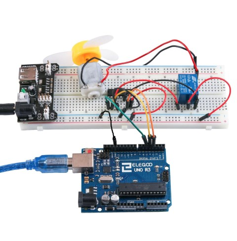

## Lección 22 Relé

### Resumen

En esta lección, aprenderá a utilizar un relé

### Componentes necesarios

> * (1) x Elegoo Uno R3
> * (1) x 830 tie-points breadboard
> * x Ventilador de aspa y 3-6v dc motor
> * x L293D IC
> * x 5v Relé
> * x Módulo de alimentación
> * x 9V1A Adaptador
> * x M-M cables (cables de puente de macho a macho


### Relé

Un relé es un interruptor operado eléctricamente. Muchos relés utilizan un electroimán para operar mecánicamente un interruptor, pero otros principios de funcionamiento también se utilizan como relés de estado sólidos. Relés se utilizan donde es necesario un circuito de control por una señal de baja potencia (con aislamiento eléctrico total entre el control y los circuitos controlados), o donde varios circuitos deben ser controlados por una señal. Los primeros Relais fueron utilizados en circuitos de larga distancia telégrafo como amplificadores. Repite la señal proveniente un circuito y había retransmitido en otro circuito. Relais fueron utilizados extensivamente en centrales telefónicas y computadoras tempranas para realizar operaciones lógicas.

Un tipo de relé que pueda manejar la alta potencia necesaria para controlar directamente un motor eléctrico u otras cargas se llama un contactor. Relés de estado sólidos controlan de circuitos de potencia sin partes móviles, en cambio usando un dispositivo de semiconductor para realizar la conmutación. Relevadores con características de funcionamiento calibradas y a veces múltiples bobinas de funcionamiento se utilizan para proteger circuitos eléctricos contra sobrecarga o fallos. En los sistemas modernos de energía eléctrica, estas funciones son realizadas por instrumentos digitales llamados "relés de protección".

## Relé con motor de coche en Arduino

A continuación es el esquema de cómo relé de coche con Arduino.

Puede ser complicado insertar el relé en la protoboard. Tienes que doblar una de las patillas del relé un poco para poder insertarlo


### Conexión


### Esquema


### Diagrama de cableado

### Código

### Montaje real

Programa de carga, después de encender todos los interruptores de potencia. El relé a recoger con un sonido de timbre. Entonces, el motor girará. Después de un período de tiempo, se liberará el relé y el motor se detiene.



### Código fuente

```c 
#define ENABLE 5
#define DIRA 3
#define DIRB 4

int i;
 
void setup() {
  //---set pin direction
  pinMode(ENABLE,OUTPUT);
  pinMode(DIRA,OUTPUT);
  pinMode(DIRB,OUTPUT);
  Serial.begin(9600);
}

void loop() {
 
//---back and forth example
    Serial.println("One way, then reverse");
    digitalWrite(ENABLE,HIGH); // enable on
    for (i=0;i<5;i++) {
    digitalWrite(DIRA,HIGH); //one way
    digitalWrite(DIRB,LOW);
    delay(750);
    digitalWrite(DIRA,LOW);  //reverse
    digitalWrite(DIRB,HIGH);
    delay(750);
  }
  digitalWrite(ENABLE,LOW); // disable
    delay(3000);
      for (i=0;i<5;i++) {
    digitalWrite(DIRA,HIGH); //one way
    digitalWrite(DIRB,LOW);
    delay(750);
    digitalWrite(DIRA,LOW);  //reverse
    digitalWrite(DIRB,HIGH);
    delay(750);
  }
    digitalWrite(ENABLE,LOW); // disable
    delay(3000);
}
   

```
