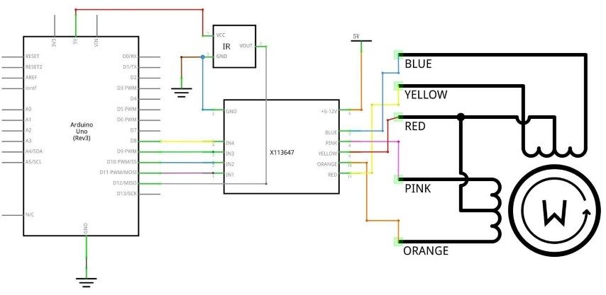

### Lección 24 Control Motor paso a paso con mando a distancia

### Resumen

En esta lección, usted aprenderá una manera divertida y fácil para controlar un motor paso a paso a distancia mediante un mando a distancia IR.

El paso a paso que estamos utilizando viene con su propio tablero de conductor, lo que es fácil conectar con nuestro UNO.

Ya que no queremos que el motor de accionamiento de la ONU, vamos a usar una barata fuente de alimentación pequeña protoboard que enchufes a la derecha en nuestro protoboard y alimentación con una fuente de alimentación 9V 1Amp.

El sensor de infrarrojos está conectado a la ONU directamente ya que no utiliza casi ninguna energía.

### Componentes necesarios

> * (1) x Elegoo Uno R3
> * x 830 tie-points breadboard
> * x IR receiver module
> * x IR remote
> * x ULN2003 stepper motor driver module
> * x Stepper motor
> * x Power supply module
> * x 9V1A Adaptador
> * x F-M cables (cables de hembra a macho DuPont)
> * x M-M cable (hilo puente de macho a macho)

### Conexión

### Esquema

### Diagrama de cableado

Estamos utilizando 4 pines para controlar el paso a paso y el 1 pin del sensor IR. Pernos 8-11 controlan el motor paso a paso y pin 12 recibe la información de IR. Conectamos los 5V y la tierra de la ONU en el sensor. Como medida de precaución, usar un protoboard alimentación potencia el motor paso a paso ya que puede utilizar más energía y no queremos dañar la fuente de alimentación de la UNO.

### Código

Después de efectuar el cableado, por favor abrir programa en el código de carpeta - lección 32 control paso a paso Motor con control remoto y haga clic en UPLOAD para cargar el programa. Ver Lección 2 para obtener más información sobre programa cargar si hay algún error.

Antes de ejecutar esto, asegúrese de que ha instalado el < IRremote >

Biblioteca de < paso a paso > o volver a instalarlo, si es necesario. De lo contrario, el código no funcionará.

Para obtener más información sobre carga el archivo de **librería**, ver Lección 1.

El código reconoce sólo 2 valores desde el control remoto IR: VOL + y VOL-. 
- Presionando VOL + del control remoto el motor hará un giro completo hacia la derecha.
- VOL- para hacer una rotación completa en sentido antihorario.

